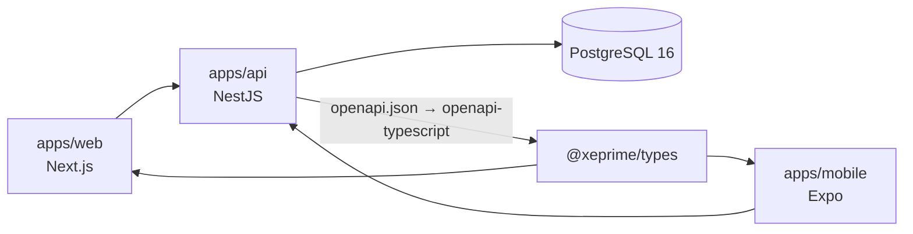

# XePrime

Nền tảng cho thuê xe: Marketplace cho khách thuê + Management Portal cho gian hàng và quản trị nền tảng.

Next.js 16 · Expo 57 (React Native) · NestJS 11 · PostgreSQL 16 · Prisma 7 · pnpm workspace · Turborepo

---

## Đọc trước khi code

| Thứ tự | Tài liệu                                                   | Vì sao                                                                    |
| ------ | ---------------------------------------------------------- | ------------------------------------------------------------------------- |
| 1      | [`CLAUDE.md`](CLAUDE.md)                                   | Bản đồ repo, kiến trúc đã chốt, điều cấm                                  |
| 1b     | [`docs/completion-roadmap.md`](docs/completion-roadmap.md) | **Đang ở đâu / làm gì tiếp** (tiến độ thực tế + milestone)                |
| 2      | [`docs/decisions/`](docs/decisions/)                       | **Quyết định kỹ thuật kèm lý do. Thắng mọi tài liệu khác khi mâu thuẫn.** |
| 3      | [`docs/`](docs/)                                           | Đặc tả nghiệp vụ: màn hình theo role, user flow, thiết kế DB              |

Bộ tài liệu trong `docs/` viết ngày 22/07/2026 và không được sửa lại. Có 3 chỗ các file tự mâu thuẫn nhau (trạng thái xe/đơn/yêu cầu đặt xe) và 4 lỗ hổng kỹ thuật lớn không đề cập — cả 7 đều được xử lý trong `docs/decisions/`.

---

## Chạy local

Yêu cầu: Node ≥ 22, pnpm 11 (`corepack enable pnpm`), Docker đang chạy.

```bash
pnpm install

cp .env.example .env
# Sinh SESSION_JWT_SECRET thật:
node -e "console.log(require('crypto').randomBytes(48).toString('base64url'))"

pnpm db:up          # PostgreSQL 16 qua Docker
pnpm db:migrate     # tạo bảng + trigger + exclusion constraint
pnpm db:seed        # admin + shop owner demo (8 xe, 6 đơn, 1 lịch bảo dưỡng)
pnpm dev            # web :3000 · api :4000 · swagger :4000/docs
```

Đăng nhập bằng **email + mật khẩu** tại http://localhost:3000/login (tài khoản do `pnpm db:seed` tạo, đọc từ `.env`):

| Vai trò        | Email                                                | Mật khẩu (mặc định)                         |
| -------------- | ---------------------------------------------------- | ------------------------------------------- |
| Platform admin | `PLATFORM_ADMIN_EMAIL` (mặc định `admin@xeprime.vn`) | `PLATFORM_ADMIN_PASSWORD`                   |
| Chủ shop demo  | `owner@xeprime.test`                                 | `DEMO_OWNER_PASSWORD` (mặc định `Abcd1234`) |

Đặt mật khẩu trong `.env` trước khi seed. Google/Facebook hoạt động sau khi khai `GOOGLE_OAUTH_*` / `FACEBOOK_APP_*` và `API_PUBLIC_URL` (ADR 0019) — chưa khai thì nút vẫn hiện nhưng báo "cách đăng nhập này chưa dùng được", còn mật khẩu và OTP chạy bình thường.

---

## Cấu trúc

```text
apps/
  web/       Next.js App Router — (public) marketplace · (auth) · (manage) portal
  mobile/    Expo + Expo Router — app di động, cùng API và cùng ADR với web
  api/       NestJS modular monolith
  worker/    Background jobs — skeleton, chạy từ Phase 5
packages/
  types/     Status union, role, permission, convention response  ← ADR 0005
  validators/  Yup schema dùng chung cho form (web + mobile)
  config/    tsconfig + eslint preset
  ui/        Component dùng chung web ↔ marketplace (trống ở Phase 0, có chủ ý)
prisma/      schema.prisma · migrations · seed
docs/        Đặc tả nghiệp vụ + ADR
```

---

### Ba client, một hợp đồng



Web và mobile là hai client **ngang hàng**: cùng backend, cùng envelope `{ data } / { error }`,
cùng bộ ADR. Không bên nào có DTO viết tay — type sinh từ OpenAPI của chính API.

Vì vậy: **đổi DTO ở backend thì phải chạy `pnpm contract`**, nếu không type của cả hai client
lệch so với API thật (ADR 0007). CI kiểm bằng cách sinh lại rồi so `git diff`.

Chi tiết riêng của từng app: [`apps/mobile/README.md`](apps/mobile/README.md).

---

## Ba thứ dễ làm sai nhất

### 1. Chống trùng lịch nằm ở database, không ở code

Hai đơn trùng xe cùng khung giờ là **bất khả thi** — Postgres từ chối ở tầng constraint:

```sql
EXCLUDE USING gist (vehicle_id WITH =, period WITH &&)
```

Nghĩa là:

- Mọi thứ chiếm chỗ trên lịch (đơn thuê, khoá xe, bảo dưỡng) **phải** ghi vào `vehicle_occupancies` qua `OccupancyService`. Ghi tắt ở nơi khác là tạo lỗ.
- **Đừng** viết `SELECT` kiểm tra trống rồi mới `INSERT` — luôn có khe hở giữa hai câu lệnh. Cứ INSERT và bắt lỗi `23P01`.
- `POST /calendar/check-conflict` chỉ để hiện cảnh báo cho người dùng. Nó không bảo vệ gì.

Chi tiết: [ADR 0006](docs/decisions/0006-booking-concurrency.md).

### 2. Tenant scope luôn đến từ backend

API không nhận `tenant_id` từ body/query/header. `TenantScopeGuard` đọc từ `tenant_memberships` của user đang đăng nhập. Thấy chỗ nào nhận `tenantId` từ client cho dữ liệu gian hàng thì đó là lỗ bảo mật, không phải tính năng.

### 3. Status không phải string tự do

```ts
if (booking.status === 'active')                 // ❌
if (booking.status === BOOKING_STATUS.ACTIVE)    // ✅
```

DB lưu `String` nên TypeScript là lớp duy nhất chặn được typo. Mọi status khai báo ở `@xeprime/types`. Chi tiết: [ADR 0005](docs/decisions/0005-status-enums.md).

---

## Lệnh hay dùng

| Lệnh                                                                    | Việc                                                                 |
| ----------------------------------------------------------------------- | -------------------------------------------------------------------- |
| `pnpm dev`                                                              | Chạy web + api song song                                             |
| `pnpm --filter @xeprime/mobile start`                                   | Metro + Expo dev server (API phải đang chạy ở :4000)                 |
| `pnpm lint` · `pnpm typecheck` · `pnpm test` · `pnpm build`             | Kiểm tra toàn workspace                                              |
| `pnpm contract`                                                         | Sinh lại OpenAPI spec → type frontend (chạy sau khi đổi DTO backend) |
| `pnpm db:migrate` · `pnpm db:seed` · `pnpm db:studio` · `pnpm db:reset` | Thao tác DB                                                          |
| `pnpm db:up` · `pnpm db:down`                                           | Bật/tắt PostgreSQL                                                   |

Sau khi đổi DTO ở backend, **phải** chạy `pnpm contract` — nếu không, type frontend sẽ lệch so với API thật (ADR 0007). CI kiểm tra bằng cách sinh lại và so `git diff`.

---

## Trạng thái

**Tiến độ thực tế + milestone + việc kế tiếp: [`docs/completion-roadmap.md`](docs/completion-roadmap.md)** (cập nhật mỗi khi đóng một phase). Lộ trình 9 phase ở `CLAUDE.md` mục 11.
