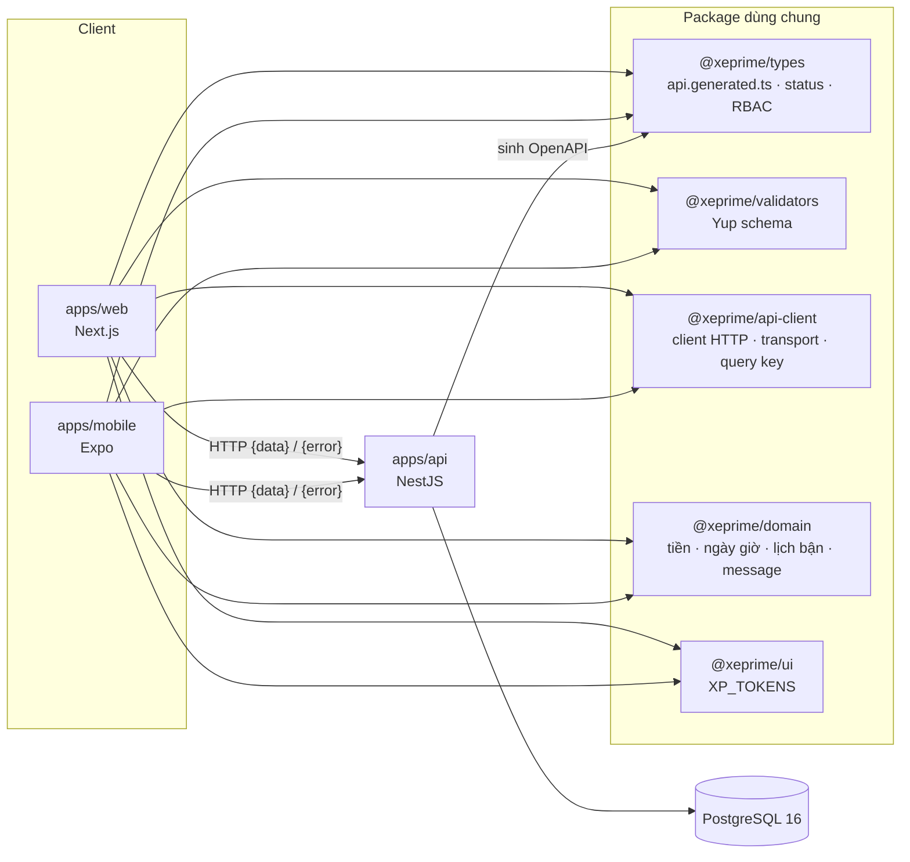
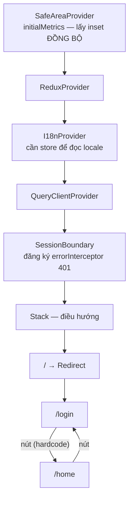
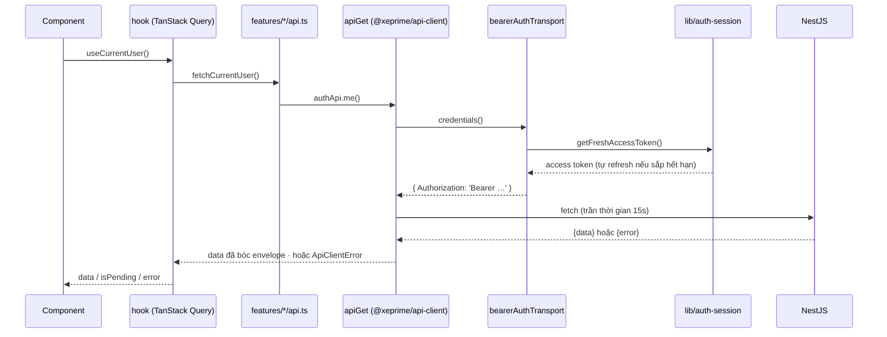
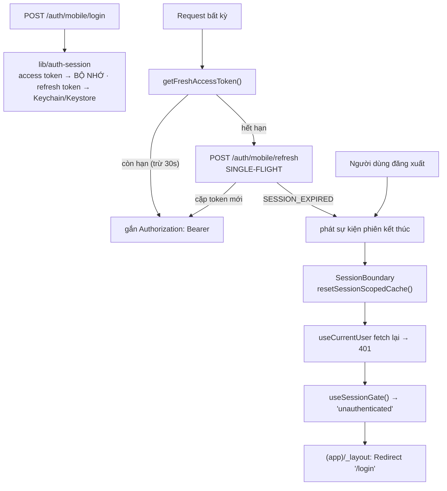

# `@xeprime/mobile` — App di động XePrime

React Native (Expo SDK 57) + Expo Router, nằm trong monorepo pnpm của XePrime.
Cùng backend, cùng hợp đồng API, cùng bộ ADR với `apps/web`.

> Đọc `CLAUDE.md` ở gốc repo và `docs/decisions/` trước. README này chỉ nói phần **riêng của
> mobile**; mọi luật nghiệp vụ (status, tenant scope, tiền, thuê dài hạn, đa ngữ) vẫn theo ADR.
> Kỷ luật khi viết feature mới: skill `.claude/skills/mobile-feature/`.

---

## 1. Chạy được trong 3 lệnh

```bash
pnpm install                            # ở gốc repo
pnpm --filter @xeprime/api start:dev    # API phải sống ở cổng 4000
pnpm --filter @xeprime/mobile start     # Metro + Expo
```

Rồi bấm `a` (Android), `i` (iOS) hoặc `w` (web preview).

| Lệnh (`pnpm --filter @xeprime/mobile …`) | Việc                                                                                          |
| ---------------------------------------- | --------------------------------------------------------------------------------------------- |
| `start`                                  | build package phụ thuộc rồi mở Expo dev server                                                |
| `android` / `ios`                        | `expo run:*` — build native                                                                   |
| `web`                                    | bản web của Expo, **chỉ để xem giao diện** (SecureStore lùi về `localStorage`, không an toàn) |
| `lint` · `typecheck` · `test`            | ESLint chung của repo · `tsc --noEmit` · Jest (`jest-expo`)                                   |
| `exec jest src/lib/live-bearer.test.ts`   | **Test sống** — gọi API thật, chứng minh app gửi đúng Bearer. Cần `XP_LIVE_API=1` + API ở cổng 4000 + DB đã seed; không đặt cờ thì suite tự bỏ qua |

`build:deps` chạy trước mọi lệnh start vì app import `@xeprime/types` /
`@xeprime/validators` ở dạng **đã build**, không phải source. Thiếu bước này thì clone mới sẽ
`MODULE_NOT_FOUND` ngay ở Metro.

### Base URL của API

Không cần cấu hình gì: [src/lib/api-base-url.ts](src/lib/api-base-url.ts) suy host từ Expo dev
server — thiết bị thật lấy IP LAN của máy chạy Metro, emulator Android đổi `localhost` thành
`10.0.2.2`. Chỉ đặt `EXPO_PUBLIC_API_URL` trong `.env` khi API **không** nằm ở cổng 4000 của
chính máy đang chạy Metro. Expo chỉ inline biến có tiền tố `EXPO_PUBLIC_`, và inline **lúc
build** — đổi giá trị phải khởi động lại Metro.

### Build Android trên máy dev Windows

`apps/mobile/android/` do `expo prebuild` sinh ra và bị gitignore. Máy dev cần **JDK 21** (JDK
24+ in cảnh báo native-access ra stderr, và task `configureCMake` của AGP coi mọi dòng stderr
là lỗi) và cấu hình đẩy thư mục build native sang đường dẫn ngắn — tên thư mục store của pnpm
làm đường dẫn object file vượt giới hạn 250 ký tự của CMake. Cấu hình nằm ngoài repo (`~/.gradle/`).

---

## 2. Cấu trúc hệ thống

Mobile là **một client ngang hàng với web**, nói chuyện với đúng một backend qua đúng một hợp đồng:



Hệ quả thực tế: **đổi DTO ở backend thì phải chạy `pnpm contract` ở gốc repo**, nếu không type
của mobile lệch so với API thật (ADR 0007). Mobile không có DTO viết tay, và cũng không có bản
thứ hai của client HTTP — hai app khác nhau đúng ở `AuthTransport` (mục 4).

### Thư mục

```
apps/mobile/
├── app/                          # route file-based của expo-router (tên file = URL)
│   ├── _layout.tsx               #   provider gốc + ErrorBoundary toàn app
│   ├── index.tsx                 #   "/" — điểm vào, chuyển thẳng sang /login
│   ├── +not-found.tsx            #   route lạ / deep link hỏng
│   ├── (app)/                    #   nhóm CẦN đăng nhập (guard đang TẮT — xem mục 5)
│   │   ├── _layout.tsx
│   │   └── home.tsx              #     "/home" — màn chủ
│   └── (auth)/
│       ├── _layout.tsx
│       └── login.tsx             #     "/login"
├── assets/images/                # ảnh tĩnh (icon/splash khai ở app.json, phải là PNG vuông)
├── messages/{vi,en}/*.json       # chuỗi giao diện, một file = một namespace
└── src/
    ├── assets.ts                 # registry ảnh — Metro cần đường dẫn HẰNG
    ├── components/
    │   ├── layout/Screen.tsx     #   khung màn: safe area + bàn phím + cuộn
    │   ├── state/                #   ScreenLoading · ScreenError · ScreenMessage · AppErrorScreen
    │   ├── ui/                   #   Button · TextField
    │   └── i18n/LocaleSwitcher.tsx
    ├── features/<miền>/          # api.ts · hooks/ · components/ — cắt theo NGHIỆP VỤ
    ├── hooks/                    # hook dùng chung không thuộc miền nào
    ├── i18n/                     # config · provider · messages · locale.slice · useErrorMessage
    ├── lib/                      # api-client · auth-session · fetch-with-timeout · secure-storage · logger
    ├── queries/                  # queryClient · queryKeys · reset-session-cache
    ├── store/                    # Redux Toolkit — chỉ ĐĂNG KÝ reducer, slice thuộc về feature
    ├── theme/                    # colors · elevation
    └── utils/
```

Tên nhóm trong ngoặc (`(app)`, `(auth)`) **không xuất hiện trong URL** — route thật là `/`,
`/login`, `/home`. Nhóm chỉ để gắn layout và guard.

Alias `@/*` → `src/*`, khai ở [tsconfig.json](tsconfig.json) và được `@expo/metro-config` đọc
lại nên chạy cả ở Metro lẫn `tsc`.

**Thêm màn hình mới** = thêm file trong đúng nhóm của `app/` + đặt logic ở `src/features/<miền>/`.
Không viết gọi API hay business logic thẳng trong file route.

---

## 3. Luồng khởi động

Thứ tự provider không tuỳ tiện — mỗi lớp cần lớp trước nó. Base **không gọi API nào lúc khởi
động**: mở app là vào thẳng `/login`, sang `/home` bằng nút.



`ErrorBoundary` của expo-router nằm **ngoài** toàn bộ khối này (lỗi có thể đến từ chính các
provider), nên `AppErrorScreen` tự dựng lại `IntlProvider` ở ngôn ngữ mặc định.

Locale lấy theo thứ tự: ngôn ngữ máy (`expo-localization`, đọc **đồng bộ** nên frame đầu đã
đúng) → lựa chọn đã lưu trong SecureStore ghi đè sau một nhịp. Không chặn render.

---

## 4. Luồng một request

**Client HTTP là `@xeprime/api-client`, dùng CHUNG với web.** App native không có bản thứ hai
của hợp đồng API: envelope `{ data, meta }`, `ApiClientError`, 48 mã lỗi, query string, phân
trang đều nằm ở package đó. [src/lib/api-client.ts](src/lib/api-client.ts) chỉ cấu hình nó một
lần rồi xuất lại — đối xứng với `apps/web/src/services/api-client.ts`.



Ba chỗ — và chỉ ba chỗ — app native khác web, cả ba nằm trong lời gọi `configureApiClient()`:

| Chỗ         | Web                            | Native                                                                        |
| ----------- | ------------------------------ | ----------------------------------------------------------------------------- |
| `baseUrl`   | `NEXT_PUBLIC_API_URL`          | [`resolveApiBaseUrl()`](src/lib/api-base-url.ts) — suy từ Expo dev server     |
| `transport` | cookie httpOnly (ADR 0002)     | `bearerAuthTransport` → `Authorization: Bearer` (ADR 0017)                    |
| `fetch`     | `fetch` của trình duyệt        | [`fetchWithTimeout`](src/lib/fetch-with-timeout.ts) — mạng di động treo, không báo lỗi |

Không gọi `fetch` trần ở feature. Sai envelope `{ data }` là **ném lỗi**, không đoán mò
(ADR 0007). Lỗi phát sinh **phía client** mang tiền tố riêng để nhìn log là biết ngay lỗi nằm ở
đâu: `CLIENT_ERROR_CODE.NETWORK_ERROR`, `CLIENT_ERROR_CODE.TIMEOUT` — chúng cố ý **không** nằm
trong `API_ERROR_CODE` của backend, vì backend không bao giờ phát chúng.

> Trần thời gian sống ở app chứ không trong package dùng chung: `setTimeout`/`AbortController`
> không nằm trong `lib: ES2023` mà package đó nhắm tới, và "bao lâu là quá lâu" là chính sách của
> từng client. Cần trần khác (upload/tải file dài) thì `createFetchWithTimeout(ms)` một client riêng.

---

## 5. Luồng phiên đăng nhập — ADR 0017

> **Guard route đang TẮT ở base.** `(app)/_layout.tsx` hiện chỉ render `Stack`; `/home` vào
> thẳng bằng nút. Phần dưới đây **đã chạy thật** (đăng nhập/refresh/đăng xuất gọi API thật) —
> bật guard chỉ là thay thân `AppLayout` bằng `useSessionGate()`.

Native KHÔNG dùng cookie: trên React Native cookie do cookie store của OS quản và Android không
flush xuống đĩa, nên kill app là mất phiên. Thay vào đó là **Bearer access token 15 phút +
refresh token opaque xoay vòng**, thu hồi được theo thiết bị.



| Tầng                       | Ở đâu                                                              | Việc                                                                                            |
| -------------------------- | ------------------------------------------------------------------ | ----------------------------------------------------------------------------------------------- |
| Kho token                  | [src/lib/auth-session.ts](src/lib/auth-session.ts)                 | Nơi DUY NHẤT biết token; đọc/ghi Keychain, làm mới, phát sự kiện "phiên kết thúc"                |
| Dọn trạng thái             | [SessionBoundary.tsx](src/features/auth/SessionBoundary.tsx)       | Nằm ngoài cây điều hướng nên **không** gọi được `useRouter` — nó chỉ dọn cache                  |
| Quyết định                 | [use-session-gate.ts](src/features/auth/hooks/use-session-gate.ts) | Trả về `loading \| unauthenticated \| unreachable \| ready` — kiểm thử được mà không cần router |
| Điều hướng (chưa nối)      | [app/(app)/_layout.tsx](<app/(app)/_layout.tsx>)                   | Nơi **duy nhất** gọi `<Redirect>`                                                               |

Sáu luật đi kèm, đừng phá:

1. **Refresh token CHỈ ở Keychain/Keystore.** Không `AsyncStorage`, không redux-persist, không
   log. Access token sống 15 phút nên nó ở **bộ nhớ** — ghi xuống đĩa chỉ thêm một chỗ để rò.
2. **SINGLE-FLIGHT khi làm mới.** Đây không phải tối ưu. Refresh token dùng MỘT lần: ba request
   song song cùng gửi một token thì server cho một cái thắng và coi hai cái sau là **replay** —
   thu hồi cả phiên, người dùng bị đá ra dù chẳng làm gì sai.
3. **Ghi đè cặp token mới sau MỖI lần refresh.** Giữ lại token cũ = lần sau gửi token đã chết =
   cũng bị coi là replay.
4. **401 một mình KHÔNG phải phiên chết.** Access token hết hạn mỗi 15 phút là chuyện thường,
   client tự làm mới rồi đi tiếp. Chỉ hai việc mới kết thúc phiên: refresh bị từ chối
   (`SESSION_EXPIRED`) và người dùng đăng xuất. Đừng dựng lại interceptor bắt 401 để logout.
5. **Lỗi mạng khi refresh thì GIỮ phiên.** Mất sóng không phải phiên chết; xoá token vì đi qua
   thang máy là bắt người dùng đăng nhập lại vô cớ.
6. **Đăng xuất phải gọi server.** Chỉ xoá ở máy là để phiên sống tiếp trên server tới 60 ngày.
   Ngược lại, server không trả lời cũng vẫn xoá ở máy — người dùng đã bấm rồi.

Kèm theo: **màn hình KHÔNG tự kiểm 401**; chúng nằm sau guard và dùng
[`useAuthenticatedUser()`](src/features/auth/hooks/use-authenticated-user.ts) — hook này **ném
lỗi** nếu không có phiên, để lỗi định tuyến nổ ra ở ErrorBoundary thay vì thành màn trắng im
lặng. Và dùng `resetQueries()`, **KHÔNG** `clear()`: `clear()` gỡ hẳn query khỏi cache nên
observer đang mounted giữ nguyên dữ liệu cũ và không ai bảo nó chạy lại — người dùng hết phiên
vẫn nhìn thấy dữ liệu của phiên đã chết và **không bao giờ bị đẩy về đăng nhập**. Đây là bug
thật đã xảy ra; [session-recovery.test.tsx](src/features/auth/session-recovery.test.tsx) khoá
lại đúng ca đó.

### Chứng minh trên dây

Unit test chạy với `fetch` giả nên chúng chứng minh được ý ĐỊNH, không phải byte đi ra.
[live-bearer.test.ts](src/lib/live-bearer.test.ts) gọi API thật và ghi lại header của từng
request — đăng nhập → `/auth/me` kèm Bearer → xoay token → đăng xuất → phiên bị từ chối:

```bash
XP_LIVE_API=1 pnpm --filter @xeprime/mobile exec jest src/lib/live-bearer.test.ts
```

Nó cắm `node:http` vào khe `globalThis.fetch` (polyfill `whatwg-fetch` của jest-expo chạy trên
`XMLHttpRequest` đã bị mock nên không đi mạng được); mọi tầng còn lại là code thật của app. Không
có `XP_LIVE_API=1` thì suite tự bỏ qua, nên `pnpm test` vẫn chạy được khi không có API.

> Còn thiếu: redirect chưa nhớ đích đến (hết phiên giữa chừng thì đăng nhập xong về `/`), nhóm
> `(auth)` không chặn người đã đăng nhập, và chưa có màn "thiết bị đang đăng nhập" dù backend đã
> lưu `deviceName`/`devicePlatform`/`appVersion` của từng phiên.
---

## 6. Ranh giới trạng thái (giống `apps/web`, ADR 0004)

| Loại            | Công cụ                                           | Ở đâu                                                                                           |
| --------------- | ------------------------------------------------- | ----------------------------------------------------------------------------------------------- |
| Dữ liệu server  | **TanStack Query**                                | `src/features/*/hooks/`, key lấy từ `src/queries/query-keys.ts`                                 |
| Form            | **React Hook Form + Yup** (`@xeprime/validators`) | cục bộ trong màn/modal, không đẩy lên global                                                    |
| UI/client state | **Redux Toolkit**                                 | slice sống cùng feature sở hữu nó (vd `src/i18n/locale.slice.ts`); `src/store/` chỉ **đăng ký** |
| Bí mật          | **expo-secure-store**                             | qua `src/lib/secure-storage.ts`, khoá khai trong `SECURE_KEY`                                   |

Slice đặt cạnh feature để phụ thuộc chỉ đi **một chiều** `store → feature`. Đặt hết vào
`store/slices/` sẽ tạo vòng phụ thuộc ngay khi slice cần hằng số của feature.

Mặc định query đã chốt ở [src/queries/query-client.ts](src/queries/query-client.ts):
`refetchOnWindowFocus: false` (React Native không có window focus), retry **chỉ** với lỗi
mạng/timeout/5xx (`isRetriableError`), mutation **không** retry — gửi lại một POST đã tới
server là tạo bản ghi trùng.

---

## 7. Đa ngữ (ADR 0012)

Hai ngôn ngữ `vi` (mặc định) / `en` qua **`use-intl`** — chính là lõi mà `next-intl` bên web
bọc lên, nên tên namespace và khoá giống hệt web.

**Gốc message là `@xeprime/domain/messages`, DÙNG CHUNG với `apps/web`** (24/08/2026): app
native không có file chữ nào của riêng nó. `src/i18n/messages.ts` chỉ là *bảng gom* chọn
namespace nào vào bundle — Metro không tách chunk theo màn hình nên danh sách đó là tập con có
chủ đích, mở tính năng nào thì thêm namespace của tính năng đó.

| Việc                            | Ở đâu                                                          |
| ------------------------------- | -------------------------------------------------------------- |
| Hằng locale, `APP_TIME_ZONE`    | [src/i18n/config.ts](src/i18n/config.ts)                       |
| Bảng gom, kiểu `AppMessages`    | [src/i18n/messages.ts](src/i18n/messages.ts)                   |
| Provider + `useAppLocale()`     | [src/i18n/I18nProvider.tsx](src/i18n/I18nProvider.tsx)         |
| Trạng thái locale               | [src/i18n/locale.slice.ts](src/i18n/locale.slice.ts)           |
| Lỗi API → chữ                   | [src/i18n/use-error-message.ts](src/i18n/use-error-message.ts) |

Khoá `t()` **được kiểm lúc biên dịch**: [src/i18n/use-intl.d.ts](src/i18n/use-intl.d.ts) gắn bó
message vào `use-intl`, nên `t('Common.actions.rerty')` là lỗi typecheck chứ không phải chuỗi
lạ lọt ra bản phát hành.

Thêm chuỗi mới: sửa **cả** `packages/domain/messages/vi/*.json` và `.../en/*.json`, khai
namespace ở [apps/web/src/i18n/namespaces.ts](../web/src/i18n/namespaces.ts) rồi thêm vào
`MESSAGES`. Hai hàng rào: `pnpm --filter @xeprime/web i18n:check` (parity vi↔en, ICU, và canh
luôn bảng gom của app native) và [messages.test.ts](src/i18n/messages.test.ts) (bó THẬT SỰ vào
bundle native).

⚠️ Namespace chia theo **TÍNH NĂNG, không theo client**: mở màn booking trên app thì dùng lại
`bookings`/`booking-requests` như web. `mobile-shell` chỉ dành cho VỎ app native (màn lỗi cấp
app, not-found, điều hướng gốc) — chép chuỗi tính năng vào đó là tạo bản dịch thứ hai cho cùng
một khoá, đúng thứ gốc chung sinh ra để chặn.

Chữ hiện cho người dùng không được viết thẳng trong component; chữ chỉ vào log thì để tiếng
Anh. Thông báo lỗi chọn theo **MÃ**, không theo `message` của backend.

> Nợ đã biết: `@xeprime/validators` vẫn trả message tiếng Việt cứng, nên lỗi form chưa dịch.

---

## 8. Giao diện & khác biệt nền tảng

Base cố ý **không đầu tư vào UI** — nó chỉ đủ để chứng minh kiến trúc chạy.

- Style bằng `StyleSheet.create`. Màu/khoảng cách/bo góc/cỡ chữ lấy từ
  [src/theme/tokens.ts](src/theme/tokens.ts) — file này **không giữ giá trị nào**, nó đọc
  `XP_TOKENS` của [`@xeprime/ui`](../../packages/ui), đúng nguồn web dựng `tokens.css` và AntD
  theme (ADR 0003). Không gõ hex hay số đo thẳng vào component: gõ một lần là app native lặng
  lẽ trôi khỏi web, y như hồi `theme/colors.ts` để primary màu đen trong khi web màu gold.
  Token viết bằng ngôn ngữ CSS nên `tokens.ts` gánh phần dịch sang native: gỡ bí danh
  `var(--xp-…)`, đổi `'16px'` → `16`, và **ném lỗi** nếu gặp hàm CSS (`color-mix`,
  `linear-gradient`) mà RN không hiểu.
  Palette hiện **chỉ có bản sáng**, nên `app.json` khoá `userInterfaceStyle: "light"` — mở
  `"automatic"` cùng lúc với việc bổ sung palette tối *ở `@xeprime/ui`*, không sớm hơn.
- Mọi màn bọc bằng [`<Screen>`](src/components/layout/Screen.tsx) — safe area, tránh bàn phím,
  `keyboardShouldPersistTaps` gom một chỗ. Màn danh sách tràn viền đặt `padded={false}` để giữ
  phần cấu trúc mà bỏ lề trang.
- Đổ bóng dùng `elevation.card` / `.raised` / `.overlay`
  ([src/theme/elevation.ts](src/theme/elevation.ts)); iOS và Android dùng hai bộ thuộc tính
  khác nhau, viết tay ở từng component là quên một bên. Giá trị parse từ token `shadow-*` của
  `@xeprime/ui` nên bóng của app và của web là một.
- [src/theme/tokens.test.ts](src/theme/tokens.test.ts) canh cả hai bộ chuyển đổi trên: chúng
  chỉ chạy lúc nạp module trên thiết bị, nên sai một dạng giá trị là màn hình trắng chứ không
  phải test đỏ. Đổi token ở `@xeprime/ui` mà dạng giá trị lệch thì hỏng ở test trước.
- Khác biệt nền tảng **nhỏ** → `Platform.select` tại chỗ. Khác biệt **lớn** (cả cây JSX, API
  native riêng) → tách `<Tên>.ios.tsx` / `<Tên>.android.tsx`, import vẫn viết không có đuôi.
- Mọi màn phải đủ trạng thái **loading / rỗng / lỗi** — dùng `src/components/state/`.
- Ảnh tĩnh khai trong [src/assets.ts](src/assets.ts): Metro nội suy đường dẫn lúc build nên nó
  phải là hằng, không dựng động được. Kiểu của `import ảnh` khai ở [global.d.ts](global.d.ts)
  vì `expo/types` chỉ khai báo module cho CSS.
- Không dùng `console.*` — đi qua [src/lib/logger.ts](src/lib/logger.ts), im lặng ở bản phát
  hành và là chỗ cắm Sentry sau.

---

## 9. Bẫy đã vấp — đừng sửa lại theo hướng cũ

| Chỗ                                            | Luật                                                                                                                                                                                                                                                                                                                       |
| ---------------------------------------------- | -------------------------------------------------------------------------------------------------------------------------------------------------------------------------------------------------------------------------------------------------------------------------------------------------------------------------- |
| [metro.config.js](metro.config.js)             | **KHÔNG** bật `resolver.disableHierarchicalLookup`. Tài liệu monorepo của Expo đề xuất nó cho layout hoisted (yarn/npm); với pnpm nó phá resolve → MODULE_NOT_FOUND hàng loạt. `watchFolders` cố ý chỉ gồm `node_modules` + `packages`                                                                                     |
| [babel.config.js](babel.config.js)             | **KHÔNG** thêm tay `react-native-worklets/plugin` — `babel-preset-expo` tự nạp khi package có trong dependency; khai lần hai là worklet transform hai lần                                                                                                                                                                  |
| [jest.config.js](jest.config.js)               | `transformIgnorePatterns: []` và preset babel khai **tường minh**. Whitelist theo tên của jest-expo không dùng được với pnpm, và Babel chỉ áp config gốc cho file nằm trong `root` — dependency ở workspace root thì nằm ngoài. Bỏ hai thứ này là `SyntaxError: Unexpected token 'export'` từ trong lòng thư viện ESM-only |
| [tsconfig.json](tsconfig.json)                 | Cố ý **không** extends `packages/config/tsconfig/*`: Expo cần `moduleResolution: bundler` + `customConditions: ["react-native"]`. Cờ strict của repo lặp lại tường minh ở đây                                                                                                                                              |
| [src/lib/fetch-with-timeout.ts](src/lib/fetch-with-timeout.ts) | Không dùng `AbortSignal.any` / `AbortSignal.timeout` — Hermes không đảm bảo có ở mọi bản RN, và lỗi chỉ lộ trên máy thật chứ không phải trong Jest (chạy trên Node)                                                                                                              |
| [app/_layout.tsx](app/_layout.tsx)             | `ErrorBoundary` phải là **export tên**; nó nằm NGOÀI các provider nên `AppErrorScreen` tự dựng lại provider nó cần. `SafeAreaProvider` phải có `initialMetrics`, thiếu thì frame đầu render với inset = 0 rồi nhảy                                                                                                         |
| `react-native-reanimated`                      | Side-effect import ở `_layout.tsx`, **không xoá** dù trông như import thừa — expo-router dùng nó cho animation của navigator                                                                                                                                                                                               |
| [jest.setup.js](jest.setup.js)                 | Mock `expo-secure-store` là bản **trong bộ nhớ**, không phải mock từng lời gọi — test vòng đời token cần "ghi rồi đọc lại được". CỐ Ý không require `@/lib/auth-session` ở đây: nạp nó trong setup là chạy trước `jest.mock('expo-constants')` của file test              |
| Test RNTL v14                                  | `render`, `fireEvent`, `renderHook` đều **async** — thiếu `await` là `result` chưa tồn tại                                                                                                                                                                                                                                 |

---

## 10. Trạng thái hiện tại

**Đã có:** điều hướng theo nhóm, **xác thực Bearer đầy đủ theo ADR 0017** (access token 15 phút
+ refresh xoay vòng single-flight + thu hồi theo thiết bị) trên `@xeprime/api-client` dùng chung
với web, tầng phiên có test đầu-cuối (đã dựng, chưa nối guard vào route), timeout + retry policy,
SecureStore, logger, đa ngữ vi/en type-safe, bộ component trạng thái/UI tối thiểu, và feature
`auth` (đăng nhập / `me` / đăng xuất) làm khuôn mẫu cho các miền còn lại. 8 test suite / 74 case,
cộng một suite **chạy với API thật** (mục 5) đã xác nhận Bearer đi đúng trên dây.

Hai màn hiện có là **khung rỗng có chủ đích**: `/login` (form thật, submit gọi API) và `/home`
(nội dung hardcode, không gọi API). Không đầu tư UI ở giai đoạn này.

**Chưa có:** guard route chưa bật (xem mục 12), iOS chưa build lần nào,
`app.config.ts` tách dev/staging/prod, `@xeprime/tokens` (spacing/typography vẫn là số rải
trong từng `StyleSheet`), refetch theo `AppState`/NetInfo, push notification, chat, và các miền
nghiệp vụ còn lại. Lộ trình chung: `docs/completion-roadmap.md`.

---

## 11. Đánh giá kiến trúc — **8.5 / 10**

Chấm trên tiêu chí "base này có đỡ nổi 9 phase nghiệp vụ không", **không** phải "đã đủ tính
năng chưa". Cập nhật sau đợt xử lý vòng đời phiên.

| Hạng mục             | Điểm | Nhận xét                                                                                                                                                                                                                  |
| -------------------- | ---- | ------------------------------------------------------------------------------------------------------------------------------------------------------------------------------------------------------------------------- |
| Vòng đời phiên       | 9.0  | Hai tầng tách bạch (phát hiện / quyết định / điều hướng), có test **đầu-cuối**. Chính test đó đã bắt được một bug thật: `clear()` không kéo được cổng về `unauthenticated`, người dùng hết phiên vẫn thấy dữ liệu cũ      |
| Tầng HTTP            | 9.5  | **Một client cho cả hai app** (`@xeprime/api-client`) — envelope ADR 0007 kiểm chặt (sai envelope là ném lỗi, không đoán), `CLIENT_ERROR_CODE` tách khỏi mã backend, timeout tự dựng thay vì tin `AbortSignal.timeout` trên Hermes |
| Chiều phụ thuộc      | 9.0  | Một chiều `store → feature`; slice sống cùng chủ sở hữu. Không barrel file, không abstraction thừa                                                                                                                        |
| Xử lý lỗi            | 9.0  | `useAuthenticatedUser()` ném lỗi thay vì trả `undefined` — lỗi định tuyến nổ ở ErrorBoundary chứ không thành màn trắng im lặng. Logger có chỗ đứng, `no-console` giữ được                                                 |
| Ranh giới trạng thái | 9.0  | Query / RHF / Redux / SecureStore phân vai rõ. Mutation không retry, retry chỉ với 5xx/mạng — hai quyết định nhiều base bỏ sót                                                                                            |
| Đa ngữ               | 8.5  | `use-intl` giữ nguyên API `t()` của web nên hai bó message hợp nhất được sau; khoá `t()` kiểm lúc **biên dịch**; `messages.test.ts` chặn lệch vi↔en. Trừ vì `@xeprime/validators` vẫn trả message tiếng Việt cứng         |
| Tương thích monorepo | 8.5  | Chỗ khó nhất của Expo + pnpm (Metro resolve, ESM-only trong Jest, babel root, tsconfig không extends được preset) đã giải xong và **ghi lý do ngay tại chỗ** — thứ tiết kiệm nhiều ngày công nhất về sau                  |
| Kiểm thử             | 8.5  | 40 case đặt đúng chỗ rủi ro, không có test trang trí. Trừ vì chưa có test cho `Screen` và cho luồng điều hướng                                                                                                            |
| Điều hướng           | 8.0  | Route group + guard tập trung, URL không đổi. Trừ vì redirect chưa nhớ đích đến và `(auth)` chưa chặn người đã đăng nhập                                                                                                  |     |
| Cấu hình môi trường  | 5.0  | Một biến `EXPO_PUBLIC_API_URL`. `app.json` tĩnh nên chưa tách được dev/staging/prod                                                                                                                                       |
| Sẵn sàng phát hành   | 4.5  | Chưa có `icon` / `splash` / `adaptiveIcon`, chưa có EAS profile, chưa có CI build, chưa có `expo-updates`. **iOS chưa build lần nào**                                                                                     |

### Đọc con số này thế nào

**8.5 là điểm KIẾN TRÚC** — khả năng đỡ được feature mà không phải đập đi xây lại. Nếu chấm cả
khâu phát hành thì thấp hơn đáng kể, và điều đó **đúng với giai đoạn hiện tại**: base này để
viết feature, chưa phải để lên store.

Thứ đáng tin nhất không nằm ở số test, mà ở chỗ luồng quan trọng nhất — hết phiên — đã bị một
test đầu-cuối kéo ra ánh sáng và chứng minh là **sai**, rồi mới sửa. Trước đó nó trông đúng và
có unit test xanh (chúng chứng minh "cache đã xoá" — đúng nhưng vô nghĩa).

Ba khoản trừ điểm cuối bảng không phải nợ kiến trúc, mà là **quyết định chưa chốt** hoặc **việc
chưa làm** — xem mục 12.

---

## 12. Ba việc nên làm TRƯỚC khi mở feature mới

1. **Bật guard route.** Xác thực đã chạy thật (ADR 0017 — xem mục 5), nhưng `(app)/_layout.tsx`
   vẫn cho vào thẳng. Bật = thay thân `AppLayout` bằng `useSessionGate()`, kèm việc nhớ đích đến
   khi hết phiên giữa chừng và chặn người đã đăng nhập vào lại nhóm `(auth)`.
2. **Đưa `tenantId` vào `queryKeys`.** Người dùng nhiều gian hàng là chuyện chắc chắn xảy ra;
   key không mang scope thì cache của tenant này hiện cho tenant kia, và lúc đó phải sửa từng
   hook một.
3. **Build iOS một lần.** Chưa chạy thì chưa được gọi là cross-platform, và lỗi native thường
   lộ ra ngay ở lần build đầu.
