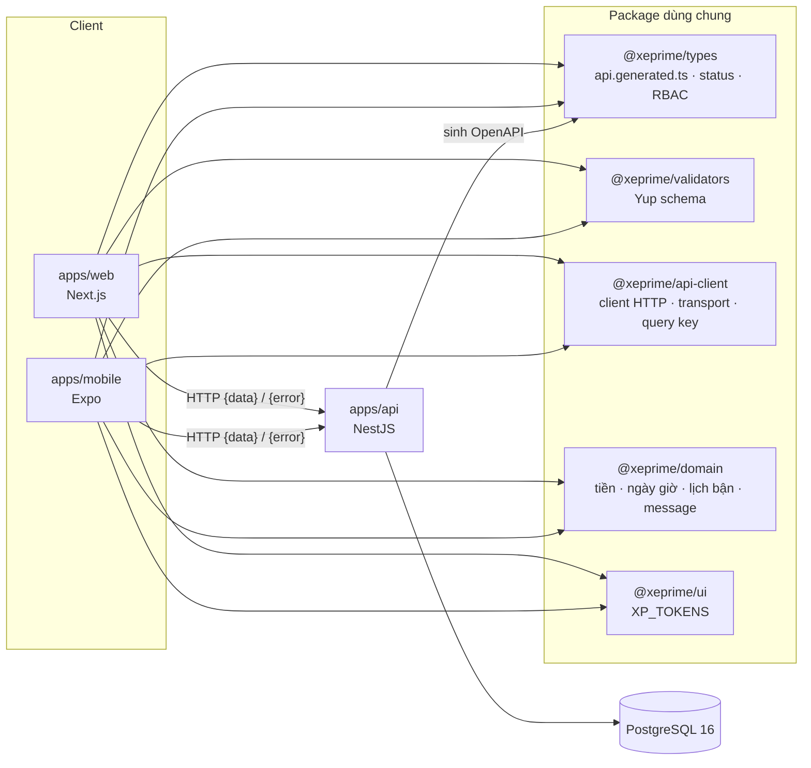
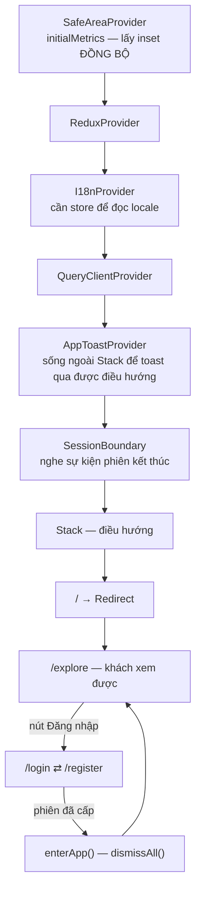
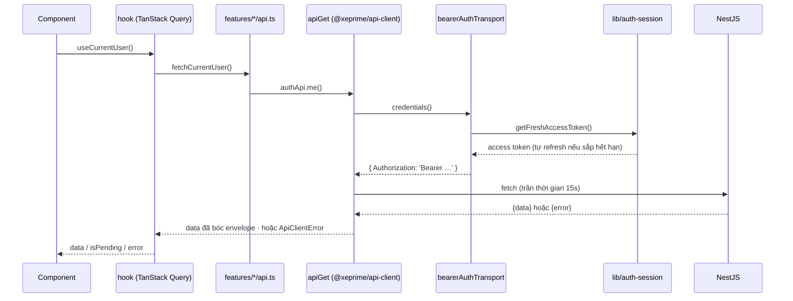
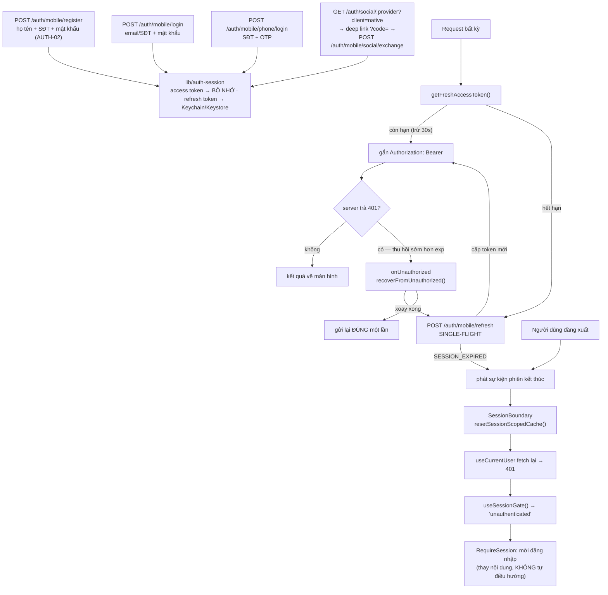

# `@xeprime/mobile` — App di động XePrime

React Native (Expo SDK 57) + Expo Router, nằm trong monorepo pnpm của XePrime.
Cùng backend, cùng hợp đồng API, cùng bộ ADR với `apps/web`.

> Đọc `CLAUDE.md` ở gốc repo và `docs/decisions/` trước. README này chỉ nói phần **riêng của
> mobile**; mọi luật nghiệp vụ (status, tenant scope, tiền, thuê dài hạn, đa ngữ) vẫn theo ADR.
> Kỷ luật khi viết feature mới: skill `.claude/skills/mobile-feature/`.

---

## 1. Chạy được trong 3 lệnh

```bash
pnpm install                            # ở gốc repo
pnpm --filter @xeprime/api start:dev    # API phải sống ở cổng 4000
pnpm --filter @xeprime/mobile start     # Metro + Expo
```

Rồi bấm `a` (Android), `i` (iOS) hoặc `w` (web preview).

| Lệnh (`pnpm --filter @xeprime/mobile …`) | Việc                                                                                          |
| ---------------------------------------- | --------------------------------------------------------------------------------------------- |
| `start`                                  | build package phụ thuộc rồi mở Expo dev server                                                |
| `android` / `ios`                        | `expo run:*` — build native                                                                   |
| `web`                                    | bản web của Expo, **chỉ để xem giao diện** — SecureStore lùi về `localStorage` nên refresh token bị chặn hẳn ở đó (ADR 0017), tức **không đăng nhập được** |
| `lint` · `typecheck` · `test`            | ESLint chung của repo · `tsc --noEmit` · Jest (`jest-expo`)                                   |
| `exec jest src/lib/live-bearer.test.ts`   | **Test sống** — gọi API thật, chứng minh app gửi đúng Bearer. Cần `XP_LIVE_API=1` + API ở cổng 4000 + DB đã seed; không đặt cờ thì suite tự bỏ qua |

`build:deps` chạy trước mọi lệnh start vì app import `@xeprime/types` /
`@xeprime/validators` ở dạng **đã build**, không phải source. Thiếu bước này thì clone mới sẽ
`MODULE_NOT_FOUND` ngay ở Metro.

### Base URL của API

Không cần cấu hình gì: [src/lib/api-base-url.ts](src/lib/api-base-url.ts) suy host từ Expo dev
server — thiết bị thật lấy IP LAN của máy chạy Metro, emulator Android đổi `localhost` thành
`10.0.2.2`. Chỉ đặt `EXPO_PUBLIC_API_URL` trong `.env` khi API **không** nằm ở cổng 4000 của
chính máy đang chạy Metro. Expo chỉ inline biến có tiền tố `EXPO_PUBLIC_`, và inline **lúc
build** — đổi giá trị phải khởi động lại Metro.

### Điện thoại thật không gọi được API

`localhost` trên điện thoại là CHÍNH chiếc điện thoại, không phải máy dev. Hai cách, chọn một:

```bash
# A. adb reverse — không cần quyền admin, không cần mở firewall (máy nối cáp USB)
adb reverse tcp:4000 tcp:4000
#    → EXPO_PUBLIC_API_URL="http://localhost:4000"   (localhost lúc này là ĐÚNG)
#    Rút cáp là mất, phải chạy lại. Tệ hơn: Expo/Metro reset bảng reverse mỗi lần start/reload
#    và chỉ tự dựng lại 8081 của nó, nên tcp:4000 biến mất giữa chừng ngay cả khi cáp còn cắm.

# B. Qua Wi-Fi — cần mở firewall MỘT lần, ở PowerShell Administrator
New-NetFirewallRule -DisplayName "XePrime API dev (TCP 4000)" -Direction Inbound `
  -Protocol TCP -LocalPort 4000 -Action Allow -Profile Private -RemoteAddress LocalSubnet
Set-NetConnectionProfile -InterfaceAlias 'Wi-Fi' -NetworkCategory Private   # rule Private chỉ ăn khi mạng là Private
#    → EXPO_PUBLIC_API_URL="http://<IP LAN máy dev>:4000", hoặc để trống cho app tự suy từ Expo dev server
```

**Máy dev hiện tại đang dùng cách B** (`.env` trỏ `http://192.168.1.183:4000`, rule firewall
trên đã tạo, Wi-Fi đã đặt Private) vì cách A đứt liên tục theo mô tả ở trên. Đổi mạng hoặc
router cấp lại DHCP thì IP đó sai — lấy IP mới bằng `ipconfig` rồi sửa `.env`.

Triệu chứng phân biệt: `{"code":"UNKNOWN"}` = sai host (đang trỏ `localhost` mà không có
reverse). `{"code":"CLIENT_TIMEOUT"}` sau ~15s = host ĐÚNG nhưng firewall chặn — Windows chặn
mọi kết nối vào khi profile mạng là **Public**, và Wi-Fi thường mặc định Public.

⚠️ Expo nội suy `EXPO_PUBLIC_*` **lúc build bundle**, không đọc lại lúc chạy: sửa `.env` xong
phải khởi động lại Metro (`expo start --clear`), bấm `r` để reload là vẫn giá trị cũ.

### Đăng nhập Google/Facebook trên máy thật CẦN cách A, không thay được bằng B

Đây là ngoại lệ của khuyến nghị ngay trên, và nó không hiển nhiên: luồng social có **hai chặng
mạng khác nhau**, đi bằng hai đường khác nhau.

| Chặng | Ai gọi | URL dựng từ |
| --- | --- | --- |
| App → API (mọi request thường) | `fetch` trong app | `EXPO_PUBLIC_API_URL` — IP LAN, cách B, chạy tốt |
| Provider → API (chặng callback) | **trình duyệt trên điện thoại** | `API_PUBLIC_URL` ở `.env` gốc |

Google chỉ chấp nhận `redirect_uri` dạng `http` khi host là `localhost`/`127.0.0.1`; mọi host
khác phải là `https` với tên miền thật. Nên `API_PUBLIC_URL` **không đổi sang IP LAN được** —
đưa `http://192.168.1.183:4000` vào Google Console sẽ bị từ chối thẳng.

Hệ quả: trên máy thật, trình duyệt được đưa về `http://localhost:4000/auth/social/…` và
`localhost` lúc đó là chính chiếc điện thoại. Triệu chứng là trang lỗi "không truy cập được"
NGAY SAU khi bấm đồng ý ở Google — trong khi mọi thứ khác của app vẫn chạy bình thường, nên rất
dễ đi tìm nhầm chỗ.

```bash
adb reverse tcp:4000 tcp:4000    # để localhost:4000 trên máy trỏ về máy dev
adb reverse --list               # kiểm tra: phải thấy cả tcp:8081 lẫn tcp:4000
```

Chạy lại lệnh đó **sau mỗi lần khởi động Metro** — Metro dựng lại bảng reverse và chỉ tự khôi
phục 8081 của nó. Giữ nguyên `EXPO_PUBLIC_API_URL` ở IP LAN: hai chặng dùng hai đường, không
xung đột.

Trên **emulator** thì không gặp: `10.0.2.2` và `localhost` đều đã trỏ về máy host.

Triệu chứng phân biệt, không cần log: trình duyệt mở ra rồi **đứng ở trang lỗi** ngay sau khi
bấm đồng ý ⇒ chặng callback không tới được máy dev (thiếu `adb reverse`). Trình duyệt **tự đóng**
mà app không đăng nhập ⇒ lỗi ở bước đổi mã, xem response của
`POST /auth/mobile/social/exchange`.

### Build Android trên máy dev Windows

`apps/mobile/android/` do `expo prebuild` sinh ra và bị gitignore. Máy dev cần **JDK 21** (JDK
24+ in cảnh báo native-access ra stderr, và task `configureCMake` của AGP coi mọi dòng stderr
là lỗi) và cấu hình đẩy thư mục build native sang đường dẫn ngắn — tên thư mục store của pnpm
làm đường dẫn object file vượt giới hạn 250 ký tự của CMake. Cấu hình nằm ngoài repo (`~/.gradle/`).

---

## 2. Cấu trúc hệ thống

Mobile là **một client ngang hàng với web**, nói chuyện với đúng một backend qua đúng một hợp đồng:



Hệ quả thực tế: **đổi DTO ở backend thì phải chạy `pnpm contract` ở gốc repo**, nếu không type
của mobile lệch so với API thật (ADR 0007). Mobile không có DTO viết tay, và cũng không có bản
thứ hai của client HTTP — hai app khác nhau đúng ở `AuthTransport` (mục 4).

### Thư mục

```
apps/mobile/
├── app/                          # route file-based của expo-router (tên file = URL)
│   ├── _layout.tsx               #   provider gốc + ErrorBoundary toàn app + chuyển cảnh
│   ├── index.tsx                 #   "/" — điểm vào, chuyển thẳng sang /explore (khách xem được)
│   ├── +not-found.tsx            #   route lạ / deep link hỏng
│   ├── (tabs)/                   #   thanh tab đáy; ba mục cần đăng nhập tự ẩn khi chưa có phiên
│   │   ├── _layout.tsx
│   │   ├── explore.tsx           #     "/explore" — Marketplace, CÔNG KHAI
│   │   ├── chat.tsx              #     "/chat"    — sau <RequireSession>
│   │   ├── trips.tsx             #     "/trips"   — sau <RequireSession>
│   │   └── account.tsx           #     "/account" — sau <RequireSession>
│   ├── login.tsx                 #   AUTH-01/03/04 — mật khẩu · OTP · social
│   ├── register.tsx              #   AUTH-02 — SĐT + mật khẩu
│   ├── forgot-password.tsx       #   AUTH-05 bước 1 — xin liên kết qua email
│   ├── reset-password.tsx        #   AUTH-05 bước 2 — ĐÍCH DEEP LINK, đọc ?token=
│   ├── set-password.tsx          #   gợi ý đặt mật khẩu sau khi đăng nhập OTP
│   ├── auth/callback.tsx         #   chặng quay về của OAuth (ADR 0019)
│   ├── search.tsx                #   kết quả tìm xe
│   └── listings/[id].tsx         #   chi tiết xe
├── assets/images/                # ảnh tĩnh (icon/splash khai ở app.json, phải là PNG vuông)
├── docs/trackingProject/*.html   # bảng theo dõi task (nguồn ưu tiên P0→P3 của app)
└── src/
    ├── assets.ts                 # registry ảnh — Metro cần đường dẫn HẰNG
    ├── components/
    │   ├── layout/AppHeader.tsx  #   ⚠️ HEADER DÙNG CHUNG — mọi màn reuse, đừng dựng riêng
    │   ├── layout/Screen.tsx     #   khung màn: safe area + bàn phím + cuộn
    │   ├── feedback/             #   ⚠️ TOAST DÙNG CHUNG — AppToastProvider + useAppToast()
    │   ├── state/                #   ScreenLoading · ScreenError · ScreenMessage · AppErrorScreen
    │   ├── ui/                   #   Button · TextField · Card · Chip · IconButton · Avatar · Skeleton · StatusIcon
    │   └── i18n/LocaleSwitcher.tsx
    ├── features/<miền>/          # api.ts · hooks/ · components/ — cắt theo NGHIỆP VỤ
    ├── hooks/                    # hook dùng chung không thuộc miền nào
    ├── i18n/                     # config · formats · provider · messages · intl-polyfill
    │                             #   app-format/domain: BẢN SAO của apps/web (xem §7)
    ├── lib/                      # api-client · auth-session · pkce · fetch-with-timeout · secure-storage · logger
    ├── navigation/               # routes.ts (bản đồ đường đi) · go-back-or.ts
    ├── queries/                  # queryClient · queryKeys · reset-session-cache
    ├── store/                    # Redux Toolkit — chỉ ĐĂNG KÝ reducer, slice thuộc về feature
    ├── theme/                    # tokens · elevation · tamagui.config (Tamagui đọc chính tokens)
    └── utils/
```

Tên nhóm trong ngoặc (`(tabs)`) **không xuất hiện trong URL** — route thật là `/explore`,
`/account`. Nhóm chỉ để gắn layout.

**Đừng viết chuỗi đường dẫn thẳng trong component**: mọi đích đi qua
[src/navigation/routes.ts](src/navigation/routes.ts), một namespace cho mỗi miền. Thêm màn hình
= thêm file trong `app/` **và** một entry trong namespace tương ứng, cùng một thay đổi.

Alias `@/*` → `src/*`, khai ở [tsconfig.json](tsconfig.json) và được `@expo/metro-config` đọc
lại nên chạy cả ở Metro lẫn `tsc`.

**Thêm màn hình mới** = thêm file trong đúng nhóm của `app/` + đặt logic ở `src/features/<miền>/`.
Không viết gọi API hay business logic thẳng trong file route.

---

## 3. Luồng khởi động

Thứ tự provider không tuỳ tiện — mỗi lớp cần lớp trước nó. Mở app là vào thẳng **Marketplace ở
chế độ khách**: khu công khai không dựng tường đăng nhập trước cửa (web cũng vậy).



`ErrorBoundary` của expo-router nằm **ngoài** toàn bộ khối này (lỗi có thể đến từ chính các
provider), nên `AppErrorScreen` tự dựng lại `IntlProvider` ở ngôn ngữ mặc định.

Locale lấy theo thứ tự: ngôn ngữ máy (`expo-localization`, đọc **đồng bộ** nên frame đầu đã
đúng) → lựa chọn đã lưu trong SecureStore ghi đè sau một nhịp. Không chặn render.

---

## 4. Luồng một request

**Client HTTP là `@xeprime/api-client`, dùng CHUNG với web.** App native không có bản thứ hai
của hợp đồng API: envelope `{ data, meta }`, `ApiClientError`, 48 mã lỗi, query string, phân
trang đều nằm ở package đó. [src/lib/api-client.ts](src/lib/api-client.ts) chỉ cấu hình nó một
lần rồi xuất lại — đối xứng với `apps/web/src/services/api-client.ts`.



Bốn chỗ — và chỉ bốn chỗ — app native khác web, cả bốn nằm trong lời gọi `configureApiClient()`:

| Chỗ              | Web                        | Native                                                                                |
| ---------------- | -------------------------- | ------------------------------------------------------------------------------------- |
| `baseUrl`        | `NEXT_PUBLIC_API_URL`      | [`resolveApiBaseUrl()`](src/lib/api-base-url.ts) — suy từ Expo dev server              |
| `transport`      | cookie httpOnly (ADR 0002) | `bearerAuthTransport` → `Authorization: Bearer` (ADR 0017)                             |
| `fetch`          | `fetch` của trình duyệt    | [`fetchWithTimeout`](src/lib/fetch-with-timeout.ts) — mạng di động treo, không báo lỗi |
| `onUnauthorized` | không cắm                  | `recoverFromUnauthorized` — xoay token khi server từ chối sớm hơn `exp`                |

Không gọi `fetch` trần ở feature. Sai envelope `{ data }` là **ném lỗi**, không đoán mò
(ADR 0007). Lỗi phát sinh **phía client** mang tiền tố riêng để nhìn log là biết ngay lỗi nằm ở
đâu: `CLIENT_ERROR_CODE.NETWORK_ERROR`, `CLIENT_ERROR_CODE.TIMEOUT` — chúng cố ý **không** nằm
trong `API_ERROR_CODE` của backend, vì backend không bao giờ phát chúng.

> Trần thời gian sống ở app chứ không trong package dùng chung: `setTimeout`/`AbortController`
> không nằm trong `lib: ES2023` mà package đó nhắm tới, và "bao lâu là quá lâu" là chính sách của
> từng client. Cần trần khác (upload/tải file dài) thì `createFetchWithTimeout(ms)` một client riêng.

---

## 5. Luồng phiên đăng nhập — ADR 0017

Native KHÔNG dùng cookie: trên React Native cookie do cookie store của OS quản và Android không
flush xuống đĩa, nên kill app là mất phiên. Thay vào đó là **Bearer access token 15 phút +
refresh token opaque xoay vòng**, thu hồi được theo thiết bị.

**Bốn đường vào, một kho token.** Đăng ký, mật khẩu, OTP và mạng xã hội đều kết thúc ở cùng
`storeTokens()` của `lib/auth-session.ts`; phần còn lại của app không phân biệt được người dùng
đã đăng nhập bằng cách nào, và đó là điều kiện để refresh/đăng xuất chỉ có một bản.



**Đặt lại mật khẩu (AUTH-05) đứng NGOÀI sơ đồ này** — nó không phát phiên. `POST
/auth/password/forgot` và `POST /auth/password/reset` dùng chung endpoint với web, và đổi mật
khẩu xong người dùng vẫn phải đăng nhập lại; đó là hành vi của web, giữ nguyên. Liên kết trong
email trỏ tới `APP_WEB_URL/reset-password?token=…`, nên `app/reset-password.tsx` chỉ nhận được
lượt mở khi máy đã bật App Links / Universal Links (hoặc qua scheme `xeprime://`); chưa bật thì
trình duyệt mở trang web, và cả hai đường gọi cùng một endpoint.

| Tầng                       | Ở đâu                                                              | Việc                                                                                            |
| -------------------------- | ------------------------------------------------------------------ | ----------------------------------------------------------------------------------------------- |
| Kho token                  | [src/lib/auth-session.ts](src/lib/auth-session.ts)                 | Nơi DUY NHẤT biết token; đọc/ghi Keychain, làm mới, phát sự kiện "phiên kết thúc"                |
| PKCE app ↔ backend         | [src/lib/pkce.ts](src/lib/pkce.ts)                                 | Sinh `code_verifier`/`code_challenge` cho social; verifier chỉ ở bộ nhớ (ADR 0019)             |
| Dọn trạng thái             | [SessionBoundary.tsx](src/features/auth/SessionBoundary.tsx)       | Nằm ngoài cây điều hướng nên **không** gọi được `useRouter` — nó chỉ dọn cache                  |
| Quyết định                 | [use-session-gate.ts](src/features/auth/hooks/use-session-gate.ts) | Trả về `loading \| unauthenticated \| unreachable \| ready` — kiểm thử được mà không cần router |
| Cổng vào màn               | [RequireSession.tsx](src/features/auth/RequireSession.tsx)         | Bọc màn CẦN đăng nhập (`chat`, `trips`, `account`). Thay nội dung theo bốn trạng thái trên; deep link không lách qua được |
| Quyền (RBAC)               | [use-permissions.ts](src/features/auth/hooks/use-permissions.ts) · [use-tenant-scope.ts](src/features/auth/hooks/use-tenant-scope.ts) | Đọc `permissions`/`tenant` từ `GET /auth/me` — CHỈ để ẩn/hiện UI, guard backend mới là bảo vệ thật |

Chín luật đi kèm, đừng phá:

1. **Refresh token CHỈ ở Keychain/Keystore.** Không `AsyncStorage`, không redux-persist, không
   log. Access token sống 15 phút nên nó ở **bộ nhớ** — ghi xuống đĩa chỉ thêm một chỗ để rò.
2. **SINGLE-FLIGHT khi làm mới.** Đây không phải tối ưu. Refresh token dùng MỘT lần: ba request
   song song cùng gửi một token thì server cho một cái thắng và coi hai cái sau là **replay** —
   thu hồi cả phiên, người dùng bị đá ra dù chẳng làm gì sai.
3. **Ghi đè cặp token mới sau MỖI lần refresh.** Giữ lại token cũ = lần sau gửi token đã chết =
   cũng bị coi là replay.
4. **401 một mình KHÔNG phải phiên chết.** Access token hết hạn mỗi 15 phút là chuyện thường,
   client tự làm mới rồi đi tiếp. Chỉ hai việc mới kết thúc phiên: refresh bị từ chối
   (`SESSION_EXPIRED`) và người dùng đăng xuất. Đừng dựng lại interceptor bắt 401 để logout.
5. **Nhưng 401 phải được THỬ CỨU một lần.** Làm mới theo `exp` chỉ bắt được lúc token hết hạn
   theo **đồng hồ máy**; server từ chối sớm hơn thế khi đồng hồ lệch, khi đổi mật khẩu, đăng
   xuất từ thiết bị khác hay bị admin khoá. `onUnauthorized` xoay một vòng rồi gửi lại **đúng
   một lần** — lần gửi lại không gọi lại hook, đó là thứ chặn vòng lặp.
6. **Lỗi mạng khi refresh thì GIỮ phiên.** Mất sóng không phải phiên chết; xoá token vì đi qua
   thang máy là bắt người dùng đăng nhập lại vô cớ.
7. **Đăng xuất phải gọi server.** Chỉ xoá ở máy là để phiên sống tiếp trên server tới 60 ngày.
   Ngược lại, server không trả lời cũng vẫn xoá ở máy — người dùng đã bấm rồi.
8. **`code_verifier` của social KHÔNG bao giờ chạm đĩa.** Nó sống vài giây trong bộ nhớ giữa lúc
   mở trình duyệt và lúc đổi mã ([lib/pkce.ts](src/lib/pkce.ts)). Ghi nó vào Keychain "cho chắc"
   là tự tạo ra thứ để đánh cắp — nó tồn tại chính vì one-time code trên deep link không an toàn.
9. **Người dùng đóng trình duyệt social ⇒ `null`, không phải lỗi.** `signInWithSocial` trả
   `null` cho cả `type !== 'success'` lẫn `?error=SOCIAL_CANCELLED`. Ném lỗi ở đây nghĩa là mọi
   nơi gọi phải nhớ lọc riêng một mã để không hiện dải đỏ cho một người chỉ đổi ý.

Kèm theo: **màn hình KHÔNG tự kiểm 401**; chúng nằm sau guard và dùng
[`useAuthenticatedUser()`](src/features/auth/hooks/use-authenticated-user.ts) — hook này **ném
lỗi** nếu không có phiên, để lỗi định tuyến nổ ra ở ErrorBoundary thay vì thành màn trắng im
lặng. Và dùng `resetQueries()`, **KHÔNG** `clear()`: `clear()` gỡ hẳn query khỏi cache nên
observer đang mounted giữ nguyên dữ liệu cũ và không ai bảo nó chạy lại — người dùng hết phiên
vẫn nhìn thấy dữ liệu của phiên đã chết và **không bao giờ bị đẩy về đăng nhập**. Đây là bug
thật đã xảy ra; [session-recovery.test.tsx](src/features/auth/session-recovery.test.tsx) khoá
lại đúng ca đó.

### Chứng minh trên dây

Unit test chạy với `fetch` giả nên chúng chứng minh được ý ĐỊNH, không phải byte đi ra.
[live-bearer.test.ts](src/lib/live-bearer.test.ts) gọi API thật và ghi lại header của từng
request — đăng nhập → `/auth/me` kèm Bearer → xoay token → đăng xuất → phiên bị từ chối:

```bash
XP_LIVE_API=1 pnpm --filter @xeprime/mobile exec jest src/lib/live-bearer.test.ts
```

Nó cắm `node:http` vào khe `globalThis.fetch` (polyfill `whatwg-fetch` của jest-expo chạy trên
`XMLHttpRequest` đã bị mock nên không đi mạng được); mọi tầng còn lại là code thật của app. Không
có `XP_LIVE_API=1` thì suite tự bỏ qua, nên `pnpm test` vẫn chạy được khi không có API.

> Còn thiếu: `RequireSession` chưa nhớ đích đến (hết phiên giữa màn `trips` thì đăng nhập xong
> về Khám phá, không quay lại `trips`); `login`/`register` không chặn người đã đăng nhập; chưa có
> màn "thiết bị đang đăng nhập" dù backend đã lưu `deviceName`/`devicePlatform`/`appVersion` của
> từng phiên; và `app/reset-password.tsx` chưa nhận được liên kết email cho tới khi App Links /
> Universal Links được cấu hình (cần `.well-known/assetlinks.json` + fingerprint chứng chỉ ký).
---

## 5b. Thông báo — MỘT hệ toast cho toàn app

Mọi thao tác gọi API phải kết thúc bằng một phản hồi nhìn thấy được: đang chạy (nút loading +
khoá), rồi thành công hoặc lỗi. Phần "thành công/lỗi" đi qua toast, và **chỉ có một hệ**.

| Tầng | Ở đâu | Việc |
| --- | --- | --- |
| Provider | [AppToast.tsx](src/components/feedback/AppToast.tsx) — `AppToastProvider` | Gói `ToastProvider` + viewport + component render làm một. Nằm ở `app/_layout.tsx`, **ngoài** `Stack` |
| Hiển thị | cùng file — `AppToast` | MỘT component cho cả ba preset; `PRESET_SKIN` là chỗ duy nhất quyết định màu/icon |
| Gọi | [use-app-toast.ts](src/components/feedback/use-app-toast.ts) — `useAppToast()` | `showSuccess` · `showError` · `showInfo` |

Luật:

1. **Màn hình không import `useToastController` của Tamagui.** Đi thẳng nghĩa là mỗi nơi tự chọn
   `duration` và tự nhớ đặt `customData.preset` — quên một lần thì lỗi hiện ra màu xanh.
2. **Không dựng hệ toast thứ hai cho một feature.** Preset mới, nếu thật sự cần, thêm vào
   `TOAST_PRESET` + `PRESET_SKIN`.
3. **Provider nằm NGOÀI `Stack`.** Bắn toast rồi `router.replace` — đặt trong màn hình thì
   provider bị tháo cùng màn đó và người dùng không đọc được gì.
4. **`message` là chuỗi ĐÃ DỊCH.** Lỗi API đi qua `useErrorMessage()` để dịch từ MÃ (ADR 0012);
   không bao giờ hiện `message` tiếng Việt cố định của backend, không bao giờ hiện lỗi thô.
5. **Lỗi của một LẦN GỬI dùng toast; lỗi của một Ô dùng chỗ dưới ô đó.** Dải đỏ giữa form đẩy bố
   cục xuống một nấc và vẫn nằm đó sau khi người dùng đã sửa.
6. **`native={false}`** — toast dựng bằng JS để iOS/Android/web giống nhau theo hệ thiết kế.
   Toast native (`burnt`) mỗi nền tảng một kiểu và không nhận token màu của app.

## 6. Ranh giới trạng thái (giống `apps/web`, ADR 0004)

| Loại            | Công cụ                                           | Ở đâu                                                                                           |
| --------------- | ------------------------------------------------- | ----------------------------------------------------------------------------------------------- |
| Dữ liệu server  | **TanStack Query**                                | `src/features/*/hooks/`, key lấy từ `src/queries/query-keys.ts`                                 |
| Form            | **React Hook Form + Yup** (`@xeprime/validators`) | cục bộ trong màn/modal, không đẩy lên global                                                    |
| UI/client state | **Redux Toolkit**                                 | slice sống cùng feature sở hữu nó (vd `src/i18n/locale.slice.ts`); `src/store/` chỉ **đăng ký** |
| Bí mật          | **expo-secure-store**                             | qua `src/lib/secure-storage.ts`, khoá khai trong `SECURE_KEY`                                   |

Slice đặt cạnh feature để phụ thuộc chỉ đi **một chiều** `store → feature`. Đặt hết vào
`store/slices/` sẽ tạo vòng phụ thuộc ngay khi slice cần hằng số của feature.

Mặc định query đã chốt ở [src/queries/query-client.ts](src/queries/query-client.ts):
`refetchOnWindowFocus: false` (React Native không có window focus), retry **chỉ** với lỗi
mạng/timeout/5xx (`isRetriableError`), mutation **không** retry — gửi lại một POST đã tới
server là tạo bản ghi trùng.

---

## 7. Đa ngữ (ADR 0012)

Hai ngôn ngữ `vi` (mặc định) / `en` qua **`use-intl`** — chính là lõi mà `next-intl` bên web
bọc lên, nên tên namespace và khoá giống hệt web.

**Gốc message là `@xeprime/domain/messages`, DÙNG CHUNG với `apps/web`** (24/08/2026): app
native không có file chữ nào của riêng nó. `src/i18n/messages.ts` chỉ là *bảng gom* chọn
namespace nào vào bundle — Metro không tách chunk theo màn hình nên danh sách đó là tập con có
chủ đích, mở tính năng nào thì thêm namespace của tính năng đó.

| Việc                            | Ở đâu                                                          |
| ------------------------------- | -------------------------------------------------------------- |
| Hằng locale, `APP_TIME_ZONE`    | [src/i18n/config.ts](src/i18n/config.ts)                       |
| Bảng gom, kiểu `AppMessages`    | [src/i18n/messages.ts](src/i18n/messages.ts)                   |
| Provider + `useAppLocale()`     | [src/i18n/I18nProvider.tsx](src/i18n/I18nProvider.tsx)         |
| Trạng thái locale               | [src/i18n/locale.slice.ts](src/i18n/locale.slice.ts)           |
| Lỗi API → chữ                   | [src/i18n/use-error-message.ts](src/i18n/use-error-message.ts) |

Khoá `t()` **được kiểm lúc biên dịch**: [src/i18n/use-intl.d.ts](src/i18n/use-intl.d.ts) gắn bó
message vào `use-intl`, nên `t('Common.actions.rerty')` là lỗi typecheck chứ không phải chuỗi
lạ lọt ra bản phát hành.

Thêm chuỗi mới: sửa **cả** `packages/domain/messages/vi/*.json` và `.../en/*.json`, khai
namespace ở [apps/web/src/i18n/namespaces.ts](../web/src/i18n/namespaces.ts) rồi thêm vào
`MESSAGES`. Hai hàng rào: `pnpm --filter @xeprime/web i18n:check` (parity vi↔en, ICU, và canh
luôn bảng gom của app native) và [messages.test.ts](src/i18n/messages.test.ts) (bó THẬT SỰ vào
bundle native).

⚠️ Namespace chia theo **TÍNH NĂNG, không theo client**: mở màn booking trên app thì dùng lại
`bookings`/`booking-requests` như web. `mobile-shell` chỉ dành cho VỎ app native (màn lỗi cấp
app, not-found, điều hướng gốc) — chép chuỗi tính năng vào đó là tạo bản dịch thứ hai cho cùng
một khoá, đúng thứ gốc chung sinh ra để chặn.

Chữ hiện cho người dùng không được viết thẳng trong component; chữ chỉ vào log thì để tiếng
Anh. Thông báo lỗi chọn theo **MÃ**, không theo `message` của backend.

> Nợ đã biết: `@xeprime/validators` vẫn trả message tiếng Việt cứng, nên lỗi form chưa dịch.

---

## 8. Giao diện & khác biệt nền tảng

Thư viện UI là **Tamagui** ([src/theme/tamagui.config.ts](src/theme/tamagui.config.ts)).

> `antd-mobile` KHÔNG dùng được ở đây: peer dependency của nó là `react-dom`, tức nó render ra
> DOM. Nó chỉ chạy ở `expo start --web`, không chạy trên thiết bị.

- Tamagui đọc **chính** bảng token native bên dưới, không có bảng màu thứ hai: `$primary` trong
  một component Tamagui và `colors.primary` trong một `StyleSheet` phải luôn ra cùng mã màu.
  Đổi màu/khoảng cách thì sửa ở `@xeprime/ui`, không sửa `tamagui.config.ts`.
- Component Tamagui dùng ở mức **primitive** (`YStack`/`XStack`/`Text`). Widget dựng sẵn của
  Tamagui giả định thang size `$1…$12` của config mặc định, còn thang ở đây là token XePrime —
  trộn vào là kích thước loạn.
- Màn hình KHÔNG dựng thẻ/viên/nút từ `XStack` trần: dùng `src/components/ui/` (`Card`, `Chip`,
  `Button`, `IconButton`, `Avatar`, `TextField`, `Skeleton`, `StatusIcon`). Đó là chỗ độ nổi, bo góc và vùng
  chạm được quyết định MỘT lần — dựng tay ở từng màn là mỗi màn một kiểu.
- **Thanh trên của mọi màn đi qua [`<AppHeader>`](src/components/layout/AppHeader.tsx)**, không
  dựng `XStack` riêng. Hai biến thể: `solid` (nền đặc, kẻ dưới) và `overlay` (nổi trên ảnh tràn
  viền). Thiếu thứ bạn cần thì **thêm biến thể vào chính file đó**, đừng rẽ nhánh ở màn hình.
  Header TỰ cộng safe-area trên ⇒ `<Screen>` đặt dưới nó phải khai
  `edges={['left', 'right', 'bottom']}`, nếu không phần trên đệm hai lần.
- **Nền header KHÔNG dùng màu thương hiệu.** Gold là màu HÀNH ĐỘNG (nút chính, chip đang chọn,
  giá thuê); tô nó lên dải rộng nhất màn hình thì mọi CTA gold bên dưới mất sức nặng. Header nhận
  diện bằng thương hiệu + thứ bậc chữ. `tone="brand"` có sẵn nhưng là NGOẠI LỆ.
- Chỗ đã biết trước hình dạng nội dung dùng `Skeleton` thay `ActivityIndicator`: khung xám đúng
  kích thước giữ nguyên bố cục nên trang không nhảy khi dữ liệu về.
- Style còn lại bằng `StyleSheet.create`. Màu/khoảng cách/bo góc/cỡ chữ lấy từ
  [src/theme/tokens.ts](src/theme/tokens.ts) — file này **không giữ giá trị nào**, nó đọc
  `XP_TOKENS` của [`@xeprime/ui`](../../packages/ui), đúng nguồn web dựng `tokens.css` và AntD
  theme (ADR 0003). Không gõ hex hay số đo thẳng vào component: gõ một lần là app native lặng
  lẽ trôi khỏi web, y như hồi `theme/colors.ts` để primary màu đen trong khi web màu gold.
  Token viết bằng ngôn ngữ CSS nên `tokens.ts` gánh phần dịch sang native: gỡ bí danh
  `var(--xp-…)`, đổi `'16px'` → `16`, và **ném lỗi** nếu gặp hàm CSS (`color-mix`,
  `linear-gradient`) mà RN không hiểu.
  Palette hiện **chỉ có bản sáng**, nên `app.json` khoá `userInterfaceStyle: "light"` — mở
  `"automatic"` cùng lúc với việc bổ sung palette tối *ở `@xeprime/ui`*, không sớm hơn.
- Mọi màn bọc bằng [`<Screen>`](src/components/layout/Screen.tsx) — safe area, tránh bàn phím,
  `keyboardShouldPersistTaps` gom một chỗ. Màn danh sách tràn viền đặt `padded={false}` để giữ
  phần cấu trúc mà bỏ lề trang.
- Đổ bóng dùng `elevation.card` / `.raised` / `.overlay`
  ([src/theme/elevation.ts](src/theme/elevation.ts)); iOS và Android dùng hai bộ thuộc tính
  khác nhau, viết tay ở từng component là quên một bên. Giá trị parse từ token `shadow-*` của
  `@xeprime/ui` nên bóng của app và của web là một.
- [src/theme/tokens.test.ts](src/theme/tokens.test.ts) canh cả hai bộ chuyển đổi trên: chúng
  chỉ chạy lúc nạp module trên thiết bị, nên sai một dạng giá trị là màn hình trắng chứ không
  phải test đỏ. Đổi token ở `@xeprime/ui` mà dạng giá trị lệch thì hỏng ở test trước.
- Khác biệt nền tảng **nhỏ** → `Platform.select` tại chỗ. Khác biệt **lớn** (cả cây JSX, API
  native riêng) → tách `<Tên>.ios.tsx` / `<Tên>.android.tsx`, import vẫn viết không có đuôi.
- Mọi màn phải đủ trạng thái **loading / rỗng / lỗi** — dùng `src/components/state/`.
- Ảnh tĩnh khai trong [src/assets.ts](src/assets.ts): Metro nội suy đường dẫn lúc build nên nó
  phải là hằng, không dựng động được. Kiểu của `import ảnh` khai ở [global.d.ts](global.d.ts)
  vì `expo/types` chỉ khai báo module cho CSS.
- Không dùng `console.*` — đi qua [src/lib/logger.ts](src/lib/logger.ts), im lặng ở bản phát
  hành và là chỗ cắm Sentry sau.

---

## 9. Bẫy đã vấp — đừng sửa lại theo hướng cũ

| Chỗ                                            | Luật                                                                                                                                                                                                                                                                                                                       |
| ---------------------------------------------- | -------------------------------------------------------------------------------------------------------------------------------------------------------------------------------------------------------------------------------------------------------------------------------------------------------------------------- |
| [metro.config.js](metro.config.js)             | **KHÔNG** bật `resolver.disableHierarchicalLookup`. Tài liệu monorepo của Expo đề xuất nó cho layout hoisted (yarn/npm); với pnpm nó phá resolve → MODULE_NOT_FOUND hàng loạt. `watchFolders` cố ý chỉ gồm `node_modules` + `packages`                                                                                     |
| [babel.config.js](babel.config.js)             | **KHÔNG** thêm tay `react-native-worklets/plugin` — `babel-preset-expo` tự nạp khi package có trong dependency; khai lần hai là worklet transform hai lần                                                                                                                                                                  |
| [jest.config.js](jest.config.js)               | `transformIgnorePatterns: []` và preset babel khai **tường minh**. Whitelist theo tên của jest-expo không dùng được với pnpm, và Babel chỉ áp config gốc cho file nằm trong `root` — dependency ở workspace root thì nằm ngoài. Bỏ hai thứ này là `SyntaxError: Unexpected token 'export'` từ trong lòng thư viện ESM-only |
| [tsconfig.json](tsconfig.json)                 | Cố ý **không** extends `packages/config/tsconfig/*`: Expo cần `moduleResolution: bundler` + `customConditions: ["react-native"]`. Cờ strict của repo lặp lại tường minh ở đây                                                                                                                                              |
| [src/i18n/intl-polyfill.ts](src/i18n/intl-polyfill.ts) | Import **đầu tiên** ở `app/_layout.tsx`, và thứ tự các polyfill bên trong **không được sắp lại**. Hermes trên Android thiếu `Intl.PluralRules` và bảng múi giờ: thiếu polyfill thì mọi message ICU `{count, plural, …}` in ra ĐƯỜNG DẪN KHOÁ (`Marketplace.available.count`) còn khoá thường vẫn đúng — trông y như "vài chỗ chưa dịch" chứ không như một lỗi runtime |
| [src/lib/fetch-with-timeout.ts](src/lib/fetch-with-timeout.ts) | Không dùng `AbortSignal.any` / `AbortSignal.timeout` — Hermes không đảm bảo có ở mọi bản RN, và lỗi chỉ lộ trên máy thật chứ không phải trong Jest (chạy trên Node)                                                                                                              |
| [app/_layout.tsx](app/_layout.tsx)             | `ErrorBoundary` phải là **export tên**; nó nằm NGOÀI các provider nên `AppErrorScreen` tự dựng lại provider nó cần. `SafeAreaProvider` phải có `initialMetrics`, thiếu thì frame đầu render với inset = 0 rồi nhảy                                                                                                         |
| [src/theme/tamagui.config.ts](src/theme/tamagui.config.ts) | Phải có **`export default`** (hoặc `export const config`). `@tamagui/babel-plugin` nạp chính file này lúc build; export đặt tên khác thì nó báo `Missing "themes"… Got config: null` và **làm chết jest worker** — lỗi hiện ra là "worker crashed for an unknown reason", không hề nhắc tới Tamagui |
| `react-native-reanimated`                      | Side-effect import ở `_layout.tsx`, **không xoá** dù trông như import thừa — expo-router dùng nó cho animation của navigator                                                                                                                                                                                               |
| [jest.setup.js](jest.setup.js)                 | Mock `expo-secure-store` là bản **trong bộ nhớ**, không phải mock từng lời gọi — test vòng đời token cần "ghi rồi đọc lại được". CỐ Ý không require `@/lib/auth-session` ở đây: nạp nó trong setup là chạy trước `jest.mock('expo-constants')` của file test              |
| Test RNTL v14                                  | `render`, `fireEvent`, `renderHook` đều **async** — thiếu `await` là `result` chưa tồn tại                                                                                                                                                                                                                                 |

---

## 10. Trạng thái hiện tại

**Đã có:**

- **Xác thực Bearer đầy đủ theo ADR 0017** (access token 15 phút + refresh xoay vòng
  single-flight + thu hồi theo thiết bị) trên `@xeprime/api-client` dùng chung với web, kèm một
  suite **chạy với API thật** (mục 5) xác nhận Bearer đi đúng trên dây.
- **Auth trọn bộ khu khách**: AUTH-01/03/04 đăng nhập (mật khẩu · OTP · Google/Facebook),
  **AUTH-02** đăng ký SĐT + mật khẩu, **AUTH-05** quên/đặt lại mật khẩu, **AUTH-07** RBAC +
  cổng phiên (`RequireSession`) + đăng xuất thu hồi ở server.
- **Marketplace khu công khai** (MKT): trang chủ, tìm kiếm, chi tiết xe.
- Hạ tầng: timeout + retry policy, SecureStore, logger, đa ngữ vi/en type-safe trên **gốc
  message dùng chung với web**, bộ component trạng thái/UI + skeleton, hệ toast một mối.

22 test suite / 162 case (+ suite live-bearer chỉ chạy khi có `XP_LIVE_API=1`).

**Chưa có:** iOS chưa build lần nào, `app.config.ts` tách dev/staging/prod, App Links /
Universal Links (liên kết đặt lại mật khẩu trong email vì thế mở ở trình duyệt), refetch theo
`AppState`/NetInfo, push notification, chat thật, đặt xe, và toàn bộ cổng quản lý. Lộ trình
chung: `docs/completion-roadmap.md`.

---

## 11. Đánh giá kiến trúc — **8.5 / 10**

Chấm trên tiêu chí "base này có đỡ nổi 9 phase nghiệp vụ không", **không** phải "đã đủ tính
năng chưa". Cập nhật sau đợt xử lý vòng đời phiên.

| Hạng mục             | Điểm | Nhận xét                                                                                                                                                                                                                  |
| -------------------- | ---- | ------------------------------------------------------------------------------------------------------------------------------------------------------------------------------------------------------------------------- |
| Vòng đời phiên       | 9.0  | Hai tầng tách bạch (phát hiện / quyết định / điều hướng), có test **đầu-cuối**. Chính test đó đã bắt được một bug thật: `clear()` không kéo được cổng về `unauthenticated`, người dùng hết phiên vẫn thấy dữ liệu cũ      |
| Tầng HTTP            | 9.5  | **Một client cho cả hai app** (`@xeprime/api-client`) — envelope ADR 0007 kiểm chặt (sai envelope là ném lỗi, không đoán), `CLIENT_ERROR_CODE` tách khỏi mã backend, timeout tự dựng thay vì tin `AbortSignal.timeout` trên Hermes |
| Chiều phụ thuộc      | 9.0  | Một chiều `store → feature`; slice sống cùng chủ sở hữu. Không barrel file, không abstraction thừa                                                                                                                        |
| Xử lý lỗi            | 9.0  | `useAuthenticatedUser()` ném lỗi thay vì trả `undefined` — lỗi định tuyến nổ ở ErrorBoundary chứ không thành màn trắng im lặng. Logger có chỗ đứng, `no-console` giữ được                                                 |
| Ranh giới trạng thái | 9.0  | Query / RHF / Redux / SecureStore phân vai rõ. Mutation không retry, retry chỉ với 5xx/mạng — hai quyết định nhiều base bỏ sót                                                                                            |
| Đa ngữ               | 8.5  | `use-intl` giữ nguyên API `t()` của web nên hai bó message hợp nhất được sau; khoá `t()` kiểm lúc **biên dịch**; `messages.test.ts` chặn lệch vi↔en. Trừ vì `@xeprime/validators` vẫn trả message tiếng Việt cứng         |
| Tương thích monorepo | 8.5  | Chỗ khó nhất của Expo + pnpm (Metro resolve, ESM-only trong Jest, babel root, tsconfig không extends được preset) đã giải xong và **ghi lý do ngay tại chỗ** — thứ tiết kiệm nhiều ngày công nhất về sau                  |
| Kiểm thử             | 8.5  | 162 case đặt đúng chỗ rủi ro, không có test trang trí. Trừ vì chưa có test cho `Screen` và cho luồng điều hướng                                                                                                           |
| Điều hướng           | 8.5  | Bản đồ route tập trung (`navigation/routes.ts`, một namespace mỗi miền) + cổng phiên một mối (`RequireSession`). Trừ vì cổng chưa nhớ đích đến và `login`/`register` chưa chặn người đã đăng nhập                          |     |
| Cấu hình môi trường  | 5.0  | Một biến `EXPO_PUBLIC_API_URL`. `app.json` tĩnh nên chưa tách được dev/staging/prod                                                                                                                                       |
| Sẵn sàng phát hành   | 4.5  | Chưa có `icon` / `splash` / `adaptiveIcon`, chưa có EAS profile, chưa có CI build, chưa có `expo-updates`. **iOS chưa build lần nào**                                                                                     |

### Đọc con số này thế nào

**8.5 là điểm KIẾN TRÚC** — khả năng đỡ được feature mà không phải đập đi xây lại. Nếu chấm cả
khâu phát hành thì thấp hơn đáng kể, và điều đó **đúng với giai đoạn hiện tại**: base này để
viết feature, chưa phải để lên store.

Thứ đáng tin nhất không nằm ở số test, mà ở chỗ luồng quan trọng nhất — hết phiên — đã bị một
test đầu-cuối kéo ra ánh sáng và chứng minh là **sai**, rồi mới sửa. Trước đó nó trông đúng và
có unit test xanh (chúng chứng minh "cache đã xoá" — đúng nhưng vô nghĩa).

Ba khoản trừ điểm cuối bảng không phải nợ kiến trúc, mà là **quyết định chưa chốt** hoặc **việc
chưa làm** — xem mục 12.

---

## 12. Ba việc nên làm TRƯỚC khi mở feature mới

1. **Cho cổng phiên nhớ đích đến.** `RequireSession` đã chặn (mục 5), nhưng hết phiên giữa màn
   `trips` thì đăng nhập xong về Khám phá. Cần mang đường đang mở theo sang `/login` và quay lại
   sau khi có phiên — kèm việc chặn người đã đăng nhập mở lại `login`/`register`.
2. **Đưa `tenantId` vào `queryKeys`.** Người dùng nhiều gian hàng là chuyện chắc chắn xảy ra;
   key không mang scope thì cache của tenant này hiện cho tenant kia, và lúc đó phải sửa từng
   hook một.
3. **Build iOS một lần.** Chưa chạy thì chưa được gọi là cross-platform, và lỗi native thường
   lộ ra ngay ở lần build đầu.
