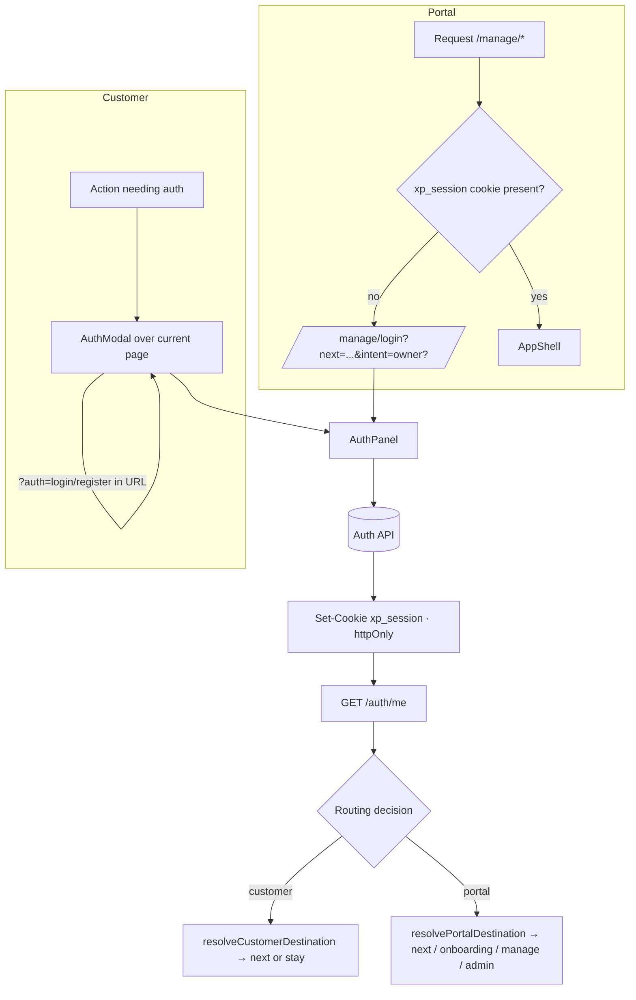
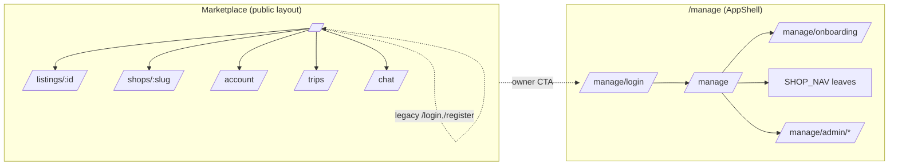

# 00 — Cross-Cutting System UX

> **Type:** Cross-cutting design brief · **Created:** 2026-08-04 · **Status:** Draft for product review
> **Owners:** Principal Software Architect · Senior Product Manager · Senior Business Analyst · UX Architect
> **Written to:** [`_DESIGN_BRIEF_STANDARD.md`](_DESIGN_BRIEF_STANDARD.md)
> **Authoritative sources:** application source code and accepted ADRs in [`docs/decisions/`](../decisions/). As-built documentation in [`docs/project/`](../project/) is secondary; historical specifications in `docs/*.md` are weakest and may be superseded.
>
> **Reading contract:** blocks headed *Confirmed* describe the system as it exists. Blocks headed *Recommended* and lines marked `[RECOMMENDED — NOT CURRENT]` describe nothing that exists today. Where evidence is absent, this brief writes `Unknown` rather than inferring.

---

## 1. Executive summary

XePrime is a single product with **two front doors and one enforcement layer**. The marketplace at `/` serves customers and is publicly readable; the portal at `/manage` serves tenant operators and platform staff and requires a session. Both call one NestJS API whose global guards — not the client — decide what a request may do.

Five cross-cutting facts shape every module:

1. **Identity is a server-issued httpOnly cookie, and authority is never carried in it.** The session JWT contains only `sub` and `sid`; roles, permissions and tenant are re-read from the database on every request ([`session.service.ts`](../../apps/api/src/modules/auth/session.service.ts), [ADR 0002](../decisions/0002-auth-session-cookie.md)).
2. **Authentication has two presentations but one implementation.** `AuthPanel` is shared by the customer modal and the portal login page, so login logic cannot drift between them ([`AuthPanel.tsx`](../../apps/web/src/features/auth/components/AuthPanel.tsx)).
3. **Post-authentication destination is a pure, tested function of context** — never a fixed default. `resolveCustomerDestination` returns `null` (stay in place) when there is no safe `next`; `/manage` is not a fallback for customers ([`post-auth-destination.ts`](../../apps/web/src/features/auth/post-auth-destination.ts)).
4. **"No tenant" is a valid terminal state**, not an error and not an onboarding trigger ([`AppShell.tsx`](../../apps/web/src/components/layout/AppShell.tsx), [`NoTenantState.tsx`](../../apps/web/src/features/shop/components/NoTenantState.tsx)).
5. **Presentation conventions are the least standardized layer.** Loading, empty, error, success, confirmation, responsive breakpoints and 403 handling are each implemented per feature rather than through a shared contract; this is the largest cross-cutting gap found.

The strongest cross-cutting risks identified are: an **unimplemented CSRF control that ADR 0002 requires** for cross-origin writes; **no session revocation or sliding renewal** although both are specified in ADR 0002 and implied by `sid`; **no client handling of `FORBIDDEN`/`MISSING_PERMISSION`** outside the platform area; and a **hardcoded session cookie name in the web proxy** that will silently break route protection if the API's configurable name changes.

---

## 2. Scope

### 2.1 In scope

Rules that every XePrime module inherits: authentication, session, authorization, navigation, shared interaction and state conventions, notifications, responsiveness, accessibility, security, privacy and audit.

### 2.2 Out of scope

This brief does **not** decide: module-specific workflows (booking, finance, chat, approvals), final visual design, component APIs, data model changes, or delivery sequencing. It does not override any accepted ADR.

### 2.3 Subject status table

Statuses follow `_DESIGN_BRIEF_STANDARD.md` §R4.

| # | Subject | Status | Primary evidence |
|---|---|---|---|
| 1 | Customer authentication | Implemented | [`AuthModal.tsx`](../../apps/web/src/features/auth/components/AuthModal.tsx), [`auth.controller.ts`](../../apps/api/src/modules/auth/auth.controller.ts) |
| 2 | Portal authentication | Implemented | [`manage/login/page.tsx`](<../../apps/web/src/app/(manage)/manage/login/page.tsx>) |
| 3 | Session lifecycle | **Partially implemented** | [`session.service.ts`](../../apps/api/src/modules/auth/session.service.ts); no revocation store, no sliding renewal |
| 4 | Password login | Implemented | [`auth.service.ts`](../../apps/api/src/modules/auth/auth.service.ts) |
| 5 | Phone OTP login | Implemented | [`phone-verification`](../../apps/api/src/modules/phone-verification/); provider is `mock` by default |
| 6 | Google/Facebook authentication | **Placeholder** | [`auth.service.ts` (web)](../../apps/web/src/services/auth.service.ts) — `getProviderIdToken` rejects |
| 7 | Forgot/reset password | Implemented (delivery environment-dependent) | [`(auth)/forgot-password`](<../../apps/web/src/app/(auth)/forgot-password/page.tsx>), [`email.service.ts`](../../apps/api/src/modules/auth/email.service.ts) |
| 8 | Customer auth modal | Implemented | [`AuthModalProvider.tsx`](../../apps/web/src/features/auth/components/AuthModalProvider.tsx) |
| 9 | Portal login page | Implemented | [`manage/login/page.tsx`](<../../apps/web/src/app/(manage)/manage/login/page.tsx>) |
| 10 | Post-authentication routing | Implemented | [`post-auth-destination.ts`](../../apps/web/src/features/auth/post-auth-destination.ts) + tests |
| 11 | Safe return URL | Implemented | [`safe-next.ts`](../../apps/web/src/features/auth/safe-next.ts) + tests |
| 12 | Tenant scope | Implemented | [`tenant-scope.guard.ts`](../../apps/api/src/common/guards/tenant-scope.guard.ts) |
| 13 | Platform scope | Implemented | [`platform-scope.guard.ts`](../../apps/api/src/common/guards/platform-scope.guard.ts) |
| 14 | Role and permission behavior | Implemented (custom roles `Unknown`) | [`permission.guard.ts`](../../apps/api/src/common/guards/permission.guard.ts), [`rbac.ts`](../../packages/types/src/rbac.ts) |
| 15 | 401 unauthenticated behavior | **Partially implemented** | [`proxy.ts`](../../apps/web/src/proxy.ts), [`AppShell.tsx`](../../apps/web/src/components/layout/AppShell.tsx); customer surfaces handle it per feature |
| 16 | 403 unauthorized behavior | **Partially implemented** | [`admin/layout.tsx`](<../../apps/web/src/app/(manage)/manage/admin/layout.tsx>); no client branch on `MISSING_PERMISSION` elsewhere |
| 17 | Users with no tenant | Implemented | [`NoTenantState.tsx`](../../apps/web/src/features/shop/components/NoTenantState.tsx) |
| 18 | Users with both tenant and platform membership | **Partially implemented** | [`nav.ts`](../../apps/web/src/constants/nav.ts) `navForScope`; no scope switcher |
| 19 | Global marketplace navigation | Implemented | [`MarketHeader.tsx`](../../apps/web/src/features/marketplace/components/MarketHeader.tsx) |
| 20 | Shop portal navigation | Implemented (contains placeholders) | [`nav.ts`](../../apps/web/src/constants/nav.ts) |
| 21 | Platform portal navigation | Implemented | [`nav.ts`](../../apps/web/src/constants/nav.ts) `PLATFORM_NAV` |
| 22 | Mobile navigation | Implemented | [`MobileTabBar.tsx`](../../apps/web/src/features/marketplace/components/MobileTabBar.tsx), [`MobileNav.tsx`](../../apps/web/src/components/layout/MobileNav.tsx) |
| 23 | Notifications | **Partially implemented** | [`NotificationBell.tsx`](../../apps/web/src/features/notifications/components/NotificationBell.tsx); channels beyond in-app `Unknown` |
| 24 | Loading conventions | **Partially implemented** | Mixed `Spin`/skeleton/`Result`/null across features |
| 25 | Empty-state conventions | **Partially implemented** | AntD `Empty` used per feature, no shared contract |
| 26 | Error-state conventions | **Partially implemented** | [`api-client.ts`](../../apps/web/src/services/api-client.ts) standardizes codes; presentation is per feature |
| 27 | Success-state conventions | **Partially implemented** | `App.useApp().message` per feature; [`RegisterSuccess.tsx`](../../apps/web/src/features/auth/components/RegisterSuccess.tsx) is the only dedicated success surface |
| 28 | Confirmation behavior | **Partially implemented** | Mixture of `Popconfirm`, modal and drawer actions |
| 29 | Form validation conventions | Implemented | RHF + Yup ([`@xeprime/validators`](../../packages/validators/src/index.ts)) + `class-validator` API-side |
| 30 | Search/filter/sort/pagination | **Partially implemented** | URL filters per ADR 0004; shared primitives adopted in 3 slices only |
| 31 | Modal and drawer behavior | **Partially implemented** | AntD defaults; responsive modal↔drawer only where explicitly coded |
| 32 | File upload behavior | **Partially implemented** | [`upload.ts`](../../apps/web/src/services/upload.ts) presign→R2; avatar remains a URL text field |
| 33 | Responsive breakpoints | **Partially implemented** | `useIsMobile` = 640px vs ~20 distinct ad-hoc CSS breakpoints |
| 34 | Accessibility | **Partially implemented** | [`TextField.tsx`](../../apps/web/src/components/form/TextField.tsx) label binding; no automated a11y tests |
| 35 | Security | **Partially implemented** | [`bootstrap.ts`](../../apps/api/src/bootstrap.ts) helmet/CORS/validation; CSRF absent |
| 36 | PII protection | Implemented | [`mask.ts`](../../apps/api/src/common/mask.ts), audited reveal endpoints |
| 37 | Audit requirements | **Partially implemented** | [`audit.service.ts`](../../apps/api/src/modules/audit/audit.service.ts); 29 call sites, authentication events not audited |
| 38 | CSRF protection (ADR 0002 §3) | **Referenced but not implemented** | Named in [ADR 0002](../decisions/0002-auth-session-cookie.md) and code comments; no implementation found |

---

## 3. Product principles

These principles are **derived from decisions already encoded in the system**, not proposed. Each cites what makes it binding.

| # | Principle | Binding source |
|---|---|---|
| P1 | The backend is the only authorization boundary; client gating is presentation only. | `CLAUDE.md` §3, [`use-permissions.ts`](../../apps/web/src/hooks/use-permissions.ts) doc comment, [`permission.guard.ts`](../../apps/api/src/common/guards/permission.guard.ts) |
| P2 | Tenant identity is derived from membership on the server and never accepted from the client. | `CLAUDE.md` §6, [`tenant-scope.guard.ts`](../../apps/api/src/common/guards/tenant-scope.guard.ts) |
| P3 | Authority is never cached in a credential; permissions are read per request. | [ADR 0002](../decisions/0002-auth-session-cookie.md) §1 |
| P4 | Correctness-critical invariants are enforced by the database, and UI checks are previews only. | [ADR 0006](../decisions/0006-booking-concurrency.md) |
| P5 | Filters, paging and range state belong in the URL. | [ADR 0004](../decisions/0004-client-state.md) |
| P6 | A user is never forced into a role they did not choose; having no tenant is valid. | [`AppShell.tsx`](../../apps/web/src/components/layout/AppShell.tsx), [`post-auth-destination.ts`](../../apps/web/src/features/auth/post-auth-destination.ts) |
| P7 | Personal data is masked by default and unmasking is an audited event. | [`mask.ts`](../../apps/api/src/common/mask.ts), [`platform-customers.service.ts`](../../apps/api/src/modules/platform-admin/platform-customers.service.ts) |
| P8 | Contract types are generated from the API, not hand-written. | [ADR 0007](../decisions/0007-api-type-contract.md) |

---

## 4. Personas and contexts

Personas below are taken from the implemented role model ([`rbac.ts`](../../packages/types/src/rbac.ts), [`docs/project/02_USER_ROLES.md`](../project/02_USER_ROLES.md)). Device and situational context is **`Unknown`** — no analytics, research or telemetry source exists in the repository; the columns state only what the code implies about the surface each persona uses.

| Persona | Identity model | Primary surface | Auth entry | Notes |
|---|---|---|---|---|
| Visitor | No session | `/`, `/listings/:id`, `/shops/:slug` | None | Public listing/facet/shop endpoints are `@Public()` |
| Customer | Authenticated user with **no** active tenant or platform membership (inferred, not stored) | Marketplace + `/account`, `/trips`, `/chat` | Auth modal over current page | Phone verification gates public booking request |
| Guest booker | Passwordless account created from verified phone at request time | Booking request flow | OTP | `POST /public/booking-requests` may return a session ([`docs/guest-booking-passwordless.md`](../guest-booking-passwordless.md)) |
| Tenant operator (`shop_owner`, `shop_manager`, `shop_staff`, `shop_viewer`) | Active `tenant_memberships` row | `/manage/*` | Portal login page | Permissions resolved from DB role mapping |
| Platform staff (`platform_admin`, `platform_staff`, `reviewer`, `support`, `finance_admin`) | Active `platform_memberships` row | `/manage`, `/manage/admin/*` | Portal login page | `PLATFORM_NAV` selected by `platformRole` |
| Background worker | No user identity | None | None | Chat outbox / retention ([ADR 0009](../decisions/0009-chat-firestore-projection.md)) |

**Unknown requirements:** real device mix, session duration expectations, concurrency of operator sessions, and whether one human is expected to hold both tenant and platform roles in production.

---

## 5. Authentication architecture

### 5.1 Confirmed current behavior

**Two presentations, one engine.** `AuthPanel` implements identifier+password, phone OTP, provider buttons and the optional post-OTP set-password step. `AuthModal` renders it over the current marketplace page; `/manage/login` renders it as a full page. There is no second copy of authentication logic.



**Session lifecycle.** `SessionService.issue()` signs `{sub, sid}` with `SESSION_JWT_SECRET`, `expiresIn = SESSION_TTL_DAYS` (default 7), issuer `xeprime-api`. The cookie is `httpOnly`, `sameSite: 'lax'`, `path: '/'`, `secure` from `SESSION_COOKIE_SECURE` (forced `true` in production by [`env.schema.ts`](../../apps/api/src/config/env.schema.ts)), optional `domain`. `AuthGuard` verifies the token on every non-`@Public()` request and additionally re-loads the user, rejecting deleted or non-`ACTIVE` users immediately. Expiry produces `SESSION_EXPIRED`; anything else produces `UNAUTHENTICATED`. Logout is `DELETE /auth/session`, which clears the cookie server-side — the client cannot clear it.

**Password login.** `POST /auth/login` accepts one `identifier` field resolved as email or normalized phone; failures do not disclose whether the identifier exists ([`docs/project/07_BUSINESS_RULES.md`](../project/07_BUSINESS_RULES.md) §Identity 1).

**Phone OTP login.** `POST /auth/phone/send-otp` and `/verify-otp` are purpose-scoped; `POST /auth/phone/login` performs find-or-create and issues a session. Configuration: `OTP_TTL_MINUTES=5`, `OTP_RESEND_COOLDOWN_SECONDS=60`, `OTP_MAX_SENDS_PER_HOUR=5`, `OTP_MAX_ATTEMPTS=5`, `OTP_MODE` default `mock`. Exhausting attempts yields `OTP_LOCKED`.

**Provider authentication (Placeholder).** `POST /auth/session` accepts a Firebase ID token and is implemented server-side, but the web function that would obtain that token rejects with `'Chưa cấu hình Firebase Web SDK…'` and carries `TODO(Phase 1)`. Google/Facebook buttons are therefore visible but non-functional in the current code path.

**Forgot/reset password.** Full-page routes `/forgot-password` and `/reset-password?token=`; `POST /auth/password/forgot` is deliberately non-enumerating; `POST /auth/password/reset` consumes a one-time token. Email delivery depends on SMTP configuration; production status is `Unknown`.

**Post-authentication routing** (pure functions, unit-tested):

| Context | Rule |
|---|---|
| Customer | `resolveCustomerDestination(next)` → `next` when safe, otherwise **`null` = close modal and stay** |
| Portal, safe `next` to a platform route, no `platformRole` | `/manage` |
| Portal, safe `next`, no tenant and no platform role, `next ≠ /manage/onboarding` | `/manage/onboarding` if `intent=owner`, else `/manage` |
| Portal, safe `next`, otherwise | `next` |
| Portal, `intent=owner`, no tenant | `/manage/onboarding` |
| Portal, has tenant | `/manage` |
| Portal, platform role only | `/manage/admin` |
| Portal, none of the above | `/manage` |

**Safe return URL.** `isSafeNextPath` rejects empty values, values containing any code point ≤ `0x20` or `0x7f`, values not starting with `/`, and values starting with `//` or `/\`. `withNext`, `safeNextPath`, `currentPathWithQuery` build on it. The proxy applies it to legacy `/login`/`/register` redirects.

### 5.2 Confirmed business rules

1. Session JWT carries only `sub` and `sid`; roles/permissions/tenant are never embedded ([ADR 0002](../decisions/0002-auth-session-cookie.md) §1–2).
2. A token that is still valid does not grant access if the user is deleted or not `ACTIVE`.
3. Phone login is passwordless and creates an account when none exists; locked accounts cannot log in.
4. OTP purposes are not interchangeable (booking vs login).
5. Registration never creates a tenant and never grants a shop role.
6. `/manage/login` is public in both the proxy and `AppShell`; the proxy deliberately does not redirect a cookie-holder away from it, to avoid a redirect loop.

### 5.3 Existing UX constraints

- The session cookie is `httpOnly`, so no client code can read authentication state; every client decision derives from `GET /auth/me`.
- The proxy can only test **cookie presence**, not validity; a stale cookie therefore reaches `AppShell`, which cleans up and redirects.
- `AuthModalProvider` intentionally does not call `useSearchParams`; URL reading is isolated in `AuthUrlSync` so the public tree keeps static rendering.

### 5.4 Existing UX problems

| # | Problem | Evidence |
|---|---|---|
| A1 | Provider buttons are visible but always fail in the current code path. | [`auth.service.ts`](../../apps/web/src/services/auth.service.ts) |
| A2 | "Quên mật khẩu?" is a `Link` to a full page, so a customer in the modal loses marketplace context mid-flow. | [`AuthPanel.tsx`](../../apps/web/src/features/auth/components/AuthPanel.tsx) L245 |
| A3 | The web proxy hardcodes `'xp_session'` while the API reads `SESSION_COOKIE_NAME` from configuration; a renamed cookie silently disables portal route protection. | [`proxy.ts`](../../apps/web/src/proxy.ts) L20 vs [`session.service.ts`](../../apps/api/src/modules/auth/session.service.ts) |
| A4 | No visible session expiry affordance: a 7-day session can expire mid-task and the user learns only when a request fails. | No renewal or expiry-warning code found |

### 5.5 Unknown requirements

Expected session duration and idle policy; whether multi-device sessions must be listable/revocable by the user; whether provider login is required for launch; production SMTP and OTP provider status.

### 5.6 Recommended future behavior

`[RECOMMENDED — NOT CURRENT]`

- Implement sliding renewal and a session/revocation store as specified in [ADR 0002](../decisions/0002-auth-session-cookie.md) §5; `sid` already exists for this purpose but nothing consumes it.
- Read the cookie name from shared configuration in the proxy instead of a literal (removes A3).
- Present password recovery inside the auth surface that started it, so customer context is preserved (addresses A2).
- Hide provider buttons when the provider is not configured, rather than failing on click (addresses A1).

---

## 6. Authorization architecture

### 6.1 Confirmed current behavior

Four global guards run in order: `AuthGuard` → `TenantScopeGuard` → `PlatformScopeGuard` → `PermissionGuard`.

```mermaid
flowchart TD
  R[Request] --> AG{@Public?}
  AG -->|yes| H[Handler]
  AG -->|no| C{xp_session cookie}
  C -->|missing/invalid| E401[401 UNAUTHENTICATED / SESSION_EXPIRED]
  C -->|valid| U{User ACTIVE?}
  U -->|no| E401
  U -->|yes| TS{@TenantScoped?}
  TS -->|yes| TM{Active tenant membership?}
  TM -->|no| E403A[403 NO_TENANT_SCOPE]
  TM -->|yes| PS
  TS -->|no| PS{@PlatformOnly?}
  PS -->|yes| PM{Active platform membership?}
  PM -->|no| E403B[403 FORBIDDEN]
  PM -->|yes| PG
  PS -->|no| PG{@RequirePermissions?}
  PG -->|missing keys| E403C[403 MISSING_PERMISSION + details.missing]
  PG -->|satisfied| H
```

- `AuthGuard` is registered globally: endpoints are closed by default and opened with `@Public()`.
- `TenantScopeGuard` resolves tenant **only** from `tenant_memberships` with `status = ACTIVE`, ordered by `createdAt asc`; it never reads body/query/header. A user currently resolves to at most one tenant.
- `PlatformScopeGuard` is a parallel, separate guard reading `platform_memberships`; it is deliberately not shared with the tenant guard.
- `PermissionGuard` unions `req.tenant.permissions` and `req.platform.permissions` and returns `MISSING_PERMISSION` with `details.missing` when keys are absent. Handler-level `@RequirePermissions` **overrides** class-level (`getAllAndOverride`).
- `GET /auth/me` returns `tenant`, `platformRole` and a **single de-duplicated union** of tenant and platform permissions.
- Client-side, `usePermissions()` filters navigation only; `useTenantScope()` derives `hasNoTenant`, `isActive`, `isPendingApproval` for presentation.

**401 behavior by surface**

| Surface | Behavior |
|---|---|
| `/manage/*` without cookie | Proxy redirects to `/manage/login?next=<path+query>` (+`intent=owner` for `/manage/onboarding`) |
| `/manage/*` with stale cookie | `AppShell` calls `destroySession()`, clears the query cache, redirects to `portalLoginWithNext(pathname)` |
| `/account`, `/trips`, `/chat` | Handled per feature: the component detects `isUnauthenticated(error)` and opens the auth modal with `next` |
| API | `401` with `UNAUTHENTICATED` or `SESSION_EXPIRED`; TanStack Query does not retry 401/403 |

**403 behavior by surface**

| Surface | Behavior |
|---|---|
| `/manage/admin/*` without `platformRole` | Dedicated `Result status="403"` with two exits; explicitly never routes to shop onboarding |
| Anywhere else | No client branch on `FORBIDDEN` / `MISSING_PERMISSION` exists — a permission failure surfaces as a generic error message (verified: zero occurrences of either code in `apps/web/src`) |

**No tenant.** `AppShell` renders `NoTenantState` for an authenticated user with no tenant and no platform role, except on `/manage/login` and `/manage/onboarding`, which render bare. The shop-creation form exists only at `/manage/onboarding`.

**Both memberships.** `navForScope(Boolean(platformRole))` selects `PLATFORM_NAV` when a platform role exists, so a user holding both memberships sees platform navigation and no shop navigation. Their `/auth/me` permissions are the union of both scopes.

### 6.2 Confirmed business rules

1. Tenant-sensitive APIs derive `tenant_id` from membership only (`CLAUDE.md` §6).
2. Permissions come from database role mappings on every request, never from the session.
3. Frontend menu filtering is not a security boundary.
4. The last active `platform_admin` cannot be demoted or removed; staff cannot modify themselves.
5. `shop_owner` cannot be assigned, demoted or removed through member APIs.

### 6.3 Existing UX constraints

- Because permissions arrive as a flat union, the client **cannot distinguish** which scope granted a key; any scope-aware UI must branch on `tenant`/`platformRole` presence instead.
- One active tenant per user is assumed by the current `me`/scope implementation, so no tenant switcher can exist without backend change.

### 6.4 Existing UX problems

| # | Problem | Evidence |
|---|---|---|
| B1 | A permission failure outside `/manage/admin/*` gives no explanation of what is missing, although the API already returns `details.missing`. | No `MISSING_PERMISSION` handling in `apps/web/src` |
| B2 | A user with both memberships cannot reach shop navigation at all, and no scope switcher exists. | [`nav.ts`](../../apps/web/src/constants/nav.ts) `navForScope`, [`docs/project/09_DESIGN_PROBLEMS.md`](../project/09_DESIGN_PROBLEMS.md) §UX 4 |
| B3 | `/manage` resolves to three different experiences (shop dashboard, platform dashboard, no-tenant choice), reducing predictability of a bookmarked URL. | [`ManageHome.tsx`](../../apps/web/src/features/dashboard/components/ManageHome.tsx), [`AppShell.tsx`](../../apps/web/src/components/layout/AppShell.tsx) |
| B4 | `finance_admin` is granted tenant-scoped `finance.view`, which has no effect without tenant membership and can mislead administrators. | [`rbac.ts`](../../packages/types/src/rbac.ts), [`docs/project/09_DESIGN_PROBLEMS.md`](../project/09_DESIGN_PROBLEMS.md) §Content 2 |

### 6.5 Unknown requirements

Whether custom `roles`/`role_permissions` rows are used in production (no administration surface exists, so effective permission sets are `Unknown`); whether multi-tenant membership per user is a requirement; whether platform staff are expected to also operate a shop.

### 6.6 Recommended future behavior

`[RECOMMENDED — NOT CURRENT]`

- A shared 403 presentation that names the missing permission from `details.missing` and states who can grant it.
- An explicit scope indicator/switcher for dual-membership users, and distinct URLs for shop vs platform dashboards (addresses B2, B3).
- Return permissions grouped by scope from `/auth/me` so the client can reason about scope without heuristics.

---

## 7. Navigation architecture

### 7.1 Confirmed current behavior



- **Marketplace:** `MarketHeader` + footer + `MobileTabBar` in the public layout; the account menu exposes account/trips/chat, a tenant or owner CTA, an admin link only when `platformRole` exists, and logout.
- **Shop portal:** `SHOP_NAV` — dashboard plus groups *Quản lý* and *Cài đặt*; leaves are filtered by `permission`; `customers`, `pickup-areas`, `drivers`, `trash` carry `comingSoon: true` and resolve to `PlaceholderPage`.
- **Platform portal:** `PLATFORM_NAV` — dashboard plus *Quản trị nền tảng* with approvals, tenants, vehicles, bookings, customers, staff, plans, audit.
- **Mobile:** `mobileTabsForScope()` returns four scope-specific tabs; `MobileNav` adds a "more" drawer. `MobileTabBar` (marketplace) opens the auth modal with the target as `next` for gated tabs.
- **Selection:** `matchSelectedKey` prefers exact match then longest `href` prefix; `/manage` matches only exactly.
- **Route constants:** all paths live in [`routes.ts`](../../apps/web/src/constants/routes.ts); dynamic paths use `vehiclePath`, `contractPath`, `listingPath`, `shopPath`.

### 7.2 Confirmed business rules

Navigation visibility is presentation only; access is enforced per endpoint (P1). `/manage/login` and `/manage/onboarding` intentionally render outside the portal shell.

### 7.3 Existing UX constraints

Next.js App Router cannot let a child route escape its parent layout, so shell exceptions are declared inside `AppShell` (`PUBLIC_PORTAL_PATHS`, `BARE_PORTAL_PATHS`) rather than by route nesting.

### 7.4 Existing UX problems

| # | Problem | Evidence |
|---|---|---|
| C1 | Four navigation destinations lead to placeholders with no return path or availability information. | [`nav.ts`](../../apps/web/src/constants/nav.ts), [`PlaceholderPage.tsx`](../../apps/web/src/components/common/PlaceholderPage.tsx) |
| C2 | Terminology varies across navigation and messages ("gian hàng", "cửa hàng", "chủ shop", "chủ xe"). | [`docs/project/09_DESIGN_PROBLEMS.md`](../project/09_DESIGN_PROBLEMS.md) §Content 1 |
| C3 | "Đơn đặt xe" (request) and "đơn thuê" (booking) are correct in data but not clearly distinguished in navigation labels. | Same source, §Content 3 |

### 7.5 Unknown requirements

Intended availability dates for placeholder destinations; whether chat belongs in the portal sidebar or the top bar; whether the marketplace requires a dedicated search results route.

### 7.6 Recommended future behavior

`[RECOMMENDED — NOT CURRENT]` A single terminology decision applied to all navigation labels; removal of placeholder entries from navigation until functional, or a placeholder that states expected availability and offers a return path.

---

## 8. Shared interaction rules

### 8.1 Confirmed current behavior

| Concern | Current behavior | Evidence |
|---|---|---|
| Form state | React Hook Form + Yup resolver; shared auth schemas in `@xeprime/validators`; field wrappers `TextField`, `SelectField`, `DateTimeField`, … | [`components/form/`](../../apps/web/src/components/form/) |
| Server validation | `ValidationPipe` with `whitelist` + `forbidNonWhitelisted`; failures return `VALIDATION_FAILED` with `details[].field` and `constraints` | [`bootstrap.ts`](../../apps/api/src/bootstrap.ts) |
| Double submit | Prevented where explicitly coded (e.g. `AuthPanel.run()` guards on a busy flag); no global convention found | [`AuthPanel.tsx`](../../apps/web/src/features/auth/components/AuthPanel.tsx) |
| Filters/paging | URL search params per ADR 0004, via per-feature filter hooks; `useUrlFilters` + `common/pagination.ts` adopted by the three platform monitoring slices only | [`use-url-filters.ts`](../../apps/web/src/hooks/use-url-filters.ts), [`docs/completion-roadmap.md`](../completion-roadmap.md) |
| Pagination | Server-side across management lists; envelope `meta` = `page`, `limit`, `total`, `hasNext` | [`api.ts`](../../packages/types/src/api.ts) |
| Modal vs drawer | Chosen per feature; `AuthModal` is the explicit responsive pattern (`Modal` desktop / bottom `Drawer` mobile via `useIsMobile`) | [`AuthModal.tsx`](../../apps/web/src/features/auth/components/AuthModal.tsx) |
| Confirmation | Mixture of `Popconfirm`, drawer actions and `App.useApp().message`; reason input required for reject/hide/lock actions | [`docs/project/09_DESIGN_PROBLEMS.md`](../project/09_DESIGN_PROBLEMS.md) §UI 3 |
| Upload | `presign → PUT to R2` for vehicle images, shop media and chat attachments; client pre-validates MIME against `IMAGE_UPLOAD_MIME_TYPES` and size against `IMAGE_UPLOAD_MAX_BYTES` | [`upload.ts`](../../apps/web/src/services/upload.ts) |
| Query cache | `staleTime: 30s`, `refetchOnWindowFocus: false`, no retry on 401/403, otherwise up to 2 retries | [`providers.tsx`](../../apps/web/src/app/providers.tsx) |
| Locale | AntD `viVN`, dayjs `vi` with `utc` + `timezone` plugins | [`providers.tsx`](../../apps/web/src/app/providers.tsx) |

### 8.2 Confirmed business rules

Money crosses the API as a string and must not be computed client-side ([ADR 0007](../decisions/0007-api-type-contract.md)); conflict previews such as `POST /calendar/check-conflict` are advisory only ([ADR 0006](../decisions/0006-booking-concurrency.md)).

### 8.3 Existing UX problems

| # | Problem | Evidence |
|---|---|---|
| D1 | No shared list-page shell: filter, empty, error and loading composition is repeated with small differences per feature. | [`docs/project/09_DESIGN_PROBLEMS.md`](../project/09_DESIGN_PROBLEMS.md) §UI 1 |
| D2 | Destructive-action severity language and mechanism are not standardized. | Same source, §UI 3 |
| D3 | Avatar is edited as a URL text field while vehicle and shop images use the presign uploader — two different upload models for the same concept. | [`AccountView.tsx`](../../apps/web/src/features/account/components/AccountView.tsx) vs [`ImageUploadField.tsx`](../../apps/web/src/components/form/ImageUploadField.tsx) |
| D4 | No offline/reconnect handling is documented for chat, uploads or long forms. | [`docs/project/09_DESIGN_PROBLEMS.md`](../project/09_DESIGN_PROBLEMS.md) §Technical 4 |
| D5 | No bulk actions exist on any page, including high-volume moderation queues. | Same source, §Technical 3 |

### 8.4 Unknown requirements

Whether bulk moderation is required; expected upload size limits for production; whether unsaved-form protection is required.

### 8.5 Recommended future behavior

`[RECOMMENDED — NOT CURRENT]` A shared list-page contract (filters in URL, server paging, consistent state slots) and a single confirmation pattern keyed to reversibility and money impact; one upload component for every image concept including avatars.

---

## 9. Shared responsive rules

### 9.1 Confirmed current behavior

- The single programmatic breakpoint is `useIsMobile()` = `(max-width: 640px)`, used to switch modal↔drawer and step layouts. `useMediaQuery` is SSR-safe and returns `false` (desktop) on the server.
- CSS Modules define their own breakpoints per feature. A repository scan of `apps/web/src/**/*.css` found **approximately 20 distinct breakpoint values** (including 420, 480, 560, 576, 640, 760, 768, 800, 840, 860, 900, 960, 992, 1000, 1040, 1080, 1120 px).
- `AppShell` provides sidebar/topbar/mobile-nav responsiveness for all portal pages; shell metrics are tokens (`--xp-shell-*`).
- Management tables define horizontal overflow individually; there is no shared responsive table pattern.

### 9.2 Existing UX problems

| # | Problem | Evidence |
|---|---|---|
| E1 | Layout breaks at different widths on different screens because breakpoints are ad hoc. | CSS scan above |
| E2 | The programmatic breakpoint (640) and the most common CSS breakpoints (560, 760, 1120) do not coincide, so JS-driven and CSS-driven layout changes can occur at different widths on the same page. | [`use-media-query.ts`](../../apps/web/src/hooks/use-media-query.ts) + CSS scan |
| E3 | Calendar mobile behavior is horizontal scrolling of a desktop timeline. | [`docs/project/05_PAGES.md`](../project/05_PAGES.md) |

### 9.3 Unknown requirements

Minimum supported viewport, target device mix and whether the portal must be fully operable on a phone.

### 9.4 Recommended future behavior

`[RECOMMENDED — NOT CURRENT]` One breakpoint scale expressed as tokens and consumed by both CSS and `useMediaQuery`, with existing values migrated as files are touched rather than in a bulk change.

---

## 10. Shared component behavior

### 10.1 Confirmed current behavior

- Shared primitives live in `apps/web/src/components`: `Logo`, `StatusTag`, `Stars`, `MaskedContact`, `PlaceholderPage`, the RHF field wrappers, `ImageUploadField`, `ImageGalleryField`, and the layout set (`AppShell`, `Sidebar`, `Topbar`, `MobileNav`, `ManageMenu`, `ManagePageHeader`).
- `StatusTag` reads label and colour from status metadata in `@xeprime/types` ([ADR 0005](../decisions/0005-status-enums.md)); components do not define status text.
- `MaskedContact` renders a masked value with an optional reveal callback and is shared by platform booking and customer drawers.
- `TextField` binds `label`/`htmlFor` to a `useId()`-derived input `id`, giving each field an accessible name outside an AntD `Form`.
- `packages/ui` currently exports no substantive shared component; all UI lives in `apps/web`.

### 10.2 Existing UX problems

Duplication of list/table/filter composition across features (D1); no shared responsive table (E-series); `packages/ui` exists as an empty seam, so "shared" and "feature-local" are not physically distinguished.

### 10.3 Recommended future behavior

`[RECOMMENDED — NOT CURRENT]` Promote genuinely shared surfaces (list shell, responsive table/card, state slots) into a single location, and treat `StatusTag`/`MaskedContact` as the pattern for "one concept, one component".

---

## 11. Loading states

**Status: Partially implemented.**

### 11.1 Confirmed current behavior

`AppShell` shows a centered `Spin` while `/auth/me` resolves and while a broken session is being cleaned. `NotificationBell` shows `Spin` inside its panel. Marketplace sections use skeletons. Some pages use `Result`, some use `null` Suspense fallbacks. TanStack Query supplies `isLoading`/`isFetching` per query; `staleTime` is 30 s and window-focus refetching is off.

### 11.2 Existing UX problems

Perceived loading differs by page because four mechanisms coexist ([`docs/project/09_DESIGN_PROBLEMS.md`](../project/09_DESIGN_PROBLEMS.md) §UI 2). Client-guarded customer pages can show a loading or redirect flash, unlike proxy-guarded portal routes (same source, §UX 6).

### 11.3 Unknown requirements

Acceptable perceived-latency thresholds; whether skeletons are required for portal tables.

### 11.4 Recommended future behavior

`[RECOMMENDED — NOT CURRENT]` One rule set: content-shaped skeletons for known layouts, `Spin` only where layout is unknown, and no full-page spinner when a single region is loading.

---

## 12. Empty states

**Status: Partially implemented.**

### 12.1 Confirmed current behavior

AntD `Empty` is used per feature, e.g. `NotificationBell` renders `Empty` with `description="Chưa có thông báo"`. Management lists document empty handling individually ([`docs/project/05_PAGES.md`](../project/05_PAGES.md)). `NoTenantState` is a purpose-built empty/choice state with title "Bạn chưa có gian hàng" and two exits. `PlaceholderPage` renders a title and generic message with no return path.

### 12.2 Existing UX problems

No repository-wide distinction between "no data yet" and "no results for current filter"; placeholder pages offer no next action ([`docs/project/09_DESIGN_PROBLEMS.md`](../project/09_DESIGN_PROBLEMS.md) §UI 5).

### 12.3 Recommended future behavior

`[RECOMMENDED — NOT CURRENT]` Every empty state states the cause, offers one action, and distinguishes unfiltered emptiness from filtered emptiness with a clear-filters affordance.

---

## 13. Error states

**Status: Partially implemented.**

### 13.1 Confirmed current behavior

The API returns `{error:{code,message,details?}}` with codes from `API_ERROR_CODE`: `UNAUTHENTICATED`, `SESSION_EXPIRED`, `INVALID_ID_TOKEN`, `EMAIL_TAKEN`, `INVALID_CREDENTIALS`, `INVALID_RESET_TOKEN`, `ACCOUNT_LOCKED`, `FORBIDDEN`, `MISSING_PERMISSION`, `NO_TENANT_SCOPE`, `TENANT_NOT_ACTIVE`, `VALIDATION_FAILED`, `NOT_FOUND`, `CONFLICT`, `BOOKING_SCHEDULE_CONFLICT`, `INVALID_STATUS_TRANSITION`, `PLAN_LIMIT_REACHED`, `PHONE_NOT_VERIFIED`, `OTP_INVALID`, `OTP_EXPIRED`, `OTP_COOLDOWN`, `OTP_TOO_MANY`, `OTP_LOCKED`, `RATE_LIMITED`, and further infrastructure codes.

`AllExceptionsFilter` normalizes errors, including PostgreSQL `23P01` (exclusion violation) → conflict. `api-client.ts` throws `ApiClientError` carrying `code`, `status`, `details`, and exposes `getErrorMessage`, `getErrorCode`, `isUnauthenticated`. Callers are instructed to branch on `code`, never on `message`.

Presentation is per feature: inline `Alert`, `message.error`, or an error region. `isUnauthenticated()` is the only cross-feature error branch found.

### 13.2 Existing UX problems

`FORDIDDEN`/`MISSING_PERMISSION` are never branched on in the web app (B1), so an authorization failure reads like a generic failure and the already-returned `details.missing` is discarded. Error presentation location (toast vs inline) varies by feature.

### 13.3 Unknown requirements

Whether user-facing error text must be centrally reviewable, and whether error codes should be surfaced to users for support purposes.

### 13.4 Recommended future behavior

`[RECOMMENDED — NOT CURRENT]` One code→message mapping owned centrally; blocking errors placed inline next to the action; transient background errors as toasts; every error offering a next step.

---

## 14. Success states

**Status: Partially implemented.**

### 14.1 Confirmed current behavior

Most mutations report success with `App.useApp().message.success(...)` (e.g. "Đã cập nhật tài khoản" in `AccountView`). `RegisterSuccess` is the only dedicated success surface: title "Tạo tài khoản thành công" with three actions, where the close label becomes "Tiếp tục" when a safe `next` exists. Financial mutations refresh their queries; no repository-wide undo mechanism exists.

### 14.2 Existing UX problems

Money-affecting confirmations use the same transient toast as trivial saves, so the strength of feedback does not track the significance of the action. No undo exists anywhere.

### 14.3 Recommended future behavior

`[RECOMMENDED — NOT CURRENT]` Feedback strength proportional to consequence: toast for reversible/minor changes; in-place state change showing the new balance/status for money operations; a result summary for batch operations.

---

## 15. Notification rules

**Status: Partially implemented.**

### 15.1 Confirmed current behavior

`GET /notifications`, `GET /notifications/unread-count`, `PATCH /notifications/{id}/read`, `POST /notifications/mark-all-read` are session-scoped to the recipient. `NotificationBell` renders a `Badge` with the unread count and a `Popover` list (page size 15) that loads only when opened, marks an item read on click and navigates via `notificationHref(n, context)`. It is shared by the portal `Topbar` (`context="manage"`) and `MarketHeader` (`context="customer"`), with context-specific link targets.

### 15.2 Confirmed business rules

A user cannot mark another user's notification as read ([`docs/project/07_BUSINESS_RULES.md`](../project/07_BUSINESS_RULES.md) §Chat 7).

### 15.3 Unknown requirements

Delivery channels beyond in-app (FCM, email) are `Unknown` ([`docs/project/10_MISSING_FEATURES.md`](../project/10_MISSING_FEATURES.md)); notification preferences, grouping, retention and priority are `Unknown` — no such code or configuration was found.

### 15.4 Recommended future behavior

`[RECOMMENDED — NOT CURRENT]` Classify notifications by whether they require action, so actionable items persist until resolved rather than being cleared by a read flag.

---

## 16. Accessibility requirements

**Status: Partially implemented.**

### 16.1 Confirmed current behavior

- `TextField` generates `id` via `useId()` and passes `htmlFor` to `Form.Item`, giving inputs accessible names outside AntD `Form` context.
- `AuthModal` passes `aria-label` to both the `Modal` and the `Drawer`.
- Status tags include text labels in addition to colour.
- Focus management in modals/drawers relies on Ant Design defaults.
- `lang` and locale: AntD `viVN`, dayjs `vi`.

### 16.2 Existing UX problems

Clickable avatar/menu triggers implemented as spans with `role="button"` without consistently evident keyboard handling ([`MarketHeader.tsx`](../../apps/web/src/features/marketplace/components/MarketHeader.tsx)); icon-only table actions whose accessible labels require per-component verification; no repository-level axe or accessibility tests; contrast ratios unverified; virtualized calendar semantics for screen readers `Unknown` ([`docs/project/09_DESIGN_PROBLEMS.md`](../project/09_DESIGN_PROBLEMS.md) §Accessibility).

### 16.3 Unknown requirements

Target conformance level (WCAG 2.1 A/AA/AAA), whether any legal accessibility obligation applies, assistive-technology support matrix.

### 16.4 Recommended future behavior

`[RECOMMENDED — NOT CURRENT]` Adopt a stated conformance target, replace `role="button"` spans with real buttons, require accessible names on icon-only controls, and add automated checks to the existing Vitest setup.

---

## 17. Security and privacy requirements

### 17.1 Confirmed current behavior

| Control | Current state | Evidence |
|---|---|---|
| Transport of identity | httpOnly, `SameSite=Lax`, `Secure` enforced in production | [`session.service.ts`](../../apps/api/src/modules/auth/session.service.ts), [`env.schema.ts`](../../apps/api/src/config/env.schema.ts) |
| Default-closed API | Global `AuthGuard`; `@Public()` opt-out | [`auth.guard.ts`](../../apps/api/src/common/guards/auth.guard.ts) |
| Input hardening | `ValidationPipe` with `whitelist` + `forbidNonWhitelisted` | [`bootstrap.ts`](../../apps/api/src/bootstrap.ts) |
| Headers | `helmet()` | [`bootstrap.ts`](../../apps/api/src/bootstrap.ts) |
| CORS | Explicit origin allowlist with `credentials: true` | [`bootstrap.ts`](../../apps/api/src/bootstrap.ts) |
| Rate limiting | Global `ThrottlerModule` `{ttl: 60000, limit: 120}`; OTP has its own cooldown/quota/attempt limits | [`app.module.ts`](../../apps/api/src/app.module.ts), [`env.schema.ts`](../../apps/api/src/config/env.schema.ts) |
| Secret hygiene | Production refuses sample `SESSION_JWT_SECRET` / `OTP_PEPPER` and non-secure cookies | [`env.schema.ts`](../../apps/api/src/config/env.schema.ts) |
| Open redirect | `isSafeNextPath` rejects protocol-relative, absolute and control-character paths | [`safe-next.ts`](../../apps/web/src/features/auth/safe-next.ts) |
| Enumeration | Login and password-reset responses do not reveal account existence | [`docs/project/07_BUSINESS_RULES.md`](../project/07_BUSINESS_RULES.md) |
| Swagger exposure | Swagger UI disabled outside non-production | [`main.ts`](../../apps/api/src/main.ts) |
| **CSRF** | **Referenced but not implemented** — required by [ADR 0002](../decisions/0002-auth-session-cookie.md) §3 for cross-origin writes; only comments reference it | Repository search found no CSRF implementation |
| **Session revocation** | **Referenced but not implemented** — `sid` is issued but no session store or revocation lookup exists | [`session.service.ts`](../../apps/api/src/modules/auth/session.service.ts), `prisma/schema.prisma` has no session model |
| **Sliding renewal** | **Referenced but not implemented** — specified in ADR 0002 §5 | No renewal code found |

### 17.2 PII protection — Implemented

Platform monitoring endpoints return masked phone and email by default (`common/mask.ts`); `maskPhone` masks the normalized-to-local form so `84…` and `09…` render identically. Revealing full contact requires `platform.customers.view_pii` in addition to the read permission and goes through dedicated endpoints (`POST /platform/bookings/{id}/contact`, `POST /platform/customers/{id}/contact`). Each reveal writes an audit entry, and the audit record stores **the fact of the reveal, not the revealed value**. `support` is the only non-admin platform role holding `view_pii`.

### 17.3 Audit requirements — Partially implemented

`AuditService.record(entry, tx)` accepts an optional transaction so an audit row lives and dies with the change it describes. Entries carry `tenantId`, `actorUserId`, `actorScope`, `action`, `targetType`, `targetId`, `before`, `after`, `ipAddress`, `userAgent`. Twenty-nine call sites exist across sixteen services, covering tenants, vehicles, members, bookings, booking requests, receipts, payments, contracts, billing, and all platform-admin services. Read access is `platform.audit.view` with list/detail separation (list omits JSON snapshots).

**Not audited:** authentication events. No `AuditService` usage exists in [`auth.service.ts`](../../apps/api/src/modules/auth/auth.service.ts) — login, logout, password reset, OTP login and session issuance leave no audit trail.

### 17.4 Existing problems

| # | Problem | Evidence |
|---|---|---|
| F1 | ADR 0002 §3 mandates CSRF protection for cross-origin writes; none is implemented, while CORS is configured for credentialed cross-origin use. | [ADR 0002](../decisions/0002-auth-session-cookie.md), [`bootstrap.ts`](../../apps/api/src/bootstrap.ts) |
| F2 | A compromised or shared session cannot be revoked before its 7-day expiry; only user deactivation ends it early. | [`auth.guard.ts`](../../apps/api/src/common/guards/auth.guard.ts) |
| F3 | Authentication events are not auditable, limiting incident investigation. | §17.3 |
| F4 | Portal route protection depends on a hardcoded cookie name in the web tier (A3). | [`proxy.ts`](../../apps/web/src/proxy.ts) |

### 17.5 Unknown requirements

Data-retention obligations for PII and audit; whether Vietnamese personal-data regulation imposes specific duties; production deployment topology (same-origin vs cross-origin), which determines how urgent F1 is; production credential status for Firebase, R2, eSMS and SMTP.

### 17.6 Recommended future behavior

`[RECOMMENDED — NOT CURRENT]` Close F1–F4 in that order; audit authentication events with the same actor/IP/user-agent shape already used elsewhere; make session revocation visible to the account owner.

---

## 18. Edge cases

Confirmed handling, with evidence. Cases marked `Unknown` were not found to be handled.

| # | Edge case | Current handling |
|---|---|---|
| 1 | Cookie present but expired/invalid | Proxy allows entry (presence-only check); `AppShell` calls `destroySession()`, clears the cache and redirects to `portalLoginWithNext(pathname)` — preventing a proxy↔shell loop |
| 2 | Cookie present but user deactivated/deleted | `AuthGuard` rejects with `UNAUTHENTICATED` regardless of token validity |
| 3 | Authenticated user opens legacy `/login` | Proxy redirects to safe `next` or `/`; never to `/manage` |
| 4 | `next` = `//evil.example`, `/\evil`, absolute URL, or contains control characters | Rejected by `isSafeNextPath`; treated as absent |
| 5 | `next` points to a platform route without `platformRole` | `resolvePortalDestination` returns `/manage`; the 403 decision is left to the admin layout and backend guards |
| 6 | Authenticated, no tenant, no platform role, opens `/manage` | `NoTenantState` — never the shop-creation form |
| 7 | Same user opens `/manage/onboarding` directly while unauthenticated | Proxy adds `intent=owner` and preserves `next` |
| 8 | User already has a tenant and opens `/manage/onboarding` | Page redirects to the portal ([`docs/project/05_PAGES.md`](../project/05_PAGES.md)) |
| 9 | Registration completed with a pending `next` | `AuthModal.handleClose` continues to `next`; close label becomes "Tiếp tục" |
| 10 | Auth opened to unblock a specific action | `takePendingAction()` runs the action after success instead of navigating |
| 11 | Concurrent booking on the same vehicle/interval | PostgreSQL exclusion constraint (`23P01`) → 409; `check-conflict` is advisory only ([ADR 0006](../decisions/0006-booking-concurrency.md)) |
| 12 | Duplicate identical pending request | Rejected as duplicate ([`docs/project/07_BUSINESS_RULES.md`](../project/07_BUSINESS_RULES.md)) |
| 13 | OTP entered incorrectly repeatedly | `OTP_LOCKED` after `OTP_MAX_ATTEMPTS` (default 5); resend cooldown 60 s; ≤5 sends/hour |
| 14 | Phone stored as `84…` but searched as `09…` | `phoneLookupVariants` matches all stored forms exactly; masking applied on the local form |
| 15 | Tenant suspended while an operator is signed in | Tenant status is re-read per request; portal shows status-driven state. Exact per-page behavior on suspension is `Unknown` |
| 16 | User holds both tenant and platform membership | Platform navigation wins; permissions are unioned; no switcher (B2) |
| 17 | Last active `platform_admin` removal/demotion | Blocked inside the transaction |
| 18 | Firestore disabled | Chat degrades to non-realtime; no explicit user indication ([`docs/project/09_DESIGN_PROBLEMS.md`](../project/09_DESIGN_PROBLEMS.md) §Technical 2) |
| 19 | Provider login attempted while Firebase Web SDK unconfigured | Promise rejects with a developer-facing message shown to the user |
| 20 | Network loss mid-upload or mid-form | `Unknown` — no offline/reconnect handling found |
| 21 | Two tabs, one logs out | `Unknown` — no cross-tab session synchronization found |
| 22 | Session expires while a long form is open | `Unknown` — no draft preservation found |

---

## 19. Known inconsistencies

| # | Inconsistency | Higher-weight evidence | Impact |
|---|---|---|---|
| K1 | ADR 0002 §3 requires CSRF protection; no implementation exists. | ADR vs source | Security (F1) |
| K2 | ADR 0002 §5 requires sliding renewal and revocability; `sid` exists but nothing consumes it and no session table exists. | ADR vs schema | Security/UX (F2, A4) |
| K3 | Proxy hardcodes `'xp_session'`; API reads `SESSION_COOKIE_NAME` (default `xp_session`). | Source vs source | Route protection silently breaks if renamed |
| K4 | `/auth/me` returns a flat permission union, but authorization is scope-separated server-side. | Source vs source | Client cannot reason about scope |
| K5 | `finance_admin` holds tenant-scoped `finance.view` with no tenant membership. | Source | Misleading permission model |
| K6 | Avatar uses a URL field while other images use presign upload. | Source vs source | Inconsistent mental model |
| K7 | `useIsMobile` (640 px) does not coincide with the most common CSS breakpoints. | Source | Layout shifts at inconsistent widths |
| K8 | Navigation exposes four placeholder destinations. | Source | Product promises exceed delivery |
| K9 | Terminology varies for the same concepts across UI text. | Source | Comprehension |
| K10 | Customer routes are client-guarded while portal routes are proxy-guarded. | Source | Different flash/redirect behavior for equivalent protection |
| K11 | README describes the worker as a skeleton although it contains outbox/retention logic. | Source vs doc | Stale documentation |
| K12 | Swagger operation-level `security` metadata is not a reliable permission source. | [`docs/project/04_API.md`](../project/04_API.md) | Generated docs can mislead |

No entry in this table is resolved as of 2026-08-04.

---

## 20. Open product questions

Each question blocks a decision that cannot be made from source. None should be answered by inference.

| # | Question | Blocks |
|---|---|---|
| Q1 | Is the production deployment same-origin (`/api` reverse proxy) or cross-origin? | Whether CSRF (K1) is urgent or covered by `SameSite=Lax` |
| Q2 | What session duration and idle policy does the business require, and must users see/revoke their sessions? | K2, A4 |
| Q3 | Are Google/Facebook logins required for launch? | Whether to implement or hide (A1) |
| Q4 | Must one person be able to operate a shop *and* hold a platform role? | K4, B2, scope switcher |
| Q5 | Is multi-tenant membership per user a requirement? | Tenant switcher, `TenantScopeGuard` evolution |
| Q6 | Are custom `roles`/`role_permissions` used in production, and who administers them? | Whether an administration surface is needed; effective permissions currently `Unknown` |
| Q7 | What accessibility conformance target applies? | §16 scope |
| Q8 | Which notification channels beyond in-app are required, and may users configure them? | §15 |
| Q9 | Must the portal be fully operable on a phone, or is it desktop-primary with mobile review? | §9, calendar direction |
| Q10 | What is the intended availability of the four placeholder destinations? | K8 — remove from navigation or annotate |
| Q11 | Are bulk actions required for moderation and operations queues? | D5 |
| Q12 | What retention applies to PII and audit records? | §17.5 |
| Q13 | Should authentication events be audited, and at what granularity? | F3 |
| Q14 | Which terminology is canonical for tenant/request/booking in user-facing text? | K9, C2, C3 |

---

## 21. Cross-module acceptance criteria

Criteria every module brief and implementation inherits. Each is stated as verifiable, and each is marked as reflecting current enforcement or as proposed.

### 21.1 Enforced today (regressions are defects)

| # | Criterion | Verification |
|---|---|---|
| AC1 | No endpoint accepts `tenant_id` from client input for tenant-scoped data. | Guard inspection; `TenantScopeGuard` derives from membership |
| AC2 | Every protected endpoint declares its permission with `@RequirePermissions`, and handler-level declarations restate class-level keys where both apply. | Controller review |
| AC3 | Session credentials never carry role, permission or tenant. | `SessionPayload` shape |
| AC4 | Authentication never routes a customer to `/manage` by default. | `resolveCustomerDestination` returns `null` without safe `next`; unit tests exist |
| AC5 | `next` accepts internal paths only. | `safe-next.test.ts` |
| AC6 | A user with no tenant is never shown the shop-creation form implicitly. | `AppShell.test.tsx` |
| AC7 | Missing platform scope yields a 403 surface, never shop onboarding. | `admin/layout.tsx` |
| AC8 | Platform monitoring returns masked PII by default; every reveal writes an audit row without the revealed value. | `mask.ts`, platform services |
| AC9 | Schedule correctness is enforced by the database; UI conflict checks are advisory. | ADR 0006 |
| AC10 | Management lists paginate server-side and express filter/paging state in the URL. | ADR 0004; page review |
| AC11 | Money crosses the wire as a string and is not computed client-side. | ADR 0007 |
| AC12 | Statuses, roles, permissions and error codes originate in `packages/types`. | ADR 0005, ADR 0007 |

### 21.2 Proposed — `[RECOMMENDED — NOT CURRENT]`

| # | Criterion |
|---|---|
| AC13 | Every screen defines loading, populated, empty, error and insufficient-permission states before implementation. |
| AC14 | Authorization failures name the missing permission and who can grant it. |
| AC15 | Empty states distinguish "no data" from "no results for filter". |
| AC16 | Feedback strength is proportional to consequence; money operations show the resulting state rather than only a toast. |
| AC17 | One breakpoint scale governs both CSS and programmatic layout decisions. |
| AC18 | Navigation contains no destination that cannot perform work. |
| AC19 | One upload mechanism serves every image concept. |
| AC20 | Every user-facing term matches a single agreed glossary. |

---

## 22. Source references

### Accepted ADRs

[0001 PostgreSQL](../decisions/0001-database-postgresql.md) · [0002 Session cookie](../decisions/0002-auth-session-cookie.md) · [0003 CSS Modules](../decisions/0003-styling-css-modules.md) · [0004 Client state](../decisions/0004-client-state.md) · [0005 Status enums](../decisions/0005-status-enums.md) · [0006 Booking concurrency](../decisions/0006-booking-concurrency.md) · [0007 API type contract](../decisions/0007-api-type-contract.md) · [0008 Public listings sync](../decisions/0008-public-listings-sync.md) · [0009 Chat projection](../decisions/0009-chat-firestore-projection.md) · [0010 Billing plans](../decisions/0010-billing-plans-subscriptions.md)

### Backend

[`bootstrap.ts`](../../apps/api/src/bootstrap.ts) · [`main.ts`](../../apps/api/src/main.ts) · [`app.module.ts`](../../apps/api/src/app.module.ts) · [`env.schema.ts`](../../apps/api/src/config/env.schema.ts) · [`auth.guard.ts`](../../apps/api/src/common/guards/auth.guard.ts) · [`tenant-scope.guard.ts`](../../apps/api/src/common/guards/tenant-scope.guard.ts) · [`platform-scope.guard.ts`](../../apps/api/src/common/guards/platform-scope.guard.ts) · [`permission.guard.ts`](../../apps/api/src/common/guards/permission.guard.ts) · [`session.service.ts`](../../apps/api/src/modules/auth/session.service.ts) · [`auth.service.ts`](../../apps/api/src/modules/auth/auth.service.ts) · [`auth.controller.ts`](../../apps/api/src/modules/auth/auth.controller.ts) · [`audit.service.ts`](../../apps/api/src/modules/audit/audit.service.ts) · [`mask.ts`](../../apps/api/src/common/mask.ts) · [`phone.ts`](../../apps/api/src/common/phone.ts) · [`all-exceptions.filter.ts`](../../apps/api/src/common/filters/all-exceptions.filter.ts)

### Frontend

[`proxy.ts`](../../apps/web/src/proxy.ts) · [`routes.ts`](../../apps/web/src/constants/routes.ts) · [`nav.ts`](../../apps/web/src/constants/nav.ts) · [`AppShell.tsx`](../../apps/web/src/components/layout/AppShell.tsx) · [`admin/layout.tsx`](<../../apps/web/src/app/(manage)/manage/admin/layout.tsx>) · [`post-auth-destination.ts`](../../apps/web/src/features/auth/post-auth-destination.ts) · [`safe-next.ts`](../../apps/web/src/features/auth/safe-next.ts) · [`AuthModal.tsx`](../../apps/web/src/features/auth/components/AuthModal.tsx) · [`AuthModalProvider.tsx`](../../apps/web/src/features/auth/components/AuthModalProvider.tsx) · [`AuthPanel.tsx`](../../apps/web/src/features/auth/components/AuthPanel.tsx) · [`RegisterSuccess.tsx`](../../apps/web/src/features/auth/components/RegisterSuccess.tsx) · [`NoTenantState.tsx`](../../apps/web/src/features/shop/components/NoTenantState.tsx) · [`api-client.ts`](../../apps/web/src/services/api-client.ts) · [`auth.service.ts`](../../apps/web/src/services/auth.service.ts) · [`upload.ts`](../../apps/web/src/services/upload.ts) · [`providers.tsx`](../../apps/web/src/app/providers.tsx) · [`use-media-query.ts`](../../apps/web/src/hooks/use-media-query.ts) · [`use-permissions.ts`](../../apps/web/src/hooks/use-permissions.ts) · [`use-tenant-scope.ts`](../../apps/web/src/hooks/use-tenant-scope.ts) · [`TextField.tsx`](../../apps/web/src/components/form/TextField.tsx) · [`ImageUploadField.tsx`](../../apps/web/src/components/form/ImageUploadField.tsx) · [`NotificationBell.tsx`](../../apps/web/src/features/notifications/components/NotificationBell.tsx) · [`MarketHeader.tsx`](../../apps/web/src/features/marketplace/components/MarketHeader.tsx)

### Shared packages

[`rbac.ts`](../../packages/types/src/rbac.ts) · [`api.ts`](../../packages/types/src/api.ts) · [`status/`](../../packages/types/src/status/) · [`validators`](../../packages/validators/src/index.ts)

### As-built documentation (secondary)

[`docs/project/01_PROJECT_OVERVIEW.md`](../project/01_PROJECT_OVERVIEW.md) · [`02_USER_ROLES.md`](../project/02_USER_ROLES.md) · [`04_API.md`](../project/04_API.md) · [`05_PAGES.md`](../project/05_PAGES.md) · [`06_COMPONENTS.md`](../project/06_COMPONENTS.md) · [`07_BUSINESS_RULES.md`](../project/07_BUSINESS_RULES.md) · [`08_WORKFLOW.md`](../project/08_WORKFLOW.md) · [`09_DESIGN_PROBLEMS.md`](../project/09_DESIGN_PROBLEMS.md) · [`10_MISSING_FEATURES.md`](../project/10_MISSING_FEATURES.md) · [`docs/completion-roadmap.md`](../completion-roadmap.md) · [`docs/guest-booking-passwordless.md`](../guest-booking-passwordless.md)

### Verification performed for this brief

Repository searches confirming absence: CSRF implementation (`apps/api`, `apps/web`) · `MISSING_PERMISSION`/`FORBIDDEN` handling in `apps/web/src` · session model in `prisma/schema.prisma` · sliding-renewal logic in `apps/api/src/modules/auth` · `AuditService` usage in `auth.service.ts`. CSS breakpoint census over `apps/web/src/**/*.css`. Audit call-site census across `apps/api/src/modules`.
