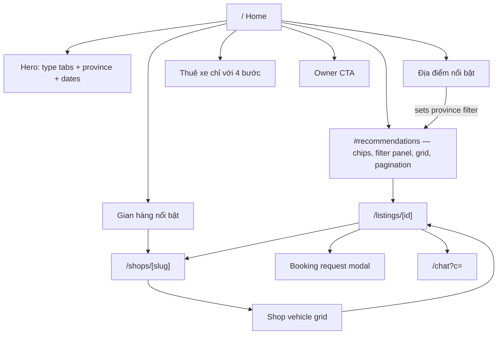
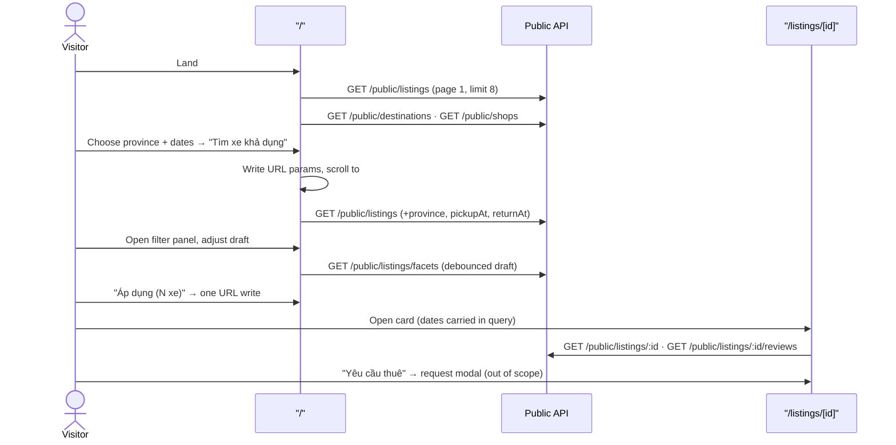

# 01 — Customer Marketplace

> **Type:** Module design brief · **Created:** 2026-08-04 · **Status:** Draft for product review
> **Owners:** Principal Software Architect · Senior Product Manager · Senior Business Analyst · UX Architect
> **Written to:** [`_DESIGN_BRIEF_STANDARD.md`](_DESIGN_BRIEF_STANDARD.md) · **Inherits:** [`00_CROSS_CUTTING_SYSTEM_UX.md`](00_CROSS_CUTTING_SYSTEM_UX.md)
> **Authoritative sources:** application source code and accepted ADRs. As-built docs in [`docs/project/`](../project/) are secondary.
>
> **Reading contract:** *Confirmed* blocks describe what exists. Anything marked `[RECOMMENDED — NOT CURRENT]` or inside a "Recommended"/"Suggested" heading describes nothing that exists today. Absent evidence is written as `Unknown`.

---

## 1. Executive summary

The customer marketplace is the only surface XePrime exposes to people without an account. It is implemented as **three public pages** — `/` (home, search and results in one), `/listings/[id]` (vehicle detail) and `/shops/[slug]` (shop profile) — served by five public API groups reading a denormalized snapshot table, `public_listings` (ADR 0008).

The discovery engine is substantially stronger than the surface that exposes it. The API supports keyword search, ten filter dimensions, exclusion-correct facet counts, four sort modes, availability filtering against real occupancy data, and bounded server pagination. The UI exposes most of this — **except keyword search, which has no input control anywhere in the marketplace** despite being fully implemented end to end (`q` is parsed, serialized, transported and executed as an `ILIKE` over title/brand/model).

Four further gaps are structural rather than cosmetic:

1. **There is no search-results route.** Results render inside `#recommendations` on `/`, so a filtered result set has a URL but not a page identity, and the home page and the results page cannot diverge.
2. **The vehicle detail page shows no availability.** Availability filtering exists on the list (`pickupAt`/`returnAt` → occupancy exclusion) but the detail page never displays which dates are free.
3. **The save/favourite control on every vehicle card has no handler** — it renders, is labelled, and does nothing.
4. **No image is served through `next/image` and no `sitemap`, `robots` or `openGraph` metadata exists**, although the pages are otherwise deliberately built as Server Components for SEO.

Pricing is display-only by design: the discounted figure shown on cards and detail is a marketing computation, and the binding price is set by the shop when it approves the request. This is correct against ADR 0006's preview/authority split but is **not communicated to the customer anywhere in the UI**.

---

## 2. Scope

### 2.1 In scope

Public discovery and pre-booking surfaces: home, search/filter/sort/pagination, destination and shop discovery, vehicle cards, vehicle detail, shop profile, public reviews, and the entry points from marketplace into booking-request, chat and owner onboarding.

### 2.2 Out of scope

Explicitly excluded from this brief and covered elsewhere: the booking-request flow itself (`RequestBookingModal`/`RequestBookingFlow`), phone verification/OTP, the chat module beyond its entry button, `/trips` and `/account`, authentication mechanics (see brief 00), the tenant portal, and all platform administration. Also out of scope: final visual design, wireframes, component APIs, and any data-model change.

### 2.3 Capability status

| # | Capability | Status | Primary evidence |
|---|---|---|---|
| 1 | Marketplace homepage | Implemented | [`(public)/page.tsx`](<../../apps/web/src/app/(public)/page.tsx>) |
| 2 | Vehicle discovery | Implemented | [`VehicleRecommendations.tsx`](../../apps/web/src/features/marketplace/components/VehicleRecommendations.tsx), `GET /public/listings` |
| 3 | Destination discovery | Implemented | [`FeaturedLocations.tsx`](../../apps/web/src/features/marketplace/components/FeaturedLocations.tsx), `listDestinations` |
| 4 | Featured shops | Implemented | [`FeaturedHosts.tsx`](../../apps/web/src/features/marketplace/components/FeaturedHosts.tsx), `listShops` |
| 5 | Vehicle recommendations | **Partially implemented** — the "recommended" sort is a global ranking, not personalization or relatedness | `listingOrderBy` default branch |
| 6 | Keyword search | **Referenced but not implemented (UI)** — API and URL contract complete, **no input control exists** | `q` in [`filter-params.ts`](../../apps/web/src/features/marketplace/filter-params.ts) + `buildListingWhere`; no writer found in `apps/web` |
| 7 | Date / rental-time search | **Partially implemented** — date-only (no time-of-day), preview semantics | [`HeroSearch.tsx`](../../apps/web/src/features/marketplace/components/HeroSearch.tsx), `availabilityFilter` |
| 8 | Vehicle type selection | Implemented | Hero tabs + chip row |
| 9 | Marketplace filters | Implemented | [`FilterPanel.tsx`](../../apps/web/src/features/marketplace/components/FilterPanel.tsx) |
| 10 | Facet counts | Implemented | `PublicListingsService.facets`, `featureFacets` |
| 11 | Sorting | Implemented | `LISTING_SORT_VALUES`, `listingOrderBy` |
| 12 | Pagination | Implemented | Server paging + `Pagination` control |
| 13 | Vehicle cards | Implemented | [`VehicleCard.tsx`](../../apps/web/src/features/marketplace/components/VehicleCard.tsx) |
| 14 | Public vehicle detail | Implemented | [`ListingDetailView.tsx`](../../apps/web/src/features/marketplace/components/ListingDetailView.tsx) |
| 15 | Vehicle image gallery | **Partially implemented** — thumbnails render but are not interactive (no lightbox, zoom, swipe or main-image swap) | `ListingDetailView.tsx` gallery block |
| 16 | Vehicle specifications | Implemented | `specs` array in `ListingDetailView` |
| 17 | Price presentation | **Partially implemented** — weekday/weekend/hourly and discount shown; no total, no fees, no deposit, no "price is indicative" statement | `ListingDetailView`, `VehicleCard` |
| 18 | Vehicle features and amenities | Implemented | `features` chips, `deliveryEnabled`, `noCollateral` badges |
| 19 | Public shop profile | Implemented | [`ShopHeader.tsx`](../../apps/web/src/features/marketplace/components/ShopHeader.tsx), `getShopBySlug` |
| 20 | Shop vehicle listing | Implemented | [`ShopVehicleGrid.tsx`](../../apps/web/src/features/marketplace/components/ShopVehicleGrid.tsx) |
| 21 | Public vehicle reviews | Implemented | [`ListingReviews.tsx`](../../apps/web/src/features/marketplace/components/ListingReviews.tsx), [`public-review.controller.ts`](../../apps/api/src/modules/review/public-review.controller.ts) |
| 22 | Chat-with-shop entry point | Implemented | [`ChatWithShopButton.tsx`](../../apps/web/src/features/chat/components/ChatWithShopButton.tsx) |
| 23 | Booking-request entry point | Implemented | [`RequestBookingButton.tsx`](../../apps/web/src/features/booking-requests/components/RequestBookingButton.tsx) |
| 24 | Owner CTA on marketplace | Implemented | [`OwnerCta.tsx`](../../apps/web/src/features/marketplace/components/OwnerCta.tsx) |
| 25 | Desktop navigation | Implemented | [`MarketHeader.tsx`](../../apps/web/src/features/marketplace/components/MarketHeader.tsx) |
| 26 | Tablet navigation | **Unknown** — no tablet-specific rule found; behavior falls out of per-component CSS | CSS breakpoint census (brief 00 §9) |
| 27 | Mobile navigation | Implemented | [`MobileTabBar.tsx`](../../apps/web/src/features/marketplace/components/MobileTabBar.tsx) |
| 28 | Save / favourite vehicle | **Placeholder** — button renders with `aria-label="Lưu xe"`, no handler, no API, no model | `VehicleCard.tsx` `.fav` button |
| 29 | Search-results route | **Referenced but not implemented** — results live in `#recommendations` on `/` | `(public)` route tree contains no search route |
| 30 | Availability display on detail | **Referenced but not implemented** — occupancy is queryable and used for list filtering, never displayed | `availabilityFilter` vs `ListingDetailView` |
| 31 | SEO infrastructure (sitemap/robots/OG) | **Referenced but not implemented** — page metadata exists; no `sitemap.ts`, `robots.ts`, `openGraph` or `canonical` found | Repository search |

---

## 3. Module purpose

The marketplace converts anonymous demand into a **rental request routed to a specific shop**, using inventory that is a projection of that shop's live operational data rather than a separately maintained catalogue.

Two consequences follow from the architecture and are not negotiable design inputs:

- Inventory shown is a snapshot table written **only** by `ListingsService` (ADR 0008), joined to `tenants` at query time so that locking a shop removes its inventory immediately.
- Availability shown is **advisory**. The exclusion constraint on `vehicle_occupancies` is what actually prevents double-booking (ADR 0006), and the marketplace never claims otherwise in code.

---

### 3.1 Inherited product principles

Per `_DESIGN_BRIEF_STANDARD.md` §5, a module brief states which cross-cutting principles apply unchanged. All eight principles in [brief 00 §3](00_CROSS_CUTTING_SYSTEM_UX.md#3-product-principles) apply here **unchanged**; four govern this module directly:

| Principle | Effect on the marketplace |
|---|---|
| P4 — DB enforces correctness; UI checks are previews | Availability filtering may narrow results but never promises a booking |
| P5 — Filters/paging in the URL | Every discovery dimension is a search param; nothing is component-local except the filter draft |
| P6 — Nobody is forced into a role | Owner CTA is an invitation resolved by real scope, never a gate |
| P8 — Types are generated, not hand-written | Filter vocabularies come from `@xeprime/types`; the UI cannot invent a body type or feature key |

No marketplace-specific principle is introduced, and no cross-cutting principle is relaxed here. Deviations from cross-cutting *conventions* (not principles) are recorded in §33.

---

## 4. Business goals

Goals below are **derived from what the implementation optimizes for**, with the evidence that makes each observable. They are not quoted from a business document; no product requirement document exists in the repository.

| # | Goal | Evidence that the system pursues it |
|---|---|---|
| G1 | Let a visitor find a rentable vehicle without an account | Every discovery endpoint is `@Public()`; booking request accepts guests with verified phone |
| G2 | Show only inventory that can actually be transacted | `status=active` + `tenant.status=active` + `deletedAt=null` enforced in every query path |
| G3 | Reduce mismatch between search and reality | Optional availability filter against real occupancy rows |
| G4 | Route demand to a shop rather than to the platform | Card, detail and shop pages all terminate in "Yêu cầu thuê" or "Nhắn shop" |
| G5 | Make discovery shareable and resumable | All filter/paging state in URL (ADR 0004) |
| G6 | Be indexable | Server-rendered pages, per-page `generateMetadata`, reviews fetched server-side specifically for SEO |
| G7 | Recruit supply from demand | Owner CTA section plus footer links into owner onboarding |

### Suggested measurable success metrics `[RECOMMENDED — NOT CURRENT]`

**No analytics, event tracking or telemetry exists in the repository.** Every metric below is a proposal and none can be measured today.

| Metric | Definition | Why this one |
|---|---|---|
| Search-to-detail rate | Sessions opening ≥1 `/listings/[id]` ÷ sessions reaching results | Tests whether cards carry enough information to earn a click |
| Detail-to-request rate | Booking requests submitted ÷ detail views | The core conversion the module exists to produce |
| Request completion rate | Requests submitted ÷ request flows started | Isolates flow friction from interest |
| Zero-result rate | Result sets with `total = 0` ÷ all result sets | Directly measures filter/inventory mismatch |
| Filter abandonment | Panels opened without "Áp dụng" ÷ panels opened | Tests whether the filter model matches customer intent |
| Availability-qualified share | Result sets carrying `pickupAt`+`returnAt` ÷ all result sets | Tests whether date search is discoverable |
| Shop-page assist rate | Requests preceded by a `/shops/[slug]` view ÷ all requests | Tests whether shop identity contributes to trust |
| Organic entry share | Sessions entering on `/listings/*` or `/shops/*` from search engines | Tests whether the SEO investment pays |

---

## 5. Target users and user goals

Personas are those defined in brief 00 §4. Device and behavioural context is **`Unknown`** — no research artefact exists.

| User | Identity state | Goal in this module | What the code lets them do |
|---|---|---|---|
| Visitor | No session | Judge whether a suitable vehicle exists, at what price, from whom | Full discovery, full detail, full shop profile, read reviews. Starting a request or chat triggers auth/OTP |
| Guest booker | No account yet | Submit a request without registering first | `POST /public/booking-requests` with verified phone; a session may be issued |
| Customer | Authenticated, no tenant | Same as visitor, plus continue existing conversations and trips | Header/tab-bar entries to `/chat`, `/trips`, `/account` |
| Prospective owner | Any | Understand that they can list their own vehicle | `OwnerCta` + footer link, routed by `resolveOwnerCtaHref` |
| Search engine | None | Index inventory and shop pages | Server-rendered HTML with per-page titles/descriptions |

---

## 6. Entry points

| Entry | Lands on | Confirmed behavior |
|---|---|---|
| Direct/organic `/` | Home | Server Component page; whole body wrapped in a single `Suspense` |
| Shared filtered URL `/?province=…&bodyType=…&page=2` | Home with filters applied | `parseFilters` restores state from `searchParams` |
| Organic `/listings/[id]` | Vehicle detail | `generateMetadata` fetches the listing; missing → `notFound()` |
| Organic `/shops/[slug]` | Shop profile | Same pattern; inactive shop → 404 |
| Legacy `/login` or `/register` | Home with auth modal | Proxy redirect (brief 00) |
| Card → shop name link | `/shops/[slug]` | `shopPath.detail` |
| Card / detail → "Yêu cầu thuê" | Modal on the same page | `RequestBookingButton` |
| Detail → "Nhắn shop" | `/chat?c=<id>` | `ChatWithShopButton`; 401 opens auth modal and replays the action |
| Destination tile | Home, filtered by province | `setFilters({province})` + smooth scroll to `#recommendations` |
| Featured shop card | `/shops/[slug]` | `FeaturedHosts` |
| Owner CTA / footer | Portal login or onboarding | `resolveOwnerCtaHref(user)` |
| Mobile tab bar | Home / chat / trips / account | Gated tabs open the auth modal with the tab as `next` |

---

## 7. Information architecture

**Confirmed structural facts**

- The marketplace is **three routes**, not four: search results are a section of `/`, addressed by the fragment `#recommendations`.
- Every listing surface renders the same `VehicleCard`, so card content is a single decision point across home, filtered results and shop inventory.
- Public layout composes `MarketHeader` → `main` → `MarketFooter` → `MobileTabBar`, with the auth modal mounted at layout level (brief 00 §5).

**Existing UX problems**

| # | Problem | Evidence |
|---|---|---|
| IA-1 | Results have no page identity; "back to results" is a scroll position, and home content and results content cannot be tuned separately. | `(public)` route tree |
| IA-2 | Header nav has three items of which two (`Khám phá`, `Về Prime`) both point to `/`; the active state is hardcoded to index 0 rather than derived from the path. | `MarketHeader.tsx` `NAV` |
| IA-3 | Footer link targets are largely `ROUTES.HOME` placeholders. | [`constants.ts`](../../apps/web/src/features/marketplace/constants.ts) `FOOTER_COLUMNS` |

---

## 8. Navigation

### 8.1 Confirmed current behavior

| Viewport | Structure |
|---|---|
| Desktop | `MarketHeader`: logo · 3 nav links · right cluster. Signed out → primary "Đăng nhập" opening the auth modal with `next` = current path. Signed in → chat icon with unread badge, `NotificationBell context="customer"`, avatar dropdown |
| Tablet | **Unknown** — no tablet rule exists; layout is whatever the per-component CSS breakpoints produce |
| Mobile | `MobileTabBar` fixed at the bottom, shown/hidden by CSS: Khám phá · Tin nhắn (badge) · Chuyến · Tài khoản/Đăng nhập. Auth-gated tabs render a `<button>` that opens the modal with `next` set to the tab target (or the current path for "Tài khoản") |

Avatar menu contents are scope-aware: account/trips/chat always; "Quản lý gian hàng" when `user.tenant` exists, otherwise the voluntary "Trở thành chủ xe"; "Quản trị nền tảng" only when `platformRole` is present; logout clears the query cache and returns to `/`.

### 8.2 Existing UX problems

| # | Problem | Evidence |
|---|---|---|
| N-1 | The avatar trigger is a `` with no key handler. | `MarketHeader.tsx` (also recorded in brief 00 §16.2) |
| N-2 | Desktop header offers no way back to results once on a detail page other than browser back. | No breadcrumb in `(public)` |
| N-3 | `Về Prime` is a nav item pointing at `/`. | `MarketHeader.tsx` |

---

## 9. Confirmed current features

**Home** — hero with vehicle-type tabs (`car`/`motorbike`), province select fed by `/public/destinations` (top 24 by inventory), pickup/return date pickers defaulting to *tomorrow* and *tomorrow + 3 days*, and a submit that writes `vehicleType`/`province`/`pickupAt`/`returnAt` to the URL then smooth-scrolls to `#recommendations`. Below: results section, destinations, featured shops, four static rental steps, owner CTA.

**Results section** — heading adapts to the active vehicle type; live count ("N xe khả dụng"); a chip row for filter-panel access (with a badge counting active advanced dimensions), vehicle type and service type; the grid; server pagination at `PAGE_SIZE = 8`.

**Filter panel** — responsive `Modal`/`Drawer` holding sort, price range slider bounded by real facet minimum/maximum, body type, brand, seat buckets, fuel type, features and four amenity switches. It keeps a **local draft**; nothing is written to the URL until "Áp dụng (N xe)". The apply button carries the live facet total for the draft.

**Vehicle detail** — server-rendered; main image plus thumbnail strip; title; price block (discounted display price, struck original, discount tag, weekend price, hourly price); amenity badges; specification list; feature chips; shop block with link, province and bio; "Yêu cầu thuê" and "Nhắn shop"; description; server-rendered public reviews with average, star display and paginated list.

**Shop profile** — server-rendered cover, logo (initial fallback), name, province, rating text ("Chưa có đánh giá" when count is zero), a `tel:` contact link, bio, address; then a client-island paginated grid of that shop's public vehicles at `PAGE_SIZE = 12`.

---

## 10. Current user journeys

Three secondary journeys are confirmed: **destination-first** (tile → province filter → scroll to results); **shop-first** (featured shop → shop page → paginated inventory → detail); and **chat-first** (detail → "Nhắn shop" → if 401, auth modal opens and the chat action replays automatically on success).

---

## 11. Search behavior

### 11.1 Confirmed current behavior

| Dimension | Where set | Transport | Backend treatment |
|---|---|---|---|
| Vehicle type | Hero tabs, chip row | `vehicleType` | Equality |
| Province | Hero select | `province` | `contains`, case-insensitive |
| Pickup / return | Hero date pickers | `pickupAt`, `returnAt` (ISO-8601) | Excludes listings whose vehicle has an overlapping occupancy row |
| Keyword | **nothing** | `q` | `OR` over `title`, `brand`, `model`, `contains`, case-insensitive |

The province option list is built from real inventory (`listDestinations` groups the snapshot by `provinceName`), never hardcoded, and preserves a currently-filtered province even when it falls outside the top-N. Availability filtering is skipped when either bound is missing, unparseable, or when `returnAt <= pickupAt`.

### 11.2 Confirmed business rules

Search reaches only `status = active` listings whose tenant is `active` and not deleted. Availability filtering is a **preview**: overlap is authoritatively prevented by the database exclusion constraint at booking time (ADR 0006), and the service comments state this explicitly.

### 11.3 Existing UX problems

| # | Problem | Evidence |
|---|---|---|
| S-1 | **No keyword input exists.** A customer who knows the model they want ("Vios") cannot type it, although the capability is complete beneath the UI. | No writer of `q` in `apps/web`; `FilterPanel` only *preserves* it |
| S-2 | Hero controls behave inconsistently: type tabs write the URL on click, while province and dates stay in local state until submit. | `HeroSearch.tsx` |
| S-3 | Dates are date-only with `inputReadOnly`; the domain supports hourly rental (`hourlyPrice`, `hourly` filter) but time-of-day cannot be searched. | `DatePicker format="DD/MM/YYYY"` |
| S-4 | Defaults (tomorrow → +3 days) are pre-filled but not applied until submit, so the visible dates do not describe the visible results. | `HeroSearch.tsx` initial state |
| S-5 | Submitting scrolls rather than navigating, so there is no distinct "results" state to return to. | `scrollIntoView` |

### 11.4 Unknown requirements

Whether keyword search was descoped or overlooked; whether hourly/time-of-day search is required; whether province should support multi-select or free-text.

### 11.5 Recommended future behavior

`[RECOMMENDED — NOT CURRENT]` Expose the existing `q` capability as a first-class control; make the hero one consistent commit action; give results their own route so that a result set is a page, not a scroll position.

---

## 12. Filter behavior

### 12.1 Confirmed current behavior

Ten filter dimensions plus price bounds are supported end to end. URL encoding is a single shared contract in `filter-params.ts`: arrays are CSV, booleans are `1`, absent means unset. `applyFilterPatch` deletes on empty/false/empty-array and **resets `page` on any change except a page change**.

| Dimension | Control | Backend semantics |
|---|---|---|
| `bodyType`, `brand`, `fuelType` | Multi-select chips | `IN` (brand case-insensitive) |
| `seats` | Bucket chips | `OR` over bucket ranges from `SEAT_BUCKET_RANGE` |
| `features` | Multi-select chips | `hasEvery` — vehicle must have **all** selected features (GIN index) |
| `priceMin` / `priceMax` | Slider bounded by facet min/max | Range on `weekdayPrice`; listings without a price are excluded when a bound is set |
| `hourly`, `delivery`, `noCollateral`, `discount` | Switches | `hourlyPrice IS NOT NULL`, `deliveryEnabled`, `noCollateral`, `discountPercent > 0` |
| `serviceType` | Chip row | Equality |
| `minSeats` | none (legacy) | `seatCount >= n`, retained for backward compatibility |

The panel holds a **draft**, so intermediate selections never touch the URL; "Áp dụng" performs exactly one write; "Xoá bộ lọc" resets only `FACET_FILTER_KEYS` and deliberately preserves search context (`q`, province, dates, vehicle type, service type). This behavior is covered by [`FilterPanel.test.tsx`](../../apps/web/src/features/marketplace/components/FilterPanel.test.tsx) and [`filter-params.test.ts`](../../apps/web/src/features/marketplace/filter-params.test.ts).

**Facet counts** use correct exclusion semantics: when counting a dimension, that dimension's own filter is removed, so choosing SUV still shows how many Sedans would match. Price bounds are computed with the price filter excluded so the slider does not collapse onto itself. Feature counts are produced by a raw `LATERAL unnest` over the pre-filtered id set, since Prisma `groupBy` cannot expand array elements. Facets are fetched with the debounced draft and `keepPreviousData`, so counts do not flash to zero.

### 12.2 Existing UX problems

| # | Problem | Evidence |
|---|---|---|
| F-1 | Active filters are visible only as a numeric badge on the "Bộ lọc" chip — there are no removable filter chips, so the customer cannot see or drop one dimension without reopening the panel. | `VehicleRecommendations.tsx` `advancedCount` |
| F-2 | `advancedCount` counts `province`, which is a search-context dimension that "Xoá bộ lọc" intentionally does **not** clear — the badge and the clear action disagree. | `advancedCount` vs `FACET_FILTER_KEYS` |
| F-3 | `features` is `hasEvery` (AND) while every other multi-select is OR; nothing in the UI communicates the difference. | `buildListingWhere` |
| F-4 | A price bound silently excludes listings with no `weekdayPrice`. | `priceFilter` |
| F-5 | "Xem tất cả" in the results header actually means "clear all filters", including vehicle type. | `clearAll()` |

### 12.3 Recommended future behavior

`[RECOMMENDED — NOT CURRENT]` Removable applied-filter chips above the grid; explicit AND/OR labelling for features; align the badge count with what "Xoá bộ lọc" clears.

---

## 13. Sorting behavior

**Confirmed.** Four values in `@xeprime/types`: `recommended` (default), `newest`, `price_asc`, `price_desc`. Ordering:

| Sort | ORDER BY |
|---|---|
| `recommended` | `ratingAvg DESC NULLS LAST`, `ratingCount DESC`, `createdAt DESC` |
| `newest` | `createdAt DESC` |
| `price_asc` / `price_desc` | `weekdayPrice ASC / DESC` |

Sort lives inside the filter panel and is omitted from the URL when it equals the default. `listingOrderBy` is shared by marketplace search and shop inventory, so ordering is consistent across both.

**Existing UX problems** — sort is buried inside the filter modal rather than sitting beside the result count, so the current ordering is invisible while browsing; price sorting uses `weekdayPrice` and therefore does **not** reflect the discounted price shown on the card, so a discounted vehicle can appear out of visual price order; `weekdayPrice` sorting places listings without a price unpredictably (`Unknown` — untested).

`[RECOMMENDED — NOT CURRENT]` Surface the active sort next to the result count; decide explicitly whether price sorting should follow displayed (discounted) price.

---

## 14. Pagination

**Confirmed.** Server-side everywhere; `{page, limit, total, hasNext}` in `meta`. API default `limit = 12`, hard maximum `48`, `page` floored at 1. The home results grid requests `limit = 8`; the shop grid uses `12`. Count and page are read inside one `$transaction` so `total` matches the returned rows. Both grids hide the pager when `total <= PAGE_SIZE` and disable the page-size changer. `page` is written to the URL (omitted when 1) and any filter change resets it.

**Existing UX problems** — three page sizes coexist (API default 12, home 8, shop 12) with no shared constant; there is no page-size control; the home pager triggers `router.replace(..., {scroll: false})`, so paging leaves the viewport where it was rather than returning to the top of the grid; the shop grid uses `router.push` while home uses `router.replace`, producing different back-button behavior for the same interaction.

---

## 15. Vehicle-card content hierarchy

**Confirmed order as rendered** (identical on home, filtered results and shop pages):

| Layer | Content | Conditional |
|---|---|---|
| Media | `mainImageUrl` or an inline SVG glyph by vehicle type | Fallback when null |
| Media overlay | Service-type badge · discount badge · **save button (no handler)** | Discount only when `> 0` |
| 1 | Vehicle name (`h3`) | Always |
| 2 | Brand + model, or type label · seat count | Hidden when empty |
| 3 | Province · rating `★ 4.9 (2)` **or** "Xe mới" when `ratingCount = 0` | — |
| 4 | Fuel · seats · "Giao tận nơi" · "Miễn thế chấp" | Each hidden when absent |
| 5 | Price: struck original + discounted price + "/ngày"; shop name link | Struck price only with discount |
| 6 | Full-width "Yêu cầu thuê" | Always |

The whole card is a stretched link to the detail page, carrying `pickupAt`/`returnAt` forward so the request flow is pre-filled. A comment states the design rule explicitly: only fields the backend actually returns are shown; missing fields hide their row.

**Existing UX problems** — the save button is a placeholder (§2.3 #28); images are raw `` without dimensions, risking layout shift; the card carries **two** competing primary targets (stretched link plus a primary-styled button), and on mobile the request button occupies the thumb zone; rating comes from the denormalized snapshot column while the detail page recomputes it live, so the two can disagree.

---

## 16. Listing-detail information hierarchy

**Confirmed order:** media (main image + non-interactive thumbnail strip) → `h1` name → price block (discount, weekday, weekend, hourly) → amenity badges → specification list (type, service, body, seats, fuel, year, colour, brand+model — each conditional) → feature chips → shop block (name link, province, bio) → actions ("Yêu cầu thuê" primary, "Nhắn shop" secondary) → description → reviews.

**Confirmed business rules.** Only `approved_public` vehicles of `active`, non-deleted tenants are returned; internal fields (plate number, tenant id) are never exposed; detail is read from `vehicles` rather than the snapshot because it needs unsnapshotted fields (description, colour, year, shop logo/bio), and the service documents that its scope conditions are equivalent to "listing active".

**Existing UX problems**

| # | Problem |
|---|---|
| D-1 | **No availability is shown.** The customer cannot see which dates are free even though the data supports it. |
| D-2 | Gallery thumbnails are inert: no lightbox, no swipe, no main-image swap; every thumbnail shares the same `alt` text. |
| D-3 | Price shows a per-day figure but never a total for the selected dates, nor fees, nor deposit, nor cancellation policy. |
| D-4 | Nothing states that the displayed price is indicative and confirmed by the shop, which is the actual business rule. |
| D-5 | Actions are inline in the flow rather than persistent; on mobile the primary CTA scrolls away. |
| D-6 | Reviews are last and unpaginated in this view — the section renders the first page returned and offers no "load more". |
| D-7 | No structured data (`Product`/`Offer`/`AggregateRating` JSON-LD) despite rating and price being present. |

---

## 17. Shop-profile information hierarchy

**Confirmed order:** cover image (or gradient fallback) → logo (or initial) → `h1` shop name → province · rating text → `tel:` contact link → bio → address → "Xe đang cho thuê (N)" grid with pagination.

**Confirmed business rules.** Only `active`, non-deleted tenants resolve; anything else is 404. The response is an explicit allowlist — name, slug, phone, province, logo, cover, bio, address, rating — and the service comments state that internal data (id, email, tax code) is deliberately excluded.

**Existing UX problems** — the profile presents no operational trust signals that the platform already stores (vehicle count is only implicit in the grid heading; completed-rental volume, response behaviour and membership age are absent); rating is shown but not broken down or linked to the reviews behind it; there is no chat entry from the shop page (chat is only reachable from a vehicle); the cover image uses `alt=""` correctly but the logo uses the shop name as `alt`, duplicating the adjacent `h1` for screen-reader users.

---

## 18. Forms and controls

**Confirmed.** The marketplace itself contains **no validated form**; every control is a filter or a navigation affordance, and all validation lives at the API DTO layer (`@IsIn`, `@IsISO8601`, `@IsInt`, CSV `@Transform`) plus the global `ValidationPipe`. Controls in use: `Select` with search (province), two `DatePicker`s with `minDate` coupling (return is forced after pickup), tab-style buttons with `role="tab"`/`aria-selected`, chips, a `Slider`, `Switch`es, and AntD `Pagination`. The only forms reachable from this module — booking request and auth — belong to other modules.

**Existing UX problems** — the province `Select` and date pickers have no error state because invalid combinations are prevented rather than reported, which is sound, but the same means an out-of-range shared URL (e.g. `returnAt` before `pickupAt`) is **silently ignored** by the backend with no feedback to the customer.

---

## 19. Loading, empty, error and success states

### 19.1 Confirmed current behavior

| Surface | Loading | Empty | Error | Success |
|---|---|---|---|---|
| Home page shell | One `Suspense` around the entire body with a large centred `Spin` | — | — | — |
| Results grid | 8 card skeletons (`Skeleton.Image` + 2 lines) | `Empty` "Chưa có xe phù hợp bộ lọc." + "Xoá bộ lọc" | `Alert type="error"` with `getErrorMessage` | Implicit — the grid renders |
| Result count | "Đang tìm xe…" | "0 xe khả dụng" | — | "N xe khả dụng" |
| Destinations | 5 skeleton tiles | **Section hidden entirely** when the list is empty | `Alert` | — |
| Featured shops | Skeletons | **Section hidden entirely** | `Alert` | — |
| Filter panel | Facet counts kept from the previous fetch (`keepPreviousData`) | — | `Unknown` — no facet error branch found | Applying closes the panel |
| Shop grid | 12 card skeletons | `Empty` "Gian hàng chưa có xe công khai." | `Alert` | — |
| Listing detail | Server-rendered; no client loading state | `notFound()` → 404 page | Fetch failure returns `null` → also 404 | — |
| Reviews | Server-rendered | "Chưa có đánh giá cho xe này." | Failure returns `null`, rendered as the empty text | — |

### 19.2 Existing UX problems

| # | Problem |
|---|---|
| L-1 | The home `Suspense` fallback is a single page-wide spinner, so one client island gates the perceived load of the whole page. |
| L-2 | Empty is not distinguished from "empty because of filters" anywhere except the results grid's action button; the shop grid and the hidden sections offer no explanation. |
| L-3 | Hiding destinations/featured-shops sections on empty means a cold-start marketplace silently loses two thirds of the home page with no message. |
| L-4 | A detail-fetch **error** and a genuinely missing listing both render 404 — a transient API failure is presented as "this vehicle does not exist". |
| L-5 | A review-fetch failure is presented as "no reviews yet", which is factually wrong. |
| L-6 | No success state exists in the module; feedback belongs entirely to the request/chat modules. |

---

## 20. Responsive behavior

**Confirmed.** `MobileTabBar` is present in the public layout and shown/hidden purely by CSS. `FilterPanel` switches between `Modal` (desktop) and `Drawer` (mobile) via `useIsMobile()` (`max-width: 640px`). Grids and hero collapse through per-component CSS Module breakpoints.

**Existing UX constraints.** As recorded in brief 00 §9, the single programmatic breakpoint (640px) does not coincide with the most common CSS breakpoints in the codebase, and no shared scale exists.

**Existing UX problems** — no tablet rule is defined anywhere (§2.3 #26); the detail page's primary CTA is inline rather than sticky on mobile; card images have no intrinsic dimensions, so grid reflow on slow connections is uncontrolled.

**Unknown** — actual rendering on real devices, minimum supported width, and whether the hero search card degrades acceptably below 375px. These require runtime testing.

---

## 21. Accessibility

**Confirmed present.** Hero type tabs use `role="tab"` + `aria-selected`; chips use the same pattern; sections use `aria-labelledby`; the tab bar uses `aria-label` and `aria-current="page"`; the card's stretched link carries `aria-label="Xem chi tiết {name}"`; decorative glyphs and the shop cover use `aria-hidden`/`alt=""`; the save button is labelled even though it is inert; hero selects have `aria-label`.

**Existing UX problems** — the header avatar trigger is a `span[role=button]` without key handling (N-1); the results chip row is marked `role="tablist"` but contains a filter-opening button and toggle chips that are not tabs, so the announced semantics do not match behaviour; all gallery thumbnails share one `alt`; there is no visible skip link; contrast and screen-reader output are `Unknown` (no automated checks exist anywhere in the repository).

**Unknown requirement** — the conformance target, which brief 00 §16.3 also records as unanswered (Q7).

---

## 22. SEO considerations confirmed by the project

**Confirmed present**

- All three public pages are Server Components; the home page comment states the split explicitly ("Page là Server Component (SEO)").
- `generateMetadata` on `/listings/[id]` and `/shops/[slug]` produces per-entity title and description, with a fallback title when the entity is missing.
- Static `metadata` on `/`; a root template `'%s · XePrime'`.
- `ListingReviews` is deliberately a Server Component so review text is in the HTML — the file comment says so.
- `ShopHeader` is a Server Component specifically to avoid client dependencies.
- The auth modal provider avoids `useSearchParams` so the public tree keeps static rendering (brief 00 §5.3).

**Confirmed absent**

| Missing | Evidence |
|---|---|
| `sitemap.ts` / `sitemap.xml` | Repository search — none |
| `robots.ts` / `robots.txt` | Repository search — none |
| `openGraph` / `twitter` metadata | No occurrence in `apps/web/src` |
| `alternates.canonical` | No occurrence |
| Structured data (JSON-LD) | No occurrence |
| Image optimization | `next/image` is used nowhere; every image is a raw `` with an eslint suppression |
| Cacheable detail fetches | `fetchListingDetail`, `fetchListingReviews` and `fetchPublicShop` all pass `cache: 'no-store'`, so detail pages are re-fetched per request with no ISR |
| Indexable filtered result URLs | Results are a fragment of `/`, so no filtered permutation can be indexed as its own page |

**Recommended future behavior** — `[RECOMMENDED — NOT CURRENT]` sitemap covering active listings and shops; canonical and OG tags; `Product`/`Offer`/`AggregateRating` structured data on detail; a real results route so province/type permutations are indexable; a caching strategy that is not blanket `no-store`.

---

## 23. Security and privacy considerations

**Confirmed.** All discovery endpoints are `@Public()` and read-only; none accepts a tenant identifier. Query DTOs are strictly validated (`@IsIn` against `@xeprime/types` value lists, ISO-8601 dates, integer bounds) and the global pipe rejects unlisted properties, so filter values cannot be injected. `limit` is capped server-side at 48 regardless of client input. Every query path scopes to `status = active` + `tenant.status = active` + `deletedAt = null`, so locking a shop removes its inventory immediately without a denormalized flag (ADR 0008 §3). The public shop response is an explicit allowlist that omits internal identifiers.

**Privacy note.** The shop profile publishes `tenant.phone` as a `tel:` link. This is business contact data for an approved shop, not customer PII, and it is distinct from the masked customer contact handling described in brief 00 §17.2. Public reviews expose free-text comments unmoderated, but the reviewer's name **is** masked: `ReviewService.toPublicDto` applies `maskName`, abbreviating the surname ("Nguyễn Văn An" → "Nguyễn Văn A."). *(Corrected 2026-08-04 by the coverage audit — the original text claimed no masking; see brief 02 K9 and §27 MK10 below.)*

**Existing problems** — public listing endpoints are protected only by the global throttler (120 requests/60 s, brief 00 §17.1); there is no per-endpoint scraping control on what is effectively a public inventory API, and `featureFacets` performs a `findMany` over all matching ids before counting, which is bounded only by the current filter.

---

## 24. Business rules

Rules demonstrable in code or accepted ADRs.

1. Only `active` listings whose tenant is `active` and not deleted appear anywhere in the marketplace.
2. `public_listings` is written exclusively by `ListingsService` (ADR 0008); marketplace queries only read it.
3. Vehicle detail resolves only `approved_public` vehicles of active tenants.
4. Tenant status is joined at query time, never denormalized, so a lock takes effect immediately.
5. Availability filtering is advisory; the exclusion constraint decides (ADR 0006).
6. Availability filtering is skipped entirely unless both bounds parse and `returnAt > pickupAt`.
7. Displayed discounted price is presentational; the binding price is set by the shop at approval — stated in both `VehicleCard` and `ListingDetailView`.
8. Money crosses the API as a string (ADR 0007); `Decimal → string` conversion happens in the response interceptor.
9. Card ratings come from denormalized `ratingAvg`/`ratingCount` on the snapshot; detail ratings are computed live from `published`, non-deleted reviews.
10. Only `published`, non-deleted reviews are publicly visible or counted.
11. Destinations are derived from real inventory; the province list is never hardcoded.
12. Featured shops require at least one active listing and are ordered by rating, then rating count, then recency.
13. Page size is bounded at 48 server-side; `page` is floored at 1.
14. A filter change resets pagination to page 1.
15. Filter values are validated against the shared type package, so an unknown body type or feature key is a 400, not an empty result.

---

## 25. Edge cases

| # | Case | Confirmed handling |
|---|---|---|
| 1 | Listing with no image | Inline SVG glyph on card; grey placeholder block on detail |
| 2 | Listing with no price | Card renders `formatMoneyVnd(null)`; excluded from results whenever a price bound is set |
| 3 | Vehicle with no reviews | "Xe mới" chip on card; "Chưa có đánh giá cho xe này." on detail |
| 4 | Shop with no rating | "Chưa có đánh giá" |
| 5 | Shop with no vehicles | Grid `Empty`; the shop is also excluded from "Gian hàng nổi bật" |
| 6 | No inventory at all | Destinations and featured-shops sections hide themselves; results show `Empty` |
| 7 | Province filtered but outside top-24 | Retained as a synthetic option so a shared link still displays correctly |
| 8 | `returnAt <= pickupAt` in a shared URL | Availability filter silently skipped; no message |
| 9 | Unparseable date in URL | Same — skipped |
| 10 | Unknown enum value in URL (e.g. `bodyType=spaceship`) | API 400 `VALIDATION_FAILED`; UI shows the generic error `Alert` |
| 11 | `limit=9999` in URL | Clamped to 48 server-side |
| 12 | `page` beyond the last page | Empty rows with a correct `total`; the pager shows the requested page |
| 13 | Shop locked while a customer views its page | Next request 404s; already-rendered pages are stale until reload (`cache: 'no-store'` limits the window) |
| 14 | Vehicle unpublished while being viewed | Same |
| 15 | Detail fetch fails transiently | Rendered as 404 (problem L-4) |
| 16 | Review fetch fails | Rendered as "no reviews" (problem L-5) |
| 17 | Chat started while signed out | Auth modal opens over the detail page and the chat action replays on success |
| 18 | Request started while signed out | Handled inside the request flow via phone OTP (out of scope) |
| 19 | Owner CTA clicked in any auth state | `resolveOwnerCtaHref` routes to portal login + owner intent, onboarding, or portal |
| 20 | Facet dimension with zero matches | Omitted from the response rather than shown as zero |
| 21 | Very long vehicle or shop name | `Unknown` — no truncation rule verified in source |
| 22 | Duplicate images in the gallery | Rendered as-is; React key is the URL, so exact duplicates would collide (`Unknown` whether duplicates occur) |

---

## 26. Dependencies

| Depends on | Nature |
|---|---|
| `public_listings` snapshot + `ListingsService` | Entire inventory surface (ADR 0008) |
| `vehicle_occupancies` | Read-only, for availability preview (ADR 0006) |
| `tenants` / `tenant_profiles` | Shop identity, province, logo, cover, bio, rating |
| `reviews` | Public review list and both rating sources |
| `@xeprime/types` | Vehicle/service/body/fuel/seat/feature vocabularies, sort values, labels |
| Auth module (brief 00) | Modal, `next` handling, current user for header/CTA |
| Booking-requests module | "Yêu cầu thuê" entry point |
| Chat module | "Nhắn shop" entry point, unread badge |
| Notifications module | Header bell |
| Vehicle module | Source data and publication approval — inventory quality is decided there, not here |
| Platform approvals | Gate that admits vehicles to the marketplace |
| Cloudflare R2 | Image hosting for listing/shop media |

---

## 27. Existing UX problems (consolidated)

| ID | Problem | Severity signal |
|---|---|---|
| S-1 | No keyword search input despite full backend support | Capability invisible to users |
| IA-1 | No results route; results are a scroll anchor | Blocks SEO and shareable result identity |
| D-1 | No availability display on detail | Highest-intent screen omits the decisive fact |
| D-3/D-4 | No total price, fees, deposit or "indicative price" statement | Expectation mismatch at conversion point |
| #28 | Save/favourite button renders but does nothing | Broken affordance on every card |
| F-1/F-2 | Applied filters not individually visible or removable; badge disagrees with clear behaviour | Filter state opacity |
| D-2 | Inert gallery | Blocks vehicle assessment |
| L-4/L-5 | Errors presented as "not found" / "no reviews" | Misinforms the user |
| L-1 | Page-wide spinner gates the whole home page | Perceived performance |
| L-3 | Empty marketplace silently hides sections | Cold-start experience |
| N-1 | Avatar trigger not keyboard-operable | Accessibility |
| IA-2/IA-3 | Dead nav and footer links | Trust |
| §15 | Rating source differs between card and detail | Data consistency |
| §13 | Price sort ignores displayed discounted price | Result order contradicts what is shown |
| §14 | Three page sizes, two router methods, no page-size control | Inconsistent paging behaviour |
| §22 | No sitemap/robots/OG/canonical/JSON-LD; no `next/image`; blanket `no-store` | SEO and performance |

---

## 28. Missing capabilities

Absent from the current code path. Absence is **not** evidence that the business wants them.

| Capability | Status | Note |
|---|---|---|
| Keyword search UI | Referenced but not implemented | Backend complete |
| Saved/favourite vehicles | Placeholder | No model, no endpoint, no persistence |
| Vehicle comparison | Not found | — |
| Map or radius search | Not found | No coordinates in `public_listings` |
| Availability calendar on detail | Referenced but not implemented | Data exists |
| Total-price / fee / deposit breakdown | Not found | — |
| Structured cancellation and collateral policy | Not found | Only free-text description exists |
| Related/similar vehicles on detail | Not found | `docs/project/05_PAGES.md` mentions recommendations on detail; the current `ListingDetailView` renders none |
| Review pagination or filtering on detail | Not found | Endpoint is paginated; the view consumes page 1 |
| Chat entry from the shop page | Not found | Chat is vehicle-scoped |
| Shop trust metrics (completed rentals, response time, tenure) | Not found | — |
| Recently viewed / continue browsing | Not found | — |
| Promotions or campaign surfaces | Not found | Only per-vehicle `discountPercent` |
| Multi-province or multi-city search | Not found | Single province, `contains` match |
| Time-of-day rental search | Not found | Date-only pickers |
| Static content pages (help, terms, privacy) | Not found | Footer links point to `/` |
| SEO infrastructure | Referenced but not implemented | §22 |

---

## 29. Recommended future features

`[RECOMMENDED — NOT CURRENT]` — none of the following exists; each is a proposal for product decision, ordered by the strength of the evidence that the gap is real.

1. **Expose keyword search.** The lowest-cost, highest-certainty gap: the capability is already built and tested at the API and URL layers.
2. **Give results their own route.** Unlocks indexable filtered pages, a real "back to results", and independent evolution of home versus results.
3. **Show availability on the detail page.** The occupancy data already drives list filtering; the highest-intent screen currently omits it.
4. **State the price contract.** Either show a computed total for the selected dates, or explicitly say the price is indicative until the shop confirms — the second is what the code actually guarantees.
5. **Resolve the favourite button.** Implement persistence or remove the control; an inert affordance on every card is worse than none.
6. **Make applied filters visible and individually removable.**
7. **Make the gallery interactive**, with per-image alternative text.
8. **Add SEO infrastructure**: sitemap, robots, canonical, OG, JSON-LD, and a caching strategy other than blanket `no-store`.
9. **Adopt `next/image`** with intrinsic dimensions for listing and shop media.
10. **Add shop trust metrics** from data the platform already holds.
11. **Distinguish "no results" from "no results for these filters"** on every empty surface, and stop hiding whole sections silently.
12. **Separate transient errors from 404** on detail and reviews.

---

## 30. Out-of-scope items

Booking-request flow internals · phone verification/OTP · authentication mechanics · `/trips`, `/account`, `/chat` interiors · tenant portal · platform administration · review submission (customer side) · payments · final visual design, wireframes and component APIs · any schema change.

---

## 30.1 Known inconsistencies

Conflicts between two authoritative sources, or between a stated intent and the code. None is resolved as of 2026-08-04.

| # | Inconsistency | Evidence |
|---|---|---|
| MK1 | `q` is a complete, tested contract from URL → API → SQL, but no control writes it. | `filter-params.ts` + `buildListingWhere` vs zero writers in `apps/web` |
| MK2 | Card rating reads the denormalized snapshot columns; detail rating is recomputed live from `reviews`. The two can disagree until `refreshRating` runs. | `toListingCard` vs `ratingsByVehicle` |
| MK3 | `docs/project/05_PAGES.md` lists "recommendations" as part of the listing detail page; `ListingDetailView` renders none. Source code wins. | Doc vs `ListingDetailView.tsx` |
| MK4 | `advancedCount` counts `province` as an advanced filter, but `FACET_FILTER_KEYS` (used by "Xoá bộ lọc") excludes it. | `VehicleRecommendations.tsx` vs `filter-params.ts` |
| MK5 | Three page sizes coexist — API default 12, home grid 8, shop grid 12 — with no shared constant. | `PublicListingsService` vs both grids |
| MK6 | Home paging uses `router.replace`; shop paging uses `router.push`. Same interaction, different history behaviour. | `use-marketplace-filters.ts` vs `ShopVehicleGrid.tsx` |
| MK7 | Price sorting orders by `weekdayPrice` while cards display the discounted price, so visible order can contradict the chosen sort. | `listingOrderBy` vs `applyDiscountPercent` usage |
| MK8 | Pages are deliberately server-rendered for SEO, yet no sitemap, robots, canonical, OG or structured data exists and all detail fetches are `no-store`. | Page comments vs repository search |
| MK9 | `minSeats` and `seats` both filter seating; only `seats` has a control, `minSeats` is retained for compatibility. | `PublicListingQueryDto` |
| MK10 | **Resolved 2026-08-04.** This brief originally stated public reviews expose `customerName` unmasked. Brief 02 (K9) proved `ReviewService.maskName` abbreviates the surname on every public review DTO. §23 and Q8 corrected by the coverage audit (brief 11). | `review.service.ts` `toPublicDto` |

---

## 31. Open questions

| # | Question | Blocks |
|---|---|---|
| Q1 | Was keyword search intentionally descoped, or is its absence an oversight? | S-1, and whether the `q` contract should be kept |
| Q2 | Should a dedicated search-results route exist, and must filtered permutations be indexable? | IA-1, §22 |
| Q3 | Must the detail page show availability before a request is submitted? | D-1 |
| Q4 | Is the customer entitled to a binding total price before requesting, or is "indicative until shop confirms" the intended contract? | D-3, D-4 |
| Q5 | Is saved/favourite a committed requirement? | Placeholder #28 |
| Q6 | Should price sorting follow list price or displayed discounted price? | §13 |
| Q7 | Is hourly / time-of-day search required, given `hourlyPrice` is sold? | S-3 |
| Q8 | ~~Should reviewer display names be masked or abbreviated on public pages?~~ **Resolved by audit**: they are abbreviated (`maskName`, brief 02 §10.1). Remaining question: is surname-initial abbreviation sufficient, and should the customer be told (brief 02 R-5)? | §23, MK10 |
| Q9 | What is the intended tablet experience? | §2.3 #26, §20 |
| Q10 | Is organic search a real acquisition channel for this business? | Whether §22 work is justified |
| Q11 | Which trust signals may be shown about a shop? | §17 |
| Q12 | What should happen when the marketplace has no inventory in a region — hide, or explain? | L-3 |
| Q13 | Should the public listing API have anti-scraping protection beyond the global throttler? | §23 |

---

## 32. Acceptance criteria

### 32.1 Enforced today — regressions are defects

| # | Criterion | Verification |
|---|---|---|
| MA1 | Only `active` listings of `active`, non-deleted tenants are ever returned | `buildListingWhere`, `getById`, `listShopVehicles` |
| MA2 | Marketplace never writes to `public_listings` | ADR 0008; module contains no write path |
| MA3 | Availability filtering is advisory and never presented as a guarantee | `availabilityFilter` comments; ADR 0006 |
| MA4 | All filter/sort/paging state is expressed in the URL and executed server-side | ADR 0004; `filter-params.test.ts` |
| MA5 | Filter panel commits exactly one URL write per apply, and "Xoá bộ lọc" preserves search context | `FilterPanel.test.tsx` |
| MA6 | Facet counts exclude their own dimension | `buildListingWhere(query, exclude)` |
| MA7 | `limit` is capped at 48 server-side regardless of client input | `MAX_LIMIT` |
| MA8 | Filter values are validated against `@xeprime/types` | Query DTO decorators |
| MA9 | Money is transported as a string | ADR 0007 |
| MA10 | Public shop responses expose only allowlisted fields | `getShopBySlug` |
| MA11 | Only `published`, non-deleted reviews are public | `ratingsByVehicle`, `ReviewService` |
| MA12 | Home, detail and shop pages remain server-rendered with per-entity metadata | `page.tsx` files |
| MA13 | Every listing grid provides loading, empty and error states | `VehicleRecommendations`, `ShopVehicleGrid` |
| MA14 | Marketplace entry points never default a customer to `/manage` | Brief 00 AC4; `MobileTabBar`, `MarketHeader`, `ChatWithShopButton` |

### 32.2 Proposed — `[RECOMMENDED — NOT CURRENT]`

| # | Criterion |
|---|---|
| MA15 | Every filter dimension that can be applied can also be seen and removed individually. |
| MA16 | A transient fetch failure is never rendered as "not found" or "none exist". |
| MA17 | Every rendered control performs an action or is not rendered. |
| MA18 | The detail page states, before submission, either the total price or that the price is indicative. |
| MA19 | Rating shown for one vehicle is identical on card and detail. |
| MA20 | Empty states distinguish "no inventory" from "no matches for these filters". |
| MA21 | Every image declares intrinsic dimensions. |
| MA22 | One page-size constant governs all marketplace grids. |

---

## 33. Consistency check against brief 00

| Cross-cutting rule (brief 00) | Marketplace conformance |
|---|---|
| §5 Customer auth is a modal over the current page; never routes to `/manage` | **Conforms** — `MarketHeader`, `MobileTabBar`, `ChatWithShopButton` all open the modal with a safe `next` |
| §6 Backend is the only authorization boundary | **Conforms** — public endpoints are read-only and scope-filtered server-side |
| §7 Navigation visibility is presentation only | **Conforms** — owner CTA resolves by real scope via `resolveOwnerCtaHref` |
| §8 Filters/paging in URL, server-side | **Conforms**, and this module is the reference implementation |
| §9 One breakpoint scale | **Deviates** — uses `useIsMobile` plus its own CSS breakpoints; same defect recorded in brief 00 §9 |
| §11 Loading conventions | **Partially conforms** — skeletons in grids, but a page-wide `Spin` gates home (L-1) |
| §12 Empty states must explain and offer an action | **Partially conforms** — results grid does; shop grid and hidden sections do not (L-2, L-3) |
| §13 Error states must state a next step | **Deviates** — detail/review failures are rendered as absence (L-4, L-5) |
| §16 Accessibility | **Partially conforms** — good ARIA on tabs/sections; avatar trigger and `role="tablist"` misuse are defects |
| §17 Security/privacy | **Conforms** — public data only, strict validation, allowlisted shop response, reviewer names abbreviated (`maskName`; corrected per MK10) |
| §21 AC4 (no default to `/manage`) | **Conforms** |

No marketplace behavior contradicts an accepted ADR. Two cross-cutting defects recorded in brief 00 (breakpoint fragmentation, inconsistent state conventions) are visible here and are **not** new module-specific problems.

---

## 34. Source references

### Web — pages and layout
[`(public)/layout.tsx`](<../../apps/web/src/app/(public)/layout.tsx>) · [`(public)/page.tsx`](<../../apps/web/src/app/(public)/page.tsx>) · [`listings/[id]/page.tsx`](<../../apps/web/src/app/(public)/listings/[id]/page.tsx>) · [`shops/[slug]/page.tsx`](<../../apps/web/src/app/(public)/shops/[slug]/page.tsx>)

### Web — marketplace feature
[`api.ts`](../../apps/web/src/features/marketplace/api.ts) · [`constants.ts`](../../apps/web/src/features/marketplace/constants.ts) · [`filter-params.ts`](../../apps/web/src/features/marketplace/filter-params.ts) · [`filter-params.test.ts`](../../apps/web/src/features/marketplace/filter-params.test.ts) · [`types.ts`](../../apps/web/src/features/marketplace/types.ts) · hooks: [`use-public-listings`](../../apps/web/src/features/marketplace/hooks/use-public-listings.ts), [`use-listing-facets`](../../apps/web/src/features/marketplace/hooks/use-listing-facets.ts), [`use-marketplace-filters`](../../apps/web/src/features/marketplace/hooks/use-marketplace-filters.ts), [`use-destinations`](../../apps/web/src/features/marketplace/hooks/use-destinations.ts), [`use-featured-shops`](../../apps/web/src/features/marketplace/hooks/use-featured-shops.ts), [`use-shop-listings`](../../apps/web/src/features/marketplace/hooks/use-shop-listings.ts) · components: [`HeroSearch`](../../apps/web/src/features/marketplace/components/HeroSearch.tsx), [`VehicleRecommendations`](../../apps/web/src/features/marketplace/components/VehicleRecommendations.tsx), [`VehicleCard`](../../apps/web/src/features/marketplace/components/VehicleCard.tsx), [`FilterPanel`](../../apps/web/src/features/marketplace/components/FilterPanel.tsx), [`FilterPanel.test`](../../apps/web/src/features/marketplace/components/FilterPanel.test.tsx), [`FeaturedLocations`](../../apps/web/src/features/marketplace/components/FeaturedLocations.tsx), [`FeaturedHosts`](../../apps/web/src/features/marketplace/components/FeaturedHosts.tsx), [`ListingDetailView`](../../apps/web/src/features/marketplace/components/ListingDetailView.tsx), [`ListingReviews`](../../apps/web/src/features/marketplace/components/ListingReviews.tsx), [`ShopHeader`](../../apps/web/src/features/marketplace/components/ShopHeader.tsx), [`ShopVehicleGrid`](../../apps/web/src/features/marketplace/components/ShopVehicleGrid.tsx), [`MarketHeader`](../../apps/web/src/features/marketplace/components/MarketHeader.tsx), [`MarketFooter`](../../apps/web/src/features/marketplace/components/MarketFooter.tsx), [`MobileTabBar`](../../apps/web/src/features/marketplace/components/MobileTabBar.tsx), [`OwnerCta`](../../apps/web/src/features/marketplace/components/OwnerCta.tsx), [`RentalSteps`](../../apps/web/src/features/marketplace/components/RentalSteps.tsx), [`BrandMark`](../../apps/web/src/features/marketplace/components/BrandMark.tsx)

### Web — cross-module entry points
[`RequestBookingButton`](../../apps/web/src/features/booking-requests/components/RequestBookingButton.tsx) · [`ChatWithShopButton`](../../apps/web/src/features/chat/components/ChatWithShopButton.tsx) · [`NotificationBell`](../../apps/web/src/features/notifications/components/NotificationBell.tsx) · [`post-auth-destination.ts`](../../apps/web/src/features/auth/post-auth-destination.ts) · [`routes.ts`](../../apps/web/src/constants/routes.ts) · [`money.ts`](../../apps/web/src/lib/money.ts) · [`vehicle-labels.ts`](../../apps/web/src/lib/vehicle-labels.ts)

### API
[`public-listings.controller.ts`](../../apps/api/src/modules/public-listings/public-listings.controller.ts) · [`public-shops.controller.ts`](../../apps/api/src/modules/public-listings/public-shops.controller.ts) · [`public-destinations.controller.ts`](../../apps/api/src/modules/public-listings/public-destinations.controller.ts) · [`public-listings.service.ts`](../../apps/api/src/modules/public-listings/public-listings.service.ts) · [`listings.service.ts`](../../apps/api/src/modules/public-listings/listings.service.ts) · [`dto/public-listing.dto.ts`](../../apps/api/src/modules/public-listings/dto/public-listing.dto.ts) · [`public-review.controller.ts`](../../apps/api/src/modules/review/public-review.controller.ts) · [`review.service.ts`](../../apps/api/src/modules/review/review.service.ts)

### Shared and data
[`packages/types/src/status/misc.ts`](../../packages/types/src/status/misc.ts) (`LISTING_STATUS`, `LISTING_SORT_*`) · [`packages/types/src/status/vehicle.ts`](../../packages/types/src/status/vehicle.ts) · [`packages/types/src/api.ts`](../../packages/types/src/api.ts) · [`prisma/schema.prisma`](../../prisma/schema.prisma) — `PublicListing`, `Tenant`, `TenantProfile`, `Vehicle`, `VehicleImage`, `VehicleFeature`, `Review`, `VehicleOccupancy`

### ADRs
[0004 Client state](../decisions/0004-client-state.md) · [0005 Status enums](../decisions/0005-status-enums.md) · [0006 Booking concurrency](../decisions/0006-booking-concurrency.md) · [0007 API type contract](../decisions/0007-api-type-contract.md) · [0008 Public listings sync](../decisions/0008-public-listings-sync.md)

### Secondary documentation
[`docs/project/04_API.md`](../project/04_API.md) · [`05_PAGES.md`](../project/05_PAGES.md) · [`06_COMPONENTS.md`](../project/06_COMPONENTS.md) · [`07_BUSINESS_RULES.md`](../project/07_BUSINESS_RULES.md) · [`09_DESIGN_PROBLEMS.md`](../project/09_DESIGN_PROBLEMS.md) · [`10_MISSING_FEATURES.md`](../project/10_MISSING_FEATURES.md)

### Verification performed for this brief
Repository searches confirming absence: any UI writer of the `q` filter in `apps/web` · `sitemap`/`robots` files · `openGraph`/`canonical`/`alternates` metadata · `next/image` usage · a click handler on the `VehicleCard` favourite button · a search-results route under `(public)`. Reads of every file listed above.
