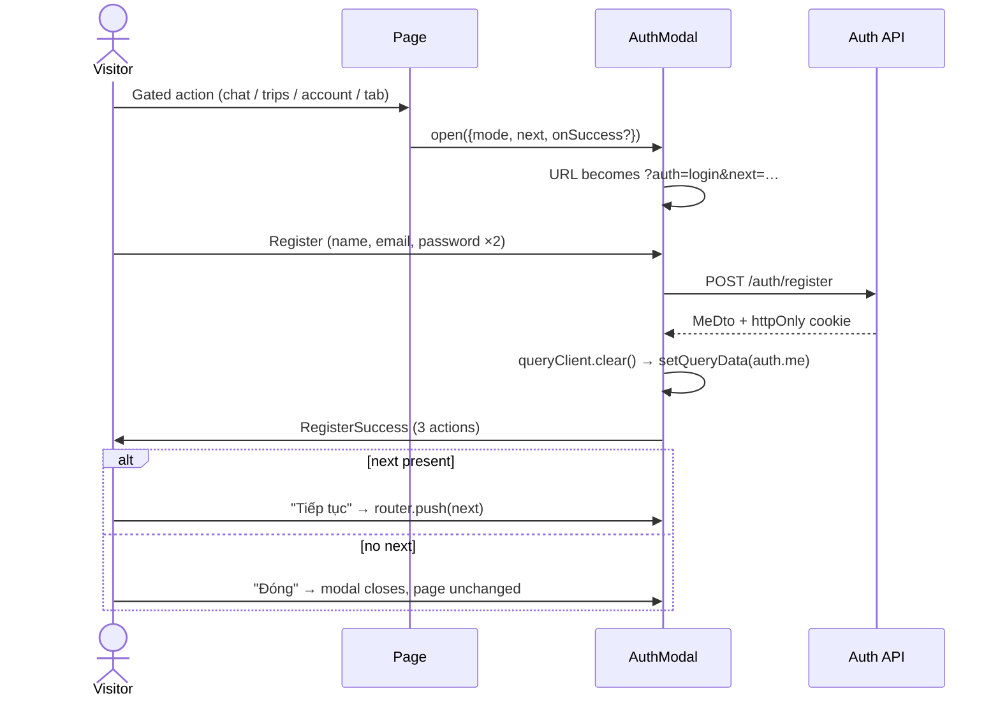
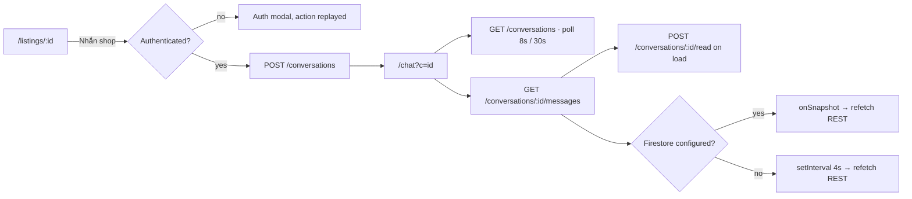

# 02 — Customer Account and Engagement

> **Type:** Module design brief · **Created:** 2026-08-04 · **Status:** Draft for product review
> **Owners:** Principal Software Architect · Senior Product Manager · Senior Business Analyst · UX Architect
> **Written to:** [`_DESIGN_BRIEF_STANDARD.md`](_DESIGN_BRIEF_STANDARD.md) · **Inherits:** [`00_CROSS_CUTTING_SYSTEM_UX.md`](00_CROSS_CUTTING_SYSTEM_UX.md) · **Adjacent:** [`01_CUSTOMER_MARKETPLACE.md`](01_CUSTOMER_MARKETPLACE.md)
> **Authoritative sources:** application source code and accepted ADRs. `docs/project/` is secondary.
>
> **Reading contract:** *Confirmed* blocks describe what exists today. Anything under a "Recommended"/"Missing" heading or marked `[RECOMMENDED — NOT CURRENT]` describes nothing that exists. Absent evidence is written as `Unknown`.

---

## 1. Executive summary

This module covers everything a customer does **after** discovery: getting an identity, keeping a profile, following their rentals, reviewing them, talking to shops, and being told when something happens.

The identity layer is the strongest part. One `AuthPanel` implements every credential path (password, OTP, providers, optional first-password), the modal never leaves the marketplace, registration ends in an explicit three-way choice rather than a redirect, and cache handling at the session boundary is deliberate — `queryClient.clear()` on both login and logout so no previous user's data survives on a shared device.

The engagement layer is thinner than it appears, and three findings dominate:

1. **The customer is never notified that their trip completed.** `BOOKING_STATUS_CHANGED` is emitted only via `emitToTenantMembers`; `emitToUser` is called from exactly two places, both in booking-request approval/rejection. Trip completion is precisely the event that unlocks reviewing, so the review loop has **no trigger** — the customer must revisit `/trips` unprompted.
2. **Guest bookers receive nothing at all.** Both customer notifications are guarded by `if (req.customerUserId)`, and the code comment states email/SMS for guests is "giai đoạn sau". A passwordless guest who books can be approved or rejected in silence.
3. **Trips are not a trip surface, they are a review surface.** `/trips` renders `MyTripsView` from `features/reviews`, sourced from `GET /reviews/my-trips`, which lists **only bookings that originated from a booking request by that user**. There is no trip detail, no contract access, no pickup information, and no cancellation path.

Two further structural points: the customer profile can edit only `displayName` and `avatarUrl` — correctly, since the API accepts nothing else — but the avatar is a URL text field while every other image in the product uses the presign uploader; and chat read-state is written from the thread as a side effect of loading messages, so opening a conversation marks it read whether or not the customer read anything.

---

## 2. Scope

### 2.1 In scope

Customer authentication experience (modal, registration success, first password), the customer account/profile surface, `/trips` and its review workflow, customer chat, the customer notification bell and its routing, and logout/cache behaviour.

### 2.2 Out of scope

Authentication *mechanics* (session issuance, guards, routing decisions, safe `next`) — owned by brief 00. Marketplace discovery — brief 01. The booking-request flow, phone verification as a booking gate, the shop side of chat, review moderation, and all portal surfaces.

### 2.3 Submodule status

| # | Submodule | Status | Primary evidence |
|---|---|---|---|
| 1 | Customer login/register experience | Implemented | [`AuthPanel.tsx`](../../apps/web/src/features/auth/components/AuthPanel.tsx) |
| 2 | Customer auth modal | Implemented | [`AuthModal.tsx`](../../apps/web/src/features/auth/components/AuthModal.tsx), [`AuthModalProvider.tsx`](../../apps/web/src/features/auth/components/AuthModalProvider.tsx) |
| 3 | Registration success actions | Implemented | [`RegisterSuccess.tsx`](../../apps/web/src/features/auth/components/RegisterSuccess.tsx) |
| 4 | Customer account/profile | Implemented | [`AccountView.tsx`](../../apps/web/src/features/account/components/AccountView.tsx), [`users.controller.ts`](../../apps/api/src/modules/users/users.controller.ts) |
| 5 | Display-name update | Implemented | `PATCH /users/me` |
| 6 | Avatar update | **Partially implemented** — free-text URL only; no upload, no presign endpoint for avatars | `AccountView.tsx` `TextField name="avatarUrl"` |
| 7 | Email/phone display | Implemented (read-only by design) | `UserProfileDto`, `UpdateMeDto` |
| 8 | Verification state display | **Partially implemented** — `phoneVerified` shown as a tag; no email verification concept; no way to verify from this screen | `AccountView.tsx` |
| 9 | Customer trips | **Partially implemented** — list only; no detail, no contract, no cancellation, request-originated bookings only | [`MyTripsView.tsx`](../../apps/web/src/features/reviews/components/MyTripsView.tsx), `ReviewService.myTrips` |
| 10 | Trip status presentation | Implemented | `StatusTag` + `BOOKING_STATUS_META` |
| 11 | Review eligibility | Implemented | `canReview = status === COMPLETED && review === null` |
| 12 | Review submission | Implemented | [`ReviewModal.tsx`](../../apps/web/src/features/reviews/components/ReviewModal.tsx), `ReviewService.createForBooking` |
| 13 | Public review effect | Implemented | `recomputeTenantRating` + `ListingsService.refreshRating` in one transaction |
| 14 | Customer chat | Implemented | [`ChatView.tsx`](../../apps/web/src/features/chat/components/ChatView.tsx) |
| 15 | Conversation list | Implemented | [`ConversationList.tsx`](../../apps/web/src/features/chat/components/ConversationList.tsx) |
| 16 | Chat thread | Implemented | [`ThreadPanel.tsx`](../../apps/web/src/features/chat/components/ThreadPanel.tsx), [`use-thread.ts`](../../apps/web/src/features/chat/hooks/use-thread.ts) |
| 17 | Message composer | Implemented | [`MessageComposer.tsx`](../../apps/web/src/features/chat/components/MessageComposer.tsx) |
| 18 | Attachments | **Partially implemented** — server validates URL origin; client validates nothing; single file per send, no preview, no progress, no removal | `MessageComposer.onPickFile`, `ChatService.assertAttachmentUrls` |
| 19 | Read/unread state | **Partially implemented** — counters correct; marking is a side effect of thread load | `use-thread.ts`, `ChatService.markRead` |
| 20 | Realtime chat | **Partially implemented** — Firestore listener when configured, 4 s/8 s polling otherwise, with no user-visible indication | `use-thread.ts`, `use-conversations.ts` |
| 21 | Notification bell | Implemented | [`NotificationBell.tsx`](../../apps/web/src/features/notifications/components/NotificationBell.tsx) |
| 22 | Notification routing | **Partially implemented** — customer context maps three target types to `/trips` and nothing else | [`notification-display.tsx`](../../apps/web/src/features/notifications/lib/notification-display.tsx) |
| 23 | Customer notification coverage | **Partially implemented** — only request approved/rejected reach a customer | `emitToUser` call-site census |
| 23b | Notification list filtering/paging | **Referenced but not implemented (UI)** — `unreadOnly` and `page` are supported through types, params and service; the bell passes neither | `filtersToParams`, `NotificationService.list` vs `NotificationBell` |
| 24 | Guest-booker notification | **Referenced but not implemented** — code comment defers email/SMS | `booking-requests.service.ts` |
| 25 | Logout and cache cleanup | Implemented | [`use-auth-actions.ts`](../../apps/web/src/features/auth/hooks/use-auth-actions.ts), `MarketHeader.handleLogout` |
| 26 | Notification preferences | **Referenced but not implemented** — `NOTIFICATION_CHANNEL` exists, only `IN_APP` is written | `notification.service.ts` |
| 27 | Account deletion / data export | **Unknown** — no endpoint, page or model field found | Repository search |
| 28 | Trip cancellation by customer | **Referenced but not implemented** — noted absent in `docs/project/10_MISSING_FEATURES.md`; no endpoint exists | API catalogue |

---

## 3. Purpose and business goals

### 3.1 Purpose

Turn a one-time booker into a returning, identifiable customer, and keep both sides of a rental informed enough that the transaction completes without phone calls.

### 3.2 Business goals

Derived from what the implementation optimizes for; no product requirement document exists in the repository.

| # | Goal | Evidence |
|---|---|---|
| G1 | Never make identity a barrier to booking | Passwordless OTP account creation; guest booking issues a session; password is optional after OTP (`SetPasswordPrompt` has "Bỏ qua") |
| G2 | Never convert a customer into a shop owner by accident | `RegisterSuccess` offers ownership as the third, secondary action with an explicit note |
| G3 | Keep the customer inside the marketplace context | Auth is a modal; `next` returns them to where they were; `resolveCustomerDestination` returns `null` by default |
| G4 | Make rentals reviewable so the marketplace accumulates trust | Review writes propagate to `tenants.ratingAvg` and `public_listings.ratingAvg` in one transaction |
| G5 | Give customer and shop a durable channel that is not a personal phone number | Chat is PostgreSQL-backed, participant-scoped, with attachments (ADR 0009) |
| G6 | Protect a shared-device user | `queryClient.clear()` on both login and logout |

### 3.3 Inherited product principles

All eight principles in [brief 00 §3](00_CROSS_CUTTING_SYSTEM_UX.md#3-product-principles) apply unchanged. Three govern this module directly:

| Principle | Effect here |
|---|---|
| P3 — Authority is never cached in a credential | `/auth/me` is re-read after every auth event; the profile screen syncs both `account.profile` and `auth.all` |
| P6 — Nobody is forced into a role | The registration success screen is the canonical implementation of this principle |
| P7 — Personal data is masked by default; unmasking is audited | Applies to platform views of this data, not to the customer's own view of it |

---

## 4. Personas

| Persona | Identity state | What this module gives them |
|---|---|---|
| Anonymous visitor | No session | The auth modal, opened from any gated action |
| Guest booker | Passwordless account created from a verified phone | A session and trips visibility — but **no notifications** while `customerUserId` was absent at request time |
| Registered customer | Email + password, no tenant | Profile, trips, reviews, chat, notifications |
| OTP-only customer | Phone-only account, `hasPassword: false` | Everything above; prompted once per OTP login to set a password, always skippable |
| Customer who also owns a shop | Tenant membership present | Same customer surfaces; `RegisterSuccess` and the account menu switch their owner action to "Vào cổng quản lý" |

Device and behavioural context is **`Unknown`** — no research or telemetry artefact exists.

---

## 5. Entry points

| Entry | Opens | Confirmed behaviour |
|---|---|---|
| "Đăng nhập" in `MarketHeader` | Auth modal, login mode | `next` = current path + query |
| Mobile tab bar, gated tab | Auth modal, login mode | `next` = the tab's destination (or current path for "Tài khoản") |
| `/?auth=login` or `?auth=register` | Auth modal | Read by `AuthUrlSync`; legacy `/login`/`/register` proxy here |
| "Nhắn shop" while signed out | Auth modal + queued action | `onSuccess` replays `startChat()` |
| `/trips` while signed out | Inline info alert + "Đăng nhập" button | Opens modal with `next` = `/trips` |
| `/account` while signed out | Inline info alert + "Đăng nhập" button | Same pattern |
| Avatar menu → "Tài khoản của tôi" | `/account` | — |
| Avatar menu → "Chuyến của tôi" | `/trips` | — |
| Avatar menu → "Tin nhắn" / header chat icon | `/chat` | Badge from `useChatUnreadCount` |
| Notification bell item | `/trips` or nothing | `notificationHref(n, 'customer')` |
| `/chat?c=<id>` | Chat with a thread pre-selected | Deep link used by "Nhắn shop" |
| `RegisterSuccess` → "Cập nhật tài khoản" | `/account` | — |
| `RegisterSuccess` → "Trở thành chủ xe" | `resolveOwnerCtaHref(user)` | Portal login + owner intent, or onboarding |

---

## 6. Journey maps

### 6.1 First-time customer, from gated action to identity



### 6.2 Review loop as currently implemented

```mermaid
flowchart TD
  BR[Booking request approved] --> B[Booking created]
  B --> OPS[Shop transitions booking to completed]
  OPS -.->|notification goes to tenant members only| SHOP[Shop inbox]
  OPS -x|no customer notification| CUST[Customer]
  CUST -->|must revisit unprompted| T["/trips"]
  T --> E{status = completed AND no review?}
  E -->|yes| RM[ReviewModal: 1-5 stars + optional comment]
  E -->|no| H["Đánh giá được sau khi hoàn thành chuyến"]
  RM --> API[POST /reviews]
  API --> TX[(One transaction)]
  TX --> R1[Create review · status published]
  TX --> R2[Recompute tenants.ratingAvg]
  TX --> R3[ListingsService.refreshRating → public_listings]
  TX --> R4[Notify tenant members: REVIEW_RECEIVED]
```

The dashed/crossed edges are the confirmed gap: nothing tells the customer their trip is reviewable.

### 6.3 Chat



---

## 7. Authentication and registration experience

### 7.1 Confirmed current behaviour

`AuthPanel` renders login as two tabs — **Email / SĐT** (single `identifier` field + password, with a "Quên mật khẩu?" link) and **Đăng nhập OTP** (`PhoneLoginForm`) — plus a provider block (Google, Facebook) and a mode switch. Register mode is a four-field form: display name, email, password, confirm password. All fields use `TextField` (RHF + Yup from `@xeprime/validators`) with correct `autoComplete` values (`username`, `current-password`, `new-password`, `name`, `email`).

Concurrency is handled centrally: `run()` returns immediately when `busy`, every button carries `loading`/`disabled`, and the panel owns a single `error` alert. `AuthPanel` never navigates — it calls `onAuthenticated(user, {justRegistered})`, which is what keeps the modal and the portal page from diverging.

**OTP login** (`PhoneLoginForm`): client-side `^(0|\+84)\d{9}$` gate before enabling send, purpose `login`, six-digit `OtpCodeInput` that auto-submits at length 6, masked confirmation of the destination number (`09•• ••• 567`), and an "edit phone" reset path. On success, if `hasPassword === false`, `SetPasswordPrompt` appears with a mandatory "Bỏ qua".

**The modal** is a centred `Modal` (420 px) on desktop and a bottom `Drawer` on mobile, chosen by `useIsMobile()`; both pass `aria-label` and `destroyOnHidden`. State is URL-driven (`?auth=`, `?next=`): `open()` uses `push` so Back closes the modal, `close()`/`setMode()` use `replace` so no history entry is left behind.

**Registration success** replaces the form in place: check icon, "Tạo tài khoản thành công", the fixed description, then three block buttons — primary continue (label "Tiếp tục" when a `next` exists, else "Đóng"), "Cập nhật tài khoản", and "Trở thành chủ xe" (or "Vào cổng quản lý" when a tenant already exists) — followed by the note *"Chỉ đăng ký gian hàng nếu bạn muốn cho thuê xe…"*.

### 7.2 Confirmed business rules

Registration never creates a tenant or grants a shop role. Password is optional for OTP accounts. Login errors do not disclose whether an identifier exists. OTP purposes are not interchangeable. `refreshAfterAuth` clears the entire query cache before writing the fresh `/auth/me`, so no pre-auth or previous-user data survives.

### 7.2b Test coverage (confirmed)

[`AuthModal.test.tsx`](../../apps/web/src/features/auth/components/AuthModal.test.tsx) contains **11 tests** that lock this behaviour, mounting the real `AuthModalProvider` + `AuthUrlSync` + `AuthModal` exactly as `(public)/layout.tsx` does:

| Behaviour asserted | Why it matters |
|---|---|
| No `?auth=` renders nothing; `?auth=login`/`register` open the right mode | URL is the source of truth |
| Login→register switch writes with `replace`, never `push`, and stays on `/` | Back closes the modal rather than flipping tabs |
| After registration: no navigation to `/manage`, no "Tạo gian hàng"/"Tên gian hàng" text | The regression this architecture exists to prevent |
| Exactly three actions are present | `RegisterSuccess` contract |
| "Cập nhật tài khoản" → `/account`, explicitly **not** `/manage/shop` | Customer profile ≠ shop profile |
| "Trở thành chủ xe" → `/manage/onboarding` | Ownership only via explicit intent |
| "Đóng" with no `next` → no navigation at all | Stay-in-place default |
| `next=/trips` → close label becomes "Tiếp tục" and navigates there | Customer intent preserved |
| Login with `next=https://evil.example` → no navigation | Open-redirect guard |

The tests drive the form through `getByLabelText('Họ tên')`, `('Email')`, `('Mật khẩu')` — which only passes because `TextField` binds `htmlFor` to a `useId()` input id, so the accessibility fix is itself under test.

### 7.3 Existing UX problems

| # | Problem | Evidence |
|---|---|---|
| A-1 | "Quên mật khẩu?" is a `Link` to `/forgot-password`, which leaves the modal and the marketplace context entirely. | `AuthPanel.tsx` L245 (also brief 00 §5.4 A2) |
| A-2 | Provider buttons always fail in the current code path. | `getProviderIdToken` rejects (brief 00 §5.4 A1) |
| A-3 | The pending action (`onSuccess`) lives only in memory; a refresh mid-modal loses it. The code documents this and mitigates with `next`, but the customer is not told. | `AuthModalProvider.OpenAuthOptions` |
| A-4 | Register mode offers no OTP tab — a phone-only customer must use the login tab to be implicitly created, which is not signposted. | `AuthPanel` renders `Tabs` only in login mode |
| A-5 | Register collects email + password only; the phone number needed for booking is collected later, in a different flow. | `RegisterForm` fields |

### 7.4 Recommended future behaviour

`[RECOMMENDED — NOT CURRENT]` Keep password recovery inside the surface that started it; hide provider buttons when the provider is unconfigured; make the queued-action affordance visible ("Đăng nhập để tiếp tục nhắn tin với {shop}").

---

## 8. Account information architecture

### 8.1 Confirmed current behaviour

`/account` is a `(public)`-group route with `robots: {index:false, follow:false}` and renders `AccountView`.

| Zone | Content | Editable |
|---|---|---|
| Identity card | Avatar (72 px, initial fallback), display name, email row, phone row + "Đã xác thực" tag when `phoneVerified` | Avatar and name preview live via `useWatch` |
| Form | "Họ tên hiển thị" (required, ≤255), "Ảnh đại diện (đường dẫn)" (URL text field) | Yes |
| Notice | `Alert` — "Email và số điện thoại chưa đổi được", explaining these are login identifiers and to contact support | — |
| Action | "Lưu thay đổi", disabled until `formState.isDirty` | — |

The backend enforces the same boundary: `UpdateMeDto` accepts **only** `displayName` and `avatarUrl`; `PATCH /users/me` has no user-id parameter, so a user can only ever modify themselves. `useUpdateMyProfile` writes `account.profile` and invalidates `auth.all`, so the header avatar and name update in the same pass. A `useEffect` resets the form when the profile refetches, so a change made in another tab does not leave stale values in the inputs.

### 8.2 Confirmed business rules

Email and phone are identity keys and cannot be changed through this API. Verification state is derived (`phoneVerified = phoneVerifiedAt !== null`). There is no email-verification concept anywhere in the model.

### 8.3 Existing UX problems

| # | Problem |
|---|---|
| P-1 | Avatar is a URL text field while vehicle and shop images use `ImageUploadField` → presign → R2. No avatar presign endpoint exists, so the inconsistency is structural, not cosmetic. |
| P-2 | An unverified phone is shown without any way to verify it, although `PhoneVerifyControl` and the OTP infrastructure exist. |
| P-3 | The read-only notice says "Liên hệ hỗ trợ" while no support channel exists in the product (support tickets are unimplemented). |
| P-4 | No account deletion, data export, session list, or password change from this screen — password change exists only via the forgot-password email flow. |

### 8.4 Unknown requirements

Whether email verification is required; whether customers must be able to change email/phone themselves; retention and deletion obligations (also open in brief 00 §17.5).

---

## 9. Trip lifecycle presentation

### 9.1 Confirmed current behaviour

`/trips` renders `MyTripsView` — a page owned by `features/reviews`, not by a trips feature. Data comes from `GET /reviews/my-trips`, which queries **`booking_requests` where `customerUserId = me` and `bookingId` is not null**, then projects the joined booking.

Each card shows: vehicle name; shop name · booking code; `StatusTag` driven by `BOOKING_STATUS_META`; the pickup→return range via `formatDateTimeRange`; and a footer that is one of three states — the submitted review (stars + comment), an "Đánh giá" button when `canReview`, or the hint *"Đánh giá được sau khi hoàn thành chuyến"*. Pagination is server-side, page size 10, hidden below one page, page held in component state (**not** in the URL).

### 9.2 Confirmed business rules

A trip appears only if it originated from a booking request made by that user account. Booking status values and their labels come from `@xeprime/types` (ADR 0005).

### 9.3 Partial and missing behaviour

| # | Gap | Consequence |
|---|---|---|
| T-1 | Bookings created directly by a shop for a walk-in customer never appear, even when the phone matches a real account. | The customer's history is incomplete by construction |
| T-2 | No trip detail view — no pickup location, no price breakdown, no payment state, no contract, no shop contact. | `/trips` cannot answer "where do I collect the car?" |
| T-3 | No customer cancellation path. | Cancelling requires contacting the shop out of band |
| T-4 | No filtering or grouping (upcoming vs past); a customer with many rentals pages through mixed statuses. | — |
| T-5 | Page state is component-local, contradicting ADR 0004 and every other list in the product. | Page 3 is not shareable and is lost on refresh |
| T-6 | The heading is "Đơn thuê của tôi" while navigation calls it "Chuyến của tôi" / "Chuyến". | Terminology drift (brief 00 §7.4 C2) |

---

## 10. Review workflow

### 10.1 Confirmed current behaviour

**Eligibility** is computed server-side per trip: `canReview = booking.status === COMPLETED && booking.review === null`. The UI never decides eligibility itself.

**Submission** — `ReviewModal` is an AntD `Modal` (no drawer variant on mobile) holding an AntD `Rate` bound through an RHF `Controller`, plus an optional comment (`TextAreaField`, `rows=4`, `maxLength=2000`). Yup requires a rating between `RATING_MIN` and `RATING_MAX`; default is 5 stars. Success shows `message.success('Cảm ơn bạn đã đánh giá!')`, resets and closes.

**Server enforcement** — `createForBooking` verifies ownership through the originating request (`bookingRequest.customerUserId === me`), rejects non-completed bookings with `VALIDATION_FAILED`, rejects a second review with `CONFLICT`, and is backed by a unique constraint on `booking_id` so the app check is a friendly message rather than the actual guard.

**Public effect** — inside one transaction the review is created as `published`, `tenants.ratingAvg`/`ratingCount` are recomputed from all published reviews, `ListingsService.refreshRating` updates the denormalized `public_listings` rating (ADR 0008 — the marketplace module never writes it), and a `REVIEW_RECEIVED` notification is emitted to tenant members. Public display masks the reviewer's name — "Nguyễn Văn An" → "Nguyễn Văn A." — via `maskName` in `toPublicDto`.

### 10.2 Confirmed business rules

One review per booking, by the booking's customer, only after completion, rating 1–5, comment optional. Only `published`, non-deleted reviews are publicly visible or counted. `ReviewService` is the sole writer of `tenants.ratingAvg`/`ratingCount`; the file comments that any future hide/moderate flow must call **both** recompute paths.

### 10.3 Existing UX problems

| # | Problem |
|---|---|
| R-1 | **No trigger.** The completion event notifies only the shop, so the review request never reaches the customer (§13). |
| R-2 | A review cannot be edited, deleted, or withdrawn — the modal is a one-shot, irreversible publish with no warning that it is public and permanent. |
| R-3 | The default rating is 5 stars, which biases the distribution the marketplace then sorts by. |
| R-4 | Reviews are per booking but displayed publicly per vehicle; the reviewer is never told what their review will be attached to. |
| R-5 | The customer is not told their name will be shown abbreviated. |
| R-6 | No shop response is possible, so a disputed review stands alone. |

---

## 11. Chat workflow

### 11.1 Confirmed current behaviour

**Layout.** `ChatView` is a two-pane master/detail; on mobile CSS collapses it to one pane at a time, with `ThreadPanel` receiving an `onBack` that clears selection. `key={selected.id}` remounts the thread per conversation, so per-thread state starts clean.

**Conversation list.** Each row shows the counterparty name, last message time, a preview (last message text, else "Về {vehicle}", else "Bắt đầu trò chuyện") and an unread `Badge`. The list polls every 8 s, or 30 s when Firestore realtime is ready, and refetches on window focus.

**Thread.** History is REST-sourced (`GET /conversations/:id/messages`, cursor-paged newest-first, reversed for display) with "Xem tin cũ hơn" for older pages. Realtime is a *signal only*: an `onSnapshot` on the last 30 Firestore messages triggers a REST refetch; without Firestore a 4 s interval does the same. `pushLocal` inserts a just-sent message immediately. `knownIds` de-duplicates across all three paths. Own messages are identified by `senderUserId === user.id` and styled as such. Auto-scroll to bottom fires on message-count change.

**Composer.** `Input.TextArea` with `autoSize` 1–4 rows; Enter sends, Shift+Enter newlines; empty/whitespace is rejected client-side and while a send is pending. Attachment: hidden file input → `presignChatAttachment` → PUT to R2 → send a message referencing the public URL. Image attachments render inline (`fileType` starts with `image/`); other types render as a filename link. Both buttons carry `aria-label`.

**Attachment integrity (server).** `ChatService.assertAttachmentUrls` rejects any attachment whose URL does not begin with the configured `R2_PUBLIC_BASE_URL`, so a caller cannot pass an arbitrary external link off as an attachment; when storage is unconfigured it returns `VALIDATION_FAILED` with "Đính kèm chưa khả dụng (chưa cấu hình lưu trữ)". Attachments are stored in `chat_attachments` (`fileUrl`, `fileType`, `fileName`, `fileSize`, `metadataJson`).

**Persistence shape.** A message write is transactional: `messages` row → `chat_attachments` rows → conversation denormalization (`lastMessageText`, `lastMessageAt`, `lastSenderType`, opposite-side unread `increment`, own side zeroed) → sender `lastReadAt` → `message_outbox` row for the worker to project to Firestore (ADR 0009). `Message.messageType` defaults to `text` and the composer never sets it.

**Read state.** `markConversationRead` is called when the newest page loads and again when new messages arrive; it zeroes the viewer-side counter and stamps `lastReadAt`, then invalidates the conversation list and unread-count queries. Server-side, `ChatService` resolves the viewer's side (`customer` vs shop-via-membership), increments the opposite side's counter on send, and sums only the viewer's side for the badge.

### 11.2 Confirmed business rules

Only participants may read, send or mark read. A customer may open a conversation only for an available public vehicle; an existing contextual conversation is reused. A message requires text or an attachment. PostgreSQL is the source of truth; Firestore is a rebuildable projection fed by an outbox (ADR 0009).

### 11.3 Existing UX problems

| # | Problem |
|---|---|
| C-1 | Opening a thread marks it read even if the customer never scrolled — read state reflects "opened", not "read". |
| C-2 | No delivery or read indication for the sender; the recipient's `lastReadAt` exists but is never surfaced. |
| C-3 | No user-visible difference between realtime and 4-second polling, so message latency silently varies by environment (brief 00 §18 case 18). |
| C-4 | Attachments: one file per action, no preview, no progress, no cancel, no removal after send, and **no client-side** type/size validation — unlike `validateImageFile` used for vehicle/shop images. The server does validate URL origin, so this is a UX gap rather than a security one: an oversized or wrong-type file is uploaded to R2 first and only then rejected, or accepted silently. |
| C-5 | Auto-scroll fires on every count change, so an incoming message yanks the viewport away from someone reading history. |
| C-6 | No typing indicator, no search, no conversation archiving, and no unread jump. |
| C-7 | The thread has no link back to the vehicle or shop being discussed — the subject line is text only. |
| C-8 | Sending failures surface as a transient toast while the composer text is preserved only because `setText('')` runs on success — recovery is implicit. |

### 11.4 Unknown requirements

Message retention; whether shops may initiate conversations; moderation/blocking; attachment size and type policy (`Unknown` — no client validation and no documented server limit for chat attachments).

---

## 12. Notification behaviour

### 12.1 Confirmed current behaviour

One `NotificationBell` serves both contexts, differing only by click-through mapping. Badge count comes from `GET /notifications/unread-count`, polled every 60 s and on window focus. The list (`limit: 15`) is fetched **only when the popover opens**. Clicking an item marks it read, closes the popover and navigates when a href exists. "Đánh dấu tất cả đã đọc" is disabled at zero unread.

Routing in customer context maps `booking`, `booking_request` and `review` target types to `/trips`; every other target type yields `null`, meaning the item is read-only. Ownership is enforced server-side: `markRead` matches on `{id, userId}` and 404s otherwise.

**Contract vs consumption.** `GET /notifications` supports `unreadOnly` and `page`, wired through `NotificationFilters` → `filtersToParams` → `NotificationService.list` (`readAt: null` when `unreadOnly`), with `total`/`hasNext` in `meta`. The bell calls `useNotifications({ limit: 15 }, open)` and passes **neither**, so only the unfiltered first page is ever reachable — the same shape of gap as the unused `q` search contract recorded in brief 01 §2.3 #6.

**Data model.** `notifications` carries `type`, `channel` (default `in_app`), `title`, `body`, polymorphic `targetType`/`targetId` (no FK), optional `dataJson`, and `readAt`. `userId` is **nullable**, reserved in the schema comment for system-wide broadcast that is "chưa dùng ở MVP". Indexes `[userId, readAt, createdAt]` and `[tenantId, createdAt]` serve the list and unread count.

**Coverage — verified by call-site census:**

| Event | Recipient | Reaches the customer? |
|---|---|---|
| `BOOKING_REQUEST_APPROVED` | `emitToUser(req.customerUserId)` | Yes, **only if** the request carried an account |
| `BOOKING_REQUEST_REJECTED` | `emitToUser(req.customerUserId)` | Yes, same condition |
| `BOOKING_CREATED` | `emitToTenantMembers` | No |
| `BOOKING_STATUS_CHANGED` | `emitToTenantMembers` | **No** |
| `REVIEW_RECEIVED` | `emitToTenantMembers` | No (shop-facing) |
| `SHOP_*`, `VEHICLE_*` | `emitToUser` (shop owner) / tenant members | No |

Only `NOTIFICATION_CHANNEL.IN_APP` is ever written.

### 12.2 Existing UX problems

| # | Problem |
|---|---|
| N-1 | **The completion event never reaches the customer**, breaking the review loop at its trigger (R-1). |
| N-2 | Guest bookers receive nothing; the guard `if (req.customerUserId)` and its comment confirm this is deferred, not accidental. |
| N-3 | All customer notifications land on `/trips`, never on the specific trip — `targetId` is carried but unused in the customer mapping. |
| N-4 | Marking read is the only lifecycle; an actionable item cannot persist until resolved (brief 00 §15.4). |
| N-5 | No preferences, no grouping, no channel choice; the 60 s poll means a rejection can sit unseen for a minute with no other channel. |
| N-6 | The bell and the chat badge are separate systems with different poll intervals (60 s vs 8/30 s) and no unified "things needing attention". |

### 12.3 Unknown requirements

Whether email/SMS notification is required for customers (brief 00 Q8); which events customers must receive; whether notification history should be browsable beyond the 15-item popover — no full notifications page exists.

---

## 13. Permissions and ownership rules

| Resource | Rule | Enforcement |
|---|---|---|
| Profile | Only self; no user-id parameter accepted | `PATCH /users/me` |
| Trips | Only bookings whose originating request carries `customerUserId = me` | `ReviewService.myTrips` |
| Review creation | Ownership via the originating request; completed; once | Service checks + unique `booking_id` |
| Review visibility | Only `published`, non-deleted | `listForVehicle`, aggregate paths |
| Conversation access | Participant only. `loadWithAccess` resolves the side: `customerUserId === me` → `customer`; else an **active** `tenant_memberships` row for that conversation's tenant → `shop`; else `FORBIDDEN`. A missing conversation is `NOT_FOUND`, so existence and permission produce different codes | `ChatService.loadWithAccess` |
| Attachment origin | Must start with `R2_PUBLIC_BASE_URL`, else `VALIDATION_FAILED` | `ChatService.assertAttachmentUrls` |
| Conversation creation | Customer, for an available public vehicle only | `getOrCreateConversation` |
| Notification read | `{id, userId}` match, else 404 | `NotificationService.markRead` |
| Session | httpOnly cookie; permissions re-read per request | Brief 00 §5–6 |

No customer surface carries a `@RequirePermissions` key: customer capability is defined by **ownership**, not by RBAC. Consistent with brief 00 P1, the client never gates any of this.

---

## 14. Forms and validation

| Form | Library / schema | Rules | Submit state |
|---|---|---|---|
| Login | RHF + `loginSchema` | `identifier` non-empty; password non-empty | Panel-level `busy`, per-button `loading` |
| Register | RHF + `registerSchema` | Name, email, password ≥8 with letter+digit, confirm must match | Same |
| Set password | RHF + `resetPasswordSchema` | Password + confirm | `save.isPending`; "Bỏ qua" disabled while pending |
| Phone OTP | Local state + regex gate | `^(0|\+84)\d{9}$`; 6-digit code auto-submits | Server enforces cooldown/quota/attempts |
| Profile | RHF + `accountProfileSchema` | `displayName` required ≤255; `avatarUrl` nullable URL | Disabled until dirty; `update.isPending` |
| Review | RHF + `reviewFormSchema` | Rating 1–5 required; comment ≤2000 | `create.isPending` |
| Message composer | No schema | Non-empty after trim; blocked while pending | `send.isPending` |

Server-side, the same constraints are re-expressed with `class-validator`, and the global pipe rejects unlisted properties. Yup messages are authored in `@xeprime/validators` and shared, per brief 00 §8.

**Problem** — the composer and OTP form use ad-hoc local validation instead of the shared schema layer, so their messages are authored inline.

---

## 15. Lists, cards and pagination

| Surface | Shape | Paging | State location |
|---|---|---|---|
| Trips | Vertical card list | Server, 10/page | **Component state** (deviation) |
| Conversations | Single-column button list | `fetchConversations(1)` — page 1 only, no pager | None |
| Thread messages | Bubble list | Cursor, "Xem tin cũ hơn" | Hook state |
| Notifications | Popover list, 15 items | None | Query |

**Problems** — the conversation list is capped at the first page with no way to reach older conversations; the notification popover has no "see all" and no page behind it; trip paging violates ADR 0004; there is no search or filter on any of these surfaces.

---

## 16. Dialogs, modals and drawers

| Surface | Desktop | Mobile | Notes |
|---|---|---|---|
| Auth | `Modal` 420 px, centred, `maskClosable` | Bottom `Drawer`, `height="auto"` | Chosen by `useIsMobile()`; both `destroyOnHidden` + `aria-label` |
| Review | `Modal`, `destroyOnClose` | Same `Modal` | **No mobile variant** — deviates from the auth pattern |
| Notifications | `Popover` | Same `Popover` | No mobile sheet |

Consistent with brief 00 §8, no dialog is nested inside another. The review modal and the notification popover are the two places where the module does not follow its own responsive pattern.

---

## 17. Loading, empty, error and success states

| Surface | Loading | Empty | Error | Success |
|---|---|---|---|---|
| Auth panel | Per-button `loading`, others disabled | — | Single `Alert` at panel top | `RegisterSuccess`, or modal closes |
| Account | Centred `Spin` | — | 401 → info alert + login button; other → error alert + "Thử lại" | `message.success('Đã cập nhật tài khoản')` |
| Trips | Centred `Spin` | `Empty` "Bạn chưa có chuyến thuê nào." | 401 → info alert + login; other → error alert (**no retry**) | Review toast |
| Review modal | Button `loading` | — | `message.error` | `message.success` + close |
| Conversation list | `Spin` | `Empty` "Chưa có hội thoại" | Plain text "Không tải được hội thoại" (**no retry**) | — |
| Thread | `Spin` | "Hãy bắt đầu trò chuyện." | Plain text "Không tải được tin nhắn" (**no retry**) | Message appears via `pushLocal` |
| Composer | Button `loading` | — | `message.error`, text preserved | Input clears |
| Notifications | `Spin` in panel | `Empty` "Chưa có thông báo" | Error text in panel | Badge decrements |

**Problems** — three surfaces present an error as bare text with no recovery action, contradicting brief 00 §13; refresh failures inside `useThread` are swallowed silently ("im lặng — thử lại lượt sau"), so a customer can watch a stale thread indefinitely; no success state is stronger than a toast anywhere in the module.

---

## 18. Responsive behaviour

**Confirmed.** The auth modal is the module's only `useIsMobile()`-driven switch. Chat collapses master/detail via CSS with a back button on mobile. Trips and account are single-column card layouts that reflow. The mobile tab bar provides the primary navigation into all three surfaces.

**Problems** — the review modal has no mobile treatment; the composer sits above the mobile tab bar with no documented safe-area handling; auto-scroll plus an on-screen keyboard is untested (`Unknown`); the module inherits the repository-wide breakpoint fragmentation recorded in brief 00 §9.

---

## 19. Accessibility

**Confirmed present.** `TextField` binds `label`/`htmlFor` through `useId()`. Auth modal and drawer carry `aria-label`. Composer buttons and the thread back button carry `aria-label`. Conversation rows and mobile gated tabs are real `<button>` elements. OTP input uses `one-time-code` autofill; phone input uses `type="tel"` + `inputMode="tel"`.

**Problems** — the header avatar trigger remains a `span[role="button"]` without key handling (brief 00 §16.2); the chat message list has no live-region announcement for incoming messages; `Rate` keyboard operability is `Unknown`; auto-scroll on new messages can move focus context unexpectedly; no automated accessibility checks exist anywhere in the repository.

---

## 20. Privacy and PII

**Confirmed.** The customer sees their own email and phone in full — correct, it is their data. Public reviews mask the reviewer's surname to an initial. OTP flows mask the destination number when echoing it back (`09•• ••• 567`). Chat exposes counterparty display names, not phone numbers; the shop's public phone is business contact data (brief 01 §23). Attachments are stored in R2 behind presigned uploads and served by public URL.

**Problems and unknowns** — chat attachments must originate from the configured R2 public base URL (server-enforced), but that constrains *who can reference* a URL, not *who can read* it: whether the bucket itself is access-controlled is `Unknown`, so an attachment URL leaked from a conversation is presumed readable by anyone holding it. Review comments are free text with no PII scrubbing or moderation path. Deleting a customer account cascades notifications and participants but sets `messages.senderUserId` and `conversations.customerUserId` to null rather than removing content — message text survives the account. Account deletion and data export do not exist as product features. Retention for messages, attachments, notifications and reviews is `Unknown`.

---

## 21. Session-expiry behaviour

**Confirmed.** The customer area is **client-guarded**, unlike `/manage` which is proxy-guarded (brief 00 §6.1). Concretely: `/account` and `/trips` detect `isUnauthenticated(error)` and render an inline info alert with a login button that opens the modal with `next` pointing back; `ChatWithShopButton` opens the modal and replays the action; TanStack Query does not retry 401/403; `queryClient.clear()` runs on both login and logout so no data crosses a session boundary.

**Problems** — chat has **no** 401 branch: `useThread` and `useConversations` render "Không tải được…" when the session expires, so an expired customer sees a generic failure rather than a login prompt. Neither poll loop stops on 401, so an expired session keeps polling every 4–8 seconds indefinitely. There is no cross-tab logout synchronization and no warning before a 7-day session expires (brief 00 §5.4 A4).

---

## 22. Edge cases

| # | Case | Confirmed handling |
|---|---|---|
| 1 | Register while a `next` is pending | "Đóng" becomes "Tiếp tục" and navigates to `next` |
| 2 | Register when the account already has a tenant (multi-tab race) | Third button becomes "Vào cổng quản lý" |
| 3 | OTP login on an account with no password | `SetPasswordPrompt` with a mandatory skip |
| 4 | Enter pressed repeatedly during submit | `run()` returns early on `busy` |
| 5 | Browser Back with the modal open | Modal closes (`push` on open, `replace` on close/mode change) |
| 6 | Refresh mid-modal | `?auth=`/`?next=` restore the modal; the queued action is lost |
| 7 | Unsafe `next` in URL | `isSafeNextPath` rejects it; treated as absent |
| 8 | Profile edited in another tab | `useEffect` resets the form from the refetched profile |
| 9 | Save with no changes | Button disabled until `isDirty` |
| 10 | Guest booking approved | Notification skipped entirely (`customerUserId` null) |
| 11 | Shop-created booking for a walk-in customer | Never appears in `/trips` |
| 12 | Second review attempt on one booking | 409 `CONFLICT`, plus a unique constraint |
| 13 | Review attempt on a non-completed booking | 400 `VALIDATION_FAILED` |
| 14 | Review on someone else's booking | 404 — existence is not disclosed |
| 15 | Conversation opened for an unavailable vehicle | Rejected by `getOrCreateConversation` |
| 16 | Duplicate conversation for the same vehicle | Existing thread reused |
| 17 | Non-participant opens a conversation id | `ForbiddenException` |
| 18 | Firestore unavailable | Falls back to 4 s polling with no indication |
| 19 | Message sent while offline | `message.error`; typed text is preserved |
| 20 | Attachment upload fails | `message.error`; no message is sent |
| 21 | Session expires while chat is open | Generic error text; polling continues |
| 22 | Notification for a target with no customer route | Marked read, no navigation |
| 23 | Logout on a shared device | `queryClient.clear()` + redirect to `/`; cookie cleared server-side |
| 24 | Logout when the cookie is already expired | `destroySession()` failure is caught; cache cleared and redirect proceeds |

---

## 23. Cross-module dependencies

| Depends on | Nature |
|---|---|
| Auth/session (brief 00) | Cookie, `/auth/me`, `next` safety, post-auth routing |
| Marketplace (brief 01) | Every entry point into this module; the "Nhắn shop" and card CTAs |
| Booking requests | Creates the rows that `myTrips` reads; emits the only two customer notifications |
| Bookings | Owns status transitions — including the completion that gates reviews |
| Public listings | Consumes review output via `refreshRating` (ADR 0008) |
| Phone verification | OTP login and the passwordless account path |
| Storage (R2) | Chat attachments; **not** avatars |
| Firebase/Firestore + worker | Optional realtime projection (ADR 0009) |
| `@xeprime/types` | Booking status meta, notification types/targets, rating bounds |
| `@xeprime/validators` | Login/register/reset schemas |

---

## 24. Existing UX problems (consolidated)

| ID | Problem | Why it matters |
|---|---|---|
| N-1 | Customer is never notified of trip completion | Review loop has no trigger |
| N-2 | Guest bookers receive no notification of any kind | Approval/rejection can go unseen |
| T-1 | Shop-created bookings never appear in `/trips` | Incomplete rental history by construction |
| T-2 | No trip detail | `/trips` cannot answer basic pickup questions |
| T-3 | No customer cancellation | Forces out-of-band contact |
| C-1 | Opening marks read regardless of reading | Unread state is not trustworthy |
| C-4 | Attachment handling is minimal and unvalidated client-side | Inconsistent with the rest of the product |
| §21 | Chat has no 401 branch and polls forever after expiry | Wrong error, wasted requests |
| P-1 | Avatar by URL while everything else uploads | Two mental models for one concept |
| P-2 | Unverified phone shown with no way to verify | Dead-end state |
| R-2 | Reviews are irreversible with no warning | Publishing without informed consent |
| R-3 | Default 5 stars | Biases the marketplace ranking signal |
| A-1 | Password recovery leaves the modal | Context loss mid-flow |
| T-5 | Trip paging is not in the URL | Contradicts ADR 0004 |
| §17 | Three surfaces show errors as bare text with no retry | Contradicts brief 00 §13 |
| §16 | Review modal has no mobile variant | Inconsistent with the auth pattern |
| N-3 | Notifications route to a list, never to the item | `targetId` is carried and discarded |

---

## 25. Missing behaviour

Trip detail · customer cancellation · review edit/withdraw · shop reply to review · notification preferences and channels · a full notifications page · guest notification via email/SMS · avatar upload · email verification · phone verification from the account screen · password change while signed in · account deletion and data export · session management · conversation search/archive · typing and read receipts · attachment previews and multi-file send · chat unread jump · unified "needs attention" surface.

---

## 26. Recommended future features

`[RECOMMENDED — NOT CURRENT]` — ordered by the strength of evidence that the gap is real.

1. **Notify the customer when a booking status changes**, especially completion. Cheapest fix with the largest effect: `emitToUser` already exists and `bookings.service.ts` already emits at exactly the right point.
2. **Deliver something to guest bookers.** The deferral is documented in code; approval/rejection in silence is a broken promise to a paying customer.
3. **Route notifications to the specific trip**, using the `targetId` already stored.
4. **Give trips a detail view** covering pickup, price, payment state and contract access.
5. **Add a 401 branch to chat** and stop polling on an expired session.
6. **Unify avatar upload with the presign uploader**, which requires an avatar presign endpoint.
7. **Let the customer verify their phone from the account screen** by reusing `PhoneVerifyControl`.
8. **Make review publishing informed**: state that it is public, name-abbreviated and permanent; stop defaulting to 5 stars.
9. **Base read state on actual viewing**, or rename the affordance to match what it means.
10. **Move trip paging into the URL** to match ADR 0004.
11. **Add a full notifications page** behind the popover.
12. **Decide and implement a customer cancellation policy.**

---

## 27. Known inconsistencies

| # | Inconsistency | Evidence |
|---|---|---|
| K1 | `BOOKING_STATUS_CHANGED` exists as a customer-relevant notification type but is only ever emitted to tenant members. | `bookings.service.ts` vs `NOTIFICATION_TYPE` |
| K2 | `NOTIFICATION_CHANNEL` supports multiple channels; only `IN_APP` is written. | `notification.service.ts` `buildData` |
| K3 | `/trips` is served by `features/reviews` and titled "Đơn thuê của tôi" while navigation calls it "Chuyến của tôi". | `MyTripsView.tsx` vs `MarketHeader`/`MobileTabBar` |
| K4 | Trip pagination is component state; every other list in the product uses the URL (ADR 0004). | `MyTripsView.tsx` |
| K5 | The auth modal is responsive (`Modal`↔`Drawer`); the review modal is not. | `AuthModal.tsx` vs `ReviewModal.tsx` |
| K6 | Chat attachments have no client-side validation although `validateImageFile` exists and is used for other uploads. | `MessageComposer.tsx` vs `services/upload.ts` |
| K7 | The account screen advises contacting support; no support channel exists. | `AccountView.tsx` vs `docs/project/10_MISSING_FEATURES.md` |
| K8 | Two independent unread systems (bell 60 s, chat 8/30 s) with no shared surface. | `use-unread-count.ts` vs `use-chat-unread-count.ts` |
| K10 | `GET /notifications` supports `unreadOnly` and `page` end to end; the only consumer passes neither, so the paging/filter contract is unreachable. | `filtersToParams` vs `NotificationBell` |
| K11 | `Conversation.status` (`open`/`closed`/`flagged`/`archived`) and `archivedAt` exist and are returned in `ConversationSummaryDto`, but no UI reads them and no endpoint changes them. | `schema.prisma`, `toSummary` vs `ConversationList` |
| K12 | The conversation list fetches page 1 only (`fetchConversations(1)`) although the endpoint is paginated. | `use-conversations.ts` |
| **K9** | **Resolved 2026-08-04.** Brief 01 §23 originally stated public reviews expose `customerName` with "no masking applied" — incorrect: `ReviewService.toPublicDto` applies `maskName`, abbreviating the surname. Brief 01 §23, Q8 and its §33 consistency row were corrected by the coverage audit (brief 11, see brief 01 MK10). | `review.service.ts` `maskName` |

---

## 28. Open questions

| # | Question | Blocks |
|---|---|---|
| Q1 | Which booking events must reach the customer, and through which channels? | N-1, N-2, K1, K2 |
| Q2 | How are guest bookers (no account) meant to be informed? | N-2 |
| Q3 | Should shop-created bookings appear in a customer's trip history when the phone matches an account? | T-1 |
| Q4 | May a customer cancel, and under what policy? | T-3 |
| Q5 | Can a review be edited or withdrawn, and may a shop reply? | R-2, R-6 |
| Q6 | Is email verification required? | P-2, §8.4 |
| Q7 | Must customers be able to change email/phone themselves? | §8.2 |
| Q8 | Are account deletion and data export legally required? | §20 |
| Q9 | What retention applies to messages, attachments, notifications and reviews? | §20 |
| Q10 | Should chat attachment URLs be access-controlled rather than public? | §20 |
| Q11 | Is realtime chat a launch requirement, or is polling acceptable? | C-3 |
| Q12 | Should read state mean "opened" or "read"? | C-1 |
| Q13 | Is a full notifications page needed, or is the 15-item popover the product? The paging/filter contract already exists unused. | §15, K10 |
| Q13b | Should conversations be closable/archivable? The status vocabulary and `archivedAt` exist with no way to reach them. | K11 |
| Q13c | Is message content expected to survive account deletion? Cascades currently null the sender and keep the text. | §20 |
| Q14 | Canonical term: "chuyến" or "đơn thuê"? | K3 (and brief 00 Q14) |

---

## 29. Acceptance criteria

### 29.1 Enforced today — regressions are defects

| # | Criterion | Verification |
|---|---|---|
| EA1 | Customer auth never navigates to `/manage` by default | `resolveCustomerDestination`; `post-auth-destination.test.ts` |
| EA2 | Registration creates no tenant and grants no shop role | `AuthService.register`; `RegisterSuccess` offers ownership as a choice |
| EA3 | One `AuthPanel` serves both presentations | Single import in `AuthModal` and `/manage/login` |
| EA4 | Auth is protected against double submit | `run()` busy guard |
| EA5 | `queryClient.clear()` runs on both login and logout | `use-auth-actions.ts` |
| EA6 | Profile mutation accepts only `displayName` and `avatarUrl`, self only | `UpdateMeDto`, `PATCH /users/me` |
| EA7 | Profile save syncs both `account.profile` and `auth.all` | `useUpdateMyProfile` |
| EA8 | Review requires ownership, completion and uniqueness | Service checks + unique `booking_id` |
| EA9 | A review updates tenant and listing ratings in the same transaction | `createForBooking` |
| EA10 | Public reviews are name-masked and `published`-only | `toPublicDto`, `listForVehicle` |
| EA11 | Chat access is participant-only | `loadWithAccess` |
| EA12 | Notification read is owner-only | `markRead` `{id, userId}` |
| EA13 | Trips show only bookings from the customer's own requests | `myTrips` where-clause |
| EA14 | 401/403 are never retried | `providers.tsx` retry policy |

### 29.2 Proposed — `[RECOMMENDED — NOT CURRENT]`

| # | Criterion |
|---|---|
| EA15 | Every state change a customer is affected by produces a notification they can receive. |
| EA16 | Every notification links to the specific object, not to a list. |
| EA17 | Every customer surface handles 401 by offering login, not by showing a generic error. |
| EA18 | No poll loop continues after an authentication failure. |
| EA19 | Every error state offers a retry or a next step. |
| EA20 | One upload mechanism serves every image, including avatars. |
| EA21 | Irreversible public actions state their consequences before submission. |
| EA22 | List paging state lives in the URL. |
| EA23 | Every modal has a defined mobile presentation. |

---

## 30. Consistency check against brief 00

| Cross-cutting rule | Conformance |
|---|---|
| §5 Customer auth is a modal over the current page; one shared engine | **Conforms** — this module contains the reference implementation |
| §5 Post-auth routing never defaults to `/manage` | **Conforms** |
| §6 Backend is the only authorization boundary | **Conforms** — customer access is ownership-based and server-enforced |
| §6 401 handling | **Partially conforms** — account and trips handle it; **chat does not** (§21) |
| §8 Filters/paging in the URL | **Deviates** — trips paging is component state (K4) |
| §8 Anti-double-submit | **Conforms** in auth and review; composer guards on `isPending` |
| §11 Loading conventions | **Partially conforms** — `Spin` everywhere, no skeletons |
| §12 Empty states explain and offer an action | **Partially conforms** — text is meaningful; only trips offers no action |
| §13 Errors state a next step | **Deviates** — three surfaces show bare text with no retry (§17) |
| §14 Feedback proportional to consequence | **Deviates** — an irreversible public review is confirmed by a toast |
| §15 Notifications link to the object | **Deviates** — customer routing targets `/trips` only (N-3) |
| §16 Accessibility | **Partially conforms** — labels and roles are good; live regions and the avatar trigger are not |
| §17 Privacy | **Conforms** for owned data; attachment URL protection is `Unknown` |
| §21 AC4/AC6 (no forced `/manage`, no forced onboarding) | **Conforms** |

No behaviour in this module contradicts an accepted ADR. The deviations above are convention-level and each is recorded as a problem or inconsistency rather than as intended design.

---

## 31. Source references

### Web — auth
[`AuthPanel.tsx`](../../apps/web/src/features/auth/components/AuthPanel.tsx) · [`AuthModal.tsx`](../../apps/web/src/features/auth/components/AuthModal.tsx) · [`AuthModal.test.tsx`](../../apps/web/src/features/auth/components/AuthModal.test.tsx) · [`AuthModalProvider.tsx`](../../apps/web/src/features/auth/components/AuthModalProvider.tsx) · [`RegisterSuccess.tsx`](../../apps/web/src/features/auth/components/RegisterSuccess.tsx) · [`SetPasswordPrompt.tsx`](../../apps/web/src/features/auth/components/SetPasswordPrompt.tsx) · [`use-auth-actions.ts`](../../apps/web/src/features/auth/hooks/use-auth-actions.ts) · [`post-auth-destination.ts`](../../apps/web/src/features/auth/post-auth-destination.ts) · [`safe-next.ts`](../../apps/web/src/features/auth/safe-next.ts)

### Web — account, trips, reviews
[`AccountView.tsx`](../../apps/web/src/features/account/components/AccountView.tsx) · [`account/api.ts`](../../apps/web/src/features/account/api.ts) · [`use-account.ts`](../../apps/web/src/features/account/hooks/use-account.ts) · [`MyTripsView.tsx`](../../apps/web/src/features/reviews/components/MyTripsView.tsx) · [`ReviewModal.tsx`](../../apps/web/src/features/reviews/components/ReviewModal.tsx) · [`reviews/schema.ts`](../../apps/web/src/features/reviews/schema.ts) · [`reviews/api.ts`](../../apps/web/src/features/reviews/api.ts) · [`use-my-trips.ts`](../../apps/web/src/features/reviews/hooks/use-my-trips.ts) · [`use-create-review.ts`](../../apps/web/src/features/reviews/hooks/use-create-review.ts)

### Web — chat, notifications, phone
[`ChatView.tsx`](../../apps/web/src/features/chat/components/ChatView.tsx) · [`ConversationList.tsx`](../../apps/web/src/features/chat/components/ConversationList.tsx) · [`ThreadPanel.tsx`](../../apps/web/src/features/chat/components/ThreadPanel.tsx) · [`MessageComposer.tsx`](../../apps/web/src/features/chat/components/MessageComposer.tsx) · [`ChatWithShopButton.tsx`](../../apps/web/src/features/chat/components/ChatWithShopButton.tsx) · [`use-thread.ts`](../../apps/web/src/features/chat/hooks/use-thread.ts) · [`use-conversations.ts`](../../apps/web/src/features/chat/hooks/use-conversations.ts) · [`use-chat-unread-count.ts`](../../apps/web/src/features/chat/hooks/use-chat-unread-count.ts) · [`ChatRealtimeContext.tsx`](../../apps/web/src/features/chat/context/ChatRealtimeContext.tsx) · [`NotificationBell.tsx`](../../apps/web/src/features/notifications/components/NotificationBell.tsx) · [`notification-display.tsx`](../../apps/web/src/features/notifications/lib/notification-display.tsx) · [`use-notifications.ts`](../../apps/web/src/features/notifications/hooks/use-notifications.ts) · [`use-unread-count.ts`](../../apps/web/src/features/notifications/hooks/use-unread-count.ts) · [`use-notification-mutations.ts`](../../apps/web/src/features/notifications/hooks/use-notification-mutations.ts) · [`PhoneLoginForm.tsx`](../../apps/web/src/features/phone-verification/components/PhoneLoginForm.tsx) · [`OtpCodeInput.tsx`](../../apps/web/src/features/phone-verification/components/OtpCodeInput.tsx) · [`phone-verification/mask.ts`](../../apps/web/src/features/phone-verification/mask.ts)

### Web — routes
[`(public)/account/page.tsx`](<../../apps/web/src/app/(public)/account/page.tsx>) · [`(public)/trips/page.tsx`](<../../apps/web/src/app/(public)/trips/page.tsx>) · [`(public)/chat/page.tsx`](<../../apps/web/src/app/(public)/chat/page.tsx>) · [`(public)/layout.tsx`](<../../apps/web/src/app/(public)/layout.tsx>) · [`MarketHeader.tsx`](../../apps/web/src/features/marketplace/components/MarketHeader.tsx) · [`MobileTabBar.tsx`](../../apps/web/src/features/marketplace/components/MobileTabBar.tsx)

### API
[`auth.controller.ts`](../../apps/api/src/modules/auth/auth.controller.ts) · [`auth.service.ts`](../../apps/api/src/modules/auth/auth.service.ts) · [`session.service.ts`](../../apps/api/src/modules/auth/session.service.ts) · [`users.controller.ts`](../../apps/api/src/modules/users/users.controller.ts) · [`review.service.ts`](../../apps/api/src/modules/review/review.service.ts) · [`review.controller.ts`](../../apps/api/src/modules/review/review.controller.ts) · [`public-review.controller.ts`](../../apps/api/src/modules/review/public-review.controller.ts) · [`chat.service.ts`](../../apps/api/src/modules/chat/chat.service.ts) · [`conversations.controller.ts`](../../apps/api/src/modules/chat/conversations.controller.ts) · [`notification.service.ts`](../../apps/api/src/modules/notification/notification.service.ts) · [`notification.controller.ts`](../../apps/api/src/modules/notification/notification.controller.ts) · [`booking-requests.service.ts`](../../apps/api/src/modules/booking-requests/booking-requests.service.ts) · [`bookings.service.ts`](../../apps/api/src/modules/bookings/bookings.service.ts) · [`phone-verification.service.ts`](../../apps/api/src/modules/phone-verification/phone-verification.service.ts)

### Shared and data
[`packages/types/src/notifications.ts`](../../packages/types/src/notifications.ts) · [`packages/types/src/status/booking.ts`](../../packages/types/src/status/booking.ts) · [`packages/types/src/status/review.ts`](../../packages/types/src/status/review.ts) · [`packages/types/src/status/chat.ts`](../../packages/types/src/status/chat.ts) · [`packages/validators/src/index.ts`](../../packages/validators/src/index.ts)

[`prisma/schema.prisma`](../../prisma/schema.prisma) — models read for this brief:

| Model | Table | Facts relied on here |
|---|---|---|
| `Review` | `reviews` | `bookingId` nullable **but `@unique`** → one review per booking enforced by the DB; `status` default `published`; soft delete; index `[vehicleId, status, createdAt]` |
| `Conversation` | `conversations` | Per-side counters `unreadCustomerCount`/`unreadTenantCount`; denormalized last message; `status` + `archivedAt` unused by any UI; `customerUserId` nullable, `onDelete: SetNull` |
| `ConversationParticipant` | `conversation_participants` | `lastReadAt`; unique `[conversationId, userId]` |
| `Message` | `messages` | `messageType` default `text`; `senderUserId` nullable `SetNull`; cursor index `[conversationId, sentAt]` |
| `ChatAttachment` | `chat_attachments` | `fileUrl`/`fileType`/`fileName`/`fileSize`; cascade from message. **Note:** the model is `ChatAttachment`, not `MessageAttachment` |
| `MessageOutbox` | `message_outbox` | `status`, `attempts`, `nextAttemptAt`, `lastError`; worker index `[status, nextAttemptAt]` (ADR 0009) |
| `Notification` | `notifications` | `userId` **nullable** (broadcast reserved, unused); polymorphic `targetType`/`targetId`; `channel` default `in_app`; index `[userId, readAt, createdAt]` |

### ADRs
[0002 Session cookie](../decisions/0002-auth-session-cookie.md) · [0004 Client state](../decisions/0004-client-state.md) · [0005 Status enums](../decisions/0005-status-enums.md) · [0007 API type contract](../decisions/0007-api-type-contract.md) · [0008 Public listings sync](../decisions/0008-public-listings-sync.md) · [0009 Chat Firestore projection](../decisions/0009-chat-firestore-projection.md)

### Verification performed for this brief

**Pass 1.** Call-site census of `emitToUser` (4 sites: 2 customer-facing in `booking-requests`, 2 owner-facing in `platform-approval`) and `emitToTenantMembers` (5 sites). Confirmed `bookings.service.ts` emits only to tenant members. Confirmed `maskName` is applied to all public review output. Confirmed `UpdateMeDto` accepts only `displayName` and `avatarUrl`. Confirmed no 401 branch in `use-thread.ts` or `use-conversations.ts`.

**Pass 2 — schema, tests and services cited but not previously read.** Read all seven Prisma models above and corrected the model name `MessageAttachment` → `ChatAttachment`. Read [`AuthModal.test.tsx`](../../apps/web/src/features/auth/components/AuthModal.test.tsx) in full (11 tests, §7.2b). Read `ChatService.loadWithAccess` and `assertAttachmentUrls`, which corrected the attachment claim in §11.3 from "unvalidated" to "server-validated origin, client-unvalidated". Read `NotificationService.list` and the web `filtersToParams`, establishing K10. Confirmed `Conversation.status`/`archivedAt` are returned but unconsumed (K11) and that the conversation list requests page 1 only (K12).
