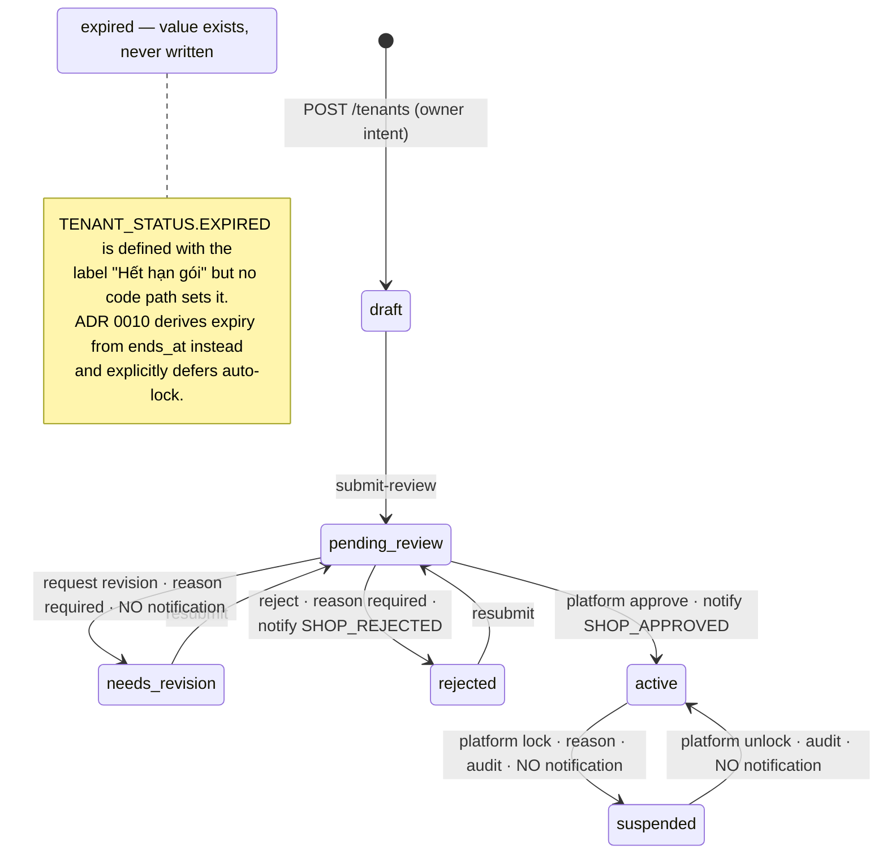
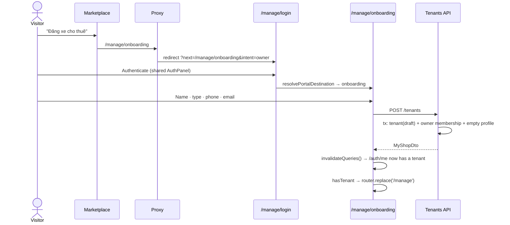
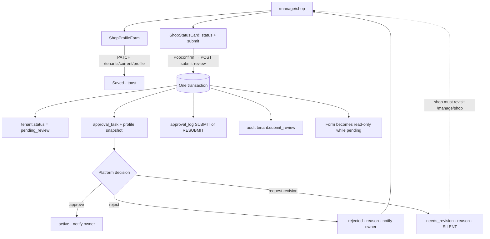

# 03 — Shop Onboarding and Settings

> **Type:** Module design brief · **Created:** 2026-08-04 · **Status:** Draft for product review
> **Owners:** Principal Software Architect · Senior Product Manager · Senior Business Analyst · UX Architect
> **Written to:** [`_DESIGN_BRIEF_STANDARD.md`](_DESIGN_BRIEF_STANDARD.md) · **Inherits:** [`00_CROSS_CUTTING_SYSTEM_UX.md`](00_CROSS_CUTTING_SYSTEM_UX.md) · **Adjacent:** [`01_CUSTOMER_MARKETPLACE.md`](01_CUSTOMER_MARKETPLACE.md), [`02_CUSTOMER_ACCOUNT_AND_ENGAGEMENT.md`](02_CUSTOMER_ACCOUNT_AND_ENGAGEMENT.md)
> **Authoritative sources:** application source code and accepted ADRs. `docs/project/` is secondary.
>
> **Reading contract:** *Confirmed* blocks describe what exists. Anything marked `[RECOMMENDED — NOT CURRENT]` or under a "Recommendations"/"Missing" heading describes nothing that exists today. Absent evidence is written as `Unknown`.

---

## 1. Executive summary

This module covers the transition from *a person with an account* to *an approved shop selling on the marketplace*, and the settings surface that shop keeps afterwards.

The **path in** is the strongest part and was deliberately rebuilt: shop creation lives at exactly one route (`/manage/onboarding`), reachable only by explicit owner intent, and having no tenant is a valid terminal state rendered by `NoTenantState` rather than an implicit onboarding trigger. Registration is transactional — tenant, owner membership and an empty profile are created together or not at all — and the client can never set `status` or `tenant_id`.

The **approval workflow** is correct in its state machine and audit trail but has one acknowledged hole that shapes the whole experience: **a revision request is silent**. `TENANT_NOTIFY_BY_KIND` maps `request_revision` to `null` with the comment *"chưa có loại thông báo riêng… mở sau"*, so when the platform asks a shop for more information, nothing is sent. The shop's status changes to `needs_revision` and the reviewer's reason sits on `/manage/shop` waiting to be discovered. The same applies to vehicle revision requests.

Four capabilities named in the request are **present in the data model and absent from the product**:

| Capability | Model | API | UI |
|---|---|---|---|
| Tenant documents | `tenant_documents` with full review lifecycle | none | none |
| Bank QR (`qrUrl`) | column + DTO field | accepted by `PATCH` | **not in the schema or the form** |
| Pickup areas | none | none | `PlaceholderPage` |
| Expired shop | `TENANT_STATUS.EXPIRED` + label "Hết hạn gói" | never written | never reachable |

Approval therefore reviews a **profile snapshot**, not documents — a shop is approved on self-declared text, with no licence, ID or vehicle-ownership evidence attached anywhere in the flow.

Two defects are worth naming up front: `AppShell` shows the banner *"Gian hàng đang chờ duyệt"* for a shop in `draft` or `needs_revision` — neither of which is awaiting review — because `useTenantScope.isPendingApproval` groups all three; and `NoTenantState` accepts an `onLogout` prop that `AppShell` never passes, so its logout affordance is unreachable.

---

## 2. Scope

### 2.1 In scope

Become-owner entry points and intent, portal login before onboarding, the no-tenant state, shop registration, tenant type, draft creation, profile completion (contact, address, media, legal, banking), documents, the approval submission/revision/rejection/resubmission cycle, active/suspended/expired shop states, shop settings, pickup areas, and return-to-marketplace behaviour.

### 2.2 Out of scope

Authentication mechanics and routing (brief 00) · marketplace discovery (brief 01) · customer surfaces (brief 02) · vehicle CRUD and vehicle publication approval · members and RBAC administration · finance · the platform reviewer's own queue UI · plans and subscriptions beyond their effect on shop status.

### 2.3 Capability status

| # | Capability | Status | Primary evidence |
|---|---|---|---|
| 1 | Become-owner entry points | Implemented | `OwnerCta`, `MarketHeader` menu, `RegisterSuccess`, `NoTenantState`, footer `constants.ts` |
| 2 | Owner intent (`intent=owner`) | Implemented | [`proxy.ts`](../../apps/web/src/proxy.ts), `resolveOwnerCtaHref`, `resolvePortalDestination` |
| 3 | Portal login before onboarding | Implemented | Proxy adds `next=/manage/onboarding&intent=owner` |
| 4 | User with no tenant | Implemented | [`NoTenantState.tsx`](../../apps/web/src/features/shop/components/NoTenantState.tsx), [`AppShell.tsx`](../../apps/web/src/components/layout/AppShell.tsx) |
| 5 | Shop registration | Implemented | [`ShopRegistration.tsx`](../../apps/web/src/features/shop/components/ShopRegistration.tsx), `TenantsService.registerShop` |
| 6 | Individual vs business tenant | **Partially implemented** — selectable and stored; **nothing downstream branches on it** | `TENANT_TYPE`, `RegisterShopDto`; no conditional logic found |
| 7 | Draft shop creation | Implemented | `status: DRAFT` in one transaction |
| 8 | Shop profile completion | Implemented | [`ShopProfileForm.tsx`](../../apps/web/src/features/shop/components/ShopProfileForm.tsx) |
| 9 | Contact information | **Partially implemented** — `phone`/`email` captured at registration, **not editable afterwards** in any UI | `RegisterShopDto` vs `ShopProfileForm` fields |
| 10 | Address / province | **Partially implemented** — free-text `provinceName`; `provinceCode` accepted by the API and never sent | `UpdateTenantProfileDto` vs `shopProfileSchema` |
| 11 | Logo and cover upload | Implemented | `ImageUploadField` + `presignShopMedia` → R2 |
| 12 | Tax and business licence info | **Partially implemented** — free-text fields, optional for every tenant type, never verified | `ShopProfileForm` "Địa chỉ & pháp lý" |
| 13 | Bank information | Implemented | Bank name / account no / account holder |
| 14 | Bank QR (`qrUrl`) | **Referenced but not implemented** — column, DTO field and service select exist; absent from `shopProfileSchema` and the form | `TenantProfile.qrUrl` vs `shopProfileSchema` |
| 15 | **Tenant documents** | **Referenced but not implemented** — `tenant_documents` model with `documentType`, `status`, `rejectReason`, `reviewedBy`, `reviewedAt`; **no endpoint, no page, no upload path** | `schema.prisma`; confirmed absent in [`docs/project/04_API.md`](../project/04_API.md) and [`10_MISSING_FEATURES.md`](../project/10_MISSING_FEATURES.md) |
| 16 | Approval submission | Implemented | `TenantsService.submitForReview` |
| 17 | Approval status display | Implemented | [`ShopStatusCard.tsx`](../../apps/web/src/features/shop/components/ShopStatusCard.tsx) |
| 18 | Revision request | **Partially implemented** — status and reason are set and shown; **no notification is emitted** | `TENANT_NOTIFY_BY_KIND.request_revision = null` |
| 19 | Rejection | Implemented | Reason required; `SHOP_REJECTED` notification to owner |
| 20 | Resubmission | Implemented | `TENANT_STATUS_SUBMITTABLE` includes `rejected` |
| 21 | Active shop | Implemented | Inventory publishable only when `active` (ADR 0008) |
| 22 | Suspended shop | **Partially implemented** — platform can lock/unlock with audit; **the shop is never told and the portal shows no suspension notice** | `platform-tenants.service.ts`; no banner branch for `SUSPENDED` |
| 23 | Expired shop | **Referenced but not implemented** — status value and label exist; **never written by any code path** | Repository search; ADR 0010 defers auto-expiry |
| 24 | Shop settings | **Partially implemented** — settings = the profile form only; `TenantProfile.settings` JSONB is unused | `settings_json` column, no reader/writer found |
| 25 | Pickup areas | **Placeholder** — `PlaceholderPage` with "Chưa có dữ liệu"; no model, no API | [`pickup-areas/page.tsx`](<../../apps/web/src/app/(manage)/manage/pickup-areas/page.tsx>) |
| 26 | Return to marketplace | Implemented | Onboarding back link; `NoTenantState` "Quay lại tìm xe" |
| 27 | Onboarding checklist | **Referenced but not implemented** — no guidance on what completes a profile | No checklist component found |
| 28 | Tenant invites | **Referenced but not implemented** — `tenant_invites` model with token/expiry; member add is direct by email | `schema.prisma`; `docs/project/10_MISSING_FEATURES.md` |

---

## 3. Module purpose

Convert an intent ("I have vehicles to rent") into a **platform-approved tenant** whose inventory may legitimately appear on the marketplace — and do it without ever imposing that path on someone who did not ask for it.

The second half of that sentence is architecture, not sentiment: shop creation is confined to one route precisely because rendering it implicitly is what previously made every customer believe they were required to open a shop.

---

## 4. Business goals

Derived from what the implementation optimizes for; no product requirement document exists in the repository.

| # | Goal | Evidence |
|---|---|---|
| G1 | Make becoming a host low-friction | Registration asks four fields, only one required (`name`) |
| G2 | Never impose the host path | One route, explicit intent, `NoTenantState` treats no-tenant as valid |
| G3 | Keep unapproved supply off the marketplace | `TENANT_STATUS_PUBLISHABLE = [active]`, joined at query time (ADR 0008) |
| G4 | Let the platform hold a quality gate | `approval_tasks` + `approval_logs` + audit on every decision |
| G5 | Make review evidence immutable | The profile is snapshotted into the approval task at submission |
| G6 | Preserve reversibility | Lock/unlock are status-guarded transitions with audit; nothing is deleted |
| G7 | Never let the client assert its own status | `status`/`tenant_id` are excluded from every inbound DTO |

---

## 5. Roles and permissions

| Actor | Capability here | Enforcement |
|---|---|---|
| Authenticated user, no tenant | `POST /tenants` — create a draft shop and become its owner | `TenantsService.registerShop` rejects an existing active membership with `CONFLICT` |
| `shop_owner` | View, update profile, submit for review | `tenant.view`, `tenant.update`, `tenant.submit_review` |
| `shop_manager` | View and (by default) **not** update the profile or submit review | Per [`docs/project/02_USER_ROLES.md`](../project/02_USER_ROLES.md): manager lacks `tenant.update` and `tenant.submit_review` unless customized |
| `shop_staff` / `shop_viewer` | View only | `tenant.view` |
| `reviewer` / `platform_admin` | Approve, reject, request revision | `platform.approvals.review` |
| `platform_admin` / `finance_admin` | Lock and unlock | `platform.tenants.manage` |

**Confirmed:** every tenant-scoped route derives `tenant_id` from the caller's active membership (`@TenantScoped`); `POST /tenants` is deliberately **not** tenant-scoped since the caller has no tenant yet. Upload presigning requires `tenant.update` and the R2 key prefix is built server-side as `tenants/{tenantId}/shop`, so a client cannot choose where it writes.

---

## 6. Entry points

| Entry | Route | Confirmed behaviour |
|---|---|---|
| `OwnerCta` on the marketplace home | `resolveOwnerCtaHref(user)` | Signed out → `/manage/login?intent=owner&next=/manage/onboarding`; signed in without tenant → `/manage/onboarding`; with tenant → `/manage` |
| Footer "Đăng xe cho thuê" | `/manage/onboarding` | Proxy inserts login + owner intent when needed |
| Account menu "Trở thành chủ xe" | `/manage/onboarding` | Shown only when `user.tenant` is null |
| `RegisterSuccess` third action | `resolveOwnerCtaHref(user)` | Label switches to "Vào cổng quản lý" if a tenant already exists |
| `NoTenantState` primary action | `/manage/onboarding` | — |
| Direct `/manage/onboarding` while signed out | Proxy → `/manage/login?next=/manage/onboarding&intent=owner` | Intent survives the login round-trip |
| Direct `/manage` with no tenant | `NoTenantState` | Never the registration form |
| `/manage/shop` | Profile + status card | Requires `tenant.view` |

---

## 7. State diagram

**Confirmed transition rules**

- Submittable only from `draft`, `needs_revision`, `rejected` (`TENANT_STATUS_SUBMITTABLE`). Submitting from `pending_review` returns `INVALID_STATUS_TRANSITION` with "Gian hàng đang chờ duyệt."; from `active` with "Gian hàng đang hoạt động, không cần gửi duyệt."
- Approval decisions map through `TENANT_STATUS_BY_KIND`: approve → `active`, reject → `rejected`, request_revision → `needs_revision`. Reject and revision both require a reason.
- Lock/unlock use `updateMany` guarded on the source status, so a wrong-step or concurrent attempt changes zero rows and returns a conflict — the same anti-race pattern used elsewhere in platform administration.
- A processed approval task cannot be processed twice.

---

## 8. Current user journeys

### 8.1 Marketplace visitor becomes a host

After creation the onboarding page redirects to `/manage`. **There is no guidance step**: the shop lands on the portal dashboard with an empty profile, an unsubmitted draft, and no instruction to complete or submit anything.

### 8.2 Profile completion and approval

---

## 9. Onboarding checklist

**Status: Referenced but not implemented.** No checklist, progress indicator or completeness signal exists anywhere in the module. The *implicit* checklist that the system actually enforces is:

| Step | Enforced? | Where |
|---|---|---|
| Create the shop (name required) | Yes — `Length(2,255)` | `RegisterShopDto` |
| Complete the profile | **No** — every profile field is optional | `UpdateTenantProfileDto`, `shopProfileSchema` |
| Upload logo / cover | **No** | `ImageUploadField`, nullable |
| Provide legal information | **No** — optional for both tenant types | `ShopProfileForm` |
| Provide banking information | **No** | Same |
| Upload documents | **Not possible** | No API |
| Submit for review | Yes — status-gated | `submitForReview` |
| Add a vehicle and submit it publicly | Separate module | Vehicle brief |

**Consequence (confirmed):** a shop can submit an entirely empty profile for review. `submitForReview` validates only the tenant's *status*, never the completeness of the snapshot it stores, so the platform reviewer can receive `{}` as evidence.

---

## 10. Profile data model

| Field | Table | In the form? | Notes |
|---|---|---|---|
| `name`, `tenantType` | `tenants` | Registration only | Not editable afterwards in any UI |
| `phone`, `email` | `tenants` | Registration only | **Not editable afterwards**; the public shop page renders `phone` as a `tel:` link |
| `code`, `slug` | `tenants` | Never | `code = SHOP-{ULID}`; slug is `slugify(name)` + 6-char ULID suffix, retried up to 5 times, then falls back to the full ULID |
| `status` | `tenants` | Never | Server-only |
| `displayName`, `bio` | `tenant_profiles` | Yes | Seeded from the shop name at creation |
| `logoUrl`, `coverUrl` | `tenant_profiles` | Yes — upload | Validated as URL, nullable |
| `address` | `tenant_profiles` | Yes | Free text ≤500 |
| `provinceName` | `tenant_profiles` | Yes | **Free text**, no picker |
| `provinceCode` | `tenant_profiles` | **No** | Accepted by the DTO, never sent, never populated |
| `taxCode`, `businessLicenseNo` | `tenant_profiles` | Yes | Free text, unverified |
| `bankName`, `bankAccountNo`, `bankAccountName` | `tenant_profiles` | Yes | Free text, unverified |
| `qrUrl` | `tenant_profiles` | **No** | Column + DTO + service select exist; missing from schema and form |
| `settings` (JSONB) | `tenant_profiles` | **No** | No reader or writer found anywhere |
| `ratingAvg`, `ratingCount` | `tenants` | Never | Written only by `ReviewService` |

**Public exposure (confirmed).** `getShopBySlug` returns an explicit allowlist — name, slug, phone, province, logo, cover, bio, address, rating. Tax code, licence number, banking details, `code`, `id` and email are **never** exposed publicly.

---

## 11. Forms and validation

| Form | Schema | Rules | Behaviour |
|---|---|---|---|
| Registration | `registerShopSchema` (Yup) + `RegisterShopDto` (class-validator) | `name` 2–255 required; `tenantType` from `TENANT_TYPE_VALUES`; `phone` `^(0\|\+84)\d{9}$` when present; `email` valid when present | `loading` on submit; errors as an `Alert` above the form |
| Profile | `shopProfileSchema` + `UpdateTenantProfileDto` | All fields optional with max lengths; `logoUrl`/`coverUrl` must be valid URLs or null | Whole `fieldset` disabled while `pending_review`, with an explanatory info alert |
| Submit for review | none | Status-gated server-side | `Popconfirm`: "Gửi hồ sơ cho nền tảng duyệt?" / "Sau khi gửi, bạn không sửa hồ sơ cho tới khi có kết quả." |

**Confirmed problems**

- Empty strings are sent for cleared fields (`logoUrl: v.logoUrl ?? ''`), so "remove the logo" writes `''` rather than `null` — the column is nullable but the UI cannot produce null.
- The two schemas diverge: the DTO accepts `provinceCode` and `qrUrl`; the Yup schema has neither.
- No unsaved-changes guard: navigating away from a dirty profile form loses the edits silently.
- The form has no dirty-state gating — "Lưu hồ sơ" is always enabled, unlike the customer account form which disables until dirty.

---

## 12. Upload behaviour

**Confirmed.** Logo and cover use `ImageUploadField` → `presignShopMedia` → `POST /uploads/shop-media/presign` → direct `PUT` to R2 → the public URL is stored in the form field. The client pre-validates MIME against `IMAGE_UPLOAD_MIME_TYPES` and size against `IMAGE_UPLOAD_MAX_BYTES` before presigning. The server requires `tenant.update`, builds the key prefix from `@CurrentTenant`, and returns `503 UPLOADS_NOT_CONFIGURED` with a stable code when R2 environment variables are missing — deliberately, so the frontend can show guidance instead of a generic 500.

**Confirmed gaps** — no crop or aspect-ratio guidance for a cover image that renders wide on the public shop page; no progress indicator beyond a spinner in the tile; a replaced image leaves the previous object in R2 (no delete path); the `503` code exists but no UI branch was found that renders a specific message for it.

---

## 13. Approval workflow

### 13.1 Confirmed current behaviour

Submission writes, in one transaction: the tenant status change, an `approval_task` carrying a **JSON snapshot of the profile at that moment**, an `approval_log` recording `SUBMIT` or `RESUBMIT` with from/to statuses, and an audit entry (`tenant.submit_review`, actor scope `tenant`).

The platform decision writes the new tenant status, the task status, an approval log, an audit entry (`approval.{action}`, actor scope `platform`) and — for approve and reject only — a notification to `tenant.ownerUserId`.

`getMyShop` returns `latestApproval` (status, reason, submittedAt, reviewedAt) taken from the most recent tenant-targeted task, which is what `ShopStatusCard` renders as the reason for revision or rejection.

### 13.2 Confirmed business rules

Only `draft`/`needs_revision`/`rejected` may submit. Reject and request-revision require a reason. A processed task is immutable. Only `active` tenants publish inventory. Approval decisions are audited without exception.

### 13.3 Partial and missing behaviour

| # | Gap | Evidence |
|---|---|---|
| AP-1 | **Revision requests are silent.** `TENANT_NOTIFY_BY_KIND.request_revision = null`, with the code comment *"request_revision chưa có loại thông báo riêng cho 'cần bổ sung' — mở sau"*. The identical gap exists for vehicles. | `platform-approval.service.ts` |
| AP-2 | Notifications go to `tenant.ownerUserId` only — a `shop_manager` who submitted the profile is never told the outcome. | Same |
| AP-3 | Review evidence is a profile snapshot; **no documents are attached** because none can be uploaded. | §2.3 #15 |
| AP-4 | No SLA, queue position or expected-response indication is shown to a waiting shop. | `ShopStatusCard` |
| AP-5 | Submission does not validate completeness, so an empty snapshot can enter the queue. | `submitForReview` |
| AP-6 | The shop cannot see its own approval history — only the latest task. | `getMyShop` |
| AP-7 | Suspension and unlock produce audit entries but **no notification and no in-portal notice**. A locked shop discovers it by noticing its inventory has vanished. | `platform-tenants.service.ts`; no `SUSPENDED` branch in `ShopStatusCard` or `AppShell` |

---

## 14. Loading, empty, error and success states

| Surface | Loading | Empty | Error | Success |
|---|---|---|---|---|
| `/manage/onboarding` | Centred `Spin` while `/auth/me` resolves **and** while redirecting an existing-tenant user | — | Registration failure → `Alert` in the card | Redirect to `/manage` |
| `NoTenantState` | — | This *is* an empty state: title, explanation, two actions | — | — |
| `/manage/shop` | `ManagePageHeader` + `Skeleton` 8 rows | — | `Result status="error"` + "Thử lại" | `message.success('Đã lưu hồ sơ')` |
| `ShopStatusCard` | Button `loading` | — | Toast via the page | Status-specific `Alert` per state (info / warning / error / success) |
| Profile form | Button `loading` | — | `Alert` above the fieldset | Toast |
| Pickup areas | — | `Empty` "Chưa có dữ liệu" | — | — |

**Confirmed problems**

| # | Problem |
|---|---|
| ST-1 | **`AppShell` shows "Gian hàng đang chờ duyệt" for `draft` and `needs_revision` shops.** `isPendingApproval` is true for `PENDING_REVIEW`, `NEEDS_REVISION` **and** `DRAFT`, so a shop that has never submitted — and one being asked to fix something — both read as "waiting for the platform". The banner also carries the sub-text "xe chưa lên marketplace cho tới khi hồ sơ được duyệt", which for a draft shop misattributes the delay to the platform. |
| ST-2 | No portal state exists for `SUSPENDED`, `REJECTED` at shell level, or `EXPIRED`; `ShopStatusCard` covers rejection and revision but only on `/manage/shop`. |
| ST-3 | The pickup-areas placeholder says "Chưa có dữ liệu" — which implies an empty list rather than an unbuilt feature — and offers no return path or availability information. |
| ST-4 | `NoTenantState` accepts `onLogout` but `AppShell` renders `<NoTenantState />` with no props, so the logout affordance is dead code. |

---

## 15. Notification requirements

**Confirmed emitted**

| Event | Type | Recipient |
|---|---|---|
| Shop approved | `SHOP_APPROVED` | `tenant.ownerUserId` |
| Shop rejected | `SHOP_REJECTED` | `tenant.ownerUserId`, body includes the reason |

**Confirmed not emitted:** revision requested (AP-1) · shop locked · shop unlocked · plan expiry (ADR 0010 explicitly excludes "notification/không tự khoá tenant khi gói hết hạn") · profile saved · submission received (no acknowledgement that the queue received the submission).

**Routing.** `notificationHref` maps `targetType: tenant` → `/manage/shop` in the manage context, so approval and rejection land on the right page. There is no customer-context mapping for `tenant`, which is correct.

---

## 16. Desktop, tablet and mobile behaviour

**Confirmed.** `/manage/onboarding` renders outside `AppShell` (listed in `BARE_PORTAL_PATHS`) as a centred single-column card, so it has no sidebar to collapse and behaves identically at every width. `NoTenantState` is likewise a centred card. `ShopProfileForm` is the only responsive layout in the module: AntD `Row`/`Col` with `xs={24} sm={12|16|8}`, so it is one column on phones and two on tablet and up. `/manage/shop` inherits the `AppShell` sidebar/topbar/mobile-nav behaviour.

**Problems and unknowns.** No tablet-specific rule exists anywhere (consistent with brief 00 §9 and brief 01 §2.3 #26). The upload tiles' behaviour at small widths is `Unknown` — not verified at runtime. The `Popconfirm` used for submission is a desktop-oriented affordance with no mobile sheet variant, matching the review-modal deviation recorded in brief 02 §16.

---

## 17. Accessibility

**Confirmed present.** All form fields route through `TextField`/`SelectField`/`TextAreaField`, which bind `label`/`htmlFor` via `useId()`. Sections use AntD `Card` titles as visual grouping, and the form uses a real `<fieldset disabled>` for the pending-review lock — so assistive technology receives the disabled state, not merely a visual cue. Buttons carry text labels rather than icon-only affordances.

**Problems.** The `fieldset disabled` reason is conveyed by a separate `Alert` that is not programmatically associated with the fieldset. Status changes (`ShopStatusCard` alerts) are not announced through a live region. `Popconfirm` keyboard behaviour is `Unknown`. Colour-coded `StatusTag` values do carry text labels (good). No automated accessibility checks exist in the repository.

---

## 18. Security and privacy

**Confirmed controls.** `status`, `tenant_id`, `code` and `slug` are absent from every inbound DTO — a client cannot self-approve or move itself between tenants. `registerShop` rejects a caller who already has an active membership. Every tenant-scoped route derives scope from membership. Upload prefixes are server-built. The public shop projection is an allowlist that excludes tax code, licence number and banking details. Lock/unlock use status-guarded `updateMany`, so concurrent or wrong-step attempts fail rather than corrupt. Every state-changing platform action writes audit.

**Privacy findings.** `tenants.phone` is published on the public shop page as a `tel:` link — business contact data, distinct from customer PII handling (brief 00 §17.2). Banking details are stored in plain columns; no encryption at rest beyond the database's own is evident (`Unknown`). Tax code and licence number are collected but, having no document workflow, serve as unverified self-declarations. The approval snapshot copies the profile — including banking fields — into `approval_tasks.snapshot` as JSONB, where it is readable by any holder of `platform.approvals.review`; whether reviewers should see banking data is an open question.

---

## 19. Edge cases

| # | Case | Confirmed handling |
|---|---|---|
| 1 | User with a tenant opens `/manage/onboarding` | `useEffect` redirects to `/manage`; a spinner shows meanwhile |
| 2 | Two tabs register simultaneously | Second call hits the active-membership check → `CONFLICT` with a directive message |
| 3 | Shop name collides on slug | `uniqueSlug` retries five times with a longer ULID slice, then uses the full ULID |
| 4 | Shop name is all diacritics or symbols | `slugify` strips to empty → base becomes `'shop'` |
| 5 | Submit while already `pending_review` | `INVALID_STATUS_TRANSITION`, "Gian hàng đang chờ duyệt." |
| 6 | Submit while `active` | `INVALID_STATUS_TRANSITION`, "Gian hàng đang hoạt động, không cần gửi duyệt." |
| 7 | Edit the profile while `pending_review` | Fieldset disabled client-side; **server does not block the PATCH** — the lock is UI-only |
| 8 | Submit an entirely empty profile | Accepted; an empty snapshot enters the queue |
| 9 | Revision requested | Status and reason set; **nothing notifies the shop** |
| 10 | Rejected shop resubmits | Allowed — `rejected` is in `TENANT_STATUS_SUBMITTABLE` |
| 11 | Platform locks an active shop | Inventory disappears from the marketplace immediately (join-time filter, ADR 0008); the shop is not told |
| 12 | Lock attempted on a non-active shop | Zero rows updated → conflict, "Chỉ khoá được gian hàng đang hoạt động" |
| 13 | Plan expires | Nothing happens to `tenant.status`; expiry is derived at read time only (ADR 0010) |
| 14 | R2 not configured | Presign returns `503 UPLOADS_NOT_CONFIGURED`; no specific UI branch was found |
| 15 | Tenant created outside the normal path with no profile row | `updateProfile` upserts; `getMyShop` returns an all-null profile object rather than failing |
| 16 | Owner account deleted | `Tenant.ownerUserId` has no cascade rule in the relation — behaviour is `Unknown` |
| 17 | Profile edited by a `shop_manager` | Blocked by default permissions, not by the UI — the form renders and fails on save |

---

## 20. Existing UX problems (consolidated)

| ID | Problem |
|---|---|
| AP-1 | Revision requests are silent — the single largest workflow gap in this module |
| AP-7 | Suspension is invisible to the shop: no notification, no portal notice |
| ST-1 | "Chờ duyệt" banner shown to `draft` and `needs_revision` shops |
| §9 | No onboarding guidance: after creation the shop is dropped on an empty portal with an unsubmitted draft |
| AP-5 | An empty profile can be submitted for review |
| §2.3 #15 | No document upload, so approval reviews self-declared text only |
| §2.3 #14 | Bank QR exists in the model and API and is unreachable in the UI |
| §2.3 #9 | Shop phone and email cannot be edited after registration |
| §2.3 #10 | Province is free text although `/public/destinations` provides a real list |
| ST-3 | Pickup-areas placeholder implies "no data" rather than "not built" |
| ST-4 | `NoTenantState` logout affordance is unreachable |
| §11 | Clearing an image writes `''` instead of null; no unsaved-changes guard; save always enabled |
| §12 | No crop or aspect guidance for the public cover image |
| AP-4 | No SLA or queue expectation while waiting |
| AP-6 | Approval history is not visible to the shop |
| §2.3 #6 | `tenantType` is collected and never used |

---

## 21. Dependencies

| Depends on | Nature |
|---|---|
| Auth/session (brief 00) | Owner intent, portal login, `next` preservation, `/auth/me` tenant scope |
| Marketplace (brief 01) | Owner CTA entry points; the public shop page consumes this profile |
| Platform approvals | Owns the decision that activates a shop |
| Platform tenants | Lock/unlock |
| Notification module | Approve/reject delivery |
| Storage (R2) | Logo and cover |
| Billing (ADR 0010) | Plan limits gate vehicle creation; expiry is read-derived |
| Public listings (ADR 0008) | Consumes `tenant.status` at query time — the reason locking is instant |
| Audit | Every submission and platform decision |
| `@xeprime/types` | `TENANT_STATUS`, `TENANT_TYPE`, `TENANT_STATUS_SUBMITTABLE`, `TENANT_STATUS_PUBLISHABLE`, permissions |
| `@xeprime/validators` | `registerShopSchema`, `shopProfileSchema` |

---

## 22. Missing features

Tenant document upload and review · bank QR UI · pickup-area management (model, API and UI) · onboarding checklist or completeness scoring · editable shop contact details · province picker · approval history for the shop · submission acknowledgement · revision notification · suspension notification and portal notice · expiry handling · tenant invite acceptance · shop-level settings (the `settings` JSONB is unused) · multi-branch support · shop deletion or transfer of ownership.

---

## 23. Recommendations

`[RECOMMENDED — NOT CURRENT]` — ordered by evidence strength that the gap is real.

1. **Emit a notification for revision requests.** The code comment already names this as deferred; a shop currently cannot learn it has been asked for something. Cheapest high-impact fix in the module.
2. **Notify on suspension and unlock**, and render a portal-level notice for `suspended` so a locked shop is not left inferring it from vanished inventory.
3. **Fix the pending banner** so `draft` and `needs_revision` do not read as "waiting for the platform" — three distinct states need three distinct messages.
4. **Add an onboarding checklist** driven by the profile fields the platform actually wants, and use it to gate or warn before submission so empty snapshots stop entering the queue.
5. **Decide the document question.** Either build upload + review against the existing `tenant_documents` model, or remove the model and state that approval is profile-based. The current halfway position means the reviewer's quality gate has no evidence behind it.
6. **Expose the bank QR field** or drop the column; a payment-relevant field that exists everywhere except the UI is a latent inconsistency.
7. **Make province a picker** fed by the same destinations source the marketplace uses, and populate `provinceCode`.
8. **Allow editing shop contact details**, which are published publicly and currently frozen at registration.
9. **Enforce the pending-review edit lock server-side**, not only in the UI.
10. **Show the shop its own approval history**, not just the latest decision.
11. **Resolve `expired`**: either implement it (with notification and a defined effect on inventory) or remove the value so the vocabulary stops promising a state that cannot occur.
12. **Build or remove pickup areas** — they are referenced by the booking flow while unmanageable here.

---

## 24. Open questions

| # | Question | Blocks |
|---|---|---|
| Q1 | What evidence must a shop provide before approval — documents, ID, vehicle ownership — or is a self-declared profile the intended standard? | §2.3 #15, AP-3, AP-5 |
| Q2 | Should `individual` and `business` require different fields and evidence? Today the choice changes nothing. | §2.3 #6 |
| Q3 | Are tax code and business licence mandatory for business tenants? | §10 |
| Q4 | What is the intended review SLA, and should it be shown? | AP-4 |
| Q5 | Should revision and suspension notify by channels beyond in-app, given a suspended shop is losing revenue? | AP-1, AP-7 |
| Q6 | Should notifications reach all owner-role members or only `ownerUserId`? | AP-2 |
| Q7 | What should happen when a plan expires — nothing, warn, or restrict? ADR 0010 defers this deliberately. | §2.3 #23 |
| Q8 | Should reviewers see banking details in the approval snapshot? | §18 |
| Q9 | Can a shop change its name after approval, given `slug` is derived from it and is a public URL? | §10 |
| Q10 | Can ownership be transferred, or a shop be closed or deleted? | §22 |
| Q11 | Are pickup areas a shop-configured entity, and what does the booking flow expect from them? | §2.3 #25 |
| Q12 | Should `shop_manager` be able to edit the profile and submit for review? Today neither is granted by default. | §5 |
| Q13 | Is multi-branch within one tenant planned, or is one tenant one location? | §22 |

---

## 25. Acceptance criteria

### 25.1 Enforced today — regressions are defects

| # | Criterion | Verification |
|---|---|---|
| SA1 | Shop creation renders at exactly one route and only via explicit owner intent | `AppShell` `BARE_PORTAL_PATHS`; `AppShell.test.tsx` |
| SA2 | A user with no tenant never sees the registration form implicitly | `NoTenantState`; `AppShell.test.tsx` |
| SA3 | Registration creates tenant, owner membership and profile atomically | `registerShop` transaction |
| SA4 | A second shop cannot be created by a user with an active membership | `CONFLICT` guard |
| SA5 | Client input never carries `status`, `tenant_id`, `code` or `slug` | DTO shapes |
| SA6 | Submission is allowed only from `draft`/`needs_revision`/`rejected` | `TENANT_STATUS_SUBMITTABLE` |
| SA7 | Submission snapshots the profile and writes approval log + audit in one transaction | `submitForReview` |
| SA8 | Reject and request-revision require a reason | `platform-approval.service.ts` |
| SA9 | Only `active` tenants publish inventory, evaluated at query time | ADR 0008 |
| SA10 | Lock/unlock are status-guarded and audited | `platform-tenants.service.ts` |
| SA11 | Upload keys are server-derived from tenant scope and require `tenant.update` | `StorageController` |
| SA12 | The public shop projection excludes tax, licence and banking data | `getShopBySlug` |
| SA13 | Owner onboarding always offers a route back to the marketplace | Onboarding back link; `NoTenantState` |

### 25.2 Proposed — `[RECOMMENDED — NOT CURRENT]`

| # | Criterion |
|---|---|
| SA14 | Every approval outcome, including revision, reaches the shop through a notification. |
| SA15 | Every status a shop can hold has a distinct, accurate portal message. |
| SA16 | A submission that cannot be reviewed meaningfully cannot be submitted. |
| SA17 | Server-side rules match client-side locks — nothing is enforced only in the UI. |
| SA18 | Every field present in the API is reachable in the UI, or removed from both. |
| SA19 | Placeholder routes state that a feature is unbuilt and offer a way back. |
| SA20 | A suspended shop is told it is suspended, and why. |

---

## 26. Consistency check against brief 00

| Cross-cutting rule | Conformance |
|---|---|
| §5 Post-auth routing respects owner intent and never defaults customers to `/manage` | **Conforms** — `intent=owner` survives the login round-trip |
| §6 Backend is the only authorization boundary | **Partially conforms** — permissions are enforced, but the pending-review edit lock is UI-only (edge case 7) |
| §6 No-tenant is a valid state | **Conforms** — this module owns the canonical implementation |
| §7 Navigation contains no dead ends | **Deviates** — pickup areas is a navigable placeholder (brief 00 §7.4 C1) |
| §8 Forms use RHF + shared Yup schemas | **Conforms**; two schema/DTO divergences noted (§11) |
| §11 Loading conventions | **Conforms** — skeleton on the shop page, spinner where layout is unknown |
| §12 Empty states explain and offer an action | **Conforms** for `NoTenantState`; **deviates** for the pickup-areas placeholder |
| §13 Errors state a next step | **Conforms** — `Result` + retry on the shop page |
| §14 Feedback proportional to consequence | **Conforms** — submission uses `Popconfirm` stating the consequence, not a bare toast |
| §15 Notifications link to the object | **Conforms** — `tenant` target → `/manage/shop` |
| §16 Accessibility | **Partially conforms** — real `fieldset disabled`; no live regions |
| §17 Security/privacy | **Conforms** — allowlisted public projection, server-built upload keys, audited transitions |
| §21 AC1/AC6 (scope from membership; no forced onboarding) | **Conforms** |

No behaviour in this module contradicts an accepted ADR. The absence of expiry handling is consistent with ADR 0010, which defers it explicitly rather than leaving it undecided.

---

## 27. Source references

### Web
[`onboarding/page.tsx`](<../../apps/web/src/app/(manage)/manage/onboarding/page.tsx>) · [`shop/page.tsx`](<../../apps/web/src/app/(manage)/manage/shop/page.tsx>) · [`pickup-areas/page.tsx`](<../../apps/web/src/app/(manage)/manage/pickup-areas/page.tsx>) · [`ShopRegistration.tsx`](../../apps/web/src/features/shop/components/ShopRegistration.tsx) · [`ShopProfileForm.tsx`](../../apps/web/src/features/shop/components/ShopProfileForm.tsx) · [`ShopStatusCard.tsx`](../../apps/web/src/features/shop/components/ShopStatusCard.tsx) · [`NoTenantState.tsx`](../../apps/web/src/features/shop/components/NoTenantState.tsx) · [`shop/api.ts`](../../apps/web/src/features/shop/api.ts) · [`use-shop.ts`](../../apps/web/src/features/shop/hooks/use-shop.ts) · [`AppShell.tsx`](../../apps/web/src/components/layout/AppShell.tsx) · [`AppShell.test.tsx`](../../apps/web/src/components/layout/AppShell.test.tsx) · [`use-tenant-scope.ts`](../../apps/web/src/hooks/use-tenant-scope.ts) · [`ImageUploadField.tsx`](../../apps/web/src/components/form/ImageUploadField.tsx) · [`upload.ts`](../../apps/web/src/services/upload.ts) · [`PlaceholderPage.tsx`](../../apps/web/src/components/common/PlaceholderPage.tsx) · [`OwnerCta.tsx`](../../apps/web/src/features/marketplace/components/OwnerCta.tsx) · [`post-auth-destination.ts`](../../apps/web/src/features/auth/post-auth-destination.ts) · [`proxy.ts`](../../apps/web/src/proxy.ts)

### API
[`tenants.controller.ts`](../../apps/api/src/modules/tenants/tenants.controller.ts) · [`tenants.service.ts`](../../apps/api/src/modules/tenants/tenants.service.ts) · [`tenant-onboarding.dto.ts`](../../apps/api/src/modules/tenants/dto/tenant-onboarding.dto.ts) · [`current-tenant.dto.ts`](../../apps/api/src/modules/tenants/dto/current-tenant.dto.ts) · [`platform-approval.service.ts`](../../apps/api/src/modules/platform-admin/platform-approval.service.ts) · [`platform-tenants.service.ts`](../../apps/api/src/modules/platform-admin/platform-tenants.service.ts) · [`storage.controller.ts`](../../apps/api/src/modules/storage/storage.controller.ts) · [`r2.service.ts`](../../apps/api/src/modules/storage/r2.service.ts) · [`audit.service.ts`](../../apps/api/src/modules/audit/audit.service.ts) · [`notification.service.ts`](../../apps/api/src/modules/notification/notification.service.ts)

### Shared and data
[`packages/types/src/status/tenant.ts`](../../packages/types/src/status/tenant.ts) · [`packages/types/src/rbac.ts`](../../packages/types/src/rbac.ts) · [`packages/types/src/status/misc.ts`](../../packages/types/src/status/misc.ts) (approval statuses) · [`packages/validators/src/index.ts`](../../packages/validators/src/index.ts)

[`prisma/schema.prisma`](../../prisma/schema.prisma) — models read for this brief:

| Model | Table | Facts relied on |
|---|---|---|
| `Tenant` | `tenants` | `code`/`slug` unique; `status` default `draft` with a comment forbidding client writes; `tenantType` default `individual`; `ownerUserId`; soft delete |
| `TenantProfile` | `tenant_profiles` | All profile columns including **`qrUrl`** and an unused `settings` JSONB; `provinceCode` alongside `provinceName` |
| `TenantDocument` | `tenant_documents` | Full review lifecycle (`documentType`, `status`, `rejectReason`, `uploadedBy`, `reviewedBy`, `reviewedAt`) with **no code path touching it** |
| `TenantMembership` | `tenant_memberships` | Unique `[tenantId, userId]`; `roleKey`; `status` |
| `TenantInvite` | `tenant_invites` | Token hash + expiry, unused by any endpoint |

### ADRs
[0002 Session cookie](../decisions/0002-auth-session-cookie.md) · [0005 Status enums](../decisions/0005-status-enums.md) · [0007 API type contract](../decisions/0007-api-type-contract.md) · [0008 Public listings sync](../decisions/0008-public-listings-sync.md) · [0010 Billing plans and subscriptions](../decisions/0010-billing-plans-subscriptions.md)

### Secondary documentation
[`docs/project/02_USER_ROLES.md`](../project/02_USER_ROLES.md) · [`04_API.md`](../project/04_API.md) · [`05_PAGES.md`](../project/05_PAGES.md) · [`07_BUSINESS_RULES.md`](../project/07_BUSINESS_RULES.md) · [`08_WORKFLOW.md`](../project/08_WORKFLOW.md) · [`09_DESIGN_PROBLEMS.md`](../project/09_DESIGN_PROBLEMS.md) · [`10_MISSING_FEATURES.md`](../project/10_MISSING_FEATURES.md)

### Verification performed for this brief

Repository searches confirming absence: any writer of `TENANT_STATUS.EXPIRED` (none) · any endpoint or component touching `tenant_documents` (none) · `qrUrl` in `shopProfileSchema` or `ShopProfileForm` (absent from both, present in model, DTO and service select) · any reader or writer of `TenantProfile.settings` (none) · a `SUSPENDED` branch in `ShopStatusCard` or `AppShell` (none). Confirmed `TENANT_NOTIFY_BY_KIND.request_revision === null` and `VEHICLE_NOTIFY_BY_KIND.request_revision === null` with the accompanying source comment. Confirmed `useTenantScope.isPendingApproval` includes `DRAFT`, and that `AppShell` renders `<NoTenantState />` without the `onLogout` prop the component accepts. Reads of every file listed above.
