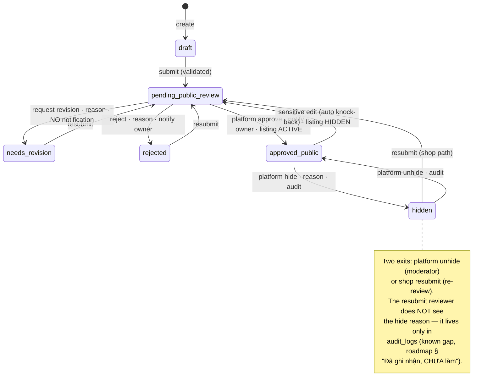

# 04 — Fleet Management

> **Type:** Module design brief · **Created:** 2026-08-04 · **Status:** Draft for product review
> **Owners:** Principal Software Architect · Senior Product Manager · Senior Business Analyst · UX Architect
> **Written to:** [`_DESIGN_BRIEF_STANDARD.md`](_DESIGN_BRIEF_STANDARD.md) · **Inherits:** [`00_CROSS_CUTTING_SYSTEM_UX.md`](00_CROSS_CUTTING_SYSTEM_UX.md) · **Adjacent:** [`01_CUSTOMER_MARKETPLACE.md`](01_CUSTOMER_MARKETPLACE.md) (consumes listings), [`03_SHOP_ONBOARDING_AND_SETTINGS.md`](03_SHOP_ONBOARDING_AND_SETTINGS.md) (tenant must be `active` to publish)
> **Authoritative sources:** application source code, migrations, tests and accepted ADRs. `docs/project/` is secondary.
>
> **Reading contract:** *Confirmed* blocks describe what exists. Anything marked `[RECOMMENDED — NOT CURRENT]` describes nothing that exists today. Absent evidence is written as `Unknown`.

---

## 1. Executive summary

Fleet management is the tenant-side CRUD surface for vehicles and the gate through which a vehicle becomes marketplace inventory. Its core is architecturally disciplined and well-tested: two **independent status axes** (operation vs public), a knock-back rule that automatically demotes a published vehicle to re-review when any of eight sensitive fields changes (ADR 0008), a snapshot-based approval trail, plan-quota enforcement at creation (ADR 0010), soft delete blocked by future occupancy (ADR 0006), and a race-safe platform hide/unhide. Eight Jest suites cover the critical paths.

The gaps cluster at the edges, and three deserve headline status:

1. **The occupancy vocabulary promises three sources; only one has a writer.** `OCCUPANCY_SOURCE_TYPE` defines `booking`, `blocked_range` and `maintenance` — with display metadata and calendar colors — but a call-site census shows `OccupancyService.reserve` is invoked **only** with `BOOKING`. The permission `vehicles.block_schedule` is defined and granted, and no endpoint requires it. A shop cannot block a vehicle for any non-booking reason.
2. **Maintenance is a status, not a workflow.** `operationStatus = maintenance` is a manual dropdown value on the vehicle form. It writes no occupancy, so a vehicle "in maintenance" **still shows as bookable** on the marketplace availability filter and can accept bookings — the two systems that both claim to describe availability do not talk to each other.
3. **Drivers and trash are navigable placeholders**, while `deletedAt` soft-delete is real — deleted vehicles are unreachable by any UI with no restore path.

One asymmetry is worth calling out for product attention: the shop-side detail page shows the **latest** approval decision only, and after a platform hide, the hide reason lives solely in `audit_logs` — the roadmap records this as a known gap (a resubmitting shop's reviewer cannot see why it was hidden).

---

## 2. Scope

### 2.1 In scope

Tenant vehicle list/search/filter/sort/pagination, create/edit forms, detail view, media, features, both status axes, pricing/discount/amenity fields, public submission and its validation, the approval/revision/rejection cycle, sensitive-edit knock-back, soft delete and its occupancy restriction, platform hide/unhide, plan limits, availability as it relates to vehicles, schedule blocking, maintenance, drivers, trash.

### 2.2 Out of scope

Booking/calendar UI internals (their own brief) · marketplace presentation of listings (brief 01) · the platform approval queue UI · shop onboarding (brief 03) · pricing strategy.

### 2.3 Capability status

Statuses follow `_DESIGN_BRIEF_STANDARD.md` §R4. Grouped as the task requires.

**Implemented vehicle management**

| # | Capability | Evidence |
|---|---|---|
| 1 | Vehicle list (paginated, filtered, sorted, server-side) | `VehiclesService.list`, [`VehicleTable.tsx`](../../apps/web/src/features/vehicles/components/VehicleTable.tsx) |
| 2 | Vehicle search (name/code/plate/brand/model, case-insensitive OR) | `searchOr()` |
| 3 | Filtering (vehicleType · serviceType · operationStatus · publicStatus) | `VehicleListQueryDto`, [`VehicleFilters.tsx`](../../apps/web/src/features/vehicles/components/VehicleFilters.tsx) |
| 4 | Sorting (newest default · name · code · price asc/desc) | `orderByOf()` |
| 5 | Pagination (default/max limits, count+page in one transaction) | `VEHICLE_DEFAULT_LIMIT`/`VEHICLE_MAX_LIMIT` |
| 6 | Create vehicle | `create()` + quota + code-uniqueness |
| 7 | Edit vehicle | `update()` + knock-back |
| 8 | Vehicle detail (+ latest review, gallery, features) | `getOne()`, [`VehicleDetailView.tsx`](../../apps/web/src/features/vehicles/components/VehicleDetailView.tsx) |
| 9 | Code (unique per tenant) and plate | `@@unique([tenantId, code])`; plate optional |
| 10 | Specifications (brand/model/year/color/seats/fuel/body) | `vehicleFormSchema`, DTOs |
| 11 | Vehicle type · service type | `VEHICLE_TYPE`, `SERVICE_TYPE` (4 values incl. `both`, `long_term`) |
| 12 | Body type (car-only, auto-cleared for motorbikes) | `VehicleForm` `useWatch` effect |
| 13 | Weekday/weekend/hourly pricing | `Decimal(14,2)`, money-as-string (ADR 0007) |
| 14 | Discount (0–100, DB CHECK) | migration `20260730150000` |
| 15 | Delivery · no-collateral flags | `deliveryEnabled`, `noCollateral` |
| 16 | Main image + gallery (≤20, ordered, presign→R2) | `replaceMedia()`, `ImageGalleryField`, `vehicle-media.spec.ts` |
| 17 | Features (14 curated keys, deduped, unique DB) | `VEHICLE_FEATURE_LABEL`, `vehicle_features` |
| 18 | Public submission validation (price+image+plate+description; active tenant) | `missingPublicFields()`, mirrored client-side in `VehiclePublicReviewPanel` |
| 19 | Vehicle approval / revision / rejection | `platform-approval.service.ts`, `vehicle-approval.spec.ts` |
| 20 | Sensitive edits knock back to re-review | `hasSensitiveChange()` + `VEHICLE_PUBLIC_SENSITIVE_FIELDS` (8 fields) |
| 21 | Soft delete, blocked by current/future occupancy | `remove()` counts `endAt > now` |
| 22 | Platform hide/unhide (race-safe, audited, reason mandatory on hide) | `platform-vehicles.service.ts` `updateMany` guarded transition |
| 23 | Plan vehicle limit at creation | `BillingService.assertVehicleQuota` → `PLAN_LIMIT_REACHED`, `platform-billing.spec.ts` |

**Partially implemented availability/blocking**

| # | Capability | What exists / what does not |
|---|---|---|
| 24 | Availability | Occupancy rows + GiST exclusion (ADR 0006) fully guard bookings; marketplace availability filter reads them (brief 01 §11). **No vehicle-level availability view exists in fleet UI** — the shop sees availability only through the calendar page |
| 25 | Vehicle schedule blocking | **Referenced but not implemented**: `blocked_range` source type, calendar color token `--xp-color-event-blocked`, and permission `vehicles.block_schedule` all exist; **no endpoint or UI writes a blocked range** |
| 26 | Operation status ↔ availability | The two are **disconnected**: `operationStatus` is a manual label; setting `maintenance`/`inactive` writes no occupancy and does not affect marketplace availability or booking creation |

**Placeholder driver/maintenance/trash features**

| # | Capability | State |
|---|---|---|
| 27 | Drivers | **Placeholder** — `PlaceholderPage`; no model, no API. `with_driver` service type is sold on the marketplace with no driver resource behind it |
| 28 | Maintenance | **Placeholder as a workflow** — exists only as an `operationStatus` value and an occupancy source type with no writer; no maintenance records, schedule, or cost linkage |
| 29 | Trash and recovery | **Placeholder** — `PlaceholderPage`; soft-deleted vehicles are real (`deletedAt`) but unlistable and unrestorable through any UI/API |

**Referenced future seasonal pricing**

| # | Capability | State |
|---|---|---|
| 30 | Seasonal pricing | **Referenced but not implemented** — [`vehicles.module.ts`](../../apps/api/src/modules/vehicles/vehicles.module.ts) names it as a labelled follow-up ("giá theo mùa (bảng `vehicle_pricing`)"); the design doc §9.6 specifies the table; the schema comment records the deliberate Phase-0 decision to keep prices on `vehicles` instead |

**Unknown business requirements** — gathered in §24.

---

## 3. Purpose and goals

The module lets a tenant maintain a truthful digital twin of its physical fleet, and controls the promotion of each vehicle from internal record to public inventory. Goals derived from the implementation:

| # | Goal | Evidence |
|---|---|---|
| G1 | The fleet record serves operations first, marketplace second | Internal-only fields (code, operation status) exist independently of publication |
| G2 | Nothing reaches the marketplace unreviewed — including edits | Knock-back on sensitive fields; client cannot set `approved_public` (schema comment + DTO shape) |
| G3 | The reviewer judges exactly what was submitted | JSON snapshot in `approval_tasks` at submission and knock-back |
| G4 | Fleet size is a monetizable limit | Quota check at creation (ADR 0010) |
| G5 | A vehicle with commitments cannot vanish | Occupancy-guarded soft delete |
| G6 | Platform moderation is reversible and accountable | Guarded transitions + mandatory reason + audit |

---

## 4. Users and permissions

| Actor | Capabilities | Permission |
|---|---|---|
| `shop_owner` | Everything | all `vehicles.*` |
| `shop_manager` | View/create/update/submit-public/block-schedule — **not delete** | per [`rbac.ts`](../../packages/types/src/rbac.ts) defaults |
| `shop_staff` / `shop_viewer` | View only | `vehicles.view` |
| `reviewer` / `platform_admin` | Approve/reject/request revision | `platform.approvals.review` |
| Platform vehicle moderators | Hide/unhide (view + moderate both required on handlers) | `platform.vehicles.view` + `platform.vehicles.moderate` |

Every tenant endpoint is `@TenantScoped()` at class level with a per-handler `@RequirePermissions`; scope comes from membership (brief 00 P2). `vehicles.block_schedule` is granted to owner and manager but **guards nothing** — no endpoint declares it.

---

## 5. Information architecture

```
/manage/vehicles              list (URL filters: q, vehicleType, serviceType,
                              operationStatus, publicStatus, sort, page, limit)
/manage/vehicles/new          create form
/manage/vehicles/[id]         detail (Descriptions + features + gallery
                              + VehiclePublicReviewPanel + edit/delete)
/manage/vehicles/[id]/edit    edit form (same VehicleForm, prefilled)
/manage/drivers               PlaceholderPage
/manage/trash                 PlaceholderPage
```

Detail and edit are **pages, not drawers** — vehicle records are shareable URLs, unlike booking detail (brief 00 K-list). The list→detail→edit loop is complete; there is no cross-link from a vehicle to *its* calendar rows, bookings or revenue (the same missing-adjacency problem recorded for the whole portal in `docs/design/07` §6, restated here as an observed gap).

---

## 6. Vehicle lifecycle and public lifecycle

Two independent axes — the type file states this explicitly: *"Hai trục này không được gộp."*

### 6.1 Operation axis (manual, label-only)

`available → renting → maintenance → inactive` in any order — it is a dropdown with no transition rules, no side effects, and no writer other than the edit form. **Confirmed:** nothing reads it for enforcement; it is display/filter data only.

### 6.2 Public axis (state machine, server-owned)



**Listing derivation (confirmed, `deriveStatus` in `listings.service.ts`):** `deletedAt` → `archived`; `approved_public` → `active`; anything else → `hidden`. Sync runs in the same transaction as every status change — six call sites in `VehiclesService` and the platform services.

**Submittable set:** `draft`, `needs_revision`, `rejected`, `hidden` (`VEHICLE_PUBLIC_STATUS_SUBMITTABLE`). Submitting from `pending_public_review`/`approved_public` returns `INVALID_STATUS_TRANSITION` with distinct messages. `archived` exists in the vocabulary with the label "Ngừng sử dụng" but no code path writes it to a vehicle — only the *listing* becomes `archived` on soft delete (`Unknown` whether vehicle-level archived is intended).

---

## 7. List/table requirements — confirmed current shape

| Column | Content |
|---|---|
| Xe | Avatar (main image), name, code · plate |
| Loại | vehicle type · service type labels |
| Đời / Số chỗ | year · seats |
| Giá ngày thường | weekday price + discount tag |
| Vận hành | `StatusTag` from `VEHICLE_OPERATION_STATUS_META` |
| Public | `StatusTag` from `VEHICLE_PUBLIC_STATUS_META` |
| (actions) | Xem · Sửa · Xoá (icon buttons with `Tooltip`; delete in `Popconfirm`) |

One view mode only (table) — the old Firebase UI's grid/list/table switcher was not carried over. No bulk selection (§14). Loading/empty/error states per `docs/project/05_PAGES.md`: URL filters, spinner/empty/error, delete confirmation.

### Search/filter/sort/pagination — confirmed

- All state in URL via `use-vehicle-filters.ts` (ADR 0004); any filter change resets `page`; `router.replace` with `scroll: false`.
- Search input is debounced locally in `VehicleFilters` and matches five columns case-insensitively. The **admin** cross-tenant search is backed by a trigram GIN index over name+plate+code; the tenant-side `ILIKE` relies on `tenantId` narrowing first (index `[tenantId, publicStatus]` etc.).
- Sort vocabulary: `newest` (default) · `name_asc` · `code_asc` · `price_asc` · `price_desc`. Price sort has the same null-position caveat as the marketplace (brief 01 §13, `Unknown` behaviour for null prices).

---

## 8. Create/edit forms — confirmed

One `VehicleForm` for both modes, RHF + `vehicleFormSchema` (shared Yup) + `class-validator` DTOs server-side. Four cards: **Thông tin cơ bản** (code, name, type, service, operation status) · **Chi tiết xe** (plate, brand AutoComplete over 17 curated brands with free text allowed, model, body [car-only], year 1990–current+1, seats 1–64, fuel, color) · **Giá thuê & chính sách** (three prices, discount %, delivery + no-collateral switches) · **Hình ảnh, tiện ích & mô tả** (main image upload, gallery ≤20 ordered, features multi-select from 14 keys, description ≤4000).

Validation notes (confirmed): required = code/name/type/service/operationStatus only; everything the *marketplace* needs (price, image, plate, description) is optional at save time and enforced only at **submission** — a deliberate two-stage model that lets an internal-only vehicle stay incomplete. Body type auto-clears on switching to motorbike. Money fields transform `''`→null. Server re-validates enums with `@IsIn` and money as string decimals.

**Confirmed problems:** no unsaved-changes guard; submit always enabled (no dirty gating — same as brief 03 §11); the form gives no indication which fields are "sensitive" beyond a sentence in the review panel, so a shop editing a published vehicle's price learns about the knock-back only after saving.

---

## 9. Media management — confirmed

Main image and gallery both use presign→PUT→R2 (`presignVehicleImage`, prefix `tenants/{id}/vehicles` server-built). Client pre-validates MIME/size. Gallery is ordered via `sortOrder`, replaced wholesale on update (`deleteMany` + `createMany` inside the tx), max 20 by schema. `vehicle_images.imageType` (`gallery|interior|exterior|document`) exists in the model and is **never written** — `Unknown` whether typed images are a requirement. Replaced/removed images leave orphaned R2 objects (no delete path — same gap as shop media, brief 03 §12). `vehicle-media.spec.ts` covers replacement semantics.

---

## 10. Detail behaviour — confirmed

`Descriptions` (responsive 1/2 columns) + both status tags + feature tags + image strip + `VehiclePublicReviewPanel`, which renders: a status-specific alert (six variants with distinct copy, including the reviewer's reason for `rejected`/`needs_revision`), the four-item requirements checklist mirroring `missingPublicFields`, and the submit/resubmit button gated by `vehicles.submit_public` and the submittable set. Only the **latest** approval task is shown (`getOne` fetches one), so history is invisible to the shop — the same limitation as tenant approval (brief 03 AP-6).

---

## 11. Dialogs, drawers, confirmations — confirmed

Delete: `Popconfirm` on the table row. Submit-public: plain button (no confirm) — asymmetric with tenant submission which does confirm (brief 03 §11); given knock-back consequences this asymmetry is noted as a problem. Platform hide: reason is mandatory (`HideVehicleDto`), collected in the admin drawer. No modal/drawer in the tenant flow otherwise — create/edit are pages.

---

## 12. Bulk actions

**Current state: none exist anywhere in the module** (consistent with the repository-wide finding, brief 00 §8.3 D5). No row selection, no bulk submit, no bulk status change, no bulk delete.

`[RECOMMENDED — NOT CURRENT]` The realistic bulk needs, in evidence order: bulk submit-public (a shop onboarding 20 vehicles must click through 20 detail pages); bulk operation-status change (fleet-wide winterization/inactive); bulk feature/price editing is *not* recommended — sensitive-field knock-back makes bulk price edits a mass-unpublish trap unless the UI states so.

---

## 13. Loading/empty/error/success states — confirmed

| Surface | L / E / Err / S |
|---|---|
| List | Spinner · `Empty` · error alert · — |
| Create/edit | Button `loading` · — · `Alert` above form (incl. `PLAN_LIMIT_REACHED` and duplicate-code messages passed through `getErrorMessage`) · redirect to detail |
| Detail | Loading state · not-found · error · — |
| Review panel | Button `loading` · checklist shows missing items pre-submit · server `VALIDATION_FAILED` lists missing fields with `details.missing` · alert flips to "Đang chờ duyệt" |
| Delete | — · — · conflict toast ("Xe đang có lịch…") · row disappears |

`PLAN_LIMIT_REACHED` has a stable code and a distinct message but no dedicated UI branch linking to plan upgrade (the message says "Vui lòng nâng cấp gói" with nothing to click — and tenants have no plan surface at all, brief 03 §22).

---

## 14. Responsive, accessibility, security

**Responsive (confirmed):** form uses `Row/Col xs/sm` collapse; detail `Descriptions` collapses to one column; the table relies on horizontal overflow on mobile — the bảng→thẻ conversion mandated by `docs/design/05` §5 is not implemented here. Tablet behaviour `Unknown` (no rule anywhere, brief 00 §9).

**Accessibility (confirmed):** all fields through the labelled RHF wrappers (`useId` binding); icon-only row actions have `Tooltip` but their `aria-label` presence is `Unknown` per static review (`docs/project/09` §A11y-2); status conveyed by tag color **plus** text (good). No live-region announcements for status changes after submit.

**Security (confirmed):** tenant scope from membership on every route; `publicStatus`/`tenantId` absent from all inbound DTOs; code uniqueness double-checked (app + `@@unique`); upload prefixes server-built; hide/unhide race-safe via status-guarded `updateMany` (two concurrent moderators → one succeeds, one gets 409); all privileged transitions audited; snapshots keep reviewer evidence immutable. Plate numbers are exposed to the tenant and admin but **never** in public listing DTOs (brief 01 §16 confirmed the omission is deliberate).

---

## 15. Business rules (confirmed, with source)

1. Vehicle code unique per tenant — app check + `@@unique([tenantId, code])`.
2. Operation and public status are independent axes — type file comment.
3. New vehicles are `draft`; creation is quota-checked (`assertVehicleQuota`: no plan or null `maxVehicles` = unlimited; count excludes soft-deleted).
4. Publication requires: submittable status ∧ tenant `active` ∧ weekdayPrice ∧ mainImageUrl ∧ plateNumber ∧ description.
5. Submission/knock-back writes approval task (with snapshot) + approval log + audit in one transaction; client can never set `approved_public`.
6. Sensitive edit on a published vehicle → `pending_public_review` + listing hidden, atomically. Sensitive set: weekday/weekend/hourly price, discount, plate, vehicleType, serviceType, mainImageUrl. Comparison is string-normalized (`String(cur) !== String(next)`), so writing the same value back does **not** knock back.
7. Non-sensitive edits to a published vehicle sync the listing in place without re-review.
8. Soft delete requires zero occupancy rows with `endAt > now`; delete archives the listing atomically.
9. `ListingsService` is the sole listing writer; `OccupancyService` the sole occupancy writer (ADRs 0008/0006).
10. Platform hide only from `approved_public`, unhide only from `hidden`; hide reason mandatory; both audited; wrong-step → 409 (`platform-vehicles.spec.ts`).
11. Discount 0–100 enforced by DB CHECK; discounted price is display-only (brief 01 rule 7).
12. Approve/reject notify `tenant.ownerUserId`; **revision requests notify nobody** (`VEHICLE_NOTIFY_BY_KIND.request_revision = null` — same acknowledged gap as tenants, brief 03 AP-1).

---

## 16. Edge cases — confirmed handling

| # | Case | Handling |
|---|---|---|
| 1 | Duplicate code within tenant | 409 with the code named; DB unique as backstop |
| 2 | Same code in another tenant | Allowed (uniqueness is per tenant) |
| 3 | Reusing a soft-deleted vehicle's code | Allowed — `assertCodeFree` filters `deletedAt: null`; the DB `@@unique` does **not**, so restore-after-reuse would violate it (latent conflict, `Unknown` if intended) |
| 4 | Submit with missing fields | 400 listing the gaps in Vietnamese + `details.missing` |
| 5 | Submit while tenant not active | 400 "Gian hàng phải được duyệt hoạt động…" |
| 6 | Submit while pending/approved | 409 with state-specific message |
| 7 | Edit price of a published vehicle | Auto knock-back + listing hidden + new approval task labelled `resubmit` |
| 8 | Save identical values on a published vehicle | No knock-back (string-compare) |
| 9 | Delete with a future booking | 409 with instruction to end the schedule first |
| 10 | Delete with only past occupancy | Allowed |
| 11 | Create beyond plan quota | 403 `PLAN_LIMIT_REACHED` |
| 12 | Two moderators hide simultaneously | One 409 (guarded `updateMany`) |
| 13 | Hide a non-published vehicle | 409 |
| 14 | Shop resubmits a platform-hidden vehicle | Allowed (`hidden` is submittable); reviewer does not see the hide reason — known gap |
| 15 | Motorbike with a body type | Prevented client-side (auto-clear); server accepts any valid enum (`Unknown` whether server should reject car-only fields for motorbikes) |
| 16 | 21st gallery image | Rejected on both sides: Yup `max(20)` and DTO `@ArrayMaxSize(20)` |
| 17 | Vehicle set to `maintenance` | Label changes; **remains bookable and marketplace-available** |
| 18 | `long_term`/`both` service types | Storable and filterable; no long-term-specific workflow exists (`docs/project/10`) |

---

## 17. Dependencies

Billing (quota) · public-listings (`syncFromVehicle`, sole listing writer) · calendar/occupancy (delete guard; availability truth) · platform-approval (decisions + notifications) · platform-vehicles (moderation) · storage/R2 (media) · audit · `@xeprime/types` (all vocabularies) · `@xeprime/validators` (`vehicleFormSchema`) · tenant status (publish gate, brief 03).

---

## 18. Existing UX problems (consolidated)

| ID | Problem |
|---|---|
| V-1 | Knock-back is invisible until it happens — the edit form does not mark sensitive fields or warn before saving one on a published vehicle |
| V-2 | Revision requests are silent (shared with brief 03 AP-1) |
| V-3 | Hide reason unreachable by the resubmit reviewer and never shown to the shop beyond the generic `hidden` alert |
| V-4 | `maintenance`/`inactive` do not affect availability — an out-of-service vehicle is bookable |
| V-5 | No blocked-range capability despite complete vocabulary/permission/color plumbing |
| V-6 | Deleted vehicles are irrecoverable through the product; trash is a placeholder |
| V-7 | `PLAN_LIMIT_REACHED` tells the shop to upgrade with nowhere to go |
| V-8 | Approval history limited to the latest task |
| V-9 | No vehicle→calendar/bookings/revenue cross-links |
| V-10 | No bulk submit for multi-vehicle onboarding |
| V-11 | Submit-public lacks a confirmation despite its consequences; delete has one — inverted severity |
| V-12 | Table does not convert to cards on mobile |
| V-13 | Orphaned R2 objects on image replacement |

---

## 19. Missing features

Blocked ranges · maintenance records/workflow · driver management (while `with_driver` is sold) · trash/restore · seasonal pricing (`vehicle_pricing`) · vehicle documents (`imageType=document` unused; no registration/inspection tracking — the legacy UI showed "Hết hạn đăng kiểm" warnings, absent here) · bulk actions · vehicle-level availability view · plan-limit upsell path · typed gallery images · vehicle duplication/cloning for similar fleet units.

---

## 20. Recommendations

`[RECOMMENDED — NOT CURRENT]`, evidence-ordered:

1. **Warn before sensitive edits on published vehicles** — mark the eight fields in the form and confirm the knock-back consequence at save. Cheapest fix for the most surprising behaviour.
2. **Wire `maintenance` to occupancy** — writing a `maintenance` occupancy row through `OccupancyService` would make the status real, using plumbing that already exists end to end.
3. **Implement blocked ranges** behind the already-granted `vehicles.block_schedule` permission, or remove the permission and vocabulary.
4. **Surface the hide reason** to both the shop (`hidden` alert) and the resubmit reviewer (already flagged in the roadmap).
5. **Notify on revision requests** (shared with brief 03 recommendation 1).
6. **Build trash/restore** over the existing `deletedAt`, resolving the code-reuse conflict (edge case 3) explicitly.
7. **Link `PLAN_LIMIT_REACHED` to an upgrade path** once a tenant-facing plan surface exists.
8. **Bulk submit-public** for fleet onboarding.
9. **Add registration/inspection expiry tracking** — the legacy product had it; its absence is a regression against the reference UI (`Unknown` whether committed — hence a question, Q6).

---

## 21. Open questions

| # | Question | Blocks |
|---|---|---|
| Q1 | Is schedule blocking (owner blocks own vehicle) a committed requirement? The permission and vocabulary say yes; nothing else does | V-5, §2.3 #25 |
| Q2 | Should `maintenance`/`inactive` remove a vehicle from bookable availability? | V-4 |
| Q3 | Is driver management planned for `with_driver` inventory, and what does assignment look like? | §2.3 #27 |
| Q4 | Is trash/restore a requirement, and how should restored vehicles interact with reused codes? | V-6, edge 3 |
| Q5 | Is seasonal pricing (`vehicle_pricing`) still intended, or is the Phase-0 flat model permanent? | §2.3 #30 |
| Q6 | Are registration/inspection expiry warnings (legacy feature) required? | §19 |
| Q7 | Should vehicle-level `archived` exist, or should the value be removed from the vocabulary? | §6.2 |
| Q8 | Are typed gallery images (`interior`/`exterior`/`document`) a requirement? | §9 |
| Q9 | Should the server reject car-only fields on motorbikes, or is client-side clearing sufficient? | edge 15 |

---

## 22. Acceptance criteria

**Enforced today (regressions are defects):** VA1 code unique per tenant · VA2 quota checked at creation · VA3 publication requires the four fields + active tenant + submittable status · VA4 client can never set `publicStatus` · VA5 sensitive edits atomically knock back and hide the listing · VA6 unchanged-value writes do not knock back · VA7 delete blocked by future occupancy and archives the listing atomically · VA8 hide/unhide are single-step guarded transitions with mandatory hide reason and audit · VA9 listing sync accompanies every status-affecting write in the same transaction · VA10 approval evidence is snapshotted · VA11 all list state lives in the URL, server-side · VA12 money crosses as strings. Verified by the eight suites listed in §2.3 and `apps/api/test/{vehicle-approval,vehicle-media,platform-vehicles,platform-billing,listings-sync}.spec.ts`.

**Proposed `[RECOMMENDED — NOT CURRENT]`:** VA13 sensitive fields are identifiable before saving · VA14 every operation status that means "not rentable" prevents rental · VA15 every defined occupancy source has a writer or is removed · VA16 deleted records are recoverable or deletion says it is permanent · VA17 every limit error links to its resolution · VA18 fleet tables convert to cards ≤640px.

---

## 23. Consistency check against brief 00

Conforms: URL state (ADR 0004 — reference-quality here) · tenant scope · permission-per-handler · status vocabulary from `@xeprime/types` · money as string · audit on privileged actions · no client-set authority fields. Deviates (recorded, not new): placeholder routes in nav (drivers/trash — brief 00 C1) · no bulk actions (D5) · table responsiveness (§9) · silent revision requests (shared with brief 03) · icon-action labelling unverified (§16.2). No ADR contradictions; the flat-pricing decision is documented in the schema itself.

---

## 24. Source references

**Web:** [`vehicles/page.tsx`](<../../apps/web/src/app/(manage)/manage/vehicles/page.tsx>) · [`new/page.tsx`](<../../apps/web/src/app/(manage)/manage/vehicles/new/page.tsx>) · [`[id]/page.tsx`](<../../apps/web/src/app/(manage)/manage/vehicles/[id]/page.tsx>) · [`[id]/edit/page.tsx`](<../../apps/web/src/app/(manage)/manage/vehicles/[id]/edit/page.tsx>) · [`VehicleForm.tsx`](../../apps/web/src/features/vehicles/components/VehicleForm.tsx) · [`VehicleTable.tsx`](../../apps/web/src/features/vehicles/components/VehicleTable.tsx) · [`VehicleFilters.tsx`](../../apps/web/src/features/vehicles/components/VehicleFilters.tsx) · [`VehicleDetailView.tsx`](../../apps/web/src/features/vehicles/components/VehicleDetailView.tsx) · [`VehiclePublicReviewPanel.tsx`](../../apps/web/src/features/vehicles/components/VehiclePublicReviewPanel.tsx) · [`use-vehicle-filters.ts`](../../apps/web/src/features/vehicles/hooks/use-vehicle-filters.ts) · hooks/api/mappers/constants in [`features/vehicles/`](../../apps/web/src/features/vehicles/) · [`drivers/page.tsx`](<../../apps/web/src/app/(manage)/manage/drivers/page.tsx>) · [`trash/page.tsx`](<../../apps/web/src/app/(manage)/manage/trash/page.tsx>)

**API:** [`vehicles.service.ts`](../../apps/api/src/modules/vehicles/vehicles.service.ts) · [`vehicles.controller.ts`](../../apps/api/src/modules/vehicles/vehicles.controller.ts) · [`vehicle.dto.ts`](../../apps/api/src/modules/vehicles/dto/vehicle.dto.ts) · [`vehicles.module.ts`](../../apps/api/src/modules/vehicles/vehicles.module.ts) · [`listings.service.ts`](../../apps/api/src/modules/public-listings/listings.service.ts) · [`platform-vehicles.service.ts`](../../apps/api/src/modules/platform-admin/platform-vehicles.service.ts) · [`platform-approval.service.ts`](../../apps/api/src/modules/platform-admin/platform-approval.service.ts) · [`billing.service.ts`](../../apps/api/src/modules/billing/billing.service.ts) (`assertVehicleQuota`) · [`occupancy.service.ts`](../../apps/api/src/modules/calendar/occupancy.service.ts) · [`storage.controller.ts`](../../apps/api/src/modules/storage/storage.controller.ts)

**Types/validators:** [`status/vehicle.ts`](../../packages/types/src/status/vehicle.ts) · [`status/misc.ts`](../../packages/types/src/status/misc.ts) (`OCCUPANCY_SOURCE_TYPE`, `LISTING_STATUS`) · [`rbac.ts`](../../packages/types/src/rbac.ts) · `vehicleFormSchema` in [`validators`](../../packages/validators/src/index.ts)

**Data:** [`schema.prisma`](../../prisma/schema.prisma) — `Vehicle` (incl. the flat-pricing comment, the three admin indexes and the trigram index), `VehicleImage` (unused `imageType`), `VehicleFeature` (`@@unique([vehicleId, featureKey])`), `VehicleOccupancy` (tstzrange + `@@unique([sourceType, sourceId])`), `PublicListing` · migration [`20260730150000_add_listing_facets`](../../prisma/migrations/) (discount CHECK)

**Tests:** `apps/api/test/{vehicle-approval,vehicle-media,platform-vehicles,platform-billing,listings-sync,listings-facets,occupancy-conflict,public-listings-filter}.spec.ts`

**ADRs:** [0005](../decisions/0005-status-enums.md) · [0006](../decisions/0006-booking-concurrency.md) · [0007](../decisions/0007-api-type-contract.md) · [0008](../decisions/0008-public-listings-sync.md) · [0010](../decisions/0010-billing-plans-subscriptions.md)

**Verification for this brief:** call-site census of `OccupancyService.reserve/reschedule/release` — every call passes `OCCUPANCY_SOURCE_TYPE.BOOKING`; no writer exists for `blocked_range` or `maintenance`. Grep confirming `vehicles.block_schedule` guards no endpoint. Confirmed `VEHICLE_NOTIFY_BY_KIND.request_revision = null`. Confirmed `imageType` never written. Confirmed `assertCodeFree` excludes soft-deleted rows while `@@unique([tenantId, code])` does not (edge case 3). Confirmed the gallery cap is enforced on both sides (`max(20)` + `@ArrayMaxSize(20)`). Confirmed seasonal pricing exists only as a module comment + design-doc section. Reads of every file above.
