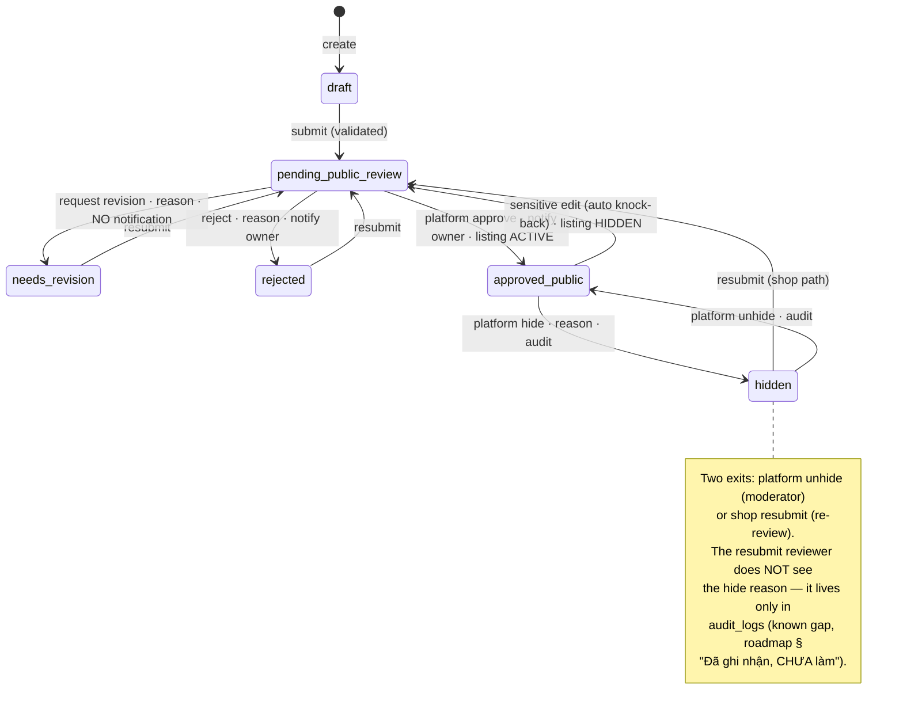

# 04 — Fleet Management

> **Type:** Module design brief · **Created:** 2026-08-04 · **Status:** Draft for product review
> **Owners:** Principal Software Architect · Senior Product Manager · Senior Business Analyst · UX Architect
> **Written to:** [`_DESIGN_BRIEF_STANDARD.md`](_DESIGN_BRIEF_STANDARD.md) · **Inherits:** [`00_CROSS_CUTTING_SYSTEM_UX.md`](00_CROSS_CUTTING_SYSTEM_UX.md) · **Adjacent:** [`01_CUSTOMER_MARKETPLACE.md`](01_CUSTOMER_MARKETPLACE.md) (consumes listings), [`03_SHOP_ONBOARDING_AND_SETTINGS.md`](03_SHOP_ONBOARDING_AND_SETTINGS.md) (tenant must be `active` to publish)
> **Authoritative sources:** application source code, migrations, tests and accepted ADRs. `docs/project/` is secondary.
>
> **Reading contract:** *Confirmed* blocks describe what exists. Anything marked `[RECOMMENDED — NOT CURRENT]` describes nothing that exists today. Absent evidence is written as `Unknown`.
>
> **Vehicle 360 addendum — SHIPPED 2026-08-13.** The six-tab edit workspace, the 360 overview, policy inheritance, vehicle source/finance, documents, maintenance/odometer, handovers and cross-surface vehicle alerts are **implemented**, not a target. Creation shipped as a **four**-step wizard (the `Thông số` step was deliberately folded into the edit workspace). Implemented / partial / deferred boundaries: [`docs/design/12_VEHICLE_360_MANAGEMENT.md`](../design/12_VEHICLE_360_MANAGEMENT.md) §0. §2.4 below records what this changed in *this* brief; the historical analysis in §§6–24 is left intact except where it is now factually wrong.

---

## 1. Executive summary

Fleet management is the tenant-side CRUD surface for vehicles and the gate through which a vehicle becomes marketplace inventory. Its core is architecturally disciplined and well-tested: two **independent status axes** (operation vs public), a knock-back rule that automatically demotes a published vehicle to re-review when any of eight sensitive fields changes (ADR 0008), a snapshot-based approval trail, plan-quota enforcement at creation (ADR 0010), soft delete blocked by future occupancy (ADR 0006), and a race-safe platform hide/unhide. Jest suites cover the critical paths (see §24).

**Superseded by Vehicle 360 (2026-08-13):** the module is no longer a CRUD surface. It now carries rental policies, vehicle source/finance, documents, maintenance/odometer, handovers and a server-derived vehicle-alert feed shared by the list and the 360 profile. §2.4 lists what that changed; §§2.3, 6.1, 8, 14, 16, 19 have been corrected in place.

The gaps cluster at the edges, and two still deserve headline status:

1. **The occupancy vocabulary promises three sources; two now have writers.** `OCCUPANCY_SOURCE_TYPE` defines `booking`, `blocked_range` and `maintenance`. `booking` and `maintenance` both write real rows (the latter since Wave 6 — a confirmed maintenance window blocks bookings through the GiST exclusion, ADR 0006). **`blocked_range` still has no writer**, and the permission `vehicles.block_schedule` is defined and granted while no endpoint requires it — a shop cannot block a vehicle for a non-booking, non-maintenance reason.
2. **Drivers and trash are navigable placeholders**, while `deletedAt` soft-delete is real — deleted vehicles are unreachable by any UI with no restore path.

One narrower asymmetry remains: `operationStatus = maintenance` set by hand on the vehicle form is still a **label only**. Availability is governed by maintenance *records*, not by that dropdown, so the two can disagree (edge case 17).

One asymmetry is worth calling out for product attention: the shop-side detail page shows the **latest** approval decision only, and after a platform hide, the hide reason lives solely in `audit_logs` — the roadmap records this as a known gap (a resubmitting shop's reviewer cannot see why it was hidden).

---

## 2. Scope

### 2.1 In scope

Tenant vehicle list/search/filter/sort/pagination, create/edit forms, detail view, media, features, both status axes, pricing/discount/amenity fields, public submission and its validation, the approval/revision/rejection cycle, sensitive-edit knock-back, soft delete and its occupancy restriction, platform hide/unhide, plan limits, availability as it relates to vehicles, schedule blocking, maintenance, drivers, trash.

### 2.2 Out of scope

Booking/calendar UI internals (their own brief) · marketplace presentation of listings (brief 01) · the platform approval queue UI · shop onboarding (brief 03) · pricing strategy.

### 2.3 Capability status

Statuses follow `_DESIGN_BRIEF_STANDARD.md` §R4. Grouped as the task requires.

**Implemented vehicle management**

| # | Capability | Evidence |
|---|---|---|
| 1 | Vehicle list (paginated, filtered, sorted, server-side) | `VehiclesService.list`, [`VehicleCardGrid.tsx`](../../apps/web/src/features/vehicles/components/VehicleCardGrid.tsx) (was `VehicleTable.tsx`, removed with §7.1) |
| 2 | Vehicle search (name/code/plate/brand/model, case-insensitive OR) | `searchOr()` |
| 3 | Filtering (vehicleType · serviceType · operationStatus · publicStatus) | `VehicleListQueryDto`, [`VehicleFilters.tsx`](../../apps/web/src/features/vehicles/components/VehicleFilters.tsx) |
| 4 | Sorting (newest default · name · code · price asc/desc) | `orderByOf()` |
| 5 | Pagination (default/max limits, count+page in one transaction) | `VEHICLE_DEFAULT_LIMIT`/`VEHICLE_MAX_LIMIT` |
| 6 | Create vehicle | `create()` + quota + code-uniqueness |
| 7 | Edit vehicle | `update()` + knock-back |
| 8 | Vehicle detail (+ latest review, gallery, features) | `getOne()`, [`Vehicle360Overview.tsx`](../../apps/web/src/features/vehicles/components/Vehicle360Overview.tsx) (was `VehicleDetailView.tsx`, replaced by the 360 overview) |
| 9 | Code (unique per tenant) and plate | `@@unique([tenantId, code])`; plate optional |
| 10 | Specifications (brand/model/year/color/seats/fuel/body) | `vehicleFormSchema`, DTOs |
| 11 | Vehicle type · service type | `VEHICLE_TYPE`, `SERVICE_TYPE` (4 values incl. `both`, `long_term`) |
| 12 | Body type (car-only, auto-cleared for motorbikes) | `VehicleForm` `useWatch` effect |
| 13 | Weekday/weekend/hourly pricing | `Decimal(14,2)`, money-as-string (ADR 0007) |
| 14 | Discount (0–100, DB CHECK) | migration `20260730150000` |
| 15 | Delivery · no-collateral flags | `deliveryEnabled`, `noCollateral` |
| 16 | Main image + gallery (≤20, ordered, presign→R2) | `replaceMedia()`, `ImageGalleryField`, `vehicle-media.spec.ts` |
| 17 | Features (14 curated keys, deduped, unique DB) | `VEHICLE_FEATURE_LABEL`, `vehicle_features` |
| 18 | Public submission validation (price+image+plate+description; active tenant) | `missingPublicFields()`, mirrored client-side in `VehiclePublicReviewPanel` |
| 19 | Vehicle approval / revision / rejection | `platform-approval.service.ts`, `vehicle-approval.spec.ts` |
| 20 | Sensitive edits knock back to re-review | `hasSensitiveChange()` + `VEHICLE_PUBLIC_SENSITIVE_FIELDS` (8 fields) |
| 21 | Soft delete, blocked by current/future occupancy | `remove()` counts `endAt > now` |
| 22 | Platform hide/unhide (race-safe, audited, reason mandatory on hide) | `platform-vehicles.service.ts` `updateMany` guarded transition |
| 23 | Plan vehicle limit at creation | `BillingService.assertVehicleQuota` → `PLAN_LIMIT_REACHED`, `platform-billing.spec.ts` |

**Partially implemented availability/blocking**

| # | Capability | What exists / what does not |
|---|---|---|
| 24 | Availability | Occupancy rows + GiST exclusion (ADR 0006) fully guard bookings; marketplace availability filter reads them (brief 01 §11). **No vehicle-level availability view exists in fleet UI** — the shop sees availability only through the calendar page |
| 25 | Vehicle schedule blocking | **Referenced but not implemented**: `blocked_range` source type, calendar color token `--xp-color-event-blocked`, and permission `vehicles.block_schedule` all exist; **no endpoint or UI writes a blocked range** |
| 26 | Operation status ↔ availability | Still **disconnected as a label**: setting `operationStatus = maintenance`/`inactive` by hand writes no occupancy. Availability is now governed by **maintenance records** (#28), which do write occupancy — so a hand-set label and real availability can disagree |

**Placeholder driver/trash features**

| # | Capability | State |
|---|---|---|
| 27 | Drivers | **Placeholder** — `PlaceholderPage`; no model, no API. `with_driver` service type is sold on the marketplace with no driver resource behind it |
| 29 | Trash and recovery | **Placeholder** — `PlaceholderPage`; soft-deleted vehicles are real (`deletedAt`) but unlistable and unrestorable through any UI/API |

### 2.4 Vehicle 360 — implemented capabilities (2026-08-13)

Replaces the former "maintenance is a placeholder" and "no vehicle documents" findings. Boundaries and deferrals: [`docs/design/12_VEHICLE_360_MANAGEMENT.md`](../design/12_VEHICLE_360_MANAGEMENT.md) §0.

| # | Capability | Evidence |
|---|---|---|
| 31 | Create wizard — 4 steps, draft save, resume, post-create checklist | [`VehicleForm.tsx`](../../apps/web/src/features/vehicles/components/VehicleForm.tsx) · `CREATE_WIZARD_STEPS` in [`VehicleFormSections.tsx`](../../apps/web/src/features/vehicles/components/VehicleFormSections.tsx) |
| 32 | Six-tab edit workspace on one route, tab in `?tab=`, unsaved-change guard, sensitive-edit confirmation | [`VehicleEditWorkspace.tsx`](../../apps/web/src/features/vehicles/components/VehicleEditWorkspace.tsx) · `VEHICLE_EDIT_TAB` in [`routes.ts`](../../apps/web/src/constants/routes.ts) |
| 33 | Tab payload isolation — each tab sends only its own fields; omitted fields are never nulled | `informationValuesToInput`/`mediaValuesToInput` in [`mappers.ts`](../../apps/web/src/features/vehicles/mappers.ts) · `writableFields()` guards every field with `!== undefined` |
| 34 | Vehicle 360 summary — stats, alerts, upcoming/recent bookings, per-domain permission gating | `GET /vehicles/:id/summary` → `summary360()` · [`Vehicle360Overview.tsx`](../../apps/web/src/features/vehicles/components/Vehicle360Overview.tsx) |
| 35 | Rental policies — deposit, one-way delivery tiers + self-quote radius, overtime, discount tiers; shop default ↔ per-vehicle override | `rental_policies` · [`shop-policies.controller.ts`](../../apps/api/src/modules/pricing/shop-policies.controller.ts) · `features/rental-policies/` |
| 36 | Vehicle source — 4 variants with per-variant DB CHECK; type change replaces the whole record + audit | [`vehicle-source.service.ts`](../../apps/api/src/modules/vehicles/vehicle-source.service.ts) · `vehicle_source_details` |
| 37 | Private vehicle files — server-built object key, byte-signature check on complete, short-lived signed GET, no URL ever in a DTO | [`vehicle-contracts.service.ts`](../../apps/api/src/modules/vehicles/vehicle-contracts.service.ts) · `vehicle_private_files` |
| 38 | Documents — versioned replace (old version still downloadable), archive, expiry against a tenant-configured threshold, manual entry | [`documents/`](../../apps/api/src/modules/vehicles/documents/) · `vehicle_documents(+_versions)` |
| 39 | OCR orchestration + `Hiện tại / Nhận dạng` review, selective per-field apply; plate apply routes through the knock-back rule | [`ocr-provider.ts`](../../apps/api/src/modules/vehicles/documents/ocr-provider.ts) · **no provider configured → 503 `OCR_NOT_CONFIGURED`** |
| 40 | Maintenance — interval config, next-service computation (`Chưa đủ dữ liệu`, never a fake 0km), record lifecycle, cost/attachment gating | [`maintenance.service.ts`](../../apps/api/src/modules/vehicles/maintenance/maintenance.service.ts) |
| 41 | Maintenance ↔ availability — a confirmed window reserves `vehicle_occupancies` via `OccupancyService`; cancel/reschedule release and move it | `occupancy.reserve/reschedule/release` calls in `maintenance.service.ts` (ADR 0006) |
| 42 | Odometer — append-only history, manual correction requires a reason + audit, decrease needs a separate permission **and** explicit confirmation, `rowVersion` conflict → 409 | [`odometer.service.ts`](../../apps/api/src/modules/vehicles/maintenance/odometer.service.ts) |
| 43 | Handovers — draft → confirm, required photo slots, fuel/battery by drivetrain, idempotent confirm, `rowVersion` guarding | [`handovers.service.ts`](../../apps/api/src/modules/bookings/handovers/handovers.service.ts) · `vehicle_handovers(+_photos)` |
| 44 | Odometer from operations — confirmed return is the **only** path that moves authoritative KM; return < pickup rejected; missing return KM opens a task instead of inventing a number | `handovers.service.ts` |
| 45 | Missing-return-KM queue + board count, filtered identically on both surfaces (soft-deleted vehicle/booking drops from both together) | [`handover-queue.controller.ts`](../../apps/api/src/modules/bookings/handovers/handover-queue.controller.ts) · `boardSummary()` · [`MissingReturnKmQueue.tsx`](../../apps/web/src/features/handovers/components/MissingReturnKmQueue.tsx) |
| 46 | Cross-surface vehicle alerts — **one computation, two surfaces**; deterministic priority; never carries money, PII or file identifiers | [`vehicle-alerts.service.ts`](../../apps/api/src/modules/vehicles/vehicle-alerts.service.ts) · [`VehicleAlerts.tsx`](../../apps/web/src/features/vehicles/components/VehicleAlerts.tsx) |
| 47 | Maintenance centre — work groups (overdue · due soon · in progress · missing KM data · missing return KM · expiring documents), filter/search/paging in the database | [`maintenance-board.controller.ts`](../../apps/api/src/modules/vehicles/maintenance/maintenance-board.controller.ts) · [`maintenance/page.tsx`](<../../apps/web/src/app/(manage)/manage/maintenance/page.tsx>) |

**Referenced future seasonal pricing**

| # | Capability | State |
|---|---|---|
| 30 | Seasonal pricing | **Referenced but not implemented** — [`vehicles.module.ts`](../../apps/api/src/modules/vehicles/vehicles.module.ts) names it as a labelled follow-up ("giá theo mùa (bảng `vehicle_pricing`)"); the design doc §9.6 specifies the table; the schema comment records the deliberate Phase-0 decision to keep prices on `vehicles` instead |

**Unknown business requirements** — gathered in §24.

---

## 3. Purpose and goals

The module lets a tenant maintain a truthful digital twin of its physical fleet, and controls the promotion of each vehicle from internal record to public inventory. Goals derived from the implementation:

| # | Goal | Evidence |
|---|---|---|
| G1 | The fleet record serves operations first, marketplace second | Internal-only fields (code, operation status) exist independently of publication |
| G2 | Nothing reaches the marketplace unreviewed — including edits | Knock-back on sensitive fields; client cannot set `approved_public` (schema comment + DTO shape) |
| G3 | The reviewer judges exactly what was submitted | JSON snapshot in `approval_tasks` at submission and knock-back |
| G4 | Fleet size is a monetizable limit | Quota check at creation (ADR 0010) |
| G5 | A vehicle with commitments cannot vanish | Occupancy-guarded soft delete |
| G6 | Platform moderation is reversible and accountable | Guarded transitions + mandatory reason + audit |

---

## 4. Users and permissions

| Actor | Capabilities | Permission |
|---|---|---|
| `shop_owner` | Everything | all `vehicles.*` |
| `shop_manager` | View/create/update/submit-public/block-schedule — **not delete** | per [`rbac.ts`](../../packages/types/src/rbac.ts) defaults |
| `shop_staff` / `shop_viewer` | View only | `vehicles.view` |
| `reviewer` / `platform_admin` | Approve/reject/request revision | `platform.approvals.review` |
| Platform vehicle moderators | Hide/unhide (view + moderate both required on handlers) | `platform.vehicles.view` + `platform.vehicles.moderate` |

Every tenant endpoint is `@TenantScoped()` at class level with a per-handler `@RequirePermissions`; scope comes from membership (brief 00 P2). `vehicles.block_schedule` is granted to owner and manager but **guards nothing** — no endpoint declares it.

### 4.1 What each permission reveals

Source of truth: [`rbac.ts`](../../packages/types/src/rbac.ts). Levels are split by *damage if abused*, not by convenience — holding one never implies the next.

| Permission | Reveals | Does **not** reveal |
|---|---|---|
| `vehicles.view` | Vehicle core: identity, both status axes, specs, prices on the vehicle record, publication requirements | Documents, maintenance, odometer, handovers, bookings, finance — each is its own key |
| `vehicles.create` / `update` / `delete` / `submit_public` | Write paths for vehicle core and its policy/source tabs | — |
| `finance.view` | Vehicle source financial detail, contract file download, source payment-obligation alerts, revenue in the 360 stats | Amounts are never carried in alert titles/details regardless of this key |
| `vehicles.documents.view` | Document **status** only: type, expiry, warning counts | Holder name/address, document numbers, VIN/engine numbers, file names, files |
| `vehicles.documents.view_details` | Sensitive document metadata (holder, numbers) | Files — that is a separate key |
| `vehicles.documents.view_files` | Opening/downloading private document files and version history | — |
| `vehicles.documents.manage` | Create/edit/archive, upload versions, run and apply OCR | — |
| `vehicles.maintenance.view` | Current odometer, interval, next-service state, schedule and history | Costs and private maintenance attachments |
| `vehicles.maintenance.manage` | Create/edit/complete/cancel records, configure intervals | — |
| `vehicles.maintenance.view_cost` | Maintenance costs | — |
| `vehicles.maintenance.view_files` | Private maintenance documents (invoices, payment vouchers) | — |
| `vehicles.odometer.correct` | Manual odometer correction — reason mandatory, audited | Decreasing the value |
| `vehicles.odometer.decrease` | Lowering authoritative KM — strictly higher bar, since KM drives maintenance and handover reconciliation | — |
| `handovers.view` | Handover records (KM, fuel, condition) and the missing-return-KM queue and its count | Private condition photos |
| `handovers.manage` | Create/edit drafts, upload condition photos, discard drafts | Confirming |
| `handovers.confirm` | The only action with real consequences: booking transition, authoritative KM write, schedule change | — |
| `handovers.view_files` | Opening/downloading private condition photos | — |
| `bookings.view` | Booking lists on the 360 profile, and alert links that carry a `bookingId` | — |

**Alerts inherit the constraints of the domain that produced them.** `GET /vehicles/alerts` requires only `vehicles.view`, so `vehicleAlertScopeOf()` builds a per-domain scope and a domain without its permission is **not queried at all** — the data never leaves the database, and its absence cannot be inferred from response shape. A `vehicles.view`-only custom role therefore cannot deduce document expiry, odometer, maintenance state, pending handovers, booking identifiers or financial obligations. Follow-on links degrade the same way: a link carrying a `bookingId` appears only with `bookings.view`, the shared queue link only when that queue is reachable, otherwise `href` is null.

Role defaults worth noting: `shop_staff` can do maintenance and handovers (including confirm) but has **no** `view_cost`, `view_files` or `odometer.decrease`; `shop_viewer` reads document status, maintenance state and handover records but cannot create, confirm or open any private file.

---

## 5. Information architecture

```
/manage/vehicles                  card grid (URL filters: q, vehicleType, serviceType,
                                  operationStatus, publicStatus, sort, page, limit)
/manage/vehicles/new              create wizard (4 steps)
/manage/vehicles/[id]             Vehicle 360 overview (stats · alerts · bookings ·
                                  document/source/maintenance cards by permission)
/manage/vehicles/[id]/edit        six-tab workspace; tab in ?tab=
                                  information | media | pricing | source | documents | maintenance
/manage/vehicles/[id]/pricing     per-vehicle price & policy (also embedded as the pricing tab)
/manage/maintenance               fleet maintenance centre + "missing return KM" queue
/manage/shop/policies             shop-default rental policies
/manage/drivers                   PlaceholderPage
/manage/trash                     PlaceholderPage
```

Handovers have **no standalone route**: they open from the booking detail drawer, and their operational backlog surfaces as a work group in `/manage/maintenance`.

Detail and edit are **pages, not drawers** — vehicle records are shareable URLs, unlike booking detail (brief 00 K-list). The list→detail→edit loop is complete. A vehicle now cross-links to its calendar (`Xem lịch`, pre-filtered) and, with `bookings.view`, to its upcoming/recent bookings from the 360 overview; there is still no vehicle→revenue view.

Invalid `?tab=` values normalize to `information` against `VEHICLE_EDIT_TAB` — the same constant that alert links are generated from, so a mistyped tab cannot silently produce a dead link.

---

## 6. Vehicle lifecycle and public lifecycle

Two independent axes — the type file states this explicitly: *"Hai trục này không được gộp."*

### 6.1 Operation axis (manual, label-only)

`available → renting → maintenance → inactive` in any order — it is a dropdown with no transition rules, no side effects, and no writer other than the edit form. **Confirmed:** nothing reads it for enforcement; it is display/filter data only.

### 6.2 Public axis (state machine, server-owned)



**Listing derivation (confirmed, `deriveStatus` in `listings.service.ts`):** `deletedAt` → `archived`; `approved_public` → `active`; anything else → `hidden`. Sync runs in the same transaction as every status change — six call sites in `VehiclesService` and the platform services.

**Submittable set:** `draft`, `needs_revision`, `rejected`, `hidden` (`VEHICLE_PUBLIC_STATUS_SUBMITTABLE`). Submitting from `pending_public_review`/`approved_public` returns `INVALID_STATUS_TRANSITION` with distinct messages. `archived` exists in the vocabulary with the label "Ngừng sử dụng" but no code path writes it to a vehicle — only the *listing* becomes `archived` on soft delete (`Unknown` whether vehicle-level archived is intended).

---

## 7. List/table requirements — confirmed current shape

| Column | Content |
|---|---|
| Xe | Avatar (main image), name, code · plate |
| Loại | vehicle type · service type labels |
| Đời / Số chỗ | year · seats |
| Giá ngày thường | weekday price + discount tag |
| Vận hành | `StatusTag` from `VEHICLE_OPERATION_STATUS_META` |
| Public | `StatusTag` from `VEHICLE_PUBLIC_STATUS_META` |
| (actions) | Xem · Sửa · Xoá (icon buttons with `Tooltip`; delete in `Popconfirm`) |

One view mode only (table) — the old Firebase UI's grid/list/table switcher was not carried over. No bulk selection (§14). Loading/empty/error states per `docs/project/05_PAGES.md`: URL filters, spinner/empty/error, delete confirmation.

### 7.1 Card-first fleet list — SHIPPED (product decision 2026-08-10)

`/manage/vehicles` uses a **vehicle card grid as its canonical presentation at every
viewport**, replacing the desktop data table. This is appropriate for the expected tenant fleet
size and gives each vehicle's image and operational context enough visual priority. Do not add a
table/grid switcher unless a later product requirement proves that large fleets need it.

Implemented in [`VehicleCardGrid.tsx`](../../apps/web/src/features/vehicles/components/VehicleCardGrid.tsx) (grid), [`VehicleManagementCard.tsx`](../../apps/web/src/features/vehicles/components/VehicleManagementCard.tsx) (card) and [`VehicleListRow.tsx`](../../apps/web/src/features/vehicles/components/VehicleListRow.tsx) (compact mobile row). Cards carry the server-derived alert chips and current odometer from `GET /vehicles/alerts` — the list never recomputes them client-side. The table view is gone; §7's column table above is retained as the historical shape.

The supplied dark fleet screenshot is a **layout and information-hierarchy reference only**. It is
not a color, typography, radius, shadow or component-style source. The implementation and updated
Figma frames must continue to use XePrime Foundations, semantic tokens, the dark portal sidebar and
the existing light content surfaces.

Each card should expose, when the current DTO and permissions provide the value:

1. Prominent main vehicle image with a vehicle fallback when missing.
2. Vehicle name, internal code and license plate.
3. Vehicle type, service type, manufacture year and seat count.
4. Both independent status axes: operation status and public/publication status.
5. Primary rental prices already owned by the vehicle record (weekday; weekend/hourly only when
   present) and discount when applicable.
6. Publication completeness or missing-requirement summary when it helps the owner act.
7. Existing authorized actions: view, edit and delete. A calendar/schedule action may appear only
   when an existing route and verified filter/deep-link contract support it.

Do **not** copy revenue, cost, profit/loss, running-booking totals, registration-expiry warnings or
other metrics from the reference screenshot unless those values already exist in the Fleet list
API and are confirmed as in-scope business data. Visual inspiration is not authorization to create
new analytics, joins or backend contracts.

Layout target:

- Wide desktop: up to 4 balanced cards per row.
- Standard portal desktop: 3 cards per row where the content width allows it.
- Tablet: 2 cards per row.
- Mobile: 1 card per row.
- Prefer responsive grid sizing over fixed screenshot-specific card widths; long names, prices and
  status labels must not overflow.

The existing filter/search/sort URL contract, server pagination, permission states, loading,
empty, no-results, error/retry and delete confirmation remain unchanged. Desktop and mobile must
consume one query result and one action definition; do not build a second data path for the grid.

### Search/filter/sort/pagination — confirmed

- All state in URL via `use-vehicle-filters.ts` (ADR 0004); any filter change resets `page`; `router.replace` with `scroll: false`.
- Search input is debounced locally in `VehicleFilters` and matches five columns case-insensitively. The **admin** cross-tenant search is backed by a trigram GIN index over name+plate+code; the tenant-side `ILIKE` relies on `tenantId` narrowing first (index `[tenantId, publicStatus]` etc.).
- Sort vocabulary: `newest` (default) · `name_asc` · `code_asc` · `price_asc` · `price_desc`. Price sort has the same null-position caveat as the marketplace (brief 01 §13, `Unknown` behaviour for null prices).

---

## 8. Create/edit forms — confirmed

One `VehicleForm` for both modes, RHF + `vehicleFormSchema` (shared Yup) + `class-validator` DTOs server-side. Four cards: **Thông tin cơ bản** (code, name, type, service, operation status) · **Chi tiết xe** (plate, brand AutoComplete over 17 curated brands with free text allowed, model, body [car-only], year 1990–current+1, seats 1–64, fuel, color) · **Giá thuê & chính sách** (three prices, discount %, delivery + no-collateral switches) · **Hình ảnh, tiện ích & mô tả** (main image upload, gallery ≤20 ordered, features multi-select from 14 keys, description ≤4000).

Validation notes (confirmed): required = code/name/type/service/operationStatus only; everything the *marketplace* needs (price, image, plate, description) is optional at save time and enforced only at **submission** — a deliberate two-stage model that lets an internal-only vehicle stay incomplete. Body type auto-clears on switching to motorbike. Money fields transform `''`→null. Server re-validates enums with `@IsIn` and money as string decimals.

**Superseded by Vehicle 360 (§2.4 #31–33).** Creation is a four-step wizard and editing is a six-tab workspace; the single shared `VehicleForm` description above still holds for field-level validation, which the wizard and the workspace both reuse.

**Resolved:** an unsaved-changes guard now exists (`beforeunload` plus a confirm when switching tabs while dirty), and a sensitive edit on a published vehicle requires explicit confirmation **before** the API call — the shop learns about the knock-back before it happens, not after (V-1 closed).

**Still open:** submit-public remains ungated by dirty state and unconfirmed (V-11).

---

## 9. Media management — confirmed

Main image and gallery both use presign→PUT→R2 (`presignVehicleImage`, prefix `tenants/{id}/vehicles` server-built). Client pre-validates MIME/size. Gallery is ordered via `sortOrder`, replaced wholesale on update (`deleteMany` + `createMany` inside the tx), max 20 by schema. `vehicle_images.imageType` (`gallery|interior|exterior|document`) exists in the model and is **never written** — `Unknown` whether typed images are a requirement. Replaced/removed images leave orphaned R2 objects (no delete path — same gap as shop media, brief 03 §12). `vehicle-media.spec.ts` covers replacement semantics.

---

## 10. Detail behaviour — confirmed

`Descriptions` (responsive 1/2 columns) + both status tags + feature tags + image strip + `VehiclePublicReviewPanel`, which renders: a status-specific alert (six variants with distinct copy, including the reviewer's reason for `rejected`/`needs_revision`), the four-item requirements checklist mirroring `missingPublicFields`, and the submit/resubmit button gated by `vehicles.submit_public` and the submittable set. Only the **latest** approval task is shown (`getOne` fetches one), so history is invisible to the shop — the same limitation as tenant approval (brief 03 AP-6).

---

## 11. Dialogs, drawers, confirmations — confirmed

Delete: `Popconfirm` on the table row. Submit-public: plain button (no confirm) — asymmetric with tenant submission which does confirm (brief 03 §11); given knock-back consequences this asymmetry is noted as a problem. Platform hide: reason is mandatory (`HideVehicleDto`), collected in the admin drawer. No modal/drawer in the tenant flow otherwise — create/edit are pages.

---

## 12. Bulk actions

**Current state: none exist anywhere in the module** (consistent with the repository-wide finding, brief 00 §8.3 D5). No row selection, no bulk submit, no bulk status change, no bulk delete.

`[RECOMMENDED — NOT CURRENT]` The realistic bulk needs, in evidence order: bulk submit-public (a shop onboarding 20 vehicles must click through 20 detail pages); bulk operation-status change (fleet-wide winterization/inactive); bulk feature/price editing is *not* recommended — sensitive-field knock-back makes bulk price edits a mass-unpublish trap unless the UI states so.

---

## 13. Loading/empty/error/success states — confirmed

| Surface | L / E / Err / S |
|---|---|
| List | Spinner · `Empty` · error alert · — |
| Create/edit | Button `loading` · — · `Alert` above form (incl. `PLAN_LIMIT_REACHED` and duplicate-code messages passed through `getErrorMessage`) · redirect to detail |
| Detail | Loading state · not-found · error · — |
| Review panel | Button `loading` · checklist shows missing items pre-submit · server `VALIDATION_FAILED` lists missing fields with `details.missing` · alert flips to "Đang chờ duyệt" |
| Delete | — · — · conflict toast ("Xe đang có lịch…") · row disappears |

`PLAN_LIMIT_REACHED` has a stable code and a distinct message but no dedicated UI branch linking to plan upgrade (the message says "Vui lòng nâng cấp gói" with nothing to click — and tenants have no plan surface at all, brief 03 §22).

---

## 14. Responsive, accessibility, security

**Responsive (confirmed current):** form uses `Row/Col xs/sm` collapse; detail `Descriptions`
collapses to one column; `/manage/vehicles` is a card grid at every viewport per §7.1, with a
compact single-row card on mobile. The create wizard's stepper is held to **one row at 390px**
(AntD `responsive` disabled, vertical title placement, ellipsised labels) rather than collapsing to
one step per line. Edit tabs stay horizontally usable and wide content scrolls inside its own
container.

Layout was verified by unit/DOM tests and code inspection. **No visual QA or screenshot comparison
was performed** for this brief.

**Accessibility (confirmed):** all fields through the labelled RHF wrappers (`useId` binding); icon-only row actions have `Tooltip` but their `aria-label` presence is `Unknown` per static review (`docs/project/09` §A11y-2); status conveyed by tag color **plus** text (good). No live-region announcements for status changes after submit.

**Security (confirmed):** tenant scope from membership on every route; `publicStatus`/`tenantId` absent from all inbound DTOs; code uniqueness double-checked (app + `@@unique`); upload prefixes server-built; hide/unhide race-safe via status-guarded `updateMany` (two concurrent moderators → one succeeds, one gets 409); all privileged transitions audited; snapshots keep reviewer evidence immutable. Plate numbers are exposed to the tenant and admin but **never** in public listing DTOs (brief 01 §16 confirmed the omission is deliberate).

---

## 15. Business rules (confirmed, with source)

1. Vehicle code unique per tenant — app check + `@@unique([tenantId, code])`.
2. Operation and public status are independent axes — type file comment.
3. New vehicles are `draft`; creation is quota-checked (`assertVehicleQuota`: no plan or null `maxVehicles` = unlimited; count excludes soft-deleted).
4. Publication requires: submittable status ∧ tenant `active` ∧ weekdayPrice ∧ mainImageUrl ∧ plateNumber ∧ description.
5. Submission/knock-back writes approval task (with snapshot) + approval log + audit in one transaction; client can never set `approved_public`.
6. Sensitive edit on a published vehicle → `pending_public_review` + listing hidden, atomically. Sensitive set: weekday/weekend/hourly price, discount, plate, vehicleType, serviceType, mainImageUrl. Comparison is string-normalized (`String(cur) !== String(next)`), so writing the same value back does **not** knock back.
7. Non-sensitive edits to a published vehicle sync the listing in place without re-review.
8. Soft delete requires zero occupancy rows with `endAt > now`; delete archives the listing atomically.
9. `ListingsService` is the sole listing writer; `OccupancyService` the sole occupancy writer (ADRs 0008/0006).
10. Platform hide only from `approved_public`, unhide only from `hidden`; hide reason mandatory; both audited; wrong-step → 409 (`platform-vehicles.spec.ts`).
11. Discount 0–100 enforced by DB CHECK; discounted price is display-only (brief 01 rule 7).
12. Approve/reject notify `tenant.ownerUserId`; **revision requests notify nobody** (`VEHICLE_NOTIFY_BY_KIND.request_revision = null` — same acknowledged gap as tenants, brief 03 AP-1).

---

## 16. Edge cases — confirmed handling

| # | Case | Handling |
|---|---|---|
| 1 | Duplicate code within tenant | 409 with the code named; DB unique as backstop |
| 2 | Same code in another tenant | Allowed (uniqueness is per tenant) |
| 3 | Reusing a soft-deleted vehicle's code | Allowed — `assertCodeFree` filters `deletedAt: null`; the DB `@@unique` does **not**, so restore-after-reuse would violate it (latent conflict, `Unknown` if intended) |
| 4 | Submit with missing fields | 400 listing the gaps in Vietnamese + `details.missing` |
| 5 | Submit while tenant not active | 400 "Gian hàng phải được duyệt hoạt động…" |
| 6 | Submit while pending/approved | 409 with state-specific message |
| 7 | Edit price of a published vehicle | Auto knock-back + listing hidden + new approval task labelled `resubmit` |
| 8 | Save identical values on a published vehicle | No knock-back (string-compare) |
| 9 | Delete with a future booking | 409 with instruction to end the schedule first |
| 10 | Delete with only past occupancy | Allowed |
| 11 | Create beyond plan quota | 403 `PLAN_LIMIT_REACHED` |
| 12 | Two moderators hide simultaneously | One 409 (guarded `updateMany`) |
| 13 | Hide a non-published vehicle | 409 |
| 14 | Shop resubmits a platform-hidden vehicle | Allowed (`hidden` is submittable); reviewer does not see the hide reason — known gap |
| 15 | Motorbike with a body type | Prevented client-side (auto-clear); server accepts any valid enum (`Unknown` whether server should reject car-only fields for motorbikes) |
| 16 | 21st gallery image | Rejected on both sides: Yup `max(20)` and DTO `@ArrayMaxSize(20)` |
| 17 | `operationStatus` set to `maintenance` by hand | Label changes only; **remains bookable**. Blocking availability requires a maintenance *record* (#41), which reserves occupancy |
| 19 | Confirmed return with KM lower than pickup KM | Rejected, naming the exact figure it must exceed |
| 20 | Confirmed return with no KM (where permitted) | Handover still closes; a `Thiếu KM trả` task opens; authoritative KM is **not** touched |
| 21 | Same handover confirmed twice / concurrently | Idempotent — one winner, no second handover, KM write or history row |
| 22 | Document with an expiry date but no file yet | Presented as `missing`, **not** `expired` — the documents tab and the alert feed agree |
| 23 | Expiry threshold not configured by the tenant | No `expiring_soon` is inferred — there is no implicit 30-day default |
| 24 | Vehicle or booking soft-deleted while a missing-KM task is open | Task leaves the queue **and** the board count together |
| 25 | Two people reconcile the same OCR job | Second gets 409; nothing is applied twice |
| 18 | `long_term`/`both` service types | Storable and filterable; no long-term-specific workflow exists (`docs/project/10`) |

---

## 17. Dependencies

Billing (quota) · public-listings (`syncFromVehicle`, sole listing writer) · calendar/occupancy (delete guard; availability truth; maintenance windows) · platform-approval (decisions + notifications) · platform-vehicles (moderation) · storage/R2 (public media **and** private vehicle files) · audit · `@xeprime/types` (all vocabularies) · `@xeprime/validators` (`vehicleFormSchema`) · tenant status (publish gate, brief 03) · pricing (shop rental-policy defaults) · bookings/handovers (authoritative odometer, missing-KM backlog) · `tenant_profiles.settings` (maintenance due-soon and document-expiry thresholds).

---

## 18. Existing UX problems (consolidated)

| ID | Problem | Status |
|---|---|---|
| V-1 | Knock-back invisible until it happens | **Closed** — sensitive edits on a published vehicle now confirm before the call (§8) |
| V-2 | Revision requests are silent (shared with brief 03 AP-1) | Open |
| V-3 | Hide reason unreachable by the resubmit reviewer and never shown to the shop beyond the generic `hidden` alert | Open |
| V-4 | `maintenance`/`inactive` do not affect availability | **Partly closed** — maintenance records block availability; the hand-set label still does not (edge 17) |
| V-5 | No blocked-range capability despite complete vocabulary/permission/color plumbing | Open |
| V-6 | Deleted vehicles are irrecoverable through the product; trash is a placeholder | Open |
| V-7 | `PLAN_LIMIT_REACHED` tells the shop to upgrade with nowhere to go | Open |
| V-8 | Approval history limited to the latest task | Open |
| V-9 | No vehicle→calendar/bookings/revenue cross-links | **Partly closed** — calendar deep-link and booking lists exist on the 360 overview; revenue view still missing |
| V-10 | No bulk submit for multi-vehicle onboarding | Open |
| V-11 | Submit-public lacks a confirmation despite its consequences; delete has one — inverted severity | Open |
| V-12 | Table does not convert to cards on mobile | **Closed** — the table is gone; cards at every viewport (§7.1) |
| V-13 | Orphaned R2 objects on image replacement | Open — applies to private vehicle files too |

---

## 19. Missing features

Blocked ranges · driver management (while `with_driver` is sold) · trash/restore · seasonal pricing (`vehicle_pricing`) · bulk actions · vehicle-level availability view · plan-limit upsell path · typed gallery images (`imageType` still unwritten) · vehicle duplication/cloning for similar fleet units · a per-vehicle financial-obligation view (`/manage/finance/vehicle-obligations`) · partnership settlement actually posting to Finance.

**Delivered since this brief was written:** maintenance records/workflow and vehicle documents, including the registration/inspection expiry warnings the legacy UI had (Q6 answered — required, and built).

---

## 20. Recommendations

`[RECOMMENDED — NOT CURRENT]`, evidence-ordered:

1. **Warn before sensitive edits on published vehicles** — mark the eight fields in the form and confirm the knock-back consequence at save. Cheapest fix for the most surprising behaviour.
2. **Wire `maintenance` to occupancy** — writing a `maintenance` occupancy row through `OccupancyService` would make the status real, using plumbing that already exists end to end.
3. **Implement blocked ranges** behind the already-granted `vehicles.block_schedule` permission, or remove the permission and vocabulary.
4. **Surface the hide reason** to both the shop (`hidden` alert) and the resubmit reviewer (already flagged in the roadmap).
5. **Notify on revision requests** (shared with brief 03 recommendation 1).
6. **Build trash/restore** over the existing `deletedAt`, resolving the code-reuse conflict (edge case 3) explicitly.
7. **Link `PLAN_LIMIT_REACHED` to an upgrade path** once a tenant-facing plan surface exists.
8. **Bulk submit-public** for fleet onboarding.
9. **Add registration/inspection expiry tracking** — the legacy product had it; its absence is a regression against the reference UI (`Unknown` whether committed — hence a question, Q6).

---

## 21. Open questions

| # | Question | Blocks |
|---|---|---|
| Q1 | Is schedule blocking (owner blocks own vehicle) a committed requirement? The permission and vocabulary say yes; nothing else does | V-5, §2.3 #25 |
| Q2 | Should `maintenance`/`inactive` remove a vehicle from bookable availability? | V-4 |
| Q3 | Is driver management planned for `with_driver` inventory, and what does assignment look like? | §2.3 #27 |
| Q4 | Is trash/restore a requirement, and how should restored vehicles interact with reused codes? | V-6, edge 3 |
| Q5 | Is seasonal pricing (`vehicle_pricing`) still intended, or is the Phase-0 flat model permanent? | §2.3 #30 |
| ~~Q6~~ | ~~Are registration/inspection expiry warnings (legacy feature) required?~~ **Answered: yes — shipped as vehicle documents (§2.4 #38)** | closed |
| Q7 | Should vehicle-level `archived` exist, or should the value be removed from the vocabulary? | §6.2 |
| Q8 | Are typed gallery images (`interior`/`exterior`/`document`) a requirement? | §9 |
| Q9 | Should the server reject car-only fields on motorbikes, or is client-side clearing sufficient? | edge 15 |

---

## 22. Acceptance criteria

**Enforced today (regressions are defects):** VA1 code unique per tenant · VA2 quota checked at creation · VA3 publication requires the four fields + active tenant + submittable status · VA4 client can never set `publicStatus` · VA5 sensitive edits atomically knock back and hide the listing · VA6 unchanged-value writes do not knock back · VA7 delete blocked by future occupancy and archives the listing atomically · VA8 hide/unhide are single-step guarded transitions with mandatory hide reason and audit · VA9 listing sync accompanies every status-affecting write in the same transaction · VA10 approval evidence is snapshotted · VA11 all list state lives in the URL, server-side · VA12 money crosses as strings. Verified by the suites listed in §24.

**Also enforced today (Vehicle 360 — regressions are defects):** VA19 a tab edit never writes a field owned by another tab, and an omitted field is never nulled · VA20 authoritative odometer moves only through a confirmed return; return KM below pickup KM is rejected · VA21 odometer history is append-only and every manual correction carries a reason plus an audit row · VA22 lowering odometer requires its own permission **and** explicit confirmation · VA23 handover confirmation is idempotent under retry and concurrency · VA24 a confirmed maintenance window occupies the vehicle through `OccupancyService` · VA25 the missing-return-KM queue and its board count use one predicate and change together · VA26 alerts are computed once server-side and consumed identically by the list and the 360 profile · VA27 a permission-less domain is never queried, so alerts leak nothing by presence, count or link · VA28 private file access is tenant+vehicle+purpose scoped, returns short-lived signed URLs, and no DTO ever carries a raw URL or object key · VA29 an expiry threshold that is not configured produces no `expiring_soon` verdict.

**Proposed `[RECOMMENDED — NOT CURRENT]`:** VA14 every operation status that means "not rentable" prevents rental · VA15 every defined occupancy source has a writer or is removed · VA16 deleted records are recoverable or deletion says it is permanent · VA17 every limit error links to its resolution. (VA13 and VA18 are now enforced — see V-1 and §7.1.)

---

## 23. Consistency check against brief 00

Conforms: URL state (ADR 0004 — reference-quality here) · tenant scope · permission-per-handler · status vocabulary from `@xeprime/types` · money as string · audit on privileged actions · no client-set authority fields. Deviates (recorded, not new): placeholder routes in nav (drivers/trash — brief 00 C1) · no bulk actions (D5) · table responsiveness (§9) · silent revision requests (shared with brief 03) · icon-action labelling unverified (§16.2). No ADR contradictions; the flat-pricing decision is documented in the schema itself.

---

## 24. Source references

**Web:** [`vehicles/page.tsx`](<../../apps/web/src/app/(manage)/manage/vehicles/page.tsx>) · [`new/page.tsx`](<../../apps/web/src/app/(manage)/manage/vehicles/new/page.tsx>) · [`[id]/page.tsx`](<../../apps/web/src/app/(manage)/manage/vehicles/[id]/page.tsx>) · [`[id]/edit/page.tsx`](<../../apps/web/src/app/(manage)/manage/vehicles/[id]/edit/page.tsx>) · [`VehicleForm.tsx`](../../apps/web/src/features/vehicles/components/VehicleForm.tsx) · [`VehicleCardGrid.tsx`](../../apps/web/src/features/vehicles/components/VehicleCardGrid.tsx) · [`VehicleFilters.tsx`](../../apps/web/src/features/vehicles/components/VehicleFilters.tsx) · [`Vehicle360Overview.tsx`](../../apps/web/src/features/vehicles/components/Vehicle360Overview.tsx) · [`VehiclePublicReviewPanel.tsx`](../../apps/web/src/features/vehicles/components/VehiclePublicReviewPanel.tsx) · [`use-vehicle-filters.ts`](../../apps/web/src/features/vehicles/hooks/use-vehicle-filters.ts) · hooks/api/mappers/constants in [`features/vehicles/`](../../apps/web/src/features/vehicles/) · [`drivers/page.tsx`](<../../apps/web/src/app/(manage)/manage/drivers/page.tsx>) · [`trash/page.tsx`](<../../apps/web/src/app/(manage)/manage/trash/page.tsx>)

**API:** [`vehicles.service.ts`](../../apps/api/src/modules/vehicles/vehicles.service.ts) · [`vehicles.controller.ts`](../../apps/api/src/modules/vehicles/vehicles.controller.ts) · [`vehicle.dto.ts`](../../apps/api/src/modules/vehicles/dto/vehicle.dto.ts) · [`vehicles.module.ts`](../../apps/api/src/modules/vehicles/vehicles.module.ts) · [`listings.service.ts`](../../apps/api/src/modules/public-listings/listings.service.ts) · [`platform-vehicles.service.ts`](../../apps/api/src/modules/platform-admin/platform-vehicles.service.ts) · [`platform-approval.service.ts`](../../apps/api/src/modules/platform-admin/platform-approval.service.ts) · [`billing.service.ts`](../../apps/api/src/modules/billing/billing.service.ts) (`assertVehicleQuota`) · [`occupancy.service.ts`](../../apps/api/src/modules/calendar/occupancy.service.ts) · [`storage.controller.ts`](../../apps/api/src/modules/storage/storage.controller.ts)

**Types/validators:** [`status/vehicle.ts`](../../packages/types/src/status/vehicle.ts) · [`status/misc.ts`](../../packages/types/src/status/misc.ts) (`OCCUPANCY_SOURCE_TYPE`, `LISTING_STATUS`) · [`rbac.ts`](../../packages/types/src/rbac.ts) · `vehicleFormSchema` in [`validators`](../../packages/validators/src/index.ts)

**Data:** [`schema.prisma`](../../prisma/schema.prisma) — `Vehicle` (incl. the flat-pricing comment, the three admin indexes and the trigram index), `VehicleImage` (unused `imageType`), `VehicleFeature` (`@@unique([vehicleId, featureKey])`), `VehicleOccupancy` (tstzrange + `@@unique([sourceType, sourceId])`), `PublicListing` · migration [`20260730150000_add_listing_facets`](../../prisma/migrations/) (discount CHECK)

**Vehicle 360 sources:** [`vehicle-alerts.service.ts`](../../apps/api/src/modules/vehicles/vehicle-alerts.service.ts) · [`vehicle-source.service.ts`](../../apps/api/src/modules/vehicles/vehicle-source.service.ts) · [`vehicle-contracts.service.ts`](../../apps/api/src/modules/vehicles/vehicle-contracts.service.ts) · [`documents/`](../../apps/api/src/modules/vehicles/documents/) · [`maintenance/`](../../apps/api/src/modules/vehicles/maintenance/) · [`handovers/`](../../apps/api/src/modules/bookings/handovers/) · [`pricing/`](../../apps/api/src/modules/pricing/) · web [`features/{vehicles,vehicle-documents,vehicle-maintenance,handovers,rental-policies}/`](../../apps/web/src/features/) · [`use-vehicle-alerts.ts`](../../apps/web/src/features/vehicles/hooks/use-vehicle-alerts.ts) (`useInvalidateVehicleSurfaces` — one list of query keys for every vehicle surface)

**Tests:** `apps/api/test/{vehicle-approval,vehicle-media,platform-vehicles,platform-billing,listings-sync,listings-facets,occupancy-conflict,public-listings-filter}.spec.ts` · Vehicle 360: `apps/api/test/{vehicle-alerts,vehicle-summary,vehicle-source,vehicle-source-permissions,vehicle-documents,vehicle-maintenance,rental-pricing,booking-handovers}.spec.ts` (PostgreSQL-backed; they **skip silently when no database is reachable**, so a green run without `pnpm db:up` proves nothing) · web `apps/web/src/features/{vehicles,vehicle-documents,vehicle-maintenance,handovers,rental-policies}/**/*.test.tsx` and the vehicle page tests under `apps/web/src/app/(manage)/manage/vehicles/`

**ADRs:** [0005](../decisions/0005-status-enums.md) · [0006](../decisions/0006-booking-concurrency.md) · [0007](../decisions/0007-api-type-contract.md) · [0008](../decisions/0008-public-listings-sync.md) · [0010](../decisions/0010-billing-plans-subscriptions.md)

**Verification for this brief:** call-site census of `OccupancyService.reserve/reschedule/release` — every call passes `OCCUPANCY_SOURCE_TYPE.BOOKING`; no writer exists for `blocked_range` or `maintenance`. Grep confirming `vehicles.block_schedule` guards no endpoint. Confirmed `VEHICLE_NOTIFY_BY_KIND.request_revision = null`. Confirmed `imageType` never written. Confirmed `assertCodeFree` excludes soft-deleted rows while `@@unique([tenantId, code])` does not (edge case 3). Confirmed the gallery cap is enforced on both sides (`max(20)` + `@ArrayMaxSize(20)`). Confirmed seasonal pricing exists only as a module comment + design-doc section. Reads of every file above.
