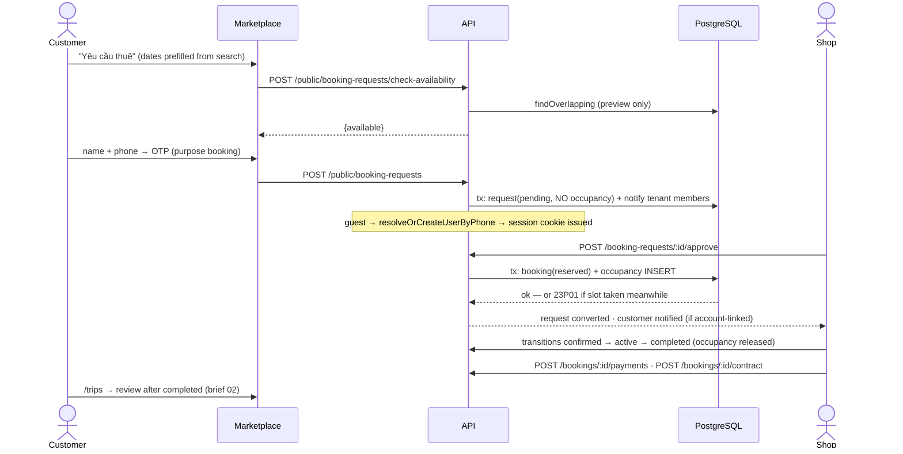
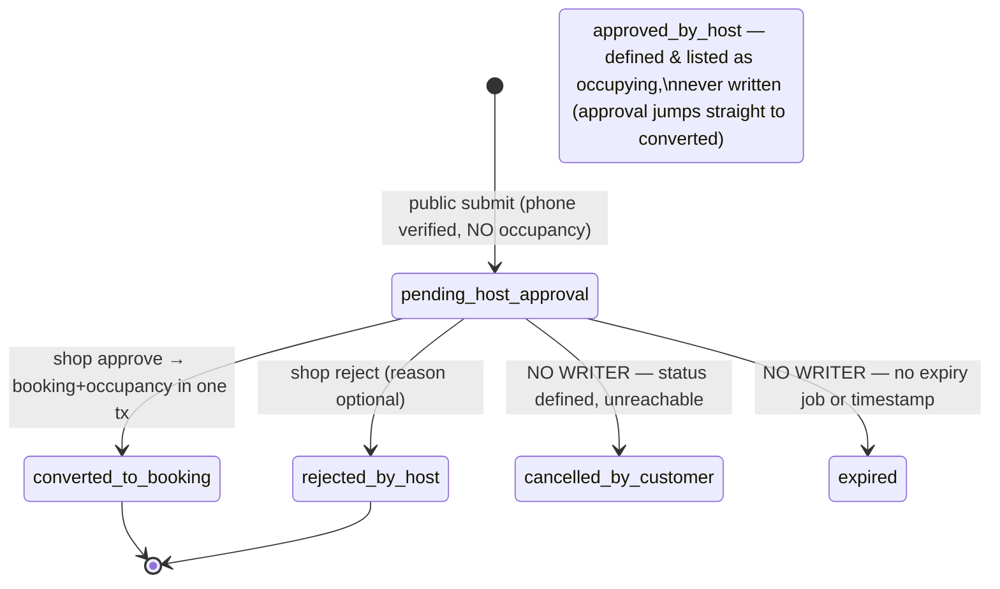
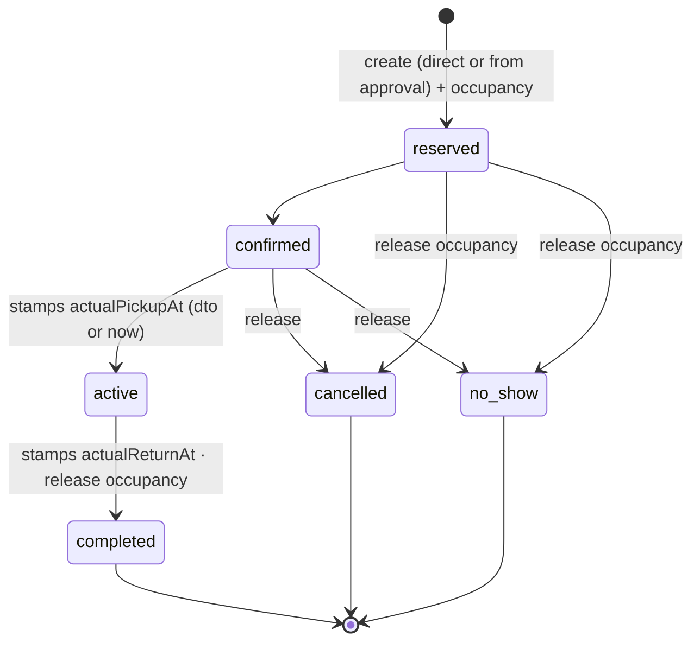
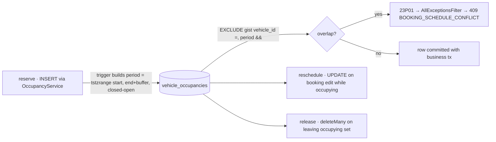

# 05 — Rental Operations

> **Type:** Module design brief (heaviest domain) · **Created:** 2026-08-04 · **Status:** Draft for product review
> **Owners:** Principal Software Architect · Senior Product Manager · Senior Business Analyst · UX Architect
> **Written to:** [`_DESIGN_BRIEF_STANDARD.md`](_DESIGN_BRIEF_STANDARD.md) · **Inherits:** [`00_CROSS_CUTTING_SYSTEM_UX.md`](00_CROSS_CUTTING_SYSTEM_UX.md) · **Adjacent:** [`01`](01_CUSTOMER_MARKETPLACE.md) (entry), [`02`](02_CUSTOMER_ACCOUNT_AND_ENGAGEMENT.md) (customer's view of trips), [`04`](04_FLEET_MANAGEMENT.md) (vehicle availability)
> **Authoritative sources:** source, migrations, tests, [ADR 0005](../decisions/0005-status-enums.md), [ADR 0006](../decisions/0006-booking-concurrency.md).
>
> **Reading contract:** *Confirmed* = exists today. `[RECOMMENDED — NOT CURRENT]` = does not exist. No evidence = `Unknown`.
>
> **Authority statement (per task):** double-booking is prevented by the PostgreSQL exclusion constraint `vehicle_occupancies_no_overlap` (`EXCLUDE USING gist ("vehicle_id" WITH =, "period" WITH &&)`), created in migration [`20260722000000_init`](../../prisma/migrations/20260722000000_init/migration.sql). Every mention of `check-conflict` / `check-availability` in this brief describes a **non-authoritative UX preview** whose result can be stale the moment it returns. This is stated in the constraint's own migration comment, in `OccupancyService`'s docblock, and in ADR 0006 — and it is the reason no service in this module performs SELECT-then-INSERT.
>
> **Accepted target addendum — 2026-08-11, NOT CURRENT:** Rental requests/bookings must snapshot deposit, one-way tiered delivery fee or manual quote, overtime and rental-only discount. Confirmed return KM flows through handover into the vehicle odometer and maintenance reminders. See [`docs/design/12_VEHICLE_360_MANAGEMENT.md`](../design/12_VEHICLE_360_MANAGEMENT.md). This does not assert current implementation.
>
> **Accepted Wave 10 simplification — 2026-08-13, NOT CURRENT:** The owner-facing handover/return happy path is two confirmations, not a mandatory settlement wizard. Odometer, condition/photos, notes and surcharges are optional advanced tasks; fuel and fuel surcharge are removed. Return completion never waits for deposit transfer or OTP. A received deposit defaults to a full-refund proposal when there are no recorded surcharges; the owner refunds outside XePrime and manually marks the record as refunded. [`14_SIMPLIFIED_HANDOVER_AND_RETURN.md`](../design/14_SIMPLIFIED_HANDOVER_AND_RETURN.md) is authoritative over older target wording but does not rewrite the historical current-code analysis below.

---

## 1. Executive summary

Rental operations is the revenue path: a marketplace request becomes a booking, the booking occupies a vehicle's calendar, money is collected against it, and a contract freezes the deal. The concurrency core is the strongest engineering in the product — one occupancy writer, constraint-decided correctness proven by a concurrent test (`Promise.allSettled` race in `occupancy-conflict.spec.ts`), request approval converting to a booking atomically, and a transition table (`BOOKING_STATUS_TRANSITIONS`) that releases the calendar exactly when a booking stops occupying it.

The gaps are almost all at the workflow's *edges*, and four define the product conversation:

1. **Two of six request statuses have no writer.** `cancelled_by_customer` and `expired` exist with labels; no endpoint sets either. A customer cannot withdraw a request, and a shop that never answers leaves it `pending_host_approval` forever — the inbox accumulates zombie requests and the customer waits indefinitely (brief 02 already records that they may wait *silently* if they were a guest).
2. **Approving a request copies people and dates but no money.** `approve()` passes vehicle/customer/times to `createWithinTx`; `baseAmount`/`deliveryFee`/`discountAmount`/`depositAmount` all default to `'0'`. Every marketplace-originated booking is born with `totalAmount = 0`, and the price the customer saw on the listing is discarded. The shop must edit the booking afterwards to make it financially real — nothing prompts them to.
3. **The calendar renders but does not act.** Drag/resize code paths exist (`DragMode`, `handleCellClick`) but the file's own TODO says click-to-create, event detail and drag/resize remain unfinished — the operational hub is read-only in practice.
4. **`bufferMinutes` is plumbing without a source.** The trigger adds it into the exclusion `period`, `ReserveInput` accepts it, the schema comments say "lấy từ tenant_settings" — and a census shows **no caller ever passes it and no tenant_settings source exists**. Every reservation is buffer 0; back-to-back rentals at the same minute are legal by the half-open `[)` range.

One correction to the shared vocabulary: `BOOKING_DATE_FIELD` (created for date-basis filtering) is consumed only by platform admin bookings; the shop's own list filters by `returnAt` range hard-coded, and its filter hook doesn't put the range in the URL.

---

## 1b. Subject status table

Per `_DESIGN_BRIEF_STANDARD.md` §R4. Evidence for each row is in the section cited.

| # | Subject | Status | See |
|---|---|---|---|
| 1 | Public booking-request creation | Implemented | §5, §7.1 |
| 2 | Guest/passwordless request | Implemented | §4, brief 02 |
| 3 | Phone-verification gate | Implemented | §7.1, §8 |
| 4 | Availability preview | Implemented (non-authoritative by design) | §0 authority statement, §7.1 |
| 5 | Duplicate request protection | Implemented (partial unique index) | §5 |
| 6 | Shop request inbox | Implemented | §7.2 |
| 7 | Request detail | **Partially implemented** — endpoint exists; no dedicated surface beyond the row | §7.2 |
| 8 | Request approval → booking conversion | Implemented (atomic) — **carries no money** | §1.2, §5 |
| 9 | Request rejection | Implemented — reason accepted by API, collected nowhere in UI | §7.2 |
| 10 | Customer request cancellation | **Referenced but not implemented** — status defined, no writer | §5 |
| 11 | Request expiry | **Referenced but not implemented** — status defined, no writer, no job | §5 |
| 12 | Direct booking creation | Implemented | §7.3 |
| 13 | Booking list / search / filter / sort / pagination | Implemented (URL, server-side; `returnFrom/To` not URL-wired) | §7.4 |
| 14 | Booking detail | **Partially implemented** — drawer only, no URL | §7.5 |
| 15 | Booking edit (incl. reschedule) | Implemented | §6, §7.3 |
| 16 | Booking state transitions | Implemented (table-validated) | §6 |
| 17 | Booking cancellation | **Partially implemented** — transition exists; no reason capture; impossible from `active`; `bookings.cancel` guards nothing | §3, §6 |
| 18 | Pickup/drop-off times (planned + actual) | Implemented | §6 |
| 19 | Customer/contact info on bookings | Implemented (name + optional phone) | §7.3 |
| 20 | Vehicle assignment | Implemented — select capped at 100 | §7.3 |
| 21 | Pricing totals | Implemented — server-computed; no discount>base guard | §8, edge 14 |
| 22 | Paid amount | Implemented — single writer (`PaymentsService`) | §7.8 |
| 23 | Notes | **Partially implemented** — booking note yes; request note in DTO, not collected | §7.1, §7.3 |
| 24 | Occupancy | Implemented — sole writer, in-tx | §6 |
| 25 | Conflict prevention | Implemented — **exclusion constraint is authoritative** | §0, §6 |
| 26 | Calendar resources / events / toolbar | Implemented | §7.6 |
| 27 | Calendar interactions (create/detail/drag) | **Placeholder** — code scaffolded, TODO-marked, commits nothing | §7.6 |
| 28 | Contract creation / detail / printing | Implemented (idempotent, snapshot, print CSS) | §7.7 |
| 29 | Contract signing / file (`fileUrl`, `signedAt`) | **Referenced but not implemented** | §7.7 |
| 30 | Buffer minutes | **Referenced but not implemented** — in trigger and DTO, zero callers, no source | §1.4 |
| 31 | Rental notifications | **Partially implemented** — full internal coverage; customer only on request decisions, guests never | §7.9 |
| 32 | Relationship to payments/debt | Implemented (boundary) | §7.8 |

---

## 2. Business goals

Derived from the implementation (no PRD exists):

| # | Goal | Evidence |
|---|---|---|
| G1 | A double-booked vehicle is impossible, not unlikely | Exclusion constraint; no SELECT-then-INSERT anywhere; concurrent race test |
| G2 | Marketplace demand converts without obligating either side early | Pending requests don't occupy (`BOOKING_REQUEST_STATUS_OCCUPYING = [approved_by_host]` — and in practice approval jumps straight to `converted_to_booking`); multiple customers may request the same slot |
| G3 | Shops can run walk-in business without the marketplace | Direct booking creation with full pricing fields |
| G4 | Every calendar-affecting action is one transaction | `createWithinTx` shared by both creation paths; release-on-transition; reschedule-on-edit |
| G5 | The money on a booking is traceable and never denormalized wrong | `paidAmount` written only by `PaymentsService`; debt computed as `max(0, total − paid)` at read time |
| G6 | The agreed deal survives later edits | Contract snapshot, idempotent per booking, unique `contract_no` per tenant |
| G7 | Operational actions are visible to the rest of the shop | Tenant-member notifications on create/transition (excluding the actor) |

---

## 3. Actors and permissions

| Actor | Capability | Permission / enforcement |
|---|---|---|
| Visitor/customer | Check availability (boolean only), submit request with verified phone | `@Public()` endpoints; `assertPhoneVerifiedForBooking`; vehicle must be `approved_public` of an `active` tenant, tenantId derived server-side from the vehicle |
| `shop_owner`/`shop_manager` | Full request inbox + approve/reject; booking CRUD + transitions; calendar; contracts | `booking_requests.view/.approve`, `bookings.view/.create/.update/.cancel`, `calendar.view`, `contracts.manage` |
| `shop_staff` | View requests/bookings/calendar; create/update bookings; **no approve, no cancel, no contracts** | rbac defaults ([`02_USER_ROLES.md`](../project/02_USER_ROLES.md)) |
| `shop_viewer` | Read-only everywhere | `.view` keys |
| Platform | Read-only cross-tenant booking monitor; **no mutation endpoint exists** | brief 00 §6; `platform-bookings` |
| Customer post-booking | Sees the trip via `/reviews/my-trips` only | brief 02 §9 |

`bookings.cancel` exists as a permission; cancellation is implemented as a *transition* guarded by `bookings.update` on `POST /bookings/:id/transition` — whether `.cancel` should guard that handler is `Unknown` (currently it guards nothing; same pattern as `vehicles.block_schedule` in brief 04).

---

## 4. End-to-end journey

---

## 5. Request lifecycle

**Confirmed:** decisions are once-only (`loadPending` rejects non-pending with `INVALID_STATUS_TRANSITION` "Yêu cầu này đã được xử lý"); `decidedBy`/`decidedAt` recorded; approval and rejection audit within the tx; the customer notification fires only when `customerUserId` is set (guest silence — brief 02 N-2). Duplicate protection is a **partial unique index** on (vehicle, phone, pickup, return) for pending rows — P2002 is translated to a friendly 409 ("Bạn vừa gửi một yêu cầu giống hệt…").

**Confirmed non-behaviour:** `approved_by_host` is dead vocabulary (defined, marked occupying, never written — the tx goes `pending → converted` in one step). No request TTL, no reminder to the shop, no withdrawal path for the customer.

---

## 6. Booking lifecycle

**Confirmed:** transitions validated by `canTransitionBooking` (table above is the exact `BOOKING_STATUS_TRANSITIONS`); same-status and invalid moves → 409 naming both states; occupying set = `reserved/confirmed/active`, and `release` fires exactly when the target leaves that set. `active` is terminal-except-completed — an in-progress rental cannot be cancelled through the API. All transitions audited and broadcast to other tenant members. Terminal states have no exits: a mistaken cancellation is irrecoverable (a new booking must be created; the code sequence `DH{ULID-slice}` makes re-linking to the original request impossible since `bookingId` on the request is already set).

### Occupancy lifecycle (authoritative layer)

**Confirmed details worth product attention:** `@@unique([sourceType, sourceId])` gives one row per booking; `deleteMany` on release makes releasing a never-occupying booking a no-op by design; the range is half-open so return-at-10:00 + pickup-at-10:00 do **not** collide; `bufferMinutes` participates in the constraint but is always 0 (§1.4); `btree_gist` extension enables the composite index. The race test proves: sequential conflict → 409, concurrent `Promise.allSettled` → exactly one winner, adjacent `[)` ranges → both succeed.

---

## 7. Current features, forms and tables

### 7.1 Public request creation — `RequestBookingFlow`

Confirmed four-step state machine `dates → contact → otp → done`, in a `RequestBookingModal` (bottom-sheet on mobile via `useIsMobile`):

| Step | Behaviour |
|---|---|
| dates | Prefilled from listing/search `pickupAt`/`returnAt`; "continue" runs `checkAvailability`; unavailable → inline "Xe đã có lịch trong khung giờ này. Vui lòng chọn thời gian khác." (stays on step) |
| contact | Name + phone (Yup schema in `booking-requests/schema.ts`); send OTP (purpose `booking`), phone echoed masked |
| otp | 6-digit auto-submit; verify success chains straight into submit; resend honors cooldown; errors inline per step |
| done | Receipt state; guest received a session (passwordless account, brief 02) |

Email and note exist in the DTO (`customerEmail?`, `note?`) — the flow collects **neither** (fields referenced, not surfaced; `Unknown` whether intended).

### 7.2 Shop inbox — `BookingRequestTable`

Status filter + vehicle filter in URL; paginated; row actions **Duyệt** and **Từ chối**, each behind a `Popconfirm` ("Duyệt và tạo đơn thuê?" / "Từ chối yêu cầu này?"). Rejection reason is **optional and the confirm collects none** — the DTO accepts `reason` but the inbox `Popconfirm` provides no input for it (`Unknown` whether a reason field exists elsewhere; none was found in the table). Request *detail* is the table row + endpoint `GET /booking-requests/:id`; no dedicated detail surface beyond the row was found. A 409 from approval (slot taken since) surfaces as the mutation's error toast — the inbox has no dedicated "this slot was just taken" treatment.

### 7.3 Direct booking — `BookingFormDrawer`

Create/edit drawer, RHF + `bookings/schema.ts`: vehicle select (from `useVehicles({limit:100})` — **caps at 100 vehicles**, a real ceiling for large fleets), customer name/phone, service type, `DateTimeField` pair, four money `NumberField`s (base/delivery/discount/deposit), note. Live conflict preview: a `useQuery` on `POST /calendar/check-conflict` fires whenever vehicle+valid range are set; `previewConflict` renders a warning; **on save the server 409 is the decider** and is shown via the `conflict` alert state. Total is computed server-side (`base + delivery − discount`); the drawer shows no computed total before save (`Unknown` if intentional).

### 7.4 Booking list — `BookingTable`

URL filters: `q` (name/code/phone, case-insensitive OR), `status`, `vehicleId`, `sort` (`newest`/`pickup_asc`/`pickup_desc`/`return_asc`); server pagination with tx-consistent count. `returnFrom/returnTo` exist in types/api and serve the **dashboard's** overdue/soon panels — the filter hook does not expose them in the list URL. Columns per `docs/project/05`: customer/phone, vehicle, pickup→return, totals, paid, debt (computed, red when positive), deposit, status chip, actions.

### 7.5 Booking detail — `BookingDetailDrawer`

`Descriptions` of parties/times/money · transition buttons derived from the current status (`Popconfirm` on the destructive branch) · payment block ("Thu tiền (còn nợ …)" opening `RecordPaymentModal`, `PaymentHistory` list; "Đã thu đủ" disabled state via `isZeroMoney`) · contract block (create-or-open, routing to `contractPath.detail`). It is a drawer with no URL — the shareability gap recorded in brief 00 B-list and `docs/design/07` IA-5.

### 7.6 Calendar

`GET /calendar/resources` (vehicles as rows, filtered by `q`/type) + `GET /calendar/events` (occupancies in range, colored by `sourceType` — only `booking` occurs in practice, brief 04). `CalendarToolbar`: search, vehicle-type `Segmented`, range 7/14/30 days, "Hôm nay" — all URL state. `CalendarScheduler`: virtualized rows (designed for 1 000 × 30), sticky resource column, drag/resize *code* present with snapping and min-1-day guard — but the file's TODO confirms click-to-create, event detail and drag/resize are **not finished**; interactions do not commit anything. Mobile behaviour is horizontal scroll of the desktop grid (brief 00 §9.2 E3).

### 7.7 Contracts

`POST /bookings/:id/contract` is **idempotent** — a second call (or a concurrent race, caught via the `bookingId` unique) returns the existing contract unchanged. Snapshot freezes parties (bên A = shop, bên B = customer), vehicle, times, price table, deposit; later booking edits do not touch it. `GET /contracts/:id` renders `ContractDocument` — a pure-snapshot A4 sheet with signature blocks — and printing is `window.print()` with global print CSS hiding everything outside `[data-print-root]`. `contract_no` unique per tenant; `fileUrl`/`signedAt` columns exist with **no workflow** (referenced, not implemented — `docs/project/10`). Contract creation requires `contracts.manage`; viewing requires only `bookings.view`.

### 7.8 Relationship to payments and debt (boundary summary; finance owns the detail)

`paidAmount` is written **only** by `PaymentsService` (record → increment + approved income receipt in one tx; void → decrement). Debt is `bookingDebt(total, paid) = max(0, total − paid)` computed at read time — no stored debt column, so a mis-priced booking (see §1.2) shows debt 0 and never appears in the debts screen.

### 7.9 Notifications generated by rental actions (census-confirmed)

| Action | Type | Recipients |
|---|---|---|
| Public request submitted | `BOOKING_REQUEST_SUBMITTED` | All tenant members |
| Request approved | `BOOKING_REQUEST_APPROVED` | Customer **iff** account-linked |
| Request rejected | `BOOKING_REQUEST_REJECTED` | Customer iff account-linked (reason in body when given) |
| Direct booking created | `BOOKING_CREATED` | Tenant members except actor (`from_request` source deliberately skips it) |
| Any transition | `BOOKING_STATUS_CHANGED` | Tenant members except actor — **never the customer** (brief 02 N-1) |
| Contract / payment actions | none found | — |

---

## 8. Validation

| Layer | Rule |
|---|---|
| Shared | `returnAt > pickupAt` — Yup early-warning + `assertRange` server-side (the Yup comment itself says the constraint is the real rule) |
| Request DTO | Phone format; verified-phone proof; vehicle bookable (`approved_public` + tenant `active`) |
| Booking DTO | Money as string decimals; status via `@IsIn`; unknown fields rejected by the global pipe |
| Transition | `canTransitionBooking` table only — client-proposed status is otherwise untrusted |
| Duplicate request | Partial unique index (DB), P2002 → 409 |
| Overlap | **Exclusion constraint only** — 23P01 → `BOOKING_SCHEDULE_CONFLICT` 409 |

No validation exists for: pickup in the past (a booking can be created retroactively — `Unknown` if intended for walk-in backfill), maximum rental duration, or price sanity (negative totals are prevented by Decimal math only insofar as discount ≤ base is *not* checked — a discount larger than base yields a **negative totalAmount**, confirmed by reading the arithmetic; no guard exists).

---

## 9. States (loading/empty/error/success) and conflict UX

| Surface | L | E | Err | S |
|---|---|---|---|---|
| Request flow | Per-step pending; buttons guarded by `submitting` | — | Inline per-step alert (incl. availability miss, OTP errors) | done step |
| Inbox | Spinner | Empty | Alert | Row updates; approve toast |
| Booking list | Spinner | Empty | Alert | — |
| Form drawer | Button loading | — | Conflict alert (preview and server 409) + generic alert | Drawer closes, list refreshes |
| Detail drawer | Spin | — | toast | Status chip updates in place |
| Calendar | Loading; empty (no vehicles); error per `docs/project/05` | — | — | — |
| Contract page | Spin | — | `Result` + retry | Print dialog |

**Conflict and race UX (confirmed):** the preview warns early; the server 409 is always handled as the decider in both the drawer (`conflict` state) and approval (mutation error). What is *missing*: after a 409 neither surface offers the nearest free slot or a jump to that vehicle's calendar — the user is told "no" without "when". No optimistic updates exist anywhere in this module — correct per brief 00 P4/design principle 7.

---

## 10. Responsive, accessibility, security and tenant isolation

**Responsive (confirmed):** request flow is the product's best mobile pattern (bottom-sheet, stepper, safe-area — per `guest-booking-passwordless.md`); booking drawers are desktop drawers with no mobile page variant; the calendar horizontally scrolls on mobile; tables overflow rather than convert to cards. Tablet rules: none (`Unknown`, repo-wide).

**Accessibility (confirmed):** forms use labelled RHF wrappers; OTP input uses `one-time-code`; `Popconfirm` keyboard behaviour `Unknown`; the calendar's virtualized grid has **no screen-reader semantics** (`docs/project/09` A11y-5 lists it as unknown/unaddressed); status conveyed as chip+text.

**Security and tenant isolation (confirmed):** every shop endpoint `@TenantScoped` with per-handler permissions; `tenantId` never accepted from the client — public submission derives it from the vehicle; cross-tenant reads are impossible via the `tenantId` in every where-clause; the availability preview returns **only a boolean**, deliberately not leaking whose booking occupies the slot; platform monitoring is read-only with masked PII and audited reveal (brief 00 §17.2); all mutating rental actions audit within their tx. `customerEmail`/`customerPhone` on requests are stored raw as typed (the platform-side lookup handles both phone shapes — roadmap §F).

---

## 11. Edge cases (confirmed handling)

| # | Case | Handling |
|---|---|---|
| 1 | Two shops-side saves race for one slot | Constraint: one commits, one 409 (`occupancy-conflict.spec.ts` concurrent case) |
| 2 | Approval races an intervening direct booking | Same — approval's tx rolls back entirely; request stays pending |
| 3 | Back-to-back rentals sharing a boundary minute | Legal — `[)` half-open range (tested) |
| 4 | Same customer double-submits the identical request | Partial unique index → friendly 409 |
| 5 | Two different customers request the same slot | Both accepted (pending doesn't occupy); first approval wins the constraint |
| 6 | Approve/reject an already-decided request | 409 "Yêu cầu này đã được xử lý" |
| 7 | Edit dates on an occupying booking | `reschedule` in tx; constraint re-checks; non-occupying bookings skip the reschedule |
| 8 | Cancel a booking that never occupied | `release` is `deleteMany` — safe no-op |
| 9 | Cancel an `active` rental | **Impossible** via the transition table — only `completed` exits `active` |
| 10 | Transition to the same status | 409 |
| 11 | Guest submits, then the shop decides | No notification of either outcome (guard on `customerUserId`) |
| 12 | Vehicle soft-deleted with future bookings | Blocked at the vehicle side (brief 04 edge 9) |
| 13 | Marketplace hides/unpublishes the vehicle mid-request | Request survives (no check at approval on `publicStatus`) — approval only re-fights the calendar, `Unknown` whether approving for a now-hidden vehicle is intended |
| 14 | Discount > base | Negative `totalAmount` — **no guard** |
| 15 | Pickup in the past | Accepted — no guard |
| 16 | Contract created twice / concurrently | Idempotent; unique race caught and the winner's row returned |
| 17 | Booking edited after contract exists | Snapshot unchanged by design; nothing warns that the printed deal now differs |
| 18 | Fleet > 100 vehicles | Booking form's vehicle select silently truncates |

---

## 12. Existing UX problems

| ID | Problem |
|---|---|
| R-1 | Zero-money conversions: approval creates `total = 0` bookings with no prompt to price them (invisible in debts thereafter) |
| R-2 | No customer withdrawal and no expiry → immortal pending requests |
| R-3 | Rejection reason accepted by the API, collected nowhere in the inbox UI |
| R-4 | 409 responses say "no" without offering an alternative slot or calendar jump |
| R-5 | Calendar is display-only; every change forces a detour through list+drawer |
| R-6 | Booking detail has no URL (drawer-only) |
| R-7 | Cancelled-by-mistake is unrecoverable; no undo, no re-link to the request |
| R-8 | Contract can silently diverge from an edited booking |
| R-9 | Vehicle select caps at 100 |
| R-10 | Email/note fields exist in the request DTO but the flow never collects them |
| R-11 | Customer never notified of transitions incl. completion (brief 02 N-1) |
| R-12 | No same-day operational view ("giao 3, nhận 2 hôm nay") — dashboard gap S-04 in `docs/design/03` |

---

## 13. Missing features

Customer request withdrawal · request expiry/TTL + `expired` writer · request-level price quote/negotiation (the legacy flow's "chủ xe báo giá" step has no data path) · booking cancellation reasons · cancellation fees/refund policy · handover records (km/fuel/photos — `docs/design/03` S-03) · buffer-minutes configuration (tenant_settings) · calendar interactions (create/detail/drag-commit) · blocked-range & maintenance occupancies (brief 04) · booking detail page URL · contract re-issue/versioning, signature and file upload (`fileUrl`/`signedAt` unused) · long-term-rental workflow (`long_term` storable, no behaviour) · multi-vehicle bookings · recurring bookings.

---

## 14. Recommendations

`[RECOMMENDED — NOT CURRENT]`, evidence-ordered:

1. **Carry price into approval** — compute from the listing's day price × duration as a default, editable before approve. Directly closes R-1, and the data (listing price, dates) is already in hand at approval time.
2. **Give requests a lifecycle end**: customer withdrawal endpoint (+ writer for `cancelled_by_customer`) and a TTL sweep writing `expired`; both statuses already have labels and colors waiting.
3. **Collect the rejection reason** in the inbox confirm — one input; the API and notification body already handle it.
4. **On 409, offer the calendar**: link the conflict alert to that vehicle's row/date; later, suggest nearest free ranges via the existing `findOverlapping`.
5. **Finish calendar interactions** in the order the TODO lists: event→detail first (read-only win), then cell→prefilled create (drawer already accepts prefill), drag-commit last (it must route through `PATCH /bookings/:id` so the constraint stays the decider).
6. **Guard the money**: reject `discount > base + delivery` and (product decision pending) past pickups.
7. **Wire `bufferMinutes`** to a real tenant setting or delete the plumbing.
8. **Warn when an edited booking has a stale contract** (compare `updatedAt` to contract `createdAt`).
9. **Give bookings URLs** (`/manage/bookings/[id]`), keeping the drawer as presentation.
10. **Raise or search the vehicle select** past 100.

---

## 15. Out of scope

Payments/receipts/debt internals and finance dashboard (their own brief) · review flow after completion (brief 02) · marketplace listing presentation (brief 01) · vehicle CRUD/publication (brief 04) · platform booking monitor details (covered in 00/04 census) · chat between parties (brief 02) · pricing strategy and seasonal pricing (brief 04 Q5).

---

## 16. Open questions

| # | Question | Blocks |
|---|---|---|
| Q1 | Should approval carry the marketplace price into the booking, and may the shop adjust it before accepting? | R-1; the legacy "báo giá" negotiation step's fate |
| Q2 | May a customer withdraw a pending request? Under what notice? | R-2, `cancelled_by_customer` |
| Q3 | What TTL should requests have, and does expiry notify anyone? | `expired` writer |
| Q4 | Is `approved_by_host` (hold-without-booking) a real intermediate state to build, or dead vocabulary to remove? | §5 |
| Q5 | Can an `active` rental ever be terminated early (dispute, breakdown), and as what status? | Transition table's `active → completed` only |
| Q6 | Should `bookings.cancel` guard the cancel transition (vs `bookings.update` today)? | §3 |
| Q7 | What buffer between rentals do shops actually need, and is it per-tenant or per-vehicle? | §1.4 |
| Q8 | Are past-dated bookings legitimate (walk-in backfill) or an error? | edge 15 |
| Q9 | Should approving a request for a since-hidden/unpublished vehicle be blocked? | edge 13 |
| Q10 | Is contract signing (upload/e-sign, `fileUrl`/`signedAt`) required, and must contracts version on booking edits? | R-8, §7.7 |
| Q11 | Should the customer see booking status changes and pickup details (ties to brief 02 T-2/N-1)? | R-11 |
| Q12 | Is drag-to-reschedule wanted at all on touch devices, or desktop-only (per `docs/design/05` §6 recommendation)? | R-5 |

---

## 17. Acceptance criteria

**Enforced today — regressions are defects:**

| # | Criterion | Verified by |
|---|---|---|
| RO1 | Overlapping occupancy on one vehicle is impossible at the database | `vehicle_occupancies_no_overlap` + `occupancy-conflict.spec.ts` (sequential, concurrent, adjacent cases) |
| RO2 | Every occupancy write goes through `OccupancyService` inside the business tx | Sole-writer pattern; CLAUDE.md §5 |
| RO3 | `check-availability`/`check-conflict` are previews; server 409 is always handled | Service docblocks; drawer + approval error paths |
| RO4 | Pending requests never occupy; approval converts atomically or rolls back entirely | `submitPublic` (no reserve), `approve` tx |
| RO5 | Requests are decided at most once | `loadPending` guard |
| RO6 | Duplicate identical pending requests are rejected by the DB | Partial unique index, P2002→409 |
| RO7 | Transitions follow `BOOKING_STATUS_TRANSITIONS` only; leaving the occupying set releases the calendar | `transition()` + `occupiesSchedule` |
| RO8 | Public submission requires verified phone and derives tenant from the vehicle | `submitPublic` |
| RO9 | `paidAmount` has one writer; debt is computed, never stored | `PaymentsService`, `bookingDebt` |
| RO10 | Contract creation is idempotent per booking with tenant-unique numbering | `contracts.spec.ts`, uniques |
| RO11 | Money crosses as strings; totals computed server-side | ADR 0007, `createWithinTx` |
| RO12 | All rental mutations audit in-tx; tenant notifications exclude the actor | Services above |
| RO13 | List/inbox/calendar state lives in the URL, server-side | Filter hooks (with the noted `returnFrom/To` exception) |

**Proposed `[RECOMMENDED — NOT CURRENT]`:** RO14 no booking is born with zero total from a priced listing · RO15 every defined status has a writer or is removed · RO16 every 409 offers a next step · RO17 destructive transitions collect a reason · RO18 booking detail is addressable by URL · RO19 calendar edits commit through the same constraint-guarded endpoints.

---

## 18. Source references

**Web:** [`features/booking-requests/`](../../apps/web/src/features/booking-requests/) (flow, modal, button, table, schema, filters, mutations) · [`features/bookings/`](../../apps/web/src/features/bookings/) (table, form drawer, detail drawer, schema, filters) · [`features/calendar/`](../../apps/web/src/features/calendar/) (scheduler, toolbar, data/filters hooks, date/position utils + their tests) · [`features/contracts/`](../../apps/web/src/features/contracts/) (`ContractDocument`, hooks) · pages [`booking-requests`](<../../apps/web/src/app/(manage)/manage/booking-requests/page.tsx>), [`bookings`](<../../apps/web/src/app/(manage)/manage/bookings/page.tsx>), [`calendar`](<../../apps/web/src/app/(manage)/manage/calendar/page.tsx>), [`contracts/[id]`](<../../apps/web/src/app/(manage)/manage/contracts/[id]/page.tsx>)

**API:** [`booking-requests.service.ts`](../../apps/api/src/modules/booking-requests/booking-requests.service.ts) · [`public-booking-requests.controller.ts`](../../apps/api/src/modules/booking-requests/public-booking-requests.controller.ts) · [`bookings.service.ts`](../../apps/api/src/modules/bookings/bookings.service.ts) · [`occupancy.service.ts`](../../apps/api/src/modules/calendar/occupancy.service.ts) · [`calendar.controller.ts`](../../apps/api/src/modules/calendar/calendar.controller.ts) · [`contracts.service.ts`](../../apps/api/src/modules/contracts/contracts.service.ts) · DTOs in each module · [`common/money.ts`](../../apps/api/src/common/money.ts) · [`all-exceptions.filter.ts`](../../apps/api/src/common/filters/all-exceptions.filter.ts) (23P01 mapping)

**Types:** [`status/booking.ts`](../../packages/types/src/status/booking.ts) (statuses, transitions, occupying set, `BOOKING_DATE_FIELD`) · [`status/booking-request.ts`](../../packages/types/src/status/booking-request.ts) · [`status/misc.ts`](../../packages/types/src/status/misc.ts) (`OCCUPANCY_SOURCE_TYPE`)

**Data:** [`schema.prisma`](../../prisma/schema.prisma) — `BookingRequest` (unique nullable `bookingId`, decided-by fields), `Booking` (money columns, `@@unique([tenantId, code])`, admin trigram index), `VehicleOccupancy` (tstzrange, `@@unique([sourceType, sourceId])`), `Contract` (`@@unique([bookingId])`, `@@unique([tenantId, contractNo])`, unused `fileUrl`/`signedAt`) · migrations [`20260722000000_init`](../../prisma/migrations/20260722000000_init/migration.sql) (btree_gist, period trigger, **exclusion constraint**), `20260724000000_add_booking_requests` (request table + `booking_id` unique), `20260729160000_add_phone_login` (the partial unique double-submit index, `WHERE "status" = 'pending_host_approval'`), `20260730120000_add_contracts`

**Tests:** [`occupancy-conflict.spec.ts`](../../apps/api/test/occupancy-conflict.spec.ts) · [`contracts.spec.ts`](../../apps/api/test/contracts.spec.ts) · [`platform-bookings.spec.ts`](../../apps/api/test/platform-bookings.spec.ts) · calendar util tests

**ADRs / docs:** [0005](../decisions/0005-status-enums.md) · [0006](../decisions/0006-booking-concurrency.md) · [0007](../decisions/0007-api-type-contract.md) · [`guest-booking-passwordless.md`](../guest-booking-passwordless.md) · `docs/project/04,05,07,08,09,10`

**Verification for this brief:** writer census for all six request statuses (two writers total: approve→`converted_to_booking`, reject→`rejected_by_host`) · `bufferMinutes` caller census (zero callers pass it; no tenant_settings source exists) · `BOOKING_DATE_FIELD` consumer census (platform admin only) · confirmed `approve()` passes no money fields to `createWithinTx` · confirmed no `reason` input in the inbox `Popconfirm`s · confirmed `useVehicles({limit:100})` in the form drawer · confirmed no guard against `discount > base` or past pickup · read of the exclusion-constraint migration in full.
