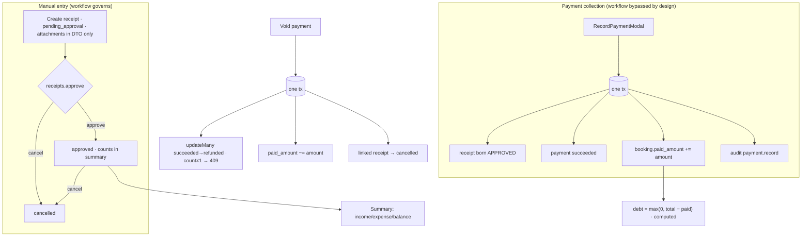

# 06 — Finance Operations

> **Type:** Module design brief · **Created:** 2026-08-04 · **Status:** Draft for product review
> **Owners:** Principal Software Architect · Senior Product Manager · Senior Business Analyst · UX Architect
> **Written to:** [`_DESIGN_BRIEF_STANDARD.md`](_DESIGN_BRIEF_STANDARD.md) · **Inherits:** [`00_CROSS_CUTTING_SYSTEM_UX.md`](00_CROSS_CUTTING_SYSTEM_UX.md) · **Adjacent:** [`05_RENTAL_OPERATIONS.md`](05_RENTAL_OPERATIONS.md) (bookings feed every number here)
> **Authoritative sources:** source, migrations, tests (`finance-receipts.spec.ts`, `payments.spec.ts`, `contracts.spec.ts`), ADRs 0005/0007. `docs/project/` secondary.
>
> **Reading contract:** *Confirmed* = exists. `[RECOMMENDED — NOT CURRENT]` = does not exist. No evidence = `Unknown`.
>
> **Authority statements (per task):**
> 1. **`PaymentsService` is the authoritative — and only — writer of `booking.paid_amount`.** Its docblock says so ("writer DUY NHẤT"), and it writes via DB-level `increment`/`decrement` so two concurrent collections cannot lose an update.
> 2. **Debt is computed, never stored: `max(0, total_amount − paid_amount)`** — `bookingDebt()` in [`common/money.ts`](../../apps/api/src/common/money.ts) for DTOs, and the equivalent `total_amount > paid_amount` predicate in raw SQL for the debts list. There is no debt column and no debt table, by design ("tránh drift").
> 3. **System categories (`is_system`, `tenant_id` null) cannot be renamed or deleted** — `loadOwnEditable` rejects them with a 400; only tenant-owned categories are mutable.
> 4. **Receipt attachments are an incomplete workflow**: the API accepts and stores URL arrays and returns them in detail, but **no upload UI exists in `ReceiptFormDrawer` and no receipt-scoped presign endpoint exists** — nothing in the product can produce a valid attachment URL.
> 5. **Charts and exports are absent.** The finance dashboard is four `Statistic` cards; zero chart code exists in the finance feature, and no CSV/PDF export exists anywhere in the module. The legacy UI's "Xuất CSV" has no counterpart.

---

## 1. Executive summary

Finance is the module that makes XePrime worth paying for monthly (docs/design/02 §7), and its **ledger core is sound**: one writer for paid amounts, computed debt that cannot drift, receipts with a status workflow and per-action audit, void that is race-safe (`updateMany` on `succeeded` → exactly-once refund semantics), and payment collection that creates its approved income receipt in the same transaction so the books and the booking never disagree.

What sits *on top* of that core is minimal, and five findings frame the product conversation:

1. **The dashboard answers "how much" but never "show me"** — four stat cards with a date range, none clickable, no breakdown by category/vehicle/time, no chart, no export. Every number is a dead end (violates docs/design/06 principle 4: money must be traceable *through the UI*, not only through the schema).
2. **The receipt approval workflow has no separation of duties.** `receipts.create` and `receipts.approve` are distinct permissions, but the default role matrix gives owner and manager both — and the API happily lets the same user create and approve their own receipt. Whether maker-checker is a requirement is the module's biggest open question.
3. **Payment-collection receipts skip the workflow by design** (`createApprovedWithinTx` births them `approved`), which is correct for not double-entering money — but it means the "approval workflow" governs only manually-entered receipts, a nuance no UI explains.
4. **Zero-total bookings are invisible to finance** (brief 05 R-1): a marketplace booking born with `totalAmount = 0` has debt 0, never appears in `/manage/debts`, and its collected payments would drive `paidAmount > totalAmount` — debt clamps to 0 and the overpayment is silently absorbed.
5. **The `payments` table is gateway-ready and gateway-less**: `provider`, `providerTransactionId`, `currency`, `subscriptionId`, and a 4-state status vocabulary exist while the only writer creates `succeeded` cash-book entries. `pending`/`failed` have no writer — the online-payment future (docs/design/03 C-01) is pre-plumbed but entirely dormant.

---

## 2. Subject status table (per §R4)

| # | Subject | Status | See |
|---|---|---|---|
| 1 | Finance dashboard | **Partially implemented** — 4 stat cards + date range; no drill-down, charts, or breakdowns | §6.1 |
| 2 | Period selection | Implemented — free `RangePicker` (component state, **not URL**) | §6.1 |
| 3 | Income / Expense / Balance | Implemented — sums of `approved` receipts; balance = income − expense | §6.1 |
| 4 | Booking debt (list + totals) | Implemented — computed via raw SQL, `trim_scale`, sorted by `return_at ASC` | §6.2 |
| 5 | Debt filters | Implemented — `overdue` / `upcoming` (≤3 days) / `unpaid` | §6.2 |
| 6 | Receipt categories (CRUD) | Implemented — tenant categories create/rename/delete | §6.3 |
| 7 | System categories | Implemented — seeded, shared, immutable (authority #3) | §6.3 |
| 8 | Receipt creation | Implemented — born `pending_approval` from the UI | §6.4 |
| 9 | Receipt approval | Implemented — `draft`/`pending_approval` → `approved`, audited | §6.4 |
| 10 | Receipt cancellation | Implemented — from `draft`/`pending_approval`/`approved`, audited; reason optional and **not collected in UI** | §6.4 |
| 11 | Receipt attachments | **Referenced but not implemented (workflow)** — authority #4 | §6.4 |
| 12 | Payment collection | Implemented — modal on booking detail and debt row | §6.5 |
| 13 | Payment history | Implemented — per booking, newest first | §6.5 |
| 14 | Payment methods | Implemented — cash / bank_transfer / qr / card / other | §6.5 |
| 15 | Payment status | **Partially implemented** — vocabulary has 4 states; only `succeeded` and `refunded` have writers | §1.5 |
| 16 | Payment void/refund | Implemented — exactly-once, decrements paid, cancels linked receipt | §6.5 |
| 17 | Booking paid amount | Implemented — single writer, DB increment (authority #1) | §6.5 |
| 18 | Dynamic debt calculation | Implemented (authority #2) | §6.2 |
| 19 | Contract financial snapshot | Implemented — frozen price table/deposit; diverges silently from later edits (brief 05 R-8) | §6.6 |
| 20 | Finance reports | **Referenced but not implemented** — nothing beyond the 4-card summary; build plan lists "Báo cáo" | §7 |
| 21 | Export (CSV/PDF) | **Referenced but not implemented** — legacy UI had "Xuất CSV"; no counterpart (authority #5) | §7 |
| 22 | Charts | **Referenced but not implemented** (authority #5) | §7 |
| 23 | Audit of finance actions | Implemented — create/approve/cancel/record/void all audit in-tx; **amounts appear in audit payloads** | §11 |
| 24 | Online payment gateway | **Referenced but not implemented** — dormant columns (§1.5) | §7 |
| 25 | Receipt→customer link | **Referenced but not implemented** — `tenantCustomerId` column, no relation/model/writer | §12 |

---

## 3. Goals and financial responsibilities

**Confirmed division of responsibility, stated in code:** *"XePrime không cầm tiền: đây là sổ ghi nội bộ của shop"* (`PaymentsService` docblock). The platform records money; it never moves it. Every amount is `Decimal(14,2)` at rest and a **string** on the wire (ADR 0007); the response interceptor converts.

| Goal | Evidence |
|---|---|
| A shop's books cannot disagree with its bookings | Payment + receipt + paid-increment in one tx |
| Collected money is exact under concurrency | DB-level `increment`, race-safe void |
| Debt can never be stale | Computed at read time (authority #2) |
| Manual money entry has a checkpoint | Receipt workflow `pending_approval → approved \| cancelled` |
| Every money action is attributable | requested/approved/cancelled-by columns + audit per action |
| The agreed deal survives edits | Contract snapshot (brief 05 §7.7) |

---

## 4. Roles and permissions

Default grants verified directly against `DEFAULT_TENANT_ROLE_PERMISSIONS` in [`rbac.ts`](../../packages/types/src/rbac.ts):

| Permission | Guards | owner | manager | staff | viewer |
|---|---|---|---|---|---|
| `finance.view` | Summary, debts, receipts list/detail, categories list | ✓ | ✓ | **✗** | ✗ |
| `receipts.create` | Create receipt; tenant-category CRUD | ✓ | ✓ | ✓ | ✗ |
| `receipts.approve` | Approve and cancel receipts | ✓ | ✓ | ✗ | ✗ |
| `payments.record` | Record collection | ✓ | ✓ | ✓ | ✗ |
| `payments.void` | Void/refund | ✓ | ✓ | ✗ | ✗ |
| `contracts.manage` | Create contract | ✓ | ✓ | ✗ | ✗ |
| `bookings.view` | Payment history, contract view | ✓ | ✓ | ✓ | ✓ |

All endpoints `@TenantScoped`; `tenant_id` from membership only.

**Confirmed asymmetry:** `shop_staff` holds `receipts.create` and `payments.record` **without `finance.view`** — staff can create a receipt and collect money (from the booking drawer, which needs only `bookings.view` + `payments.record`) but cannot open `/manage/receipts`, `/manage/debts` or the dashboard to see what they recorded. The write-without-read split may be intentional (cashier model) or an oversight — recorded as Q13.

**Confirmed gap:** no maker-checker — the creator may approve their own receipt (§1.2). Platform roles have no tenant finance access (`finance_admin`'s tenant-scoped `finance.view` is ineffective — brief 00 K5).

---

## 5. Information architecture and workflow

```
/manage/finance    dashboard: RangePicker + 4 Statistic cards
/manage/receipts   ledger: filters → table → detail drawer · category modal · create drawer
/manage/debts      debt list: segment filter → table → RecordPaymentModal
(booking detail drawer, brief 05 §7.5: payment block + history + contract)
/manage/contracts/[id]  printable snapshot
```



**Confirmed subtlety:** cancelling an *approved* receipt via the receipts screen does **not** touch any payment or `paid_amount` — only the void path reverses money. A user who cancels the auto-created collection receipt directly desynchronizes the ledger from the booking (books show less income; booking still shows paid). Nothing prevents or warns about this (edge 6).

---

## 6. Current features

### 6.1 Dashboard (`/manage/finance`)

`RangePicker` (day-granular, free range; **component state, not URL** — deviates from ADR 0004 and every other list) → `GET /finance/summary` → four `Statistic` cards: Tổng thu, Tổng chi, Balance, Còn phải thu (+ debt booking count). Income/expense sum **approved** receipts only, date-filtered on `createdAt`; debt totals are range-independent (always "now"). Colors are hardcoded hex (`#389e0d`, `#cf1322`) — an ADR 0003 token violation. No presets (this month/last month), no comparison, no click-through.

### 6.2 Debts (`/manage/debts`)

Raw-SQL list over bookings where `total_amount > paid_amount`, excluding `cancelled`, ordered `return_at ASC`; `trim_scale(...)::text` keeps money as clean strings. Segment filters: **overdue** (`return_at < now`, not completed/cancelled — note: **completed bookings with debt are excluded from "overdue"** but included in the unfiltered list), **upcoming** (within 3 days — hardcoded window), **unpaid** (`paid_amount = 0`). Row action "Thu tiền" opens `RecordPaymentModal`. Pagination server-side; filter in URL via `use-debt-filters`.

### 6.3 Categories

`CategoryManagerModal` from the receipts page: list (system first, then A-Z), create/rename/delete for tenant-owned only. System categories seeded (roadmap: seed includes finance categories), shared across tenants via `tenant_id NULL`, immutable (authority #3). Deleting a category `SetNull`s its receipts' `categoryId` — history keeps the row, loses the label (`Unknown` whether an "uncategorized" bucket should surface).

### 6.4 Receipts (`/manage/receipts`)

Filters (type, status, category, booking, from/to on `createdAt`) in URL; server pagination; tx-consistent count. `ReceiptFormDrawer`: type, category (filtered by type), amount (`NumberField money min=0`), method, referenceCode, description — **no attachment field, no booking/vehicle linkage fields** (both exist in the DTO; `bookingId`/`vehicleId` are set only by the payment path). Table row actions: Duyệt / Huỷ in `Popconfirm`s — cancellation collects **no reason** though the API accepts one (same gap as brief 05 R-3). Receipt numbers `PT-YYYYMMDD-XXXX` / `PC-...` with ULID suffix — **generated app-side with no uniqueness constraint** (`receiptNo` is not unique in the schema; collision is improbable, not impossible — `Unknown` if acceptable for an accounting document).

### 6.5 Payments

`RecordPaymentModal` (from booking drawer and debt row): shows current debt, collects amount (>0, **no ceiling** — overpayment permitted, see edge 5), method, optional reference/description. Server: authority #1 transaction. `PaymentHistory` lists per-booking payments with method/status chips; void button behind `payments.void` (UI presence in `PaymentHistory` confirmed via `docs/project/06`; `payments.spec.ts` covers record + void semantics). Void: exactly-once flip, decrement, linked-receipt cancel, audit.

### 6.6 Contract financial snapshot

Confirmed in brief 05 §7.7 and re-stated for the finance lens: the snapshot freezes base/delivery/discount/total/deposit at creation; **`paidAmount` is not part of the snapshot** — the printed contract shows the agreed price, not the settlement state; and later booking-price edits do not re-issue it. `CONTRACT_STATUS` has 4 values; only `active` is ever written (`draft`/`signed`/`void` have no writers — same dead-vocabulary pattern as briefs 04/05).

---

## 7. Reports, exports, charts — all absent (authority #5)

Confirmed absent by grep: no chart library or chart code in the finance feature; no CSV/PDF/export endpoint or button anywhere in `apps/web` finance surfaces or `apps/api/src/modules/finance`; no per-category, per-vehicle, or time-series aggregation endpoint beyond the single 4-value summary. The build plan (§10 "dashboard tài chính khớp dữ liệu") is satisfied only in the 4-card sense; the legacy product's per-vehicle revenue/cost cards and CSV export have no counterpart. **Export requirements: not confirmed anywhere** — recorded as a question (Q6), not a requirement.

---

## 8. Forms, validation, dialogs

| Surface | Validation (Yup + class-validator) | Dialog pattern |
|---|---|---|
| Receipt create | type/method from vocabularies; amount required, money string; description ≤? (DTO caps) | Drawer |
| Receipt approve/cancel | Status-gated server-side (`loadFor` allowed-lists) | `Popconfirm` |
| Category create/rename | name required; type from vocabulary | Modal |
| Record payment | amount `moreThan(0)`; method from vocabulary; ref ≤255; note ≤500 | Modal |
| Void payment | none client-side | Confirm (per `docs/project/06`) |

No form warns about consequences that matter: cancelling an approved receipt (ledger desync, edge 6), overpaying (edge 5), or voiding (money reversal confirmed by a plain confirm). Anti-double-submit via mutation `isPending` throughout.

---

## 9. States, responsive, accessibility

**States (confirmed):** dashboard — `Spin` / `Result`+retry / cards; receipts & debts — spinner/empty/error alerts per the repo pattern; modals — button loading, toast on success/error. Money-affecting successes are toasts only (deviates from brief 00 §14 / AC16 — the strongest feedback for "700.000 đ collected" is a vanishing message, though the drawer's debt figure does update in place).

**Responsive:** tables overflow horizontally on mobile (no card conversion); modals have no sheet variant; the dashboard's `Row`/`Col` cards reflow properly. Tablet: no rule (`Unknown`, repo-wide).

**Accessibility:** labelled RHF wrappers throughout; `Statistic` values are plain text (readable); `Popconfirm` keyboard behaviour `Unknown`; no live-region announcements after money actions; color-plus-text chips for statuses (good). Red/green statistic colors are the only encoding of income-vs-expense on the dashboard cards *besides* their labels — acceptable, but the hex hardcoding bypasses the token system.

---

## 10. Financial-data security

**Confirmed:** tenant isolation on every query (scope from membership; raw SQL includes `tenant_id = ${tenantId}` parameterized via `Prisma.sql`); money as strings end-to-end; no client-supplied `paidAmount`/`totalAmount`/`status` — all server-computed or vocabulary-validated; receipts soft-delete only (no hard delete endpoint); platform staff cannot read tenant finance (no platform finance endpoint exists). Banking data risk sits in brief 03 §18 (profile snapshot), not here.

**Findings:** audit payloads include amounts (`after: {amount, method}`) — appropriate for an internal ledger but it means `audit_logs` readers (`platform.audit.view`) can see tenant revenue figures (`Unknown` whether intended); attachment URLs, once the workflow exists, will be public R2 URLs (same exposure as chat, brief 02 §20).

---

## 11. Audit implications

**Confirmed per-action audit, all in-transaction:** `receipt.create`, `receipt.approve`, `receipt.cancel` (reason when given), `payment.record` (amount+method), `payment.void` (amount in `before`). Actor scope `tenant` throughout. Together with the by/at columns on receipts, every đồng has two trails (row lineage + audit log). **Not audited:** category CRUD (create/rename/delete leave no audit) — low stakes but inconsistent; contract creation **is** audited (brief 05). The exactly-once void plus audit makes the reversal history complete; however, since `cancelWithinTx` (void path) bypasses `ReceiptsService.cancel`, the *receipt* cancellation inside a void carries no separate `receipt.cancel` audit — the `payment.void` entry is the sole record (acceptable single-trail, worth stating).

---

## 12. Edge cases

| # | Case | Confirmed handling |
|---|---|---|
| 1 | Two simultaneous collections on one booking | Both succeed; `increment` serializes at the DB — no lost update |
| 2 | Void raced twice | `updateMany(status: succeeded)` count≠1 → 409 "Giao dịch này đã được hoàn trước đó" |
| 3 | Void a payment whose receipt was already cancelled | `cancelWithinTx` filters `status != cancelled` — no-op, decrement still applies |
| 4 | Approve/cancel a receipt in the wrong state | 409 `INVALID_STATUS_TRANSITION` |
| 5 | Collect more than the debt | **Permitted** — no ceiling; `paidAmount` may exceed `totalAmount`; debt clamps to 0; overpayment invisible thereafter |
| 6 | Cancel the auto-created collection receipt directly | **Permitted** — ledger income drops, `paidAmount` unchanged; no warning, no linkage guard |
| 7 | Zero-total booking (brief 05 R-1) with payments | Never in the debts list; payments accepted; overpayment case 5 |
| 8 | Booking soft-deleted with payments | Payments' `bookingId` is `SetNull` on booking delete — orphaned ledger rows keep amounts (`Unknown` intended reporting treatment) |
| 9 | Category deleted under receipts | `SetNull`; rows keep amount, lose label |
| 10 | Receipt-number collision | Possible (no unique); consequence `Unknown` |
| 11 | Summary range spans no receipts | Sums coalesce to 0; cards render `0 đ` |
| 12 | `attachments` posted via API directly | Stored and returned — but unverifiable in any UI |
| 13 | Debt on completed bookings | In the list, excluded from "overdue" segment — a completed unpaid rental hides from the urgency filter |
| 14 | Refund beyond void (partial refund) | **Not possible** — void is all-or-nothing per payment |

---

## 13. Existing UX problems

| ID | Problem |
|---|---|
| F-1 | Dashboard numbers are dead ends — no drill-down from any card to the rows that produced it |
| F-2 | Period selection is component state, not URL (ADR 0004 deviation; not shareable) |
| F-3 | No visual distinction between workflow receipts and auto-approved collection receipts in the ledger |
| F-4 | Cancel-approved-receipt can silently desync books from bookings (edge 6) |
| F-5 | No overpayment guard or warning (edge 5) |
| F-6 | Cancellation reason accepted by API, collected nowhere (twin of brief 05 R-3) |
| F-7 | "Upcoming" debt window hardcoded at 3 days |
| F-8 | Completed-with-debt hides from the overdue segment (edge 13) |
| F-9 | Money success = vanishing toast (brief 00 AC16 deviation) |
| F-10 | Hardcoded hex on statistic colors (ADR 0003) |
| F-11 | Receipt drawer cannot link a receipt to a booking/vehicle though the data model supports it |
| F-12 | No debt-list link from the dashboard's debt card |

---

## 14. Missing features

Reports beyond 4 values (per-category, per-vehicle P&L — legacy had per-vehicle revenue/cost/profit cards — time series) · charts · CSV/PDF export · receipt attachment upload (presign + UI + preview) · deposit lifecycle (deposit is a stored amount with no held/returned workflow; legacy UI had "Cọc đang giữ" and 4 collateral modes) · partial refunds · debt reminders (docs/design/03 S-10) · configurable upcoming-window · maker-checker option · receipt print (print CSS exists only for contracts) · customer-facing payment visibility (customer never sees what they paid — brief 02 T-2) · online gateway atop the dormant columns · invoice for platform subscriptions (separate module, G-02).

---

## 15. Recommendations

`[RECOMMENDED — NOT CURRENT]`, evidence-ordered:

1. **Make every dashboard number a link** to its filtered source list (receipts filtered to the range/type; debts list). Cheapest fix; establishes the traceability principle the schema already honors.
2. **Guard the two ledger-desync paths**: warn (or require `payments.void` instead) when cancelling a collection-linked receipt; warn on overpayment with the excess shown.
3. **Move the dashboard range to the URL** with presets (this/last month) — aligns with ADR 0004 and makes reports shareable.
4. **Complete attachments or remove them**: receipt-scoped presign + upload field + thumbnail in detail; the model, DTO and storage pattern all exist (brief 03 §12's uploader is reusable).
5. **Distinguish auto vs manual receipts** in the ledger (source chip), and consider whether approve/cancel actions should even show on collection receipts.
6. **Collect the cancellation reason** — one input; API and audit already carry it.
7. **Surface uncategorized and orphaned rows** (edges 8–9) in filters so sums remain explainable.
8. **Decide maker-checker** (Q1) before shops grow staff — the permission split already supports it; only role defaults and a same-user check are missing.
9. **Fix the overdue segment** to include completed-with-debt or add an explicit "ended with debt" filter (edge 13).
10. **Per-vehicle P&L as the first real report** — the legacy UI proves demand; `receipts.vehicleId` + bookings provide the data.

---

## 16. Open questions

| # | Question | Blocks |
|---|---|---|
| Q1 | Is maker-checker (creator ≠ approver) required for manual receipts? | §1.2, rec 8 |
| Q2 | May a collection exceed the outstanding debt (tips/deposits-as-payment), and how should the excess be represented? | edge 5 |
| Q3 | Should cancelling a collection-linked receipt be blocked in favor of void? | edge 6, rec 2 |
| Q4 | What deposit lifecycle is required (held/applied/returned; the legacy 4 collateral modes)? | §14 |
| Q5 | Are partial refunds needed? | edge 14 |
| Q6 | Is CSV/PDF export a launch requirement (legacy parity)? | §7 |
| Q7 | Which reports matter first — per-vehicle P&L, per-category, monthly series? | §14 |
| Q8 | Should receipt numbers be DB-unique per tenant (accounting-document integrity)? | edge 10 |
| Q9 | Is 3 days the right "sắp đến hạn" window, and should it be configurable? | F-7 |
| Q10 | Should platform audit readers see tenant revenue amounts in audit payloads? | §10 |
| Q11 | What is the reporting treatment of payments whose booking was deleted (edge 8) and receipts whose category was deleted (edge 9)? | §12 |
| Q12 | Should the customer see their payment history and remaining balance (ties to brief 02 T-2)? | §14 |
| Q13 | Is staff's write-without-read finance access (create receipts and collect payments, but no ledger/debt/dashboard visibility) an intended cashier model or an oversight? | §4 |

---

## 17. Acceptance criteria

**Enforced today — regressions are defects:**

| # | Criterion | Verified by |
|---|---|---|
| FA1 | `booking.paid_amount` is written only by `PaymentsService`, via DB increment/decrement | authority #1; `payments.spec.ts` |
| FA2 | Debt is computed `max(0, total − paid)`; no stored debt column exists | authority #2; `bookingDebt`, raw SQL |
| FA3 | Recording a payment creates its approved income receipt, payment row, increment and audit in one tx | `recordForBooking` |
| FA4 | Void is exactly-once (`succeeded → refunded`), decrements paid, cancels the linked receipt, audits | `voidPayment`; edge 2 |
| FA5 | Receipt transitions are status-gated: approve from draft/pending; cancel from draft/pending/approved | `loadFor`; `finance-receipts.spec.ts` |
| FA6 | System categories cannot be renamed or deleted | authority #3 |
| FA7 | Every receipt/payment mutation audits in its transaction | §11 |
| FA8 | All finance money crosses as strings; summary/debt figures are `trim_scale`d text | ADR 0007 |
| FA9 | Every finance query is tenant-scoped, including raw SQL, parameterized | §10 |
| FA10 | Receipts/debts lists paginate server-side with URL filters | §6.2, §6.4 |
| FA11 | Summary counts only `approved` receipts | §6.1 |

**Proposed `[RECOMMENDED — NOT CURRENT]`:** FA12 every aggregate figure links to its constituent rows · FA13 no ledger action can silently desync receipts from booking paid state · FA14 overpayment is impossible or explicit · FA15 money-affecting success shows the resulting state in place, not only a toast · FA16 receipt numbers are unique per tenant · FA17 attachments are producible, viewable and verifiable in the product · FA18 period selection is shareable URL state.

---

## 18. Source references

**Web:** [`features/finance/`](../../apps/web/src/features/finance/) — `ReceiptTable`, `ReceiptFormDrawer`, `DebtTable`, `CategoryManagerModal`, hooks (`use-finance-summary`, `use-receipts`, `use-receipt-filters`, `use-debts`, `use-debt-filters`, `use-finance-categories`, `use-receipt-mutations`), `schema.ts`, `constants.ts` · [`features/payments/`](../../apps/web/src/features/payments/) — `RecordPaymentModal`, `PaymentHistory`, `schema.ts`, hooks · [`features/contracts/`](../../apps/web/src/features/contracts/) · pages [`finance`](<../../apps/web/src/app/(manage)/manage/finance/page.tsx>), [`receipts`](<../../apps/web/src/app/(manage)/manage/receipts/page.tsx>), [`debts`](<../../apps/web/src/app/(manage)/manage/debts/page.tsx>) · [`lib/money.ts`](../../apps/web/src/lib/money.ts) (`isZeroMoney`, string comparison)

**API:** [`payments.service.ts`](../../apps/api/src/modules/payments/payments.service.ts) · [`receipts.service.ts`](../../apps/api/src/modules/finance/receipts.service.ts) (incl. `createApprovedWithinTx`, `cancelWithinTx`, `genReceiptNo`) · [`finance-overview.service.ts`](../../apps/api/src/modules/finance/finance-overview.service.ts) (raw-SQL debts + summary) · [`finance-categories.service.ts`](../../apps/api/src/modules/finance/finance-categories.service.ts) (`loadOwnEditable`) · controllers + [`finance.dto.ts`](../../apps/api/src/modules/finance/dto/finance.dto.ts) (incl. `attachments` field) · [`contracts.service.ts`](../../apps/api/src/modules/contracts/contracts.service.ts) · [`common/money.ts`](../../apps/api/src/common/money.ts)

**Types:** [`status/finance.ts`](../../packages/types/src/status/finance.ts) (category/receipt types, payment methods/statuses, contract statuses) · [`status/misc.ts`](../../packages/types/src/status/misc.ts) (`RECEIPT_STATUS`) · [`rbac.ts`](../../packages/types/src/rbac.ts) (finance permission grants)

**Data:** [`schema.prisma`](../../prisma/schema.prisma) — `Receipt` (by/at lineage columns, dormant `tenantCustomerId`, non-unique `receiptNo`), `Payment` (dormant gateway columns, `currency` default VND, `SetNull` on booking), `FinanceCategory` (`is_system`, nullable `tenant_id`), `ReceiptAttachment` · migrations `20260729120000_add_finance_receipts`, `20260729140000_add_payments`, `20260730120000_add_contracts`

**Tests:** [`finance-receipts.spec.ts`](../../apps/api/test/finance-receipts.spec.ts) · [`payments.spec.ts`](../../apps/api/test/payments.spec.ts) · [`contracts.spec.ts`](../../apps/api/test/contracts.spec.ts)

**ADRs/docs:** [0003](../decisions/0003-styling-css-modules.md) · [0004](../decisions/0004-client-state.md) · [0005](../decisions/0005-status-enums.md) · [0007](../decisions/0007-api-type-contract.md) · `docs/project/04,05,06,07` · [`completion-roadmap.md`](../completion-roadmap.md) (Phase 6 slices)

**Verification for this brief:** writer census for `PAYMENT_STATUS` (`succeeded` at record, `refunded` at void; `pending`/`failed` none) and `CONTRACT_STATUS` (only `active`) · grep confirming no attachment UI in `ReceiptFormDrawer` and no receipt presign endpoint · grep confirming zero chart code and zero export code in finance surfaces · confirmed `receiptNo` carries no unique constraint · confirmed dashboard range is `useState`, not URL · confirmed hardcoded hex in `finance/page.tsx` · confirmed category CRUD is unaudited · full reads of all three finance services and the payments service.
