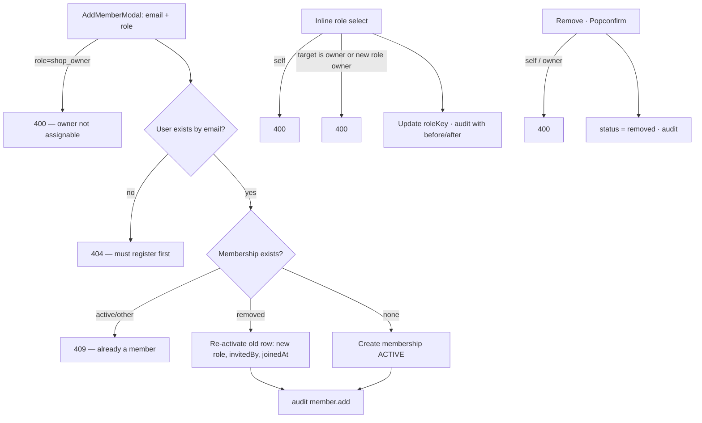

# 07 — Shop Organization and Communication

> **Type:** Module design brief · **Created:** 2026-08-04 · **Status:** Draft for product review
> **Owners:** Principal Software Architect · Senior Product Manager · Senior Business Analyst · UX Architect
> **Written to:** [`_DESIGN_BRIEF_STANDARD.md`](_DESIGN_BRIEF_STANDARD.md) · **Inherits:** [`00_CROSS_CUTTING_SYSTEM_UX.md`](00_CROSS_CUTTING_SYSTEM_UX.md) · **Adjacent:** [`02_CUSTOMER_ACCOUNT_AND_ENGAGEMENT.md`](02_CUSTOMER_ACCOUNT_AND_ENGAGEMENT.md) (the customer half of the same chat), [`03_SHOP_ONBOARDING_AND_SETTINGS.md`](03_SHOP_ONBOARDING_AND_SETTINGS.md) (the tenant these members belong to)
> **Authoritative sources:** source, schema, [ADR 0009](../decisions/0009-chat-firestore-projection.md), worker code. `docs/project/` secondary.
>
> **Reading contract:** *Confirmed* = exists. `[RECOMMENDED — NOT CURRENT]` = does not exist. No evidence = `Unknown`.

---

## 1. Executive summary

This brief covers the shop's *people*: its staff (members and roles), its customers (as a managed asset), and the channels connecting everyone (chat and notifications).

**Member management is complete and carefully guarded** — add-by-existing-email, role change and soft removal, each with owner-protection, self-action bans, re-activation of previously removed members, and per-action audit. The RBAC resolution chain beneath it is more sophisticated than any UI reveals: per-request DB reads, custom-role support with a cross-tenant ownership check, and typed fallbacks used only when seeding is missing.

Five classifications the task demands, stated plainly:

1. **Member management: Implemented** — the full add/change/remove lifecycle with correct restrictions ([`members.service.ts`](../../apps/api/src/modules/members/members.service.ts)).
2. **Shop customer page: Placeholder** — `/manage/customers` renders `PlaceholderPage("Khách hàng")`. The shop has **no view of its own customers** — no history, no debt-per-customer, no notes — although bookings carry every datum needed. (The platform's customer monitor is a different feature for a different actor.)
3. **Custom roles: database support without management UI/API** — `roles` + `role_permissions` model custom tenant roles, `RbacService` resolves them (custom role beats system role, with a tenant-ownership guard against cross-tenant role injection), `TenantMembership.roleId` links them — and **no endpoint or page creates, edits or assigns one**.
4. **Platform-support chat participation: Referenced but not implemented** — `PARTICIPANT_TYPE.PLATFORM_SUPPORT` and `SENDER_TYPE.PLATFORM_SUPPORT` exist in the vocabulary; a writer census finds **zero** code paths that create such a participant or send as one. Conversations are strictly customer↔shop.
5. **Notification delivery channels: production behavior Unknown** — only `in_app` is ever written (brief 02 K2); FCM/email/SMS delivery is absent in code, and the roadmap's real-SMS note applies to OTP, not notifications.

The sharpest UX finding: **shop chat is scoped to the tenant, not to the member** — every active member of a tenant sees *all* of that tenant's conversations (correct for a shared inbox) with **no assignment, no "handled by", and no indication another colleague is already replying**. Combined with read-state being per-side (one member opening a thread zeroes `unreadTenantCount` for the whole shop), a two-staff shop can silently drop a customer because each believed the other had it.

---

## 2. Subject status table (§R4)

| # | Subject | Status | See |
|---|---|---|---|
| 1 | Shop members list | Implemented — search (name/email), role filter, pagination; owner-first ordering | §5.1 |
| 2 | Add member by existing email | Implemented — no invite flow; re-activates removed members | §5.1 |
| 3 | Tenant roles (4 system roles) | Implemented | §4 |
| 4 | Effective permissions | Implemented — DB per request; `GET /rbac/my-permissions` for inspection | §4.2 |
| 5 | Owner restrictions | Implemented — cannot assign/demote/remove owner | §5.1 |
| 6 | Manager/staff/viewer responsibilities | Implemented (defaults) — see matrix | §4.1 |
| 7 | Role change | Implemented — inline select, audited with before/after | §5.1 |
| 8 | Member removal | Implemented — soft (`status = removed`), audited | §5.1 |
| 9 | Self-action restrictions | Implemented — no self role-change, no self-removal | §5.1 |
| 10 | Custom roles | **Referenced but not implemented (management)** — classification #3 | §4.3 |
| 11 | Shop customer management | **Placeholder** — classification #2 | §6 |
| 12 | Shop chat (list/thread/messages) | Implemented — same `ChatView` as customer side, shop-scoped | §7 |
| 13 | Attachments | **Partially implemented** — as brief 02 §11 (server-validated origin, no client validation/preview) | §7 |
| 14 | Unread state | **Partially implemented** — per-side counter; opening = read; shared across all members | §7.2 |
| 15 | Shop notifications | Implemented — bell in `Topbar`, `context="manage"` | §8 |
| 16 | Notification routing (manage) | Implemented — booking/request/tenant/vehicle targets → list pages (never the item) | §8 |
| 17 | Customer communication | **Partially implemented** — chat only; no outbound call/SMS/Zalo affordances (legacy UI had Gọi/Zalo/Nhắn tin buttons) | §7.3 |
| 18 | Platform support participant | **Referenced but not implemented** — classification #4 | §7.4 |
| 19 | Notification channels | `in_app` implemented; others **Unknown in production** — classification #5 | §8 |
| 20 | Tenant invites (token-based) | **Referenced but not implemented** — `tenant_invites` model unused (brief 03 §2.3 #28) | §9 |
| 21 | Member profile-in-tenant | **Referenced but not implemented** — `displayNameInTenant` column, no writer/reader | §9 |

---

## 3. Goals

| # | Goal | Evidence |
|---|---|---|
| G1 | A shop can be run by a team, not just its owner | Membership + role split; manager holds near-full operations |
| G2 | The owner can never be locked out of their own shop | Owner cannot be demoted/removed by any API path |
| G3 | Authority changes take effect immediately | Permissions read from DB per request (ADR 0002 §1) |
| G4 | Staff churn does not corrupt history | Soft removal; re-add reuses the row; audit trail with before/after |
| G5 | Customer conversations belong to the shop, not to an individual account | Tenant-scoped conversation access via membership |
| G6 | Internal awareness without spam | Tenant-member notifications exclude the actor |

---

## 4. Roles and permissions matrix

### 4.1 Default matrix (verified against `DEFAULT_TENANT_ROLE_PERMISSIONS`)

| Capability | owner | manager | staff | viewer |
|---|---|---|---|---|
| Tenant view | ✓ | ✓ | ✓ | ✓ |
| Tenant update / submit review | ✓ | ✗ | ✗ | ✗ |
| Members view / invite | ✓ | ✓ | ✗ | ✗ |
| Members update-role / remove | ✓ | ✗ | ✗ | ✗ |
| Vehicles view | ✓ | ✓ | ✓ | ✓ |
| Vehicles create/update/publish/block | ✓ | ✓ | ✗ | ✗ |
| Vehicles delete | ✓ | ✗ | ✗ | ✗ |
| Requests view | ✓ | ✓ | ✓ | ✓ |
| Requests approve | ✓ | ✓ | ✗ | ✗ |
| Bookings view / create / update | ✓ | ✓ | ✓ | view only |
| Bookings cancel | ✓ | ✓ | ✗ | ✗ |
| Calendar view | ✓ | ✓ | ✓ | ✓ |
| Finance view | ✓ | ✓ | ✗ | ✗ |
| Receipts create / Payments record | ✓ | ✓ | ✓ | ✗ |
| Receipts approve / Payments void / Contracts manage | ✓ | ✓ | ✗ | ✗ |
| Chat (shop side) | ✓ any active member | ✓ | ✓ | ✓ |

Notes confirmed elsewhere: manager cannot edit the tenant profile or submit it for review (brief 03 Q12); staff's finance write-without-read asymmetry (brief 06 Q13); **chat has no permission key at all** — access is membership-only, so even `shop_viewer` can read *and send* in every shop conversation (`Unknown` whether viewer-sends is intended — Q6).

### 4.2 Effective-permission resolution (confirmed)

`TenantScopeGuard` → `RbacService.permissionsForTenantMember(roleKey, roleId, tenantId)`:

1. If a `roleId` (custom role) is set, verify the role **belongs to this tenant** (`tenantId` + `scope=tenant` filter — the comment names cross-tenant role injection as the attack this blocks); use its permission keys if non-empty.
2. Else resolve the system role row (`tenantId: null`, by key) and use its DB-recorded permissions.
3. Else fall back to the typed defaults — the comment marks this branch as "seed thiếu" territory, not normal production behavior.

`GET /rbac/my-permissions` exposes the effective set for inspection. `/auth/me` returns the deduplicated union across scopes (brief 00 K4 — the client cannot tell which scope granted a key).

### 4.3 Custom roles — classification #3

**Confirmed present:** `Role` (scope, nullable `tenantId`, `isSystem` guard comment, `@@unique([scope, tenantId, key])`), `RolePermission` join, `TenantMembership.roleId`, and the full resolution path above.
**Confirmed absent:** any endpoint or page to create/edit/assign a custom role; `AddMemberDto`/`UpdateMemberRoleDto` accept only the four system `roleKey`s. Production usage is therefore `Unknown` (brief 00 Q6) — the capability is reachable only by direct DB writes.

---

## 5. Member workflow



### 5.1 Confirmed surface (`/manage/members`)

Search input (name/email, contains-insensitive) + role `Select` filter + paginated `Table`; owner row pinned first by ordering. Role change is an **inline `Select` per row** (disabled for the owner row and implicitly for self via the API); removal is a `Popconfirm`d button hidden for owner and self. `AddMemberModal`: email + role (options exclude owner), local Yup schema. Errors from the API (404 no account, 409 already member) surface via `getErrorMessage`.

**Deviation confirmed:** member filters are `useState`, **not URL** — the same ADR 0004 deviation as trips (brief 02 K4) and the finance dashboard (brief 06 F-2). List state is unshareable and lost on refresh.

**Guard-rails confirmed server-side (UI mirrors them):** owner unassignable/undemotable/unremovable · no self role-change · no self-removal · removed-member re-add reuses the unique `[tenantId, userId]` row. Every mutation audits with actor, target and role before/after.

**Inline role change has no confirmation** — one misclick on the select commits a permission change instantly (contrast: removal confirms). Recorded as problem P-3.

---

## 6. Shop customer management — classification #2

**Placeholder.** `/manage/customers` renders `PlaceholderPage("Khách hàng")` — "Chưa có dữ liệu", no return path. The nav entry carries `comingSoon` and, notably, `permission: BOOKING_VIEW` (a borrowed key — no customer permission exists).

**What the data already supports** (confirmed available in `bookings`/`booking_requests`): per-phone rental history, totals, computed debt per customer, no-show history, linked `customerUserId` when the request carried an account. The roadmap explicitly distinguishes this page from the platform's customer monitor and defers it ("shop cần danh sách khách RIÊNG của mình"). `Receipt.tenantCustomerId` (brief 06 §12) suggests a planned `tenant_customers` entity that has no model. Requirements — dedupe rule (phone?), notes, blacklist, cross-shop privacy boundaries — are all `Unknown` (Q1).

---

## 7. Communication workflow

### 7.1 Shop chat (confirmed)

Same `ChatView` as the customer side (`/manage/chat?c=`), differing only by scope: `listConversations` returns rows where `customerUserId = me` **or** `tenantId ∈ my active memberships`, and side resolution labels the shop side per row. The thread, composer, attachments, cursor history, realtime-or-poll refresh, and mark-read mechanics are exactly brief 02 §11 — including its defects (no 401 branch, open-marks-read, single-file unvalidated attachments, page-1-only list).

```mermaid
sequenceDiagram
  actor Cu as Customer
  participant DB as PostgreSQL (source of truth)
  participant W as Worker (outbox pump)
  participant FS as Firestore (projection)
  actor S1 as Staff A
  actor S2 as Staff B
  Cu->>DB: message → unreadTenantCount +1 · outbox row
  W->>DB: claim pending (advisory lock, oldest first)
  W->>FS: project last ~30 messages (idempotent overwrite)
  W-->>DB: fail → attempts+1, backoff nextAttemptAt; ≥MAX → FAILED
  FS-->>S1: onSnapshot → REST refetch (or 4s poll without Firestore)
  S1->>DB: opens thread → unreadTenantCount = 0
  Note over S2: sees conversation as read — no signal that A merely opened it
```

Worker behavior confirmed from `outbox-pump.ts`: advisory-lock claim, idempotent overwrite ("đẩy lại chỉ ghi đè, không nhân đôi"), exponential backoff, permanent `FAILED` after `MAX_ATTEMPTS` (ADR 0009). A `FAILED` outbox row silently degrades that conversation's realtime signal; no alerting surface exists (`Unknown` operational treatment — Q8).

### 7.2 The shared-inbox problem (confirmed mechanics)

`unreadTenantCount` is **one counter for the whole shop side**; `markRead` zeroes it for whichever member opens the thread; `ConversationParticipant` rows exist only for the customer (the code comments: shop side accesses via membership, no participant rows). Therefore: no per-member read state, no assignment, no "colleague is typing/handling", no distinction between "we answered" and "someone looked". For a single-operator shop this is fine; at two or more staff it invites dropped conversations (§1 finding). `Conversation.status`/`archivedAt` remain reachable-nowhere (brief 02 K11) — a shop cannot even close a resolved thread.

### 7.3 Customer communication beyond chat

**Partially implemented.** Chat is the only in-product channel. Booking/request rows show `customerPhone`, and the legacy UI offered **Gọi / Zalo / Nhắn tin** per request — the new inbox has no `tel:`/Zalo affordances (brief 01's shop page has a `tel:` link; the portal side does not). No outbound notification to customers from shop actions beyond the two request decisions (brief 02 §12).

### 7.4 Platform support participant — classification #4

Vocabulary complete (`PARTICIPANT_TYPE.PLATFORM_SUPPORT`, `SENDER_TYPE.PLATFORM_SUPPORT`); writer census across `apps/api` and `apps/web` finds zero uses outside the type file. No endpoint adds a support participant, no UI exists, and support-ticket work is explicitly deferred (roadmap §11.1 remainder). The concept is design-ready and wholly dormant.

---

## 8. Notifications (shop side)

**Confirmed.** Same `NotificationBell` with `context="manage"` in the portal `Topbar`. Manage-context routing: `booking → /manage/bookings`, `booking_request → /manage/booking-requests`, `tenant → /manage/shop`, `vehicle → /manage/vehicles`, else null — **always the list, never the item**, though `targetId` is stored (mirror of brief 02 N-3). Events reaching shop members: request submitted, booking created (excl. actor), status changed (excl. actor), review received, shop/vehicle approved-or-rejected (owner only — brief 03 AP-2). Silent: revision requests, suspension (brief 03), payments/contracts (brief 06).

**Channels — classification #5:** `Notification.channel` defaults `in_app` and no other value is ever written; no FCM/email/SMS sender exists in `apps/api` or `apps/worker`. Production delivery beyond in-app is therefore **Unknown/absent**; a shop that closes the tab is unreachable. The 60-second badge poll bounds notification latency; the separate chat badge polls at 8/30s (brief 02 K8).

---

## 9. IA, forms, tables, states, responsive, accessibility (condensed per repo patterns)

**IA:** `/manage/members` (Cài đặt group) · `/manage/chat` (nav; docs/design/07 IA-3 proposes moving it to the topbar) · `/manage/customers` (placeholder in nav — trần-IA violation IA-4).
**Forms:** AddMemberModal (email+role, Yup local — one of the few schemas not in `@xeprime/validators`); composer (brief 02 §14).
**Tables/lists:** members table (avatar, name/email, role select, status tag, joined, remove); conversation list (brief 02 §15 — page 1 only).
**States:** members — `Result`+retry on error, `Empty`, `isFetching` indicator, per-row `loading` on remove; chat states per brief 02 §17 including its bare-text errors.
**Responsive:** members table overflows on mobile (no card conversion); chat collapses master/detail; no tablet rules (repo-wide).
**Accessibility:** labelled fields via wrappers; inline role `Select` rows lack per-row accessible labels naming the member (`Unknown` from static review — the select's accessible name is the current value only); `Popconfirm` keyboard behavior `Unknown`; no live regions.

---

## 10. Privacy and tenant isolation

**Confirmed:** member emails are visible to anyone with `members.view` (manager+) — internal directory, acceptable; customer identity in chat is display-name only (no phone/email in conversation DTOs); conversation access is participant-or-membership only, with `NOT_FOUND` vs `FORBIDDEN` distinguished (brief 02 §13); all member queries tenant-scoped; the custom-role resolution's tenant-ownership check closes the cross-tenant role hole; audit rows for member actions live in the tenant's audit scope. Removed members lose access on their **next request** (per-request DB reads — no session revocation needed for this case, unlike brief 00 F2's general gap).

---

## 11. Edge cases

| # | Case | Confirmed handling |
|---|---|---|
| 1 | Add email with no account | 404 with registration guidance (no invite fallback) |
| 2 | Add an existing active member | 409 |
| 3 | Re-add a removed member | Old row re-activated with new role/joinedAt |
| 4 | Assign/demote/remove owner | 400 in all three paths |
| 5 | Self role-change / self-removal | 400 |
| 6 | Removed member's open session | Next request loses tenant scope (per-request reads) |
| 7 | Removed member with open chat tab | Conversation list refetch drops rows; in-flight thread requests turn 403 — rendered as bare error text (brief 02 §21) |
| 8 | Member of shop A opens shop B's conversation | 403 `FORBIDDEN` |
| 9 | Membership pointing at another tenant's custom role | Role ignored; falls through to system role (guarded) |
| 10 | Custom role with zero permissions | Treated as empty → falls through to system role (the `keys.length > 0` check) |
| 11 | Same user is customer of their own shop's conversation | `listConversations` OR-clause matches both; side resolves to `customer` (customerUserId wins) — plausible self-chat, behavior confirmed by the ordering of checks |
| 12 | Two staff answer one customer simultaneously | No mutual visibility; both send; messages interleave |
| 13 | Outbox permanently FAILED | Realtime silently absent for that message; poll still recovers display |
| 14 | Owner wants to leave / transfer ownership | Impossible — no path (brief 03 Q10) |
| 15 | Last manager removed by owner | Allowed — no floor on non-owner roles (owner retains full control, so safe) |

---

## 12. Existing UX problems

| ID | Problem |
|---|---|
| P-1 | Shared inbox with per-side read state: one member's open marks the shop's thread read for everyone |
| P-2 | No conversation assignment/handled-by/close — `status`/`archivedAt` unreachable |
| P-3 | Inline role change commits without confirmation while removal confirms — inverted severity |
| P-4 | Member filters in component state, not URL (ADR 0004 deviation) |
| P-5 | Add-member dead-ends on unregistered emails (no invite path; `tenant_invites` table sits unused) |
| P-6 | Customers page is a navigable placeholder promising an asset the shop cannot see |
| P-7 | Notifications route to lists, never items (manage-side mirror of brief 02 N-3) |
| P-8 | No outbound call/Zalo affordances despite phone data and legacy precedent |
| P-9 | Chat inherits all brief-02 defects on the shop side (401, attachments, page-1 list) |
| P-10 | AddMemberModal schema lives feature-local, not in `@xeprime/validators` (shared-schema convention deviation) |

---

## 13. Missing capabilities

Shop customer CRM (the placeholder) · custom-role management UI/API · token invites for unregistered emails · conversation assignment/close/notes · per-member read state · platform-support join (vocabulary ready) · notification channels beyond in-app · member activity view ("what did this staff do" — audit data exists, tenant-facing UI does not) · ownership transfer · `displayNameInTenant` usage · quick-reply templates · outbound contact links.

---

## 14. Recommendations

`[RECOMMENDED — NOT CURRENT]`, evidence-ordered:

1. **Build the shop customer page from bookings data** — group by normalized phone, show count/total/debt/last rental; zero migration needed for a first version. It is the roadmap's own acknowledged gap and the strongest retention lever (docs/design/03 S-01).
2. **Add "handled-by" to conversations** — even a lightweight `lastSenderType`-based "answered/unanswered" chip in the list would defuse P-1 without schema change; real assignment needs a column.
3. **Confirm inline role changes** (P-3) — one `Popconfirm` aligns severity with removal.
4. **Move member filters to the URL** (P-4).
5. **Expose close/archive** using the existing status vocabulary (P-2).
6. **Decide custom roles** (Q4): ship a minimal management UI over the existing resolution chain, or remove `roleId` plumbing — the current state is unauditable authority (roles only creatable by DB access).
7. **Wire the invite table or drop it** (P-5): token invites solve the unregistered-email dead end and `tenant_invites` already models them.
8. **Route notifications to items** using stored `targetId` (with brief 05 R-9's booking URLs as prerequisite).
9. **Add `tel:`/Zalo links** on request/booking rows (P-8) — pure UI, data present.
10. **Surface outbox health** (edge 13) at least in platform admin.

---

## 15. Open questions

| # | Question | Blocks |
|---|---|---|
| Q1 | What defines a "customer" of a shop — normalized phone, linked account, or a curated `tenant_customers` entity (the dormant `Receipt.tenantCustomerId` hints at the latter)? | §6, rec 1 |
| Q2 | Is a shared inbox the intended chat model, or should conversations be assignable to members? | P-1/P-2, rec 2 |
| Q3 | Should "read" be per member or per side? | P-1 |
| Q4 | Are custom tenant roles a committed feature? Who audits roles created via DB today? | §4.3, rec 6 |
| Q5 | Should managers be able to change roles / remove members (currently owner-only), and should there be a member cap per plan? | §4.1 |
| Q6 | Should `shop_viewer` be able to **send** chat messages, given chat bypasses the permission system entirely? | §4.1 note |
| Q7 | Is token-based invitation (unregistered emails) required, and over which channel given SMTP status is env-dependent? | P-5 |
| Q8 | What is the operational response to permanently FAILED outbox rows? | edge 13 |
| Q9 | Which notification channels must exist for shop operators who are not in the app (FCM? Zalo? email?) | §8, classification #5 |
| Q10 | Should platform support be able to join conversations (the dormant participant type), and under what consent/visibility rules? | §7.4 |
| Q11 | Is `displayNameInTenant` (per-shop staff display name) a requirement or removable? | §2.3 #21 |

---

## 16. Acceptance criteria

**Enforced today — regressions are defects:**

| # | Criterion | Verified by |
|---|---|---|
| SO1 | Owner cannot be assigned, demoted or removed via member APIs | Three 400 guards in `members.service.ts` |
| SO2 | No member can change their own role or remove themselves | Self-checks |
| SO3 | Added members must hold existing accounts; duplicates 409; removed members re-activate in place | `add()` |
| SO4 | Every member mutation audits with role before/after | Service transactions |
| SO5 | Effective permissions come from DB per request; custom roles resolve only within their own tenant | `RbacService` |
| SO6 | Shop conversation access requires active membership of that conversation's tenant | `loadWithAccess` (brief 02 §13) |
| SO7 | Chat source of truth is PostgreSQL; Firestore projection is idempotent with backoff and terminal FAILED | ADR 0009, `outbox-pump.ts` |
| SO8 | Notification recipients are scoped (tenant members, actor excluded where specified); read is owner-only | `notification.service.ts` |
| SO9 | Member list paginates server-side with tx-consistent counts | `list()` |

**Proposed `[RECOMMENDED — NOT CURRENT]`:** SO10 every shop has a customer view derived from its own bookings · SO11 a conversation shows whether and by whom it has been answered · SO12 permission changes require confirmation · SO13 every role in production is creatable and auditable through the product · SO14 unregistered emails receive an invite rather than a dead end · SO15 notifications open the object they describe.

---

## 17. Source references

**Web:** [`features/members/`](../../apps/web/src/features/members/) (api, `AddMemberModal`, constants, hooks) · [`members/page.tsx`](<../../apps/web/src/app/(manage)/manage/members/page.tsx>) · [`customers/page.tsx`](<../../apps/web/src/app/(manage)/manage/customers/page.tsx>) · [`chat/page.tsx`](<../../apps/web/src/app/(manage)/manage/chat/page.tsx>) · [`features/chat/`](../../apps/web/src/features/chat/) (shared with brief 02) · [`features/notifications/`](../../apps/web/src/features/notifications/) · [`Topbar.tsx`](../../apps/web/src/components/layout/Topbar.tsx) · [`constants/nav.ts`](../../apps/web/src/constants/nav.ts)

**API:** [`members.service.ts`](../../apps/api/src/modules/members/members.service.ts) · [`members.controller.ts`](../../apps/api/src/modules/members/members.controller.ts) · [`member.dto.ts`](../../apps/api/src/modules/members/dto/member.dto.ts) · [`rbac.service.ts`](../../apps/api/src/modules/rbac/rbac.service.ts) · [`rbac.controller.ts`](../../apps/api/src/modules/rbac/rbac.controller.ts) · [`chat.service.ts`](../../apps/api/src/modules/chat/chat.service.ts) (`listConversations` scope, `activeTenantIds`) · [`notification.service.ts`](../../apps/api/src/modules/notification/notification.service.ts)

**Worker:** [`outbox-pump.ts`](../../apps/worker/src/jobs/outbox-pump.ts) (claim, backoff, MAX_ATTEMPTS → FAILED)

**Types/data:** [`rbac.ts`](../../packages/types/src/rbac.ts) (roles, permission catalog, default matrices) · [`status/chat.ts`](../../packages/types/src/status/chat.ts) (`PARTICIPANT_TYPE`, `SENDER_TYPE`, `MESSAGE_TYPE`, `OUTBOX_STATUS`) · [`status/misc.ts`](../../packages/types/src/status/misc.ts) (`MEMBERSHIP_STATUS`, `CONVERSATION_STATUS`) · [`schema.prisma`](../../prisma/schema.prisma) — `Role` (`@@unique([scope, tenantId, key])`, `isSystem`), `RolePermission`, `TenantMembership` (`roleId`, `displayNameInTenant`, `@@unique([tenantId, userId])`), `TenantInvite` (unused), `Conversation`/`ConversationParticipant` (brief 02 §31 table)

**Tests:** [`chat.spec.ts`](../../apps/api/test/chat.spec.ts) · (member service behavior additionally documented in roadmap Phase 7C notes for the mirrored platform-staff service)

**ADRs/docs:** [0002](../decisions/0002-auth-session-cookie.md) · [0009](../decisions/0009-chat-firestore-projection.md) · `docs/project/02,04,05,06,07,09,10` · [`completion-roadmap.md`](../completion-roadmap.md)

**Verification for this brief:** writer census for `PLATFORM_SUPPORT` (zero outside the type file) · confirmed `/manage/customers` is `PlaceholderPage` with nav `comingSoon` + borrowed `BOOKING_VIEW` permission · confirmed no custom-role endpoint/page exists while `RbacService` fully resolves them · confirmed member filters are `useState` · confirmed shop-side chat scope is membership-wide with a single per-side unread counter and customer-only participant rows · confirmed only `in_app` channel is ever written and no FCM/email/SMS sender exists in api or worker · confirmed `AddMemberModal`'s schema is feature-local · full reads of `members.service.ts` and `rbac.service.ts`.
