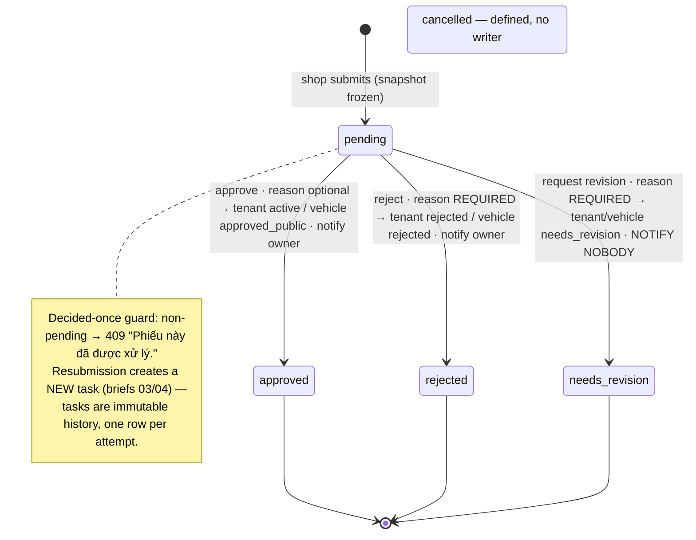

# 08 — Platform Governance

> **Type:** Module design brief · **Created:** 2026-08-04 · **Status:** Draft for product review
> **Owners:** Principal Software Architect · Senior Product Manager · Senior Business Analyst · UX Architect
> **Written to:** [`_DESIGN_BRIEF_STANDARD.md`](_DESIGN_BRIEF_STANDARD.md) · **Inherits:** [`00_CROSS_CUTTING_SYSTEM_UX.md`](00_CROSS_CUTTING_SYSTEM_UX.md) · **Adjacent:** [`03`](03_SHOP_ONBOARDING_AND_SETTINGS.md) (the shop side of tenant approval), [`04`](04_FLEET_MANAGEMENT.md) (the shop side of vehicle approval and hide), [`00 §17`](00_CROSS_CUTTING_SYSTEM_UX.md) (PII monitoring, staff, audit read — **out of scope here**)
> **Authoritative sources:** source, schema, nine platform test suites. `docs/project/` secondary.
>
> **Reading contract:** *Confirmed* = exists. `[RECOMMENDED — NOT CURRENT]` = does not exist. No evidence = `Unknown`.

---

## 1. Executive summary

Platform governance is where XePrime earns its marketplace's trust: the approval gate that admits shops and vehicles, the lock/hide levers that remove them, and the dashboard that tells staff what needs attention. It is the best-tested area of the product (nine Jest suites) and its transaction discipline is exemplary — **every decision changes the target's status, finalizes the task, writes an approval log, writes audit, and notifies, in one transaction** ("quyết định duyệt và dấu vết của nó cùng sống cùng chết").

The governance *mechanics* are done; the governance *judgment support* is not. Four findings frame the product conversation:

1. **Reviewers decide on self-declared snapshots with no criteria.** The approval drawer shows the profile/vehicle snapshot and the log timeline — but there is no quality checklist (docs/design G-04), no document evidence (documents are unbuildable, brief 03), and for a tenant task the snapshot may legally be `{}` (brief 03 AP-5). Approval is a yes/no on whatever the shop typed.
2. **The hide reason travels one way.** Hide requires a mandatory reason that lands in `audit_logs` — and nowhere else. The shop sees a generic `hidden` state (brief 04 V-3); when it resubmits, the *new approval task's* reviewer has no view of why it was hidden (roadmap's own acknowledged gap). Governance memory exists but is not consulted at the exact moment it matters.
3. **Two decision paths, asymmetric silences.** Approve and reject notify the owner; **request-revision notifies nobody** on either target type (`TENANT_NOTIFY_BY_KIND.request_revision = null`, same for vehicles — briefs 03/04). Lock and unlock notify nobody at all. The platform's most corrective actions are its quietest.
4. **The queue is a list, not a workload.** Oldest-first ordering exists, but there is no reviewer assignment, no SLA/aging display, no bulk decision (roadmap's "duyệt hàng loạt" ambition in docs/design 5.9 has no implementation), and `APPROVAL_STATUS.CANCELLED` plus both `*_document` target types are dead vocabulary — defined, never written, and explicitly rejected by the review dispatcher ("Loại phiếu này chưa được hỗ trợ duyệt").

Scope note: PII monitoring (bookings/customers), staff management, plans/billing and audit *reading* were covered in briefs 00/06 and the roadmap; this brief covers them only where governance actions generate audit.

---

## 2. Subject status table (§R4)

| # | Subject | Status | See |
|---|---|---|---|
| 1 | Platform dashboard | Implemented — 6 KPI cards + 2 panels | §6 |
| 2 | Platform KPIs | Implemented — tenants by status, active/total listings, bookings (total/active), pending approvals by target | §6 |
| 3 | Approval queue | Implemented — oldest-first, paginated | §7 |
| 4 | Approval filters | Implemented — `status`, `targetType` in URL | §7 |
| 5 | Approval detail | Implemented — drawer: snapshot render (+ vehicle image), tenant block, log `Timeline` | §7.2 |
| 6 | Tenant approval | Implemented | §7.1 |
| 7 | Vehicle approval | Implemented | §7.1 |
| 8 | Approve | Implemented — reason optional | §7.1 |
| 9 | Reject | Implemented — reason **mandatory** (400 without) | §7.1 |
| 10 | Request revision | Implemented — reason mandatory; **notifies nobody** | §7.1, finding 3 |
| 11 | Approval history | **Partially implemented** — full per-task `approval_logs` timeline in the drawer; **no cross-task history per target** (prior hides/rejections invisible on a new task) | §7.2, finding 2 |
| 12 | Tenant monitoring | Implemented — search/status filters, vehicle counts | §8 |
| 13 | Tenant detail | Implemented — drawer + counts + `currentPlan` + plan section | §8 |
| 14 | Tenant lock | Implemented — reason optional (`Unknown` if intended vs hide's mandatory), guarded `active→suspended`, audited, **no notification** | §8 |
| 15 | Tenant unlock | Implemented — `Popconfirm`, guarded `suspended→active`, audited, no notification | §8 |
| 16 | Vehicle monitoring | Implemented — q (trigram-indexed), public/operation/type/tenant-status filters | §9 |
| 17 | Vehicle detail | Implemented — drawer | §9 |
| 18 | Vehicle moderation (hide) | Implemented — reason **mandatory**, `approved_public→hidden`, race-safe, listing sync in-tx | §9 |
| 19 | Unhide | Implemented — `hidden→approved_public`, `Popconfirm` | §9 |
| 20 | Governance notifications | **Partially implemented** — approve/reject → owner only; revision/lock/unlock/hide/unhide → silent | §10 |
| 21 | Governance audit | Implemented — every decision and moderation in-tx with before/after | §11 |
| 22 | Document approval (`tenant_document`/`vehicle_document`) | **Referenced but not implemented** — target types defined; dispatcher rejects them | §7.1 |
| 23 | `APPROVAL_STATUS.CANCELLED` | **Referenced but not implemented** — no writer | §7.1 |
| 24 | Bulk approval | **Referenced but not implemented** — no selection/endpoint (design doc 5.9 aspiration only) | finding 4 |
| 25 | Reviewer assignment / SLA | **Referenced but not implemented** — `reviewedBy` records who decided; nothing assigns beforehand | finding 4 |

---

## 3. Governance goals and personas

| Goal | Evidence |
|---|---|
| Nothing reaches the marketplace without a human decision | Approval tasks gate tenant activation and vehicle publication; client cannot set either status |
| Decisions are once-only, evidenced, and attributable | Pending-only guard; snapshot; `reviewedBy/At`; log + audit in-tx |
| Removal levers are reversible and race-safe | Guarded `updateMany` transitions (lock/unlock, hide/unhide) — concurrent moderators: one wins, one 409 |
| Marketplace effect is immediate | Tenant status joined at query time (ADR 0008); listing sync in the decision tx |
| Reviewers see what was submitted, not what exists now | Snapshot comment in schema: "để reviewer thấy đúng thứ shop đã gửi kể cả khi shop sửa sau" |

**Personas** (from `PLATFORM_ROLE` + default grants): `platform_admin` (everything) · `reviewer` (dashboard + approvals + vehicle view/moderate) · `platform_staff` (dashboard + read-only monitors) · `finance_admin` (dashboard, tenants manage, billing, bookings view) · `support` (monitors + PII reveal — outside this brief). MVP uses admin+staff; the other three are seeded-forward (rbac comment).

### Permission matrix (verified against `DEFAULT_PLATFORM_ROLE_PERMISSIONS` and controller decorators)

| Capability | Permission | admin | staff | reviewer | support | finance_admin |
|---|---|---|---|---|---|---|
| Dashboard | `platform.dashboard.view` | ✓ | ✓ | ✓ | ✓ | ✓ |
| Approvals (list/detail/decide) | `platform.approvals.review` | ✓ | ✗ | ✓ | ✗ | ✗ |
| Tenants (list/detail/lock/unlock) | `platform.tenants.manage` | ✓ | ✗ | ✗ | ✗ | ✓ |
| Vehicles view | `platform.vehicles.view` | ✓ | ✓ | ✓ | ✓ | ✗ |
| Vehicles hide/unhide | view **+** `platform.vehicles.moderate` (both on the handler — the getAllAndOverride lesson, roadmap §F) | ✓ | ✗ | ✓ | ✗ | ✗ |

Note confirmed: one `platform.approvals.review` permission covers approving *shops* and *vehicles* alike — no per-target split; and `platform.tenants.manage` couples read with the lock lever (staff who may see tenants may not exist without also empowering lock for `finance_admin` — `Unknown` if intended, Q7).

---

## 4. Information architecture and navigation

`PLATFORM_NAV` (scope-selected by `platformRole`, brief 00 §7): Tổng quan → Duyệt hồ sơ (`/manage/admin`) · Gian hàng · Xe toàn hệ thống · [Đơn thuê · Khách thuê · Nhân sự · Gói dịch vụ · Nhật ký — other briefs]. Mobile tabs: Tổng quan / Duyệt hồ sơ / Xe / Đơn thuê. The admin layout renders the 403 boundary (brief 00 §6). All list state is URL-backed via the shared `use-url-filters` primitive (these three slices are its first adopters — roadmap).

---

## 5. Lifecycles

### Approval workflow

### Tenant lifecycle (platform's levers on brief 03's diagram)

`pending_review → active|rejected|needs_revision` (via approval) · `active ⇄ suspended` (lock/unlock, reason on lock optional, guarded single-step, audited, silent). Locking hides all inventory instantly via the query-time join — no listing writes needed (ADR 0008 §3).

### Vehicle moderation lifecycle

`pending_public_review → approved_public|rejected|needs_revision` (approval; listing synced in-tx) · `approved_public ⇄ hidden` (hide with mandatory reason / unhide; guarded; listing synced; audited; **silent to the shop**). Shop-side resubmission from `hidden` re-enters the approval queue **without the hide context** (finding 2).

---

## 6. Dashboard behavior

**Confirmed** (`platform-dashboard.service.ts` + `PlatformDashboardView`): parallel counts — tenants grouped by status, active/total public listings, bookings total and active, pending approvals grouped by target type; plus two panels: "Chờ duyệt" (recent pending tasks) and "Gian hàng mới" (recent tenants with province). Six `StatCard`s reuse the shop-dashboard components. Shortcut links exist per `docs/project/05` ("Shortcuts; no form or chart"). No date-range dimension — all values are all-time or current-state; no charts (consistent with the platform-wide absence, brief 06 authority #5). Whether KPI cards click through to filtered lists: the panels link, the stat cards' behavior is `Unknown` from static review (not verified — recorded as such rather than assumed, cf. docs/design F-1 pattern).

---

## 7. Approval queue and detail

### 7.1 Decision mechanics (confirmed)

`DECISION` table drives all three verbs: approve (reason optional), reject (`needsReason`), request_revision (`needsReason`) — a missing reason 400s with "Vui lòng nhập lý do gửi cho chủ shop". Dispatch by `targetType`; document types rejected explicitly. Both branches: `finalizeTask` (task status + `reviewedBy/At` + reason + approval_log with from/to) + target status change + listing sync (vehicle branch) + audit (`approval.approve|reject|request_revision`, actor scope `platform`, before/after of both statuses) + owner notification where mapped — one transaction.

### 7.2 Queue and drawer (confirmed)

Table: status/targetType URL filters, oldest-first, tenant name, submitter name, timestamps, reason column for decided rows. Drawer: `Skeleton` load; snapshot rendered as `Descriptions` with the vehicle main image when present; tenant identity block; **full per-task log timeline** (action, from→to, note, actor, time — `approval_logs` ordered asc); action row [Duyệt] [Yêu cầu bổ sung] [Từ chối] with a shared reason `Modal` (`TextArea`, ok disabled until non-empty, danger styling on reject). Decided tasks show no actions (immutable). Toasts per outcome.

**Confirmed gaps:** no link from the drawer to the live target (tenant detail / vehicle detail) to compare snapshot vs current; no prior-task history for the same target; no queue aging indicator; empty-snapshot tenants render an empty `Descriptions` (the `hasSnapshot` guard shows an `Empty` — the reviewer's evidence is literally nothing).

---

## 8. Tenant monitoring, lock and unlock

**Confirmed** (`platform-tenants.service.ts`, drawer): list with q/status URL filters and vehicle counts; detail with vehicle+booking counts and `currentPlan` (ADR 0010) plus the plan-management section (assignment/renewal/history/cancel — billing scope); **lock** via Modal with optional reason (`reason.trim() || undefined`), **unlock** via `Popconfirm`. Transitions are the guarded `updateMany` pattern with distinguishing error messages for wrong-step vs not-found. Audit `tenant.lock`/`tenant.unlock` with reason in `after`. No notification either way (brief 03 AP-7).

**Asymmetry confirmed:** hide-vehicle demands a reason; lock-tenant — the strictly bigger action — does not (Q3).

---

## 9. Vehicle monitoring and moderation

**Confirmed** (`platform-vehicles.service.ts`, drawer): list over `vehicles` (not the snapshot — includes unpublished), filters tenantId/publicStatus/operationStatus/vehicleType/**tenantStatus** + trigram-indexed q over name/plate/code (the three-column GIN from roadmap §review); detail drawer; **hide** Modal (mandatory reason, ok disabled until non-empty), **unhide** `Popconfirm`. Single-step guarded transitions `approved_public ⇄ hidden`, wrong-step 409, listing sync + audit (`vehicle.platform_hide` with reason / `vehicle.platform_unhide`) in-tx. Covered by `platform-vehicles.spec.ts` including the 409 race.

---

## 10. Governance notifications

| Action | Recipient | Confirmed |
|---|---|---|
| Approve (tenant/vehicle) | `tenant.ownerUserId` — `SHOP_APPROVED`/`VEHICLE_APPROVED`, reason in body if given | ✓ |
| Reject (both) | Owner — `SHOP_REJECTED`/`VEHICLE_REJECTED` with reason | ✓ |
| Request revision (both) | **Nobody** — mapped to `null` with "mở sau" comment | ✓ silent |
| Lock / unlock | Nobody | ✓ silent |
| Hide / unhide | Nobody | ✓ silent |
| New submission → reviewers | **Nobody** — no notification targets platform staff anywhere (`emitToUser` census, brief 02) | ✓ silent |

The queue is pull-only: reviewers learn of new work by opening the dashboard. In-app is the only channel (brief 07 classification #5).

---

## 11. Auditability

**Confirmed:** every governance mutation audits in its transaction with actor scope `platform`, target, and before/after status pairs; hide/lock reasons are stored in the audit `after` payload; approval decisions additionally write the `approval_logs` row (two trails: workflow log + audit log). Read side (`platform.audit.view`) supports filtering by exactly these actions (the 04/08 additions to `admin-audit/constants.ts` exist so "ai đã xem PII"/governance actions are filterable — roadmap). Nothing governance-related is un-audited. The known asymmetry: the *shop* cannot see any of this (no tenant-facing audit or approval history — briefs 03 AP-6, 04 V-8).

---

## 12. Tables, filters, dialogs, states, responsive, accessibility (repo patterns)

**Tables:** three list tables on the shared server-paginated pattern with tx-consistent counts; segments on admin-vehicles per `docs/project/05`. **Dialogs:** reason `Modal`s (reject/revision/hide/lock) with disabled-until-reason where mandatory; `Popconfirm` for the reversal verbs (unlock/unhide) — severity-consistent, unlike some shop surfaces. **States:** skeleton drawer loads, `Empty` for empty snapshot, error/empty/loading per list; success toasts. **Responsive:** desktop-first admin tables with overflow; drawers not full-screen on mobile; platform mobile tabs exist but deep moderation on a phone is untested (`Unknown`). **Accessibility:** repo-standard — labelled inputs in modals, `Timeline` semantics from AntD, no live regions, `Popconfirm` keyboard `Unknown` (brief 00 §16).

---

## 13. Security

**Confirmed:** every endpoint `@PlatformOnly()` + per-handler permissions with the moderate-handlers restating view (getAllAndOverride); no tenant scope accepted from clients; decisions once-only; transitions race-guarded; snapshots immutable; 403 layout client-side with backend guards as the real gate (brief 00). Reviewer sees tenant phone/email in the task detail (business contact, not customer PII — masked-PII surfaces are the monitoring endpoints, out of scope). Banking data in tenant snapshots visible to `platform.approvals.review` holders — open question carried from brief 03 (Q8 there).

---

## 14. Edge cases

| # | Case | Confirmed handling |
|---|---|---|
| 1 | Two reviewers decide one task | Second gets 409 (pending-only guard) |
| 2 | Two moderators hide one vehicle | One 409 (`updateMany` race — tested) |
| 3 | Reject without reason | 400 |
| 4 | Approve a task whose vehicle was deleted meanwhile | Vehicle branch `findUnique` → not-found aborts the tx |
| 5 | Empty tenant snapshot | `Empty` in the drawer; decision still possible (brief 03 AP-5) |
| 6 | Hide a non-published vehicle / unhide a non-hidden one | 409 wrong-step |
| 7 | Lock a non-active tenant | 409 with directional message |
| 8 | Shop resubmits after hide | New task, queue-normal; hide reason not shown (finding 2) |
| 9 | Shop edits after submitting | Snapshot unchanged — reviewer sees the submitted version by design |
| 10 | Document-type task ever created (DB-side) | Dispatcher 400s "chưa được hỗ trợ duyệt" |
| 11 | Reviewer account deleted later | `reviewedBy` `SetNull` — decision survives, attribution lost in the task row (audit row retains actor id) |
| 12 | Approving a vehicle of a suspended tenant | **No tenant-status check in the vehicle branch** — vehicle becomes `approved_public`; listing sync derives from vehicle+deletedAt only, but the marketplace join hides it while suspended. Net effect consistent, though the status is granted (`Unknown` if intended, Q9) |

---

## 15. Existing UX problems

| ID | Problem |
|---|---|
| G-1 | No review criteria/checklist — approval is unstructured judgment (docs/design G-04) |
| G-2 | Hide reason invisible to the next reviewer and to the shop (finding 2; roadmap-acknowledged) |
| G-3 | Revision requests silent on both target types (briefs 03/04) |
| G-4 | Lock/unlock silent; suspended shops learn by symptom |
| G-5 | Reason mandatory for hide but optional for lock — inconsistent severity |
| G-6 | No cross-task history per target in the drawer |
| G-7 | No snapshot-vs-current diff or link to the live target |
| G-8 | Queue has no aging/SLA display; reviewers discover work by polling the dashboard |
| G-9 | No bulk decisions for high-volume onboarding |
| G-10 | Empty-evidence tasks are decidable |
| G-11 | Dead vocabulary: `cancelled` status, both document target types |

---

## 16. Missing features

Review checklist/criteria capture (structured verdicts, not just free-text reason) · per-target approval history & hide-context surfacing · reviewer notifications (new submissions) and shop notifications (revision/lock/hide) · bulk approve/reject · SLA tracking and queue aging · document review (types reserved) · task cancellation (vocabulary reserved) · admin notes (`admin_notes` model exists unused — `docs/project/10`) · impersonation for support (docs/design G-06) · governance reporting (approval throughput, rejection reasons taxonomy).

---

## 17. Recommendations

`[RECOMMENDED — NOT CURRENT]`, evidence-ordered:

1. **Surface prior context on every task**: same-target task history + the latest hide/lock audit reason in the drawer. Closes G-2/G-6 with data already stored; the roadmap already names it.
2. **Notify the three silent actions** (revision, lock/unlock, hide/unhide) — the notification plumbing and reason strings already exist; only the type-mapping nulls stand in the way (briefs 03/04 recommendation 1, restated as governance-side).
3. **Add a review checklist** captured per decision (structured booleans + the existing reason) — G-04's lever; also fixes G-10 by requiring evidence acknowledgment before approving an empty snapshot.
4. **Make lock's reason mandatory** to match hide (G-5) — one `needsReason`-style flag.
5. **Notify reviewers of new submissions** — first platform-directed notification; the dashboard's pending counts already compute the badge number.
6. **Bulk approve** with per-row results (docs/design 5.9's "Đã duyệt 8/10" pattern) once checklist exists — bulk without criteria amplifies G-1.
7. **Queue aging column** (`now − submittedAt`) and oldest-first as an explicit sort choice.
8. **Retire or implement dead vocabulary** (cancelled, document types) — same discipline recommended in briefs 04–07.

---

## 18. Open questions

| # | Question | Blocks |
|---|---|---|
| Q1 | What are the approval criteria for shops and vehicles — and should they be captured structurally per decision? | G-1, rec 3 |
| Q2 | Must revision/lock/hide notify the shop, and through which channels? | G-3/G-4, rec 2 |
| Q3 | Should lock require a reason like hide does? | G-5 |
| Q4 | Should the resubmit reviewer automatically see hide/rejection context (and should the shop see the hide reason)? | G-2 |
| Q5 | Is there a review SLA, and is queue aging/assignment needed at expected volumes? | G-8, rec 7 |
| Q6 | Is bulk approval wanted, and under what safeguards? | G-9 |
| Q7 | Should `finance_admin` hold the lock lever (it comes bundled with `tenants.manage`)? | §3 matrix |
| Q8 | Should one `approvals.review` permission cover both target types, or should shop-approval and vehicle-approval split? | §3 |
| Q9 | Should approving a vehicle be blocked while its tenant is suspended? | edge 12 |
| Q10 | Are document review and task cancellation planned (vocabulary reserved), or removable? | G-11 |
| Q11 | Do platform staff need any channel beyond in-app polling to learn of new submissions? | §10 |

---

## 19. Acceptance criteria

**Enforced today — regressions are defects:**

| # | Criterion | Verified by |
|---|---|---|
| PG1 | Every decision finalizes task + target status + approval log + audit + mapped notification in one tx | `platform-approval.service.ts`; `vehicle-approval.spec.ts` |
| PG2 | Tasks are decided at most once | Pending guard; edge 1 |
| PG3 | Reject and revision require a reason; the reason reaches the log, audit and (where mapped) the notification | `DECISION.needsReason` |
| PG4 | Reviewer evidence is the submission-time snapshot | Schema comment; §7.2 |
| PG5 | Lock/unlock and hide/unhide are single-step guarded transitions; concurrent attempts lose with 409 | `platform-tenants/vehicles.spec.ts` |
| PG6 | Hide requires a reason; both moderation verbs audit with before/after and sync the listing in-tx | `platform-vehicles.service.ts` |
| PG7 | Locking a tenant removes its marketplace presence immediately without listing writes | ADR 0008 §3 |
| PG8 | Moderate-capable handlers restate the view permission | Roadmap §F; controllers |
| PG9 | All governance lists are URL-filtered, server-paginated with tx-consistent counts | Feature hooks |
| PG10 | Client can never set tenant status or vehicle public status | DTO shapes (briefs 03/04) |

**Proposed `[RECOMMENDED — NOT CURRENT]`:** PG11 every governance action that changes a shop's standing notifies it · PG12 every decision records against explicit criteria · PG13 a reviewer sees the target's full governance history at decision time · PG14 no decidable task has empty evidence · PG15 every defined status/target type has a writer or is removed.

---

## 20. Source references

**Web:** [`features/platform-dashboard/`](../../apps/web/src/features/platform-dashboard/) · [`features/approvals/`](../../apps/web/src/features/approvals/) (`ApprovalTable`, `ApprovalDetailDrawer`, filters) · [`features/admin-tenants/`](../../apps/web/src/features/admin-tenants/) (`AdminTenantTable`, `AdminTenantDetailDrawer`) · [`features/admin-vehicles/`](../../apps/web/src/features/admin-vehicles/) · pages under [`(manage)/manage/admin/`](<../../apps/web/src/app/(manage)/manage/admin/>) · [`use-url-filters.ts`](../../apps/web/src/hooks/use-url-filters.ts) · [`constants/nav.ts`](../../apps/web/src/constants/nav.ts)

**API:** [`platform-approval.service.ts`](../../apps/api/src/modules/platform-admin/platform-approval.service.ts) (DECISION table, dispatcher, both apply branches, `finalizeTask`) · [`platform-tenants.service.ts`](../../apps/api/src/modules/platform-admin/platform-tenants.service.ts) · [`platform-vehicles.service.ts`](../../apps/api/src/modules/platform-admin/platform-vehicles.service.ts) · [`platform-dashboard.service.ts`](../../apps/api/src/modules/platform-admin/platform-dashboard.service.ts) · [`platform-admin.controller.ts`](../../apps/api/src/modules/platform-admin/platform-admin.controller.ts) · DTOs · [`listings.service.ts`](../../apps/api/src/modules/public-listings/listings.service.ts) · [`audit.service.ts`](../../apps/api/src/modules/audit/audit.service.ts)

**Types/data:** [`status/misc.ts`](../../packages/types/src/status/misc.ts) (`APPROVAL_STATUS/ACTION/TARGET_TYPE`) · [`status/tenant.ts`](../../packages/types/src/status/tenant.ts) · [`status/vehicle.ts`](../../packages/types/src/status/vehicle.ts) · [`rbac.ts`](../../packages/types/src/rbac.ts) (platform matrix) · [`schema.prisma`](../../prisma/schema.prisma) — `ApprovalTask` (snapshot JSONB, `reviewedBy` SetNull, three indexes), `ApprovalLog`, `AdminNote` (unused)

**Tests:** `vehicle-approval` · `platform-tenants` · `platform-vehicles` · `platform-dashboard` · `platform-audit` · `platform-billing` · `platform-staff` · `platform-bookings` · `platform-customers` (`apps/api/test/`)

**ADRs/docs:** [0005](../decisions/0005-status-enums.md) · [0008](../decisions/0008-public-listings-sync.md) · [0010](../decisions/0010-billing-plans-subscriptions.md) · CLAUDE.md §6 (three security lines) · [`completion-roadmap.md`](../completion-roadmap.md) (Phase 7 blocks, §F, acknowledged hide-reason gap) · `docs/project/04,05,07` · briefs 03/04 (shop-side counterparts)

**Verification for this brief:** writer census — `APPROVAL_STATUS.CANCELLED` (none), document target types (dispatcher rejects), platform-directed notifications (none) · confirmed reject/revision `needsReason` vs lock optional-reason asymmetry · confirmed no tenant-status check in the vehicle approval branch (edge 12) · confirmed drawer renders per-task logs only (no cross-task query) · full reads of the approval, tenants, vehicles and dashboard services and both admin drawers.
