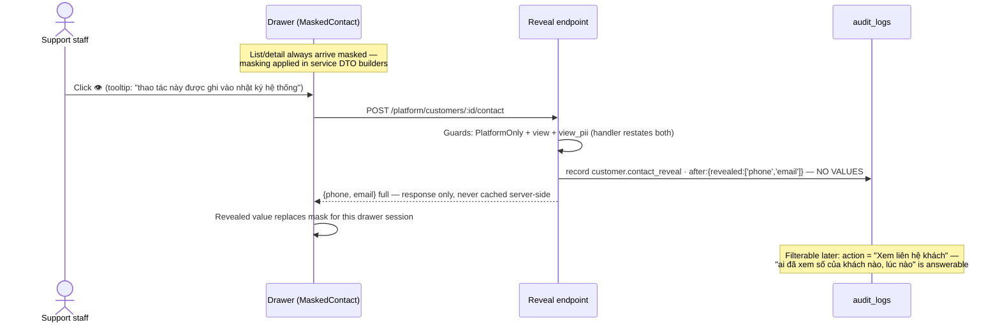
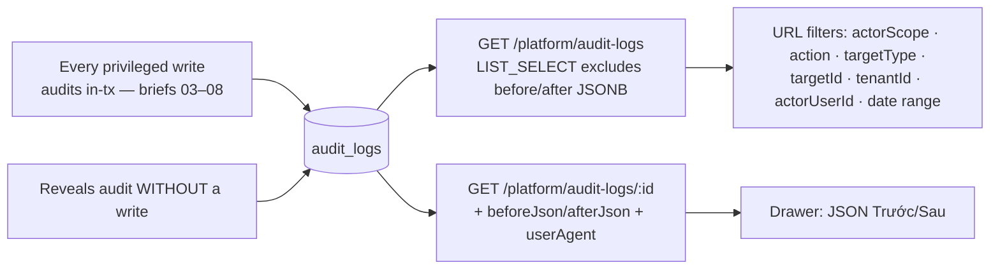

# 09 — Platform Operations and Privacy

> **Type:** Module design brief · **Created:** 2026-08-04 · **Status:** Draft for product review
> **Owners:** Principal Software Architect · Senior Product Manager · Senior Business Analyst · UX Architect
> **Written to:** [`_DESIGN_BRIEF_STANDARD.md`](_DESIGN_BRIEF_STANDARD.md) · **Inherits:** [`00_CROSS_CUTTING_SYSTEM_UX.md`](00_CROSS_CUTTING_SYSTEM_UX.md) (§17.2 is this module's summary) · **Adjacent:** [`08_PLATFORM_GOVERNANCE.md`](08_PLATFORM_GOVERNANCE.md) (the mutation side of platform administration)
> **Authoritative sources:** source, tests (`platform-bookings.spec.ts`, `platform-customers.spec.ts`, `platform-audit.spec.ts`), roadmap §11.1/§F. `docs/project/` secondary.
>
> **Reading contract:** *Confirmed* = exists. `[RECOMMENDED — NOT CURRENT]` = does not exist. No evidence = `Unknown`.
>
> **Mandated markings (per task):**
> 1. **Monitoring is read-only.** Platform booking and customer endpoints expose no mutation — the services' own docblocks say "CHỈ ĐỌC"; the only POST in either controller is contact reveal, which mutates nothing.
> 2. **PII reveal is a separate, audited endpoint** — `POST /platform/{bookings,customers}/:id/contact`, guarded by view **+** `platform.customers.view_pii` (both restated on the handler), writing an audit row on every call **without copying the PII value into the log**.
> 3. **Support tickets: missing.** No model, endpoint, page or reference beyond the roadmap's remaining-work line. (The only "ticket" in the codebase is an upload-presign variable name.)
> 4. **Review moderation: missing.** `REVIEW_STATUS.HIDDEN` exists with a label and the type-file comment describes platform hiding — no API or UI writes it (`docs/project/10` concurs).
> 5. **Legal/retention requirements: `Unknown`** — no source in the repository states PII retention, audit retention, deletion obligations, or applicable-law analysis (carried from brief 00 Q12).

---

## 1. Executive summary

This module is the platform's read side: cross-tenant visibility into bookings and customers with PII masked at the service layer, and the audit log that makes every privileged act answerable. Its design center is a sentence from `mask.ts`: **mask where the DTO is built, "KHÔNG ở frontend: dữ liệu đã ra khỏi API là đã lộ"** — and it is applied consistently.

The privacy engineering is the most deliberate in the codebase:

- **Masking preserves verifiability**: phone keeps 3+3 digits *on the normalized local form* (so `84…` and `09…` render identically and support can confirm "đúng số khách đọc cho tôi" without reading the directory); email keeps 2 chars + full domain.
- **Lookup resists scanning**: phone/email search is **exact-match only**, with the comment naming the threat ("cho tìm gần đúng… là biến ô tra cứu thành công cụ quét danh bạ"), and `phoneLookupVariants` bridges the two stored phone shapes (roadmap §F — the module's biggest caught-in-review bug).
- **Reveal is deliberate friction**: a separate permission, a user-initiated button ("không tự bung khi mở drawer"), a tooltip disclosing the logging, and an audit row recording *what was revealed, never the value*.
- **The audit trail is queryable for exactly this**: `booking.contact_reveal`/`customer.contact_reveal` are labeled filter options — the constants file states they are "lý do endpoint bỏ che PII tồn tại".

The gaps are governance-of-the-governors rather than mechanics: **reveals are unbounded** (no rate limit, no reason capture, no anomaly surfacing — a support account can walk the customer list revealing every contact, each row dutifully audited but nothing watching the pattern); **the audit log has no integrity protection or retention policy** (append-only by convention, not by constraint — a platform_admin with DB access could alter it, and rows accumulate forever); and **the customer is a subject, not a party** — they are never told their contact was viewed, and data-subject rights (export, erasure) have no implementation anywhere (brief 02 §20).

---

## 2. Subject status table (§R4)

| # | Subject | Status | See |
|---|---|---|---|
| 1 | Platform booking monitoring | Implemented — **read-only** (marking #1) | §6 |
| 2 | Platform customer monitoring | Implemented — read-only; customer = anti-join on active memberships | §7 |
| 3 | Cross-tenant search | Implemented — trigram-indexed q (bookings: code+customerName; customers: displayName); exact-only phone/email | §6–7 |
| 4 | Booking detail | Implemented — drawer, masked contact, tenant/vehicle context | §6 |
| 5 | Customer detail | Implemented — drawer: counts (requests/booked/reviews/conversations), verification states | §7 |
| 6 | Recent customer requests | Implemented — last 10 with tenant/vehicle/status/booking code | §7 |
| 7 | Masked phone | Implemented — 3+3 on local form; ≤6-digit fallback | §5 |
| 8 | Masked email | Implemented — 2 chars + domain; no-@ fallback | §5 |
| 9 | PII reveal | Implemented — separate POST per surface (marking #2) | §5 |
| 10 | PII reveal permission | Implemented — `platform.customers.view_pii`; default holders: `platform_admin`, `support` only | §4 |
| 11 | Audit for every reveal | Implemented — one row per call, value never copied | §5, §8 |
| 12 | Platform audit log (read) | Implemented — list omits JSONB; detail loads it | §8 |
| 13 | Audit filters | Implemented — actorScope/action/targetType/targetId/tenantId/actorUserId/date range, all URL | §8 |
| 14 | Audit detail | Implemented — drawer with before/after JSON | §8 |
| 15 | Before/after snapshots | Implemented — `beforeJson`/`afterJson`, list-select excluded by design | §8 |
| 16 | Actor scope | Implemented — `platform`/`tenant`/`system` vocabulary + filter | §8 |
| 17 | Support role | **Partially implemented** — role + grants exist (monitors + PII); **no support-specific surface or workflow** | §4 |
| 18 | Support-ticket concept | **Missing** (marking #3) | §10 |
| 19 | Review moderation | **Missing** (marking #4) — status value dormant; recompute hooks pre-wired (brief 02 §10.2 notes both recompute paths must be called) | §10 |
| 20 | Privacy controls (masking/limiting) | Implemented at the access layer; **absent at the lifecycle layer** (retention/erasure/notification) | §9 |
| 21 | Read-only constraints | Implemented (marking #1) | §6–7 |
| 22 | Reveal rate limiting / anomaly detection | **Missing** — only the global 120/60s throttler applies | §9, abuse A1 |
| 23 | Data-subject rights (export/erasure/notice) | **Missing**; legal basis `Unknown` (marking #5) | §9 |

---

## 3. Operational and privacy goals

**Operational** (evidence: build plan §11.1, roadmap 04/08 block): let platform staff answer a support call — "khách này là ai, đơn nào, trạng thái gì" — across all tenants, without touching tenant data. **Privacy** (evidence: `mask.ts` doc, CLAUDE §6 line 3): the same staff must not be able to browse the customer directory; identification requires either information the customer already gave support (exact phone/email) or an explicit, logged reveal.

The tension is resolved by design: *aggregate freely, identify deliberately*. Counts, statuses and histories are open to `*.view`; identity crosses a second permission and leaves a trace.

---

## 4. Roles and permissions

Verified against `DEFAULT_PLATFORM_ROLE_PERMISSIONS` and the controllers (both restating view on the reveal handlers — the getAllAndOverride rule):

| Capability | Permission | admin | staff | reviewer | support | finance_admin |
|---|---|---|---|---|---|---|
| Bookings monitor (list/detail) | `platform.bookings.view` | ✓ | ✓ | ✗ | ✓ | ✓ |
| Customers monitor | `platform.customers.view` | ✓ | ✓ | ✗ | ✓ | ✗ |
| **Reveal contact (both surfaces)** | view + `platform.customers.view_pii` | ✓ | ✗ | ✗ | **✓** | ✗ |
| Audit read (list/detail) | `platform.audit.view` | ✓ | ✗ | ✗ | ✗ | ✗ |

Confirmed: `support` is the only non-admin role holding `view_pii` (roadmap §A — deliberate); `platform_staff` sees masked data with no unmask path (UI hides the eye button via `usePermissions`, backend 403s regardless); **audit reading is admin-only by default**, so support's reveals are visible only to admins — a real oversight structure, though nothing *alerts* on it. Shop-side actors never reach these endpoints (`@PlatformOnly`).

---

## 5. PII workflow

Confirmed details: the audit row is written **even though nothing changes in the DB** — the service comment makes this explicit; bookings reveal returns `customerPhone` only (bookings carry no email), customers reveal returns both; the revealed value lives in the mutation's client state (drawer session) — reopening re-requires a reveal, hence a new audit row (verifiable friction, arguably correct); the reveal button never auto-fires on drawer open, by documented intent.

---

## 6. Booking monitoring (read-only)

**Confirmed** (`platform-bookings.service.ts` + feature): list over all tenants' bookings with filters — status, tenantId, vehicleId, general q (trigram GIN over code+customerName), **exact** phone via `phoneLookupVariants`, and a date range applied to `createdAt` **or** `pickupAt` via `BOOKING_DATE_FIELD` (this is the shared vocabulary's actual consumer — brief 05 §1 correction). Detail drawer: booking core, tenant/vehicle names, money fields, `customerPhoneMasked`, `MaskedContact` with reveal. **No transition, edit or cancel exists** — status changes remain the shop's alone (roadmap: "chuyển trạng thái vẫn của shop — ADR 0006 giữ một đường ghi lịch duy nhất"). Smoke-tested end-to-end including the 403 for shop owners calling platform endpoints (roadmap verify block).

---

## 7. Customer monitoring (read-only)

**Confirmed** (`platform-customers.service.ts`): "customer" is **defined by anti-join** — `users` with no ACTIVE tenant membership and no ACTIVE platform membership (removed ex-staff correctly count as customers; owners/staff never appear). Filters: status, hasRequests, exact phone (variants), exact lowercased email, name contains. List enriches with request/review counts plus a one-groupBy booked count. Detail adds email/phone verification timestamps, conversation count, and the last 10 requests with outcomes. Deleted users (`deletedAt`) are excluded everywhere — reveal on a deleted user 404s.

---

## 8. Audit workflow (read side)

**Confirmed:** list/detail split is a deliberate performance decision (comment: "JSONB nặng, drawer lấy riêng"), backed by the `created_at` + `action,created_at` indexes (migration `20260731100000`); action/targetType labels are maintained in `admin-audit/constants.ts` sourced by grepping `audit.record` call sites — including the two reveal actions and the 04/08 additions without which "không lọc được 'ai đã xem PII'". Actor identity shows displayName+email; `ipAddress`/`userAgent` columns exist — **whether any call site populates them is `Unknown`** (the reveal calls pass neither; detail exposes `userAgent`).

**Confirmed structural properties:** append-only **by convention** — no UPDATE/DELETE endpoint exists, but neither does a DB-level guard (no trigger, no revoked grants in migrations); no retention/archival job; no export; no hash-chain or tamper evidence. Authentication events remain unaudited (brief 00 F3), so "who logged in as whom before this reveal" is unanswerable.

---

## 9. Security, privacy, states, responsive, accessibility

**Security (confirmed):** masking at DTO build; exact-only identifier search; both-permission reveal handlers; `@PlatformOnly` everywhere; tests cover masking, variants matching all three phone shapes, reveal audit content, and shop-owner 403s. **Lifecycle gaps (confirmed absent):** no reveal reason capture, no per-actor reveal quota, no customer notification of access, no retention on `users`/`audit_logs`/messages, no erasure or export path — legal obligations `Unknown` (marking #5).

**States/responsive/accessibility:** repo-standard — the three lists follow the shared URL-filter + server-pagination + tx-count pattern (these slices are `use-url-filters`' reference adopters); drawers skeleton-load; masked cells render "—" when empty; reveal errors toast. Tables overflow on mobile (no card conversion); drawers not full-screen. `MaskedContact`'s eye button is icon-only **with** a tooltip; whether it carries an `aria-label` is `Unknown` from this pass (tooltip ≠ accessible name — brief 00 §16 pattern); no live region announces the reveal.

---

## 10. Missing features (markings #3–#4 and neighbors)

**Support tickets — missing** (marking #3): no model/API/UI; roadmap lists it as §11.1 remaining work; brief 02 C-09 and brief 07 Q10 describe the customer- and chat-side holes it would fill. The `support` role currently has *visibility* but no *workflow* — it can identify a caller and then act only outside the product.

**Review moderation — missing** (marking #4): `REVIEW_STATUS.HIDDEN` + label + type-comment exist; no endpoint or page writes it. The code has pre-paid the hard part: `ReviewService` warns that any future hide flow must call both `recomputeTenantRating` and `listings.refreshRating` (brief 02 §10.1). Until built, a defamatory or PII-bearing review is irremovable through the product.

**Also missing:** reveal reason/justification · reveal analytics ("top revealers", per-customer access history) · customer-facing access notice · impersonation (docs/design G-06; would demand its own audit + banner) · audit export/retention · `admin_notes` surface (model unused — brief 08) · deleted-user handling policy (their audit rows persist with `SetNull` actor references).

---

## 11. Edge cases and abuse scenarios

**Edge cases (confirmed handling):**

| # | Case | Handling |
|---|---|---|
| 1 | Customer becomes shop staff after booking | Vanishes from the customer monitor (anti-join); bookings remain findable in booking monitor |
| 2 | Ex-staff (removed membership) rents a car | Counts as customer — deliberate (`Unknown`-free; comment states it) |
| 3 | Phone searched as `09…`/`84…`/`+84…` | All match via variants — tested against production-shaped seeds (roadmap §F) |
| 4 | Guest bookings (no `customerUserId`) | Visible in booking monitor by phone; **invisible to the customer monitor** (they are users only if OTP-created; the request's raw phone is the only handle) |
| 5 | Reveal on deleted/nonexistent target | 404; **no audit row** (lookup precedes recording — an unsuccessful probe leaves no trace, `Unknown` if acceptable) |
| 6 | Two staff reveal the same customer | Two audit rows — correct |
| 7 | Masked value for ≤6-digit or malformed phone | Tail-only fallback; no crash |
| 8 | Email without `@` | Generic tail mask |
| 9 | Audit row whose actor was deleted | Actor `SetNull`; row survives with null actor names |
| 10 | JSONB snapshots with PII from *other* actions | brief 06 Q10's revenue case generalizes: `before/after` payloads are only as clean as each call site — reveals are clean by construction; tenant snapshots include banking (brief 03 Q8) |

**Abuse scenarios (analysis against confirmed controls):**

| # | Scenario | Current posture |
|---|---|---|
| A1 | Support walks the customer list revealing everyone | Every reveal audited; **nothing rate-limits, aggregates or alerts** — detection requires an admin proactively filtering audit |
| A2 | Directory scanning via search | Blocked by exact-match design for phone/email; name search remains fuzzy (names are lower-sensitivity, but combined with masked digits could narrow — residual, `Unknown` acceptance) |
| A3 | Screenshot/exfiltration after reveal | Out of technical scope — no watermark/policy layer; unaddressed |
| B1 | Staff granted `view_pii` via a custom platform role | Possible through DB-only role editing (brief 07 §4.3) — permission changes are not themselves audited (no `role.*` audit actions exist) |
| B2 | Tampering with audit_logs | DB-access-level threat; append-only is conventional (§8) |

---

## 12. Existing UX problems

| ID | Problem |
|---|---|
| O-1 | Reveal requires no reason — the audit answers *who/when*, never *why* |
| O-2 | No per-customer access history view ("this customer's contact was viewed 12 times") despite the data existing in audit |
| O-3 | Re-reveal on every drawer open (session-only state) — correct friction, but unexplained to the user, reading as a bug |
| O-4 | Audit JSON drawer shows raw `Trước/Sau` — undiffable for large tenant snapshots |
| O-5 | Audit list is admin-only, so the support team cannot review even its own access history |
| O-6 | No link from an audit row to its target's detail drawer (targetId is filterable but not navigable) |
| O-7 | Guest bookers' PII (raw phone on requests/bookings) is governed by the same masking on read but has no user record to anchor rights or history to (edge 4) |
| O-8 | Icon-only reveal button's accessible name unverified (repo a11y pattern) |

---

## 13. Recommendations

`[RECOMMENDED — NOT CURRENT]`, evidence-ordered:

1. **Capture a reason at reveal** — one select+note in the confirm step, stored in the existing `after` payload. Turns the trail from who/when into who/why; zero schema change.
2. **Reveal analytics on the audit data**: per-actor daily counts and per-customer access history; alert admins past a threshold. Closes A1 with data already collected.
3. **Build review moderation** on the reserved status — the recompute contract is already documented; the platform currently cannot remove a PII-bearing review (marking #4's operational consequence).
4. **Decide and implement retention** for audit_logs and customer PII once legal requirements are known (marking #5) — and make append-only structural (DB trigger or revoked grants).
5. **Audit authentication and role-permission changes** (brief 00 F3 + abuse B1) so the reveal trail has identity context.
6. **Support tickets** as the workflow shell around this visibility (roadmap-planned; briefs 02/07 define both ends).
7. **Diff view for audit snapshots** (O-4) and target-linking from audit rows (O-6).
8. **Consider audit-row-on-failed-reveal** (edge 5) — probing nonexistent IDs is itself signal.
9. **Customer access notice** — even a passive "lần xem gần nhất" on their account — pending the legal answer to Q3.

---

## 14. Open legal/product questions

| # | Question | Blocks |
|---|---|---|
| Q1 | What law governs this PII (Vietnam PDPD 13/2023?) and what does it require for access logging, retention, and breach duty? — **`Unknown`, blocking most below** | markings #5 |
| Q2 | What retention applies to audit_logs, customer accounts, guest phones on old bookings, and chat? | rec 4 |
| Q3 | Must customers be notified when staff view their contact? | rec 9 |
| Q4 | Are data-subject rights (export, erasure) required, and how do they interact with bookings/audit that reference the user? | §10; brief 02 Q8 |
| Q5 | Should reveals require a stated reason and/or a per-day cap? | O-1, A1 |
| Q6 | Should support read (at least) its own audit trail? | O-5 |
| Q7 | Who moderates reviews, under what criteria, and can shops flag them? | marking #4 |
| Q8 | What is the support-ticket scope (channels, SLA, linkage to reveals/conversations)? | marking #3 |
| Q9 | Is guest-booker PII (no user record) subject to the same rights and retention? | edge 4, O-7 |
| Q10 | Should audit integrity be structural (trigger/immutability) rather than conventional? | B2 |

---

## 15. Acceptance criteria

**Enforced today — regressions are defects:**

| # | Criterion | Verified by |
|---|---|---|
| PP1 | Monitoring endpoints expose no mutation of tenant data | Controllers; marking #1 |
| PP2 | Every contact field in list/detail responses is masked at the service layer | `toListItem`/`toDetail` paths; `mask.spec` per roadmap |
| PP3 | Masking normalizes phone to local form so all stored shapes render identically | `maskPhone` + `toLocalPhone` |
| PP4 | Phone/email lookup is exact-match only, matching every stored variant | `phoneLookupVariants`; `platform-customers.spec` seeds `84…` |
| PP5 | Reveal requires view + `view_pii`, restated on the handler | Controllers; getAllAndOverride rule |
| PP6 | Every successful reveal writes an audit row naming actor, target and revealed fields — never values | `revealContact` both services |
| PP7 | Reveal actions are filterable in the audit UI by labeled action | `admin-audit/constants.ts` |
| PP8 | Audit list never loads JSONB snapshots; detail does | `LIST_SELECT` split |
| PP9 | Customer definition excludes any active tenant/platform member and includes removed ex-members | `CUSTOMER_ONLY` |
| PP10 | Deleted users are invisible to monitoring and unrevealable | where-clauses |
| PP11 | Shop-scoped actors receive 403 on all platform monitoring endpoints | Smoke + `@PlatformOnly` |
| PP12 | All three lists: URL filters, server pagination, tx-consistent counts | Shared primitives |

**Proposed `[RECOMMENDED — NOT CURRENT]`:** PP13 every reveal carries a reason · PP14 reveal volume is monitored and alertable · PP15 audit is structurally append-only with defined retention · PP16 a hidden review disappears from public aggregates via both recompute paths · PP17 permission-grant changes are themselves audited · PP18 data-subject requests have a defined, implementable path.

---

## 16. Source references

**Web:** [`features/admin-bookings/`](../../apps/web/src/features/admin-bookings/) · [`features/admin-customers/`](../../apps/web/src/features/admin-customers/) (drawer wiring `useRevealCustomerContact` + `has(PLATFORM_CUSTOMER_PII_VIEW)`) · [`features/admin-audit/`](../../apps/web/src/features/admin-audit/) (constants with labeled reveal actions, URL filter hook) · [`MaskedContact.tsx`](../../apps/web/src/components/data-display/MaskedContact.tsx) · [`use-url-filters.ts`](../../apps/web/src/hooks/use-url-filters.ts)

**API:** [`platform-customers.service.ts`](../../apps/api/src/modules/platform-admin/platform-customers.service.ts) (full read: `CUSTOMER_ONLY`, exact-match comments, `revealContact`) · [`platform-bookings.service.ts`](../../apps/api/src/modules/platform-admin/platform-bookings.service.ts) · both controllers (dual-permission reveal handlers) · [`platform-audit.service.ts`](../../apps/api/src/modules/platform-admin/platform-audit.service.ts) (`LIST_SELECT` split) · [`common/mask.ts`](../../apps/api/src/common/mask.ts) (full read) · [`common/phone.ts`](../../apps/api/src/common/phone.ts) · [`common/pagination.ts`](../../apps/api/src/common/pagination.ts) · [`audit.service.ts`](../../apps/api/src/modules/audit/audit.service.ts)

**Types/data:** [`rbac.ts`](../../packages/types/src/rbac.ts) (5 monitoring permissions; support's `view_pii`) · [`status/review.ts`](../../packages/types/src/status/review.ts) (dormant `HIDDEN`) · `AUDIT_ACTOR_SCOPE` · [`schema.prisma`](../../prisma/schema.prisma) — `AuditLog` (JSONB pair, `ipAddress`/`userAgent`, actor `SetNull`), `User` (phone `84…` convention) · migrations `20260731100000_add_audit_log_indexes`, `20260804100000_add_platform_monitoring_indexes` (trigram + btree set)

**Tests:** [`platform-customers.spec.ts`](../../apps/api/test/platform-customers.spec.ts) · [`platform-bookings.spec.ts`](../../apps/api/test/platform-bookings.spec.ts) · [`platform-audit.spec.ts`](../../apps/api/test/platform-audit.spec.ts) · `mask.spec.ts` (roadmap-listed)

**Docs:** CLAUDE.md §6 line 3 · [`completion-roadmap.md`](../completion-roadmap.md) (04/08 block §§A–F, verify log) · `docs/project/02,04,07,09,10` · briefs 00 §17, 02 §20, 08

**Verification for this brief:** grep census — "ticket" (one presign variable only), `REVIEW_STATUS.HIDDEN` writers (none), reveal call sites passing `ipAddress`/`userAgent` (none) · confirmed both reveal handlers restate the view permission · confirmed audit read is admin-only in defaults · confirmed no-audit-on-404-reveal ordering · confirmed no rate limiting beyond the global throttler on reveal endpoints · full reads of `mask.ts`, `MaskedContact`, and `platform-customers.service.ts`.
