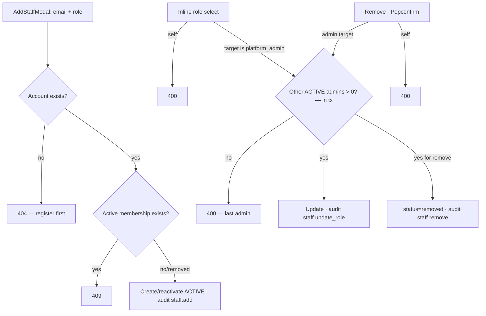
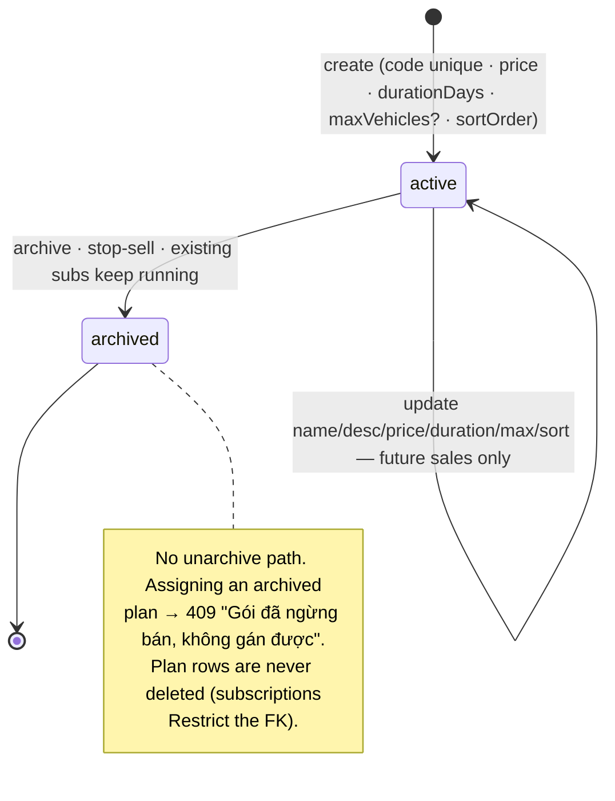
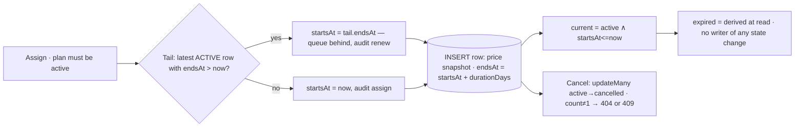

# 10 — Platform Organization and Billing

> **Type:** Module design brief · **Created:** 2026-08-04 · **Status:** Draft for product review
> **Owners:** Principal Software Architect · Senior Product Manager · Senior Business Analyst · UX Architect
> **Written to:** [`_DESIGN_BRIEF_STANDARD.md`](_DESIGN_BRIEF_STANDARD.md) · **Inherits:** [`00_CROSS_CUTTING_SYSTEM_UX.md`](00_CROSS_CUTTING_SYSTEM_UX.md) · **Adjacent:** [`07`](07_SHOP_ORGANIZATION_AND_COMMUNICATION.md) (the tenant-side mirror of staff management), [`08`](08_PLATFORM_GOVERNANCE.md) (who wields these roles), [`04`](04_FLEET_MANAGEMENT.md) (where the vehicle quota bites)
> **Authoritative sources:** source, [ADR 0010](../decisions/0010-billing-plans-subscriptions.md), migration `20260731120000_add_plans_subscriptions`, tests (`platform-staff.spec.ts`, `platform-billing.spec.ts`). `docs/project/` secondary.
>
> **Reading contract:** *Confirmed* = exists. `[RECOMMENDED — NOT CURRENT]` = does not exist. No evidence = `Unknown`.
>
> **Mandated separations (per task):**
> 1. **Implemented plan/subscription behavior** — full plan CRUD-and-archive, append-only subscription history with price snapshots and tail-chaining renewal, derived expiration, early cancel, current-plan derivation, all through the single-writer `BillingService` with per-action audit.
> 2. **Partial plan-limit enforcement** — exactly **one** enforcement point exists: `assertVehicleQuota` at vehicle creation. Submit-public and booking enforcement are ADR-0010 §Hoãn items, not oversights.
> 3. **Missing invoice feature** — no invoice model/endpoint/UI; `payments.subscription_id` remains a bare column ("để trần chưa FK"); recording subscription money has no path (`PaymentsService` is booking-centric — brief 06).
> 4. **Existing role behavior** — the five platform roles with add/change/remove, self-action bans, and in-transaction last-super-admin protection.
> 5. **Unknown commercial policy** — pricing strategy, expiry consequences, refund-on-cancel, self-serve: all `Unknown`; gathered in §14.

---

## 1. Executive summary

This module is the platform's own back office: who works for XePrime (staff + roles) and how shops pay for it (plans + subscriptions). Both halves follow the codebase's best patterns deliberately — staff management **mirrors the tenant members module** (roadmap: "mirror `members`"), and billing adopts the **single-writer rule** from Occupancy/Listings, with ADR 0010 as its unusually complete design record.

The engineering choices worth naming:

- **Subscription history is append-only with snapshots.** Renewal never updates a row: it inserts a new period whose `startsAt` chains off the **latest active `endsAt` in the future** — the code comments that using "current" instead of "tail" would double-book periods on consecutive renewals. Price is copied onto the row, so later plan-price changes never touch sold subscriptions.
- **Expiration is derived, not stored.** "Current plan" = active row with `startsAt <= now < endsAt`, latest `endsAt`; no cron flips status; `SUBSCRIPTION_STATUS` writes only `active|cancelled`. The trade — "expired" exists only at read time — is ADR-documented.
- **Last-admin protection is transactional.** `assertNotLastAdmin` counts *other* ACTIVE `platform_admin`s inside the mutation's transaction, so two concurrent demotions cannot leave zero admins.

The gaps are the commercial layer above the ledger: **no invoice, no payment recording, no revenue reporting** (the platform literally cannot record that a shop paid for its gói); **enforcement is one checkpoint** — a shop whose plan lapsed keeps its published fleet, keeps taking bookings, and only notices when adding a vehicle past the cap; **nothing happens at expiry** — no notification, no `TENANT_STATUS.EXPIRED` writer (brief 03 §2.3 #23), no restriction; and **`limitsJson` is dormant** — the future-proofing column has no writer, no DTO field, no form control. The staff half's gaps mirror brief 07's: filters in component state, inline role change without confirmation, add-by-existing-email dead end.

---

## 2. Subject status table (§R4)

| # | Subject | Status | See |
|---|---|---|---|
| 1 | Platform staff list | Implemented — q (name/email) + role + status filters, pagination | §5 |
| 2 | Add staff | Implemented — existing email only; default role `platform_staff` | §5 |
| 3 | Change platform role | Implemented — inline select; last-admin + self guards | §5 |
| 4 | Remove staff | Implemented — soft (`removed`), guarded | §5 |
| 5–9 | The five roles (admin/staff/reviewer/support/finance_admin) | Implemented as vocabulary + default grants; reviewer/support/finance_admin are seeded-forward ("mở sau" — MVP uses admin+staff) | §4 |
| 10 | Last-super-admin protection | Implemented — in-tx count of other ACTIVE admins | §5 |
| 11 | Self-action restrictions | Implemented — no self role-change/removal | §5 |
| 12 | Plan list | Implemented — status segment (active/archived/all), sortOrder, subscription counts | §6 |
| 13 | Create plan | Implemented — unique code (409 on dup) | §6 |
| 14 | Update plan | Implemented — future-sale terms only; sold rows untouched | §6 |
| 15 | Archive plan | Implemented — stop-sell; existing subscriptions unaffected; no unarchive (`Unknown` if intended) | §6 |
| 16 | Plan price | Implemented — `Decimal(14,2)`, VND default, string on wire | §6 |
| 17 | Duration | Implemented — `durationDays`, endsAt = startsAt + days | §6 |
| 18 | Max vehicle limit | Implemented — NULL = unlimited | §6 |
| 19 | **JSON limits (`limitsJson`)** | **Referenced but not implemented** — column only; no writer, no DTO field, no UI | §6 |
| 20 | Tenant subscription history | Implemented — paginated, newest-first, in tenant drawer | §7 |
| 21 | Assign plan | Implemented — audit `subscription.assign` | §7 |
| 22 | Extend/renew | Implemented — tail-chaining; audit `subscription.renew` | §7 |
| 23 | Cancel subscription | Implemented — active-only, race-guarded `updateMany` | §7 |
| 24 | Price snapshot | Implemented — copied at assign | §7 |
| 25 | Derived expiration | Implemented — no job, read-time only | §7 |
| 26 | Plan enforcement | **Partially implemented** (separation #2) — vehicle-create only | §8 |
| 27 | **Subscription invoices** | **Missing** (separation #3) | §9 |
| 28 | Billing audit | Implemented — 6 actions, in-tx, price in payloads | §10 |

---

## 3. Business goals

| # | Goal | Evidence |
|---|---|---|
| G1 | Monetize shops by fleet size | `maxVehicles` as the plan axis; quota at creation |
| G2 | Never re-price sold periods | Price snapshot per subscription row |
| G3 | Renewal history is the ledger | Append-only rows satisfy build-plan §11.2's done-when |
| G4 | Grandfather every existing tenant | No plan = no limit (ADR §4) — zero backfill |
| G5 | Platform staffing is safe by construction | Last-admin + self guards in-tx |
| G6 | Billing changes are attributable | 6 audited actions with before/after |

---

## 4. Personas, permissions and role matrix

Staff management: `platform.staff.manage` (admin-only by defaults). Billing: `platform.billing.manage` — **admin + finance_admin** (ADR §5). Viewing a tenant's plan inside its detail rides on `platform.tenants.manage`. The full five-role capability matrix lives in briefs 08 §3 and 09 §4; this module adds:

| Capability | admin | staff | reviewer | support | finance_admin |
|---|---|---|---|---|---|
| Staff list/add/change/remove | ✓ | ✗ | ✗ | ✗ | ✗ |
| Plan CRUD/archive · assign/renew/cancel | ✓ | ✗ | ✗ | ✗ | ✓ |

Confirmed structural rule (roadmap 7C): **one non-removed membership per user** — the guard reads only the first ACTIVE row (`findFirst createdAt asc`), and the service enforces the invariant at add-time; `@@unique([userId, roleKey])` backs it. Role labels: Super Admin · Nhân viên nền tảng · Nhân viên kiểm duyệt · Nhân viên hỗ trợ · (finance label in constants).

---

## 5. Staff-management workflow

**Confirmed surface** (`/manage/admin/staff`): the members-page pattern verbatim — search + role/status filters (**`useState`, not URL** — the same ADR 0004 deviation, brief 07 P-4), paginated table, inline role `Select` (no confirmation — brief 07 P-3's mirror), `Popconfirm`d remove, `AddStaffModal` with feature-local Yup schema defaulting to `platform_staff`. Errors surface via `getErrorMessage`. Covered by `platform-staff.spec.ts` (roadmap 7C: blocks self-ops and last-admin demote/remove "check trong tx").

**Notable asymmetry vs members:** tenant members can never be granted `shop_owner`; platform staff **can** be granted `platform_admin` through add/change (there is no "owner" concept) — meaning admin creation is one select away, guarded only by `staff.manage` being admin-only. Every grant is audited; whether admin-grant should demand stronger ceremony is Q6.

---

## 6. Plan lifecycle

**Confirmed surface** (`/manage/admin/plans`): segment All/Đang bán/Ngừng bán · table with price/cycle/limit/assigned-count/status · `PlanFormModal` (code+name+description+price+durationDays+maxVehicles nullable, Yup with number-or-null pattern; **no `limitsJson` control**) · archive behind `Popconfirm`. Editing an archived plan: the update endpoint has no status guard — name/price edits on archived plans are accepted (`Unknown` if intended; harmless since assign checks status).

---

## 7. Subscription lifecycle

**Confirmed:** history is paginated in `TenantPlanSection` (inside the admin tenant drawer — the **only** billing surface; shops have no view of their own plan, brief 03 §22); the current-plan card shows name, expiry and limit; "Gia hạn / đổi gói" opens the assign modal (plan select + note). Chaining uses the **future-most** active row deliberately (double-renewal comment). Cancel is the standard race-guarded `updateMany` with 404/409 disambiguation. A queued-future period cancelled independently leaves the current period intact (append-only rows are independent — verified by the row model).

**Confirmed consequences of derived expiry:** no notification at any point (ADR §Hoãn: "không notification/không tự khoá"); `TENANT_STATUS.EXPIRED` remains writer-less; a "cancelled" current period ends entitlement **immediately** at the quota check (findCurrent filters `status: ACTIVE`) — early cancel = instant unlimited (no plan) rather than paid-through-period (`Unknown` which is intended — Q3).

---

## 8. Plan enforcement — partial by design (separation #2)

**The one checkpoint (confirmed):** `BillingService.assertVehicleQuota(tenantId)` at the top of `VehiclesService.create` — current plan with finite `maxVehicles`, count of non-deleted vehicles `>=` limit → `403 PLAN_LIMIT_REACHED` ("Đã chạm giới hạn số xe của gói. Vui lòng nâng cấp gói."). No plan or NULL limit = unlimited. Tested in `platform-billing.spec.ts`.

**Confirmed non-enforcement (ADR §Hoãn):** submit-public unaffected · booking creation unaffected · existing over-limit fleets untouched (downgrade to a smaller plan strands the count with no reconciliation) · expiry changes nothing. Combined UX consequence (briefs 04 V-7 + 06): the error tells the shop to upgrade, but **shops have no plan surface and no payment path**, so "nâng cấp gói" means "call the platform".

---

## 9. Missing invoice feature (separation #3)

**Confirmed absent:** no invoice model, endpoint, page, or number sequence; `payments.subscription_id` is a bare column with no FK and no writer; `PaymentsService.recordForBooking` is the only payment writer and requires a booking. The platform can *sell* (assign a priced period) but cannot *record being paid* — subscription revenue lives outside the system entirely. Roadmap lists "invoice cho gói" as §11.1 remaining work; docs/design G-02 concurs. Also missing downstream: platform revenue reporting, VAT/e-invoice compliance fields (`Unknown` legal requirements — Vietnam e-invoice rules, Q9), dunning.

---

## 10. Forms, states, security, audit (repo patterns)

**Validation:** plan form Yup (code/name required, price ≥ 0 number-or-null pattern, duration ≥ 1, maxVehicles nullable ≥ 1) + DTO mirrors; staff modal email+role. **Confirmations:** archive/remove/cancel via `Popconfirm`; role change and assign have none (assign is a modal — deliberate enough). **States:** standard — `Result`+retry, `Empty`, per-row loading, toasts. **Responsive/accessibility:** admin tables overflow on mobile; inline selects' accessible names unverified (brief 07 §9 pattern); no live regions.

**Security (confirmed):** all endpoints `@PlatformOnly` + permission; plan FK `Restrict` prevents deleting sold plans; cancel/assign race-guarded; price arrives as string (ADR 0007); no client-supplied `startsAt`/`endsAt`/`price` — all server-derived. **Audit (confirmed):** `plan.create|update|archive` (with price before/after) and `subscription.assign|renew|cancel` (with plan code, price, period) — in-tx, filterable via the admin-audit constants. Same caveat as brief 06 Q10: commercial amounts are readable by audit viewers.

---

## 11. Edge cases

| # | Case | Confirmed handling |
|---|---|---|
| 1 | Duplicate plan code | 409 pre-check + `@unique` backstop |
| 2 | Assign an archived plan | 409 |
| 3 | Two renewals in quick succession | Both chain correctly off the future-most tail — no overlap (the comment's exact scenario) |
| 4 | Concurrent cancel of one row | `updateMany` count≠1 → one 409 |
| 5 | Cancel a future queued period | That row only; current period unaffected |
| 6 | Cancel the current period | Entitlement ends immediately at the quota check (§7) |
| 7 | Plan price raised after sales | Sold rows keep snapshot price |
| 8 | Plan archived mid-subscription | Subscription runs to `endsAt` |
| 9 | Downgrade below current fleet size | Accepted; existing vehicles stay; only *new* creation blocked |
| 10 | Demote/remove the last ACTIVE admin | 400 in-tx (`assertNotLastAdmin`) |
| 11 | Two admins demote each other concurrently | Tx count prevents zero-admin end state |
| 12 | Re-add removed staff | Reactivated in place (mirror of members) |
| 13 | Add staff email with no account | 404 dead end (no invite) |
| 14 | Deleted user with billing rows | `createdBy` is a bare Char column (no relation) — attribution string survives (`Unknown` display treatment) |
| 15 | Duration arithmetic across DST | Pure ms math; Vietnam has no DST — non-issue domestically |

---

## 12. Existing UX problems

| ID | Problem |
|---|---|
| B-1 | `PLAN_LIMIT_REACHED` tells shops to upgrade with no destination (briefs 04 V-7/06 restated — the commercial dead-end) |
| B-2 | Shops cannot see their own plan, expiry or history anywhere |
| B-3 | Expiry is silent to everyone — no badge, no notification, no dashboard aging |
| B-4 | Staff/plan filters in component state (ADR 0004 deviation, third occurrence) |
| B-5 | Inline platform-role change — including granting admin — commits without confirmation |
| B-6 | `limitsJson` promises extensibility no surface can use |
| B-7 | Assigned-count on plans doesn't distinguish current vs historical subscriptions |
| B-8 | No unarchive, and archived plans remain silently editable |
| B-9 | Add-staff dead-ends on unregistered emails |

---

## 13. Recommendations

`[RECOMMENDED — NOT CURRENT]`, evidence-ordered:

1. **Give shops a read-only plan page** (`/manage/subscription` — brief 03 §22 named it): current plan, expiry, history. Pure read of existing data; makes B-1's error message answerable and is the prerequisite for any self-serve future.
2. **Build invoices as the ADR sketched**: FK `payments.subscription_id`, a subscription-payment write path beside `recordForBooking`, an invoice number sequence — unblocking revenue recording before any gateway work.
3. **Decide and implement expiry consequences** (Q2) — at minimum a notification N days before `endsAt` (worker exists; brief 03 rec 11 pairs with this).
4. **Confirm admin grants** with an explicit modal naming the powers being conferred (B-5) — the one place inline-select severity is highest.
5. **Move both filter sets to the URL** (B-4).
6. **Split assigned-count into current/total** (B-7) and block or flag edits to archived plans (B-8).
7. **Wire `limitsJson` or drop it** — same dead-vocabulary discipline as briefs 04–09.
8. **Define cancel semantics** (Q3) before refunds ever arise: paid-through-period vs immediate, and record which was chosen on the row.

---

## 14. Commercial open questions (separation #5 — all `Unknown`)

| # | Question | Blocks |
|---|---|---|
| Q1 | What is the pricing strategy — is `maxVehicles` the right (only) axis, and what goes in `limitsJson`? | B-6, plan design |
| Q2 | What happens at expiry — grace period, notification cadence, feature restriction, `TENANT_STATUS.EXPIRED`? | B-3, ADR §Hoãn 2 |
| Q3 | Does early cancel mean paid-through-period or immediate termination? Refunds? | §7, edge 6 |
| Q4 | Must plan changes prorate, and can a tenant hold overlapping/queued different plans intentionally? | §7 chaining |
| Q5 | Is self-serve purchase/renewal (online payment) on the roadmap, and does it precede or follow invoices? | ADR §Hoãn 3, rec 1–2 |
| Q6 | Should granting `platform_admin` require stronger ceremony than one select? | B-5 |
| Q7 | Should submit-public/booking be blocked over-limit or post-expiry (ADR's deferred enforcement)? | §8 |
| Q8 | How are existing over-limit fleets treated on downgrade? | edge 9 |
| Q9 | What Vietnamese e-invoice/VAT obligations apply to subscription billing? | §9 |
| Q10 | Are the three dormant roles (reviewer/support/finance_admin) launching, and does finance_admin's tenant-lock bundling (brief 08 Q7) survive that launch? | §4 |

---

## 15. Acceptance criteria

**Enforced today — regressions are defects:**

| # | Criterion | Verified by |
|---|---|---|
| PB1 | `BillingService` is the sole writer of `plans` and `tenant_subscriptions` | ADR 0010 §3; module boundaries |
| PB2 | Subscription history is append-only; renewal inserts, chained off the future-most active `endsAt` | `assign()`; edge 3 |
| PB3 | Price is snapshotted per row; plan-price changes never affect sold rows | edge 7 |
| PB4 | Expiration is derived; only `active|cancelled` are ever written | `findCurrent`; ADR §2 |
| PB5 | Archived plans cannot be newly assigned; plan rows cannot be deleted | 409 + FK `Restrict` |
| PB6 | Vehicle creation is quota-checked; no plan or NULL limit = unlimited | `assertVehicleQuota`; `platform-billing.spec.ts` |
| PB7 | Cancel is active-only and race-guarded | `updateMany` |
| PB8 | All six billing actions audit in-tx with price/period payloads | §10 |
| PB9 | Last ACTIVE admin cannot be demoted or removed; checks run in the mutation's tx | `assertNotLastAdmin`; `platform-staff.spec.ts` |
| PB10 | Staff cannot modify themselves; one non-removed membership per user | Guards + `@@unique` |
| PB11 | Client never supplies `price`, `startsAt`, `endsAt`, or membership status | DTO shapes |

**Proposed `[RECOMMENDED — NOT CURRENT]`:** PB12 every shop can see its own entitlement · PB13 subscription revenue is recordable and reported · PB14 expiry produces at least one notification before and at `endsAt` · PB15 admin grants require explicit confirmation · PB16 every schema column has a writer or is removed.

---

## 16. Source references

**Web:** [`features/admin-staff/`](../../apps/web/src/features/admin-staff/) (`AddStaffModal`, hooks, constants) · [`features/admin-plans/`](../../apps/web/src/features/admin-plans/) (`PlanFormModal`, `TenantPlanSection`, hooks) · pages [`admin/staff`](<../../apps/web/src/app/(manage)/manage/admin/staff/page.tsx>), [`admin/plans`](<../../apps/web/src/app/(manage)/manage/admin/plans/page.tsx>) · [`AdminTenantDetailDrawer`](../../apps/web/src/features/admin-tenants/components/AdminTenantDetailDrawer.tsx) (plan section mount)

**API:** [`billing.service.ts`](../../apps/api/src/modules/billing/billing.service.ts) (full read: plans, assign/cancel, `currentPlan`, `assertVehicleQuota`, `findCurrent`) · [`platform-staff.service.ts`](../../apps/api/src/modules/platform-admin/platform-staff.service.ts) (`assertNotLastAdmin`, single-membership doc) · billing/staff controllers + DTOs · [`vehicles.service.ts`](../../apps/api/src/modules/vehicles/vehicles.service.ts) (quota call site)

**Types/data:** [`rbac.ts`](../../packages/types/src/rbac.ts) (`PLATFORM_ROLE`, `platform.billing.manage`/`staff.manage` grants) · [`status/misc.ts`](../../packages/types/src/status/misc.ts) (`PLAN_STATUS`, `SUBSCRIPTION_STATUS`, `MEMBERSHIP_STATUS`) · [`schema.prisma`](../../prisma/schema.prisma) — `Plan` (unique code, dormant `limitsJson`, `@@index([status, sortOrder])`), `TenantSubscription` (snapshot price, `@@index([tenantId, endsAt])`, FK `Restrict`), `PlatformMembership` (`@@unique([userId, roleKey])`) · migration `20260731120000_add_plans_subscriptions`

**Tests:** [`platform-staff.spec.ts`](../../apps/api/test/platform-staff.spec.ts) · [`platform-billing.spec.ts`](../../apps/api/test/platform-billing.spec.ts)

**ADRs/docs:** [ADR 0010](../decisions/0010-billing-plans-subscriptions.md) (read in full — decisions, deferrals, consequences) · [`completion-roadmap.md`](../completion-roadmap.md) (Phase 7C/D blocks) · `docs/project/02,04,05,10` · briefs 03/04/06/07/08

**Verification for this brief:** `limitsJson` writer/reader census (zero outside schema) · confirmed no status guard on `updatePlan` for archived plans · confirmed staff/plan page filters are `useState` · confirmed the tail-vs-current chaining comment and cancel's 404/409 disambiguation · confirmed `payments.subscription_id` has no FK and no writer · full reads of `billing.service.ts` and ADR 0010.
