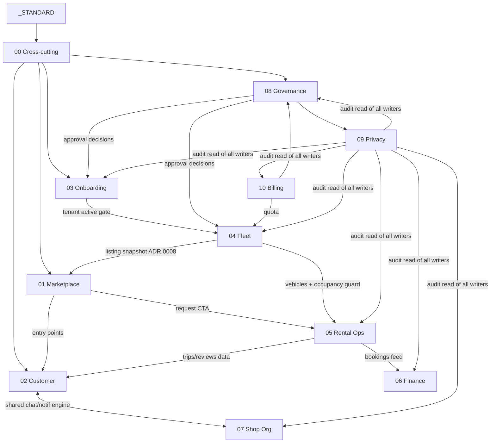

# XePrime Design Briefs

> **Created:** 2026-08-04 · **Audited:** 2026-08-04 ([brief 11](11_COVERAGE_AND_CONSISTENCY_AUDIT.md))
> Twelve documents: a writing standard, one cross-cutting brief, ten domain briefs, and the audit.
> **Authority order:** source code and accepted ADRs (`docs/decisions/`) > these briefs > `docs/project/` as-built docs > historical specs. A brief never overrides an ADR.

> ⚠️ **Ảnh chụp ngày 04/08/2026, không được cập nhật theo mã.** Tên file trong các brief là tên
> TẠI THỜI ĐIỂM viết; chín component đã bị xoá và viết lại kể từ đó — bảng tra ở
> [`../CODEMAP.md`](../CODEMAP.md) §"Tên cũ trong tài liệu thiết kế". Phần văn xuôi mô tả hành vi
> cũng có thể đã lỗi thời (ví dụ `/trips` nay là một khu riêng có chi tiết chuyến và huỷ chuyến,
> không còn là "review surface" như brief 02 mô tả). **Mã nguồn và ADR thắng.**
>
> Bộ `docs/project/` mà các brief trích dẫn đã bị dọn ngày 23/07/2026 và không tồn tại; các
> trích dẫn tới nó nay là chữ thường, không phải liên kết.

## 1. Purpose

These briefs are the evidence-based bridge between the as-built system and future product/UX work. Each one separates, per submodule: **confirmed current behavior** (with file references), **confirmed business rules**, **partial behavior**, **missing behavior**, **`Unknown` requirements**, and **recommendations** (always marked `[RECOMMENDED — NOT CURRENT]`). They exist so a designer, engineer and product reviewer can share one document without guessing which sentences describe reality.

They are **not**: redesigns, wireframes, tickets, or requirement documents. Nothing in them adds a product requirement — unsourced intent lives only in "Open questions".

## 2. Reading order

| Order | Read | Why first |
|---|---|---|
| 1 | [`_DESIGN_BRIEF_STANDARD.md`](_DESIGN_BRIEF_STANDARD.md) | The rules every brief follows — evidence classes, the 5-status taxonomy, the six-block pattern |
| 2 | [`00_CROSS_CUTTING_SYSTEM_UX.md`](00_CROSS_CUTTING_SYSTEM_UX.md) | Auth, authorization, navigation and state conventions every domain inherits |
| 3 | The domain brief you are working in (01–10) | Each states which cross-cutting rules apply unchanged and where it deviates |
| 4 | [`11_COVERAGE_AND_CONSISTENCY_AUDIT.md`](11_COVERAGE_AND_CONSISTENCY_AUDIT.md) | What was verified, corrected, and remains open |

## 3. Brief ownership map

Every submodule has exactly one **primary owner**; other briefs link rather than redefine.

| # | Brief | Owns |
|---|---|---|
| 00 | [Cross-Cutting System UX](00_CROSS_CUTTING_SYSTEM_UX.md) | Authentication (all mechanics), session, authorization architecture, 401/403/no-tenant/multi-scope, navigation architecture, shared state/interaction/responsive/a11y/security conventions, forgot/reset password |
| 01 | [Customer Marketplace](01_CUSTOMER_MARKETPLACE.md) | `/`, `/listings/[id]`, `/shops/[slug]`, discovery/search/filter/facets/sort, vehicle cards, public reviews *display*, SEO, entry points to booking/chat |
| 02 | [Customer Account & Engagement](02_CUSTOMER_ACCOUNT_AND_ENGAGEMENT.md) | Auth *experience* (modal, RegisterSuccess), `/account`, `/trips`, review *submission & effects*, chat (shared engine + customer side), notifications (shared engine + customer routing), logout |
| 03 | [Shop Onboarding & Settings](03_SHOP_ONBOARDING_AND_SETTINGS.md) | Owner intent, `/manage/onboarding`, NoTenantState, shop registration/profile/media, tenant approval *shop side*, tenant statuses, pickup-areas placeholder |
| 04 | [Fleet Management](04_FLEET_MANAGEMENT.md) | `/manage/vehicles/*`, both vehicle status axes, publication *shop side*, sensitive-edit knock-back, soft delete, quota consumption, drivers/trash placeholders, blocked-range/maintenance gaps |
| 05 | [Rental Operations](05_RENTAL_OPERATIONS.md) | Booking requests (public + inbox), bookings, transitions, occupancy & the exclusion constraint, calendar, contracts, availability preview |
| 06 | [Finance Operations](06_FINANCE_OPERATIONS.md) | Finance dashboard, receipts/categories, payments/void, debt, `paid_amount` authority, contract *financial* snapshot |
| 07 | [Shop Organization & Communication](07_SHOP_ORGANIZATION_AND_COMMUNICATION.md) | Tenant members/roles/RBAC resolution, custom roles, shop customers placeholder, chat *shop side & shared-inbox semantics*, worker/outbox, notification *shop routing* |
| 08 | [Platform Governance](08_PLATFORM_GOVERNANCE.md) | Platform dashboard, approval queue/decisions *platform side*, tenant lock/unlock, vehicle hide/unhide, governance audit |
| 09 | [Platform Operations & Privacy](09_PLATFORM_OPERATIONS_AND_PRIVACY.md) | Booking/customer monitoring, masking, PII reveal, audit *read* side, support/review-moderation gaps, retention unknowns |
| 10 | [Platform Organization & Billing](10_PLATFORM_ORGANIZATION_AND_BILLING.md) | Platform staff/roles, last-admin protection, plans, subscriptions, quota *definition*, invoice gap |

**Shared-engine rule:** chat and notifications have one implementation with two contexts — brief 02 owns the engine and customer context; brief 07 owns the shop context and shared-inbox semantics. Approval is one workflow with two sides — 03/04 own the shop side, 08 the platform side. The vehicle quota is defined in 10 (`assertVehicleQuota`) and consumed in 04.

## 4. Module coverage matrix

37 pages, all API domains, all 38 Prisma models, all 9 roles and 37 permissions are assigned. Full tables in [brief 11 §3](11_COVERAGE_AND_CONSISTENCY_AUDIT.md). Summary:

### Page → brief

| Pages | Brief |
|---|---|
| `/`, `/listings/[id]`, `/shops/[slug]` | 01 |
| `/account`, `/trips`, `/chat` | 02 |
| `/forgot-password`, `/reset-password`, `/manage/login` | 00 |
| `/manage/onboarding`, `/manage/shop`, `/manage/pickup-areas` | 03 |
| `/manage/vehicles{,/new,/[id],/[id]/edit}`, `/manage/drivers`, `/manage/trash` | 04 |
| `/manage` (both dashboards: shop shell 00/05-adjacent, platform 08), `/manage/calendar`, `/manage/bookings`, `/manage/booking-requests`, `/manage/contracts/[id]` | 05 (08 for platform dashboard) |
| `/manage/finance`, `/manage/receipts`, `/manage/debts` | 06 |
| `/manage/members`, `/manage/chat`, `/manage/customers` | 07 |
| `/manage/admin`, `/manage/admin/tenants`, `/manage/admin/vehicles` | 08 |
| `/manage/admin/bookings`, `/manage/admin/customers`, `/manage/admin/audit` | 09 |
| `/manage/admin/staff`, `/manage/admin/plans` | 10 |

### API domain → brief

`/auth`, `/health`* → 00 · `/users/me` → 02 · `/rbac` → 07 · `/tenants` → 03 · `/members` → 07 · `/vehicles`, `/uploads/vehicle-images` → 04 · `/uploads/shop-media` → 03 · `/public/*` → 01 · `/public/booking-requests`, `/booking-requests`, `/bookings`, `/calendar`, `/contracts` → 05 · `/bookings/:id/payments`, `/payments`, `/finance`, `/receipts`, `/debts` → 06 · `/notifications` → 02/07 (engine/context) · `/reviews` → 02 · `/conversations`, `/chat` → 02/07 · `/platform/dashboard`, `/platform/approvals`, `/platform/tenants` (lock), `/platform/vehicles` → 08 · `/platform/bookings`, `/platform/customers`, `/platform/audit-logs` → 09 · `/platform/staff`, `/platform/plans`, `/platform/tenants/:id/subscriptions` → 10. (*technical-only)

### Database domain → brief

| Models | Brief |
|---|---|
| `User`, `Review`, `Notification`, `Conversation`, `ConversationParticipant`, `Message`, `ChatAttachment` | 02 |
| `UserIdentity`, `PasswordResetToken`, `PhoneVerification` | 00 (auth mechanics; technical) |
| `Tenant`, `TenantProfile`, `TenantDocument`, `TenantInvite` | 03 |
| `TenantMembership`, `Role`, `Permission`, `RolePermission` | 07 |
| `Vehicle`, `VehicleImage`, `VehicleFeature` | 04 |
| `PublicListing` | 01 (read) / 04 (lifecycle via `ListingsService`) |
| `BookingRequest`, `Booking`, `VehicleOccupancy`, `Contract` | 05 |
| `FinanceCategory`, `Receipt`, `ReceiptAttachment`, `Payment` | 06 |
| `ApprovalTask`, `ApprovalLog`, `AdminNote`* | 08 |
| `AuditLog` | 09 (read) / all writers in their own briefs |
| `PlatformMembership`, `Plan`, `TenantSubscription` | 10 |
| `MessageOutbox` | 07 (worker) |

(*dormant — no code path; recorded in 08/09)

## 5. Persona → module matrix

| Persona | Primary briefs | Also touches |
|---|---|---|
| Visitor | 01 | 00 (auth modal), 05 (request entry) |
| Customer / guest booker | 01, 02 | 05 (their requests/trips data) |
| `shop_owner` | 03, 04, 05, 06, 07 | 00, 10 (quota effects) |
| `shop_manager` / `shop_staff` / `shop_viewer` | 04, 05, 06, 07 | 00 |
| `platform_admin` | 08, 09, 10 | all (holds every permission) |
| `platform_staff` | 08 (dashboard), 09 (masked monitors) | — |
| `reviewer` | 08 | — |
| `support` | 09 | 08 (dashboard) |
| `finance_admin` | 10, 08 (tenants/lock) | 09 (bookings view) |

## 6. Role → module matrix (mutation capability)

| | 01 | 02 | 03 | 04 | 05 | 06 | 07 | 08 | 09 | 10 |
|---|---|---|---|---|---|---|---|---|---|---|
| customer | read | ✓ own | — | — | request | — | chat | — | — | — |
| shop_viewer | — | — | read | read | read | — | chat† | — | — | — |
| shop_staff | — | — | read | read | ✓ | write-only† | chat | — | — | — |
| shop_manager | — | — | read | ✓ | ✓ | ✓ | members-view | — | — | — |
| shop_owner | — | — | ✓ | ✓ | ✓ | ✓ | ✓ | — | — | — |
| platform_staff | — | — | — | — | — | — | — | dash | masked read | — |
| reviewer | — | — | — | — | — | — | — | approve+moderate | — | — |
| support | — | — | — | — | — | — | — | dash | read+**reveal** | — |
| finance_admin | — | — | — | — | — | — | — | tenants+lock | bookings read | billing ✓ |
| platform_admin | — | — | — | — | — | — | — | ✓ | ✓ | ✓ |

† Documented anomalies: chat has no permission key (viewer can send — brief 07 Q6); staff holds finance write without `finance.view` (brief 06 Q13).

## 7. Implementation-status summary

Aggregate of the eleven §R4 status tables (per-subject detail in each brief; consolidated table in brief 11 §3.7):

| Status | Count | Headline members |
|---|---|---|
| **Implemented** | ~170 subjects | Auth architecture, discovery engine, member/staff management, occupancy + exclusion constraint, payments/receipts ledger, approval mechanics, PII masking/reveal/audit, plans/subscriptions |
| **Partially implemented** | ~45 | Availability display, trips (list-only), read/unread semantics, notification coverage/channels, plan enforcement (one checkpoint), approval history (per-task only), responsive/a11y conventions |
| **Placeholder** | 6 | `/manage/customers`, `/manage/pickup-areas`, `/manage/drivers`, `/manage/trash`, maintenance-as-workflow, calendar interactions |
| **Referenced but not implemented** | ~25 | Keyword-search UI, saved vehicles, custom-role management, `blocked_range`/`maintenance` occupancy, request `cancelled_by_customer`/`expired`, contract signing, `qrUrl`, `limitsJson`, seasonal pricing, CSRF, session revocation, document approval, review moderation, support tickets, invoices, `TENANT_STATUS.EXPIRED`, broadcast notifications |
| **Missing (no trace beyond intent)** | ~10 | Trip detail/cancellation, shop plan surface, exports/charts, deposit lifecycle, data-subject rights, reveal analytics |

## 8. Cross-module dependency diagram

## 9. Unresolved product decisions

~110 open questions across the briefs; brief 11 §8 keeps the consolidated register. The fifteen that gate the most work:

1. **Legal basis and retention for PII and audit** (09 Q1–Q2) — blocks most privacy decisions.
2. **Which booking events reach customers, over which channels** (02 Q1; only in-app exists, guests get nothing).
3. **Approval evidence standard** — documents or self-declared profiles (03 Q1, 08 Q1)?
4. **Should approval carry the marketplace price into the booking** (05 Q1 — today every converted booking is 0đ)?
5. **Expiry consequences for plans** (10 Q2 — nothing happens today, by ADR deferral).
6. **Invoice/e-invoice obligations** for subscription billing (10 Q9).
7. **Customer cancellation** of requests and rentals (02 Q4, 05 Q2/Q5).
8. **Maker-checker for receipts** (06 Q1) and overpayment policy (06 Q2).
9. **Shared-inbox vs assigned conversations**, and read-per-member (07 Q2–Q3).
10. **Custom roles** — commit or remove the dormant machinery (07 Q4, 00 Q6).
11. **Maintenance/blocking wired to availability** (04 Q1–Q2).
12. **Keyword search intent** (01 Q1 — built end-to-end minus the input).
13. **Reveal governance** — reason, caps, customer notice (09 Q3/Q5).
14. **Tablet experience** — no rule exists anywhere (00 Q9, 01 Q9).
15. **Dead-vocabulary policy** — a dozen defined-but-writer-less statuses/columns need a keep-or-kill decision each (recurring in 04–10).

## 10. Instructions for designers

- Read the standard, then 00, then your domain brief **before** opening Figma; `docs/design/` (brand, principles, Figma prompts) governs *how it looks* — these briefs govern *what is true*.
- Design all five states per surface; the briefs list which are missing today — do not assume the happy path is the whole path.
- Statuses/roles/labels come from `@xeprime/types` exactly as the briefs spell them; never invent a state a brief marks writer-less without flagging the open question.
- Anything you propose beyond confirmed behavior inherits the `[RECOMMENDED — NOT CURRENT]` discipline in your own notes.
- Check your brief's "Existing UX problems" first — they are the prioritized backlog of what design must fix.

## 11. Instructions for developers

- Treat each brief's "Enforced today" acceptance criteria as regression contracts — breaking one is a defect even if no test catches it yet.
- The single-writer rules (Occupancy, Listings, Payments→paid_amount, Billing) and the never-from-client fields (tenant_id, statuses, prices) are load-bearing; the briefs cite the exact guard for each.
- Before building a "new" feature, search the briefs for **Referenced but not implemented** — the model/vocabulary/permission often already exists (and sometimes must be removed instead).
- When implementation changes, update the owning brief per the standard §7: move shipped recommendations into confirmed blocks with new references; mark resolved inconsistencies, never delete them.
- Deviations from ADR 0004 (URL state) recorded in 02/06/07/10 are defects to fix when touching those files, not patterns to copy.

## 12. Instructions for product/BA reviewers

- Your queue is §9 here plus each brief's "Open questions" — every row names what it blocks; answering one should turn into either a recommendation-promotion or a vocabulary removal.
- "Confirmed business rules" sections are the actual rule set the system enforces — review them for *business* correctness; the audit only verified they match code.
- `Unknown` is a finding, not a gap in the docs: it means no source states the requirement. Supply the requirement, don't ask the docs to invent it.
- The five-status taxonomy is strict; push back on any future edit that calls a partial module "implemented".

## 13. Change-management rules

1. **A brief never overrides an ADR.** Disagreement goes to Open questions; the ADR changes first.
2. **One owner per submodule** (map in §3). New submodules get assigned here before being documented.
3. **Corrections require evidence** — a file, migration or ADR reference; preference is not grounds (audit rule, kept permanent).
4. **Resolved items are marked, not deleted** — see brief 01 MK10 / brief 02 K9 for the pattern.
5. **Recommendations stay labeled** until shipped, then move to confirmed blocks with their new source reference and date.
6. **The audit (brief 11) is re-run** after any phase-scale change; its coverage tables are the completeness checklist.
7. Every edit updates the brief's header date and, if structural, this README's matrices.
