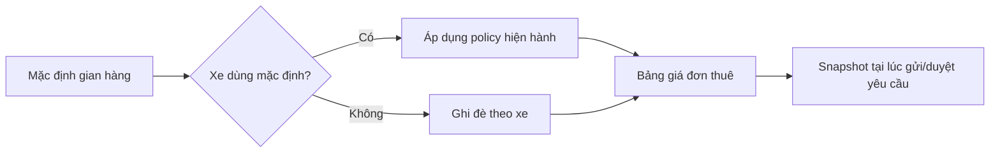
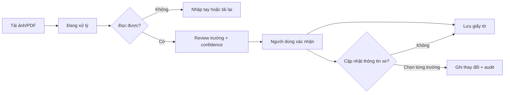
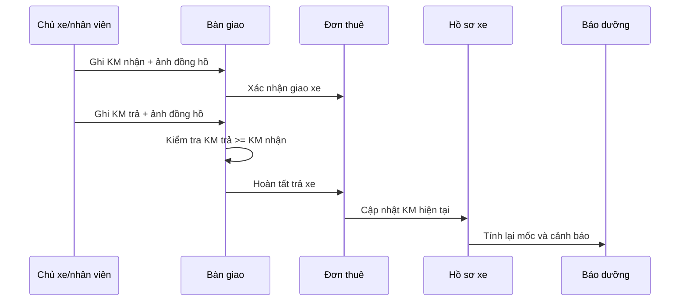

# 12 — Vehicle 360 Management

> **Loại tài liệu:** Target product & UX specification  
> **Ngày chốt:** 2026-08-11  
> **Trạng thái:** Accepted design direction — chưa phản ánh trạng thái code hiện tại  
> **Phạm vi:** Quản lý xe của gian hàng, chính sách thuê, nguồn xe và nghĩa vụ tài chính, giấy tờ/OCR, bảo dưỡng/KM, các điểm nối với yêu cầu thuê và bàn giao  
> **Đọc cùng:** [`04_FLEET_MANAGEMENT.md`](../design-briefs/04_FLEET_MANAGEMENT.md), [`05_RENTAL_OPERATIONS.md`](../design-briefs/05_RENTAL_OPERATIONS.md), [`06_FINANCE_OPERATIONS.md`](../design-briefs/06_FINANCE_OPERATIONS.md), [`07_INFORMATION_ARCHITECTURE.md`](07_INFORMATION_ARCHITECTURE.md), [`08_UX_GUIDELINES.md`](08_UX_GUIDELINES.md), [`10_IMPLEMENTATION_CONSTRAINTS.md`](10_IMPLEMENTATION_CONSTRAINTS.md)

---

## 1. Mục tiêu sản phẩm

Biến hồ sơ xe từ một form CRUD thành **trung tâm quản lý vòng đời của từng tài sản**. Tại một nơi, chủ gian hàng phải trả lời nhanh được:

- Xe đang ở trạng thái nào và còn thiếu việc gì?
- Giá, cọc, giao nhận, quá giờ và giảm giá đang áp dụng ra sao?
- Xe thuộc sở hữu, trả góp, thuê lại hay hợp tác?
- Tháng này xe phát sinh nghĩa vụ phải trả nào?
- Giấy tờ nào sắp hết hạn?
- KM hiện tại là bao nhiêu, khi nào cần bảo dưỡng?
- Các số liệu trên được cập nhật từ đơn thuê/bàn giao nào?

Thiết kế ưu tiên người vận hành nhỏ và vừa, thường có vài xe đến vài chục xe. Không biến hồ sơ xe thành một màn hình ERP dày đặc.

## 2. Quyết định nghiệp vụ đã chốt

| Chủ đề | Quyết định mục tiêu |
| --- | --- |
| Tiền cọc | Một số tiền cố định. Có mặc định gian hàng và cho phép ghi đè theo xe. |
| Phí giao nhận | Tính theo **khoảng cách một chiều**. Hỗ trợ nhiều khoảng phí; ngoài bán kính cấu hình chuyển sang báo giá thủ công. |
| Phí quá giờ | Cấu hình riêng ở cấp gian hàng, cho phép ghi đè theo xe. |
| Giảm giá | Chỉ áp dụng trên tiền thuê cơ bản; không giảm cọc, giao nhận, quá giờ, phạt/bồi thường hoặc chi phí khác. |
| Nguồn xe | `Sở hữu` · `Trả góp` · `Thuê lại` · `Hợp tác`. |
| Trả góp | Hỗ trợ hai phương pháp: dư nợ giảm dần và trả đều/niên kim. |
| Hợp tác | Mặc định chia theo **doanh thu xe được chia**; nhập tỷ lệ của chủ xe và suy ra phần gian hàng. |
| Giấy tờ | Không bắt buộc để lưu hồ sơ xe. Hết hạn chỉ cảnh báo, không tự ẩn xe và không tự chặn đặt xe. |
| OCR | Kết quả nhận dạng luôn là bản nháp để người dùng kiểm tra; không tự ghi đè dữ liệu xe. |
| KM hiện tại | Sau khi hoàn tất trả xe, KM trả đã xác nhận cập nhật KM hiện tại. Chỉnh tay phải có lý do và lịch sử. |

### 2.1 Công thức chia doanh thu hợp tác

```text
doanh_thu_xe_duoc_chia = tien_thue_sau_giam + phi_qua_gio
phan_chu_xe = doanh_thu_xe_duoc_chia × ty_le_chu_xe
phan_gian_hang = doanh_thu_xe_duoc_chia − phan_chu_xe
```

Không đưa vào cơ sở chia:

- tiền cọc;
- phí giao nhận — khoản này thuộc bên thực hiện giao nhận;
- tiền phạt, bồi thường, vệ sinh hoặc nhiên liệu;
- các khoản thu/chi ngoài đơn thuê.

Chỉ phát sinh khoản phải trả cho chủ xe khi đơn đã hoàn thành và khoản thu đủ điều kiện quyết toán. UI dùng nhãn rõ nghĩa **“Tỷ lệ của chủ xe”**, không dùng một nhãn “Hoa hồng” mơ hồ.

## 3. Phạm vi màn hình

### 3.1 Màn hình hiện có cần cập nhật

| Route/surface | Cập nhật mục tiêu |
| --- | --- |
| `/manage/vehicles` | Giữ card grid; thêm cảnh báo hành động ngắn gọn, nguồn xe, giấy tờ/bảo dưỡng sắp hạn theo quyền. Không biến card thành báo cáo tài chính đầy đủ. |
| `/manage/vehicles/new` | Giữ wizard 5 bước gọn; dùng mặc định gian hàng; thông tin nâng cao hoàn tất sau khi tạo. |
| `/manage/vehicles/:id` | Thành trang tổng quan 360: tình trạng, việc cần làm, lịch gần nhất, chính sách, giấy tờ, bảo dưỡng và tài chính theo quyền. |
| `/manage/vehicles/:id/edit` | Thay wizard chỉnh sửa bằng 6 tab trên cùng một route; tab lưu trong query `?tab=`. |
| Yêu cầu thuê | Thêm trạng thái cần báo giá giao nhận thủ công và bảng phân rã giá trước khi duyệt. |
| Đơn thuê/bàn giao | Ghi KM nhận/trả, nhiên liệu, ảnh, tình trạng; sau trả xe cập nhật KM và cảnh báo bảo dưỡng. |

### 3.2 Màn hình mới cần có

Chỉ thêm bốn khu vực tổng hợp. Các form chi tiết vẫn dùng tab, drawer hoặc modal.

| Màn hình | Route mục tiêu | Vì sao cần trang riêng | Vị trí điều hướng |
| --- | --- | --- | --- |
| Chính sách thuê | `/manage/settings/rental-policies` | Mặc định dùng cho nhiều xe; tránh nhập lặp khi tạo xe | Cài đặt |
| Trung tâm bảo dưỡng | `/manage/maintenance` | Xem xe nào sắp/đã đến hạn trên toàn đội xe | Tài sản & khách |
| Nghĩa vụ theo xe | `/manage/finance/vehicle-obligations` | Tổng hợp kỳ trả góp, thuê lại và quyết toán hợp tác | Tiền |
| Bàn giao | `/manage/handovers` | Công việc liên đơn thuê, cần hàng đợi nhận/trả và bằng chứng | Điều hành |

Nếu Figma đã có `Bàn giao` trong Rental Operations thì **mở rộng frame hiện có trong vùng Proposed v2**, không tạo menu/khái niệm trùng lặp.

### 3.3 Không tạo màn hình độc lập cho

- từng tab chỉnh sửa xe;
- xem/sửa một giấy tờ hoặc kết quả OCR;
- thêm một lần bảo dưỡng;
- xem lịch trả góp;
- báo giá giao nhận của một yêu cầu thuê.

Các tác vụ trên dùng tab trong hồ sơ, drawer hoặc responsive dialog. Trên mobile, drawer/dialog có thể mở toàn màn hình nhưng vẫn là cùng một tác vụ.

## 4. Kiến trúc điều hướng một xe

### 4.1 Header hồ sơ xe

Header detail/edit gồm:

- ảnh đại diện, tên xe, mã nội bộ và biển số;
- trạng thái vận hành và trạng thái public — luôn là hai trục riêng;
- nguồn xe và KM hiện tại;
- một cảnh báo ưu tiên cao nhất;
- hành động chính theo ngữ cảnh: `Chỉnh sửa`, `Gửi duyệt`, `Xem lịch` hoặc `Tạo bàn giao`;
- menu phụ cho hành động ít dùng.

Không hiển thị mọi con số tài chính trong header. Người không có quyền tài chính không được nhìn thấy số dư, lịch trả hoặc tỷ lệ hợp tác qua summary/card.

### 4.2 Sáu tab chỉnh sửa

| Tab | Nội dung |
| --- | --- |
| `Thông tin xe` | Tên, mã, loại, dịch vụ, trạng thái, biển số, hãng/model, năm, số chỗ, nhiên liệu, màu, KM hiện tại có kiểm soát. |
| `Hình ảnh & tiện ích` | Ảnh chính, gallery, tiện ích, mô tả. |
| `Giá & chính sách` | Giá thuê, giảm giá, cọc, giao nhận, quá giờ; dùng mặc định hoặc ghi đè theo xe. |
| `Nguồn xe & tài chính` | Loại nguồn xe và form có điều kiện; chỉ vai trò có quyền mới xem số tiền/hợp đồng. |
| `Giấy tờ` | Đăng ký/cà vẹt, đăng kiểm, bảo hiểm, tài liệu khác; upload, OCR, hạn và cảnh báo. |
| `Bảo dưỡng & KM` | KM hiện tại, chu kỳ, lần gần nhất, mốc tiếp theo, lịch sử và lịch sắp tới. |

Desktop dùng tab sticky dưới header. Mobile giữ **một hàng ngang**, cuộn ngang có snap/fade và không wrap. Tên mobile có thể rút gọn: `Thông tin` · `Hình ảnh` · `Giá` · `Nguồn xe` · `Giấy tờ` · `Bảo dưỡng`.

### 4.3 Bố cục

- Không kéo rộng sidebar hoặc thay đổi global shell.
- Vùng hồ sơ dùng hết chiều rộng khả dụng, gutter 24px desktop, tối đa khoảng 1440px.
- Form giữ chiều rộng 960–1120px, tối đa hai cột; không kéo field ngắn hết màn hình.
- Bảng/lịch trình có thể dùng toàn chiều rộng. Khi tràn, scroll ngang; cột thao tác cố định bên phải.
- Mobile padding 16px, khoảng cách dọc gọn, action bar sticky đáy; không giấu chức năng cốt lõi trong hover.

## 5. Luồng tạo xe

Wizard tạo mới vẫn có 5 bước:

1. `Cơ bản`
2. `Thông số`
3. `Giá & chính sách`
4. `Hình ảnh`
5. `Xác nhận`

- Bước 1 hỏi nguồn xe nhưng **không yêu cầu hoàn tất toàn bộ tài chính/hợp đồng**.
- Bước 3 mặc định bật `Dùng chính sách chung của gian hàng`; chỉ hiện tóm tắt. Có thể chọn `Thiết lập riêng cho xe này`.
- Cho phép lưu nháp khi thiếu dữ liệu chỉ cần cho public.
- Sau khi tạo thành công, hiện checklist thay vì một form dài: hoàn thiện nguồn xe; tải giấy tờ/OCR; nhập KM; thiết lập bảo dưỡng; hoàn thiện điều kiện public.
- Mỗi checklist mở đúng tab tương ứng.

## 6. Giá và chính sách thuê

### 6.1 Thứ bậc cấu hình



UI luôn cho biết nguồn của policy: `Theo gian hàng` hoặc `Riêng cho xe`. Khi thay đổi mặc định, cho biết số xe đang kế thừa và số xe dùng ghi đè.

### 6.2 Tiền cọc

- Số tiền cố định VND, có thể là 0.
- Không nằm trong doanh thu thuê và không bị giảm giá.
- Booking chụp snapshot; thay đổi cấu hình không đổi đơn cũ.

### 6.3 Giao nhận

Policy gồm bật/tắt, km một chiều, bảng khoảng phí không chồng lấn, bán kính tối đa tự báo và `Báo giá thủ công ngoài bán kính`.

Ví dụ minh họa: `0–3 km: miễn phí`, `>3–5 km: 30.000đ`, `>5–10 km: 50.000đ`. Giá trị ví dụ không phải mặc định bắt buộc. Mỗi dòng có `Từ`, `Đến`, `Phí`; UI preview biên để tránh mơ hồ ở đúng 3km/5km.

Ngoài vùng tự báo:

1. khách thấy `Chủ xe sẽ xác nhận phí giao xe`;
2. inbox có trạng thái `Cần báo phí giao nhận`;
3. drawer báo giá nhập khoảng cách đã xác nhận, phí, ghi chú;
4. booking lưu snapshot phí, không đọc lại policy động.

Việc khách có cần xác nhận lại báo giá trước khi duyệt là **Unknown** và cần chốt trước triển khai backend.

### 6.4 Quá giờ

Thiết kế hỗ trợ mức phí mỗi giờ, thời gian miễn phí nếu áp dụng, đơn vị làm tròn và preview công thức. Chủ xe có thể điều chỉnh có lý do tại lúc trả xe.

Giá trị mặc định của thời gian miễn phí và đơn vị làm tròn là **Unknown**; Figma dùng placeholder/annotation `Cần cấu hình`, không tự gán luật.

### 6.5 Giảm giá

```text
tien_thue_sau_giam = tien_thue_co_ban − (tien_thue_co_ban × phan_tram_giam)
tong_truoc_coc = tien_thue_sau_giam + phi_giao_nhan + phi_qua_gio + khoan_khac
```

UI hiển thị giá gốc, số tiền giảm và giá sau giảm; không chỉ phần trăm.

## 7. Nguồn xe và tài chính

### 7.1 Sở hữu

Chỉ cần xác nhận loại nguồn. Ngày mua, giá mua, ghi chú là tùy chọn và không chặn vận hành.

### 7.2 Trả góp

Form gồm ngân hàng/tổ chức cho vay; số hợp đồng và file/ảnh tùy chọn; dư nợ gốc ban đầu, ngày giải ngân, thời hạn; lãi suất năm; phương pháp `Dư nợ giảm dần` hoặc `Trả đều/niên kim`; ngày đến hạn hằng tháng; lịch dự tính tách gốc/lãi/tổng; trạng thái kỳ; ghi nhận đã trả và liên kết phiếu chi.

Lịch tính chỉ là dự tính. UI cho phép đối chiếu số thực tế trên sao kê mà không âm thầm sửa các kỳ đã trả.

### 7.3 Thuê lại

Thông tin chủ xe, liên hệ, tiền thuê định kỳ, chu kỳ/ngày trả, ngày bắt đầu/kết thúc, ảnh/file hợp đồng, ghi chú. Hợp đồng sắp hết hạn cảnh báo nhưng không tự ẩn hoặc chặn xe.

### 7.4 Hợp tác

Thông tin chủ xe, tỷ lệ của chủ xe, chu kỳ quyết toán, ngày chốt/trả, ngày hiệu lực, hợp đồng và ghi chú. Quyết toán hiển thị từng đơn làm căn cứ và các khoản bị loại.

### 7.5 Dữ liệu nhạy cảm

- Có `view` không có `manage`: read-only.
- Không có quyền tài chính: không nhìn thấy tab, số tiền, hợp đồng hoặc cảnh báo suy ra số tiền.
- Card/list chỉ thể hiện loại nguồn; không lộ dư nợ/tiền thuê.
- Đổi loại nguồn, lịch trả, tỷ lệ cần audit.

## 8. Giấy tờ và OCR

Loại giấy tờ: đăng ký/cà vẹt, đăng kiểm, bảo hiểm, khác. Trạng thái: `Chưa có` · `Đang xử lý` · `Cần kiểm tra` · `Còn hiệu lực` · `Sắp hết hạn` · `Đã hết hạn` · `Không đọc được`.



OCR có thể đọc họ tên, địa chỉ, biển số, số khung, số máy, ngày đăng ký, ngày hết hạn và thông tin đăng kiểm tùy loại. Trường không có bằng chứng để trống. Khi khác dữ liệu xe, so sánh `Hiện tại / Nhận dạng` và chọn từng trường; không mặc định “Ghi đè tất cả”.

Giấy tờ hết hạn cảnh báo trên detail/tab/trung tâm công việc nhưng không đổi operation/public status. Ngưỡng `sắp hết hạn` còn **Unknown**, không hard-code 30 ngày như luật đã chốt.

## 9. Bảo dưỡng và KM

Thông tin nền: KM hiện tại và nguồn cập nhật; chu kỳ thay nhớt; KM lần gần nhất; KM tiếp theo tự tính; ghi chú; khả năng thêm hạng mục khác sau này.

```text
km_bao_duong_tiep_theo = km_lan_gan_nhat + chu_ky_km
km_con_lai = km_bao_duong_tiep_theo − km_hien_tai
```

Thiếu thành phần thì hiển thị `Chưa đủ dữ liệu`, không dùng 0km giả.

### 9.1 Luồng KM từ bàn giao



- Không cập nhật KM từ dữ liệu khách tự khai.
- Thiếu KM trả: tạo task `Thiếu KM trả`, không tăng KM tự động.
- Chỉnh KM thủ công phải có lý do; giảm KM cần quyền cao hơn và cảnh báo.
- Bảo dưỡng hoàn tất có thể cập nhật KM lần gần nhất, chi phí và phiếu chi.

### 9.2 Trung tâm bảo dưỡng

Ưu tiên việc cần làm: `Quá hạn`, `Sắp đến hạn`, `Đang bảo dưỡng`, `Thiếu dữ liệu KM`. `Sắp hết hạn giấy tờ` có thể là bộ lọc liên quan nhưng không biến thành maintenance record.

Khoảng bảo dưỡng đã xác nhận phải chặn availability bằng occupancy. Chỉ đổi nhãn xe sang `Bảo dưỡng` là không đủ.

## 10. Quyền truy cập mục tiêu

| Vai trò | Chính sách | Nguồn/tài chính | Giấy tờ | Bảo dưỡng/KM | Bàn giao |
| --- | --- | --- | --- | --- | --- |
| Owner | Toàn quyền | Toàn quyền | Toàn quyền | Toàn quyền | Toàn quyền |
| Manager | Xem/sửa theo cấu hình | Mặc định không xem số tiền; cấp riêng | Xem/sửa | Xem/sửa | Xem/sửa |
| Staff vận hành | Chỉ xem tóm tắt cần thiết | Không | Xem trạng thái, không mặc định xem file nhạy cảm | Nhập KM/record được giao | Thực hiện |
| Viewer | Read-only không nhạy cảm | Không | Trạng thái tổng quát | Read-only | Read-only theo quyền |

Capability mục tiêu: `vehicles.policies.manage`; `vehicles.finance.view/manage`; `vehicles.documents.view/manage`; `vehicles.maintenance.view/manage`; `handovers.manage`. Tên cuối cùng phải theo convention code khi triển khai; đây không phải xác nhận permission hiện có.

## 11. Trạng thái UI bắt buộc

Mỗi surface chính có loading/skeleton giữ layout; first-empty; no-results + `Xóa bộ lọc`; error/retry không mất form; partial/null là `Chưa có thông tin`; saving/success; read-only/no-permission; upload/processing/OCR failed/review; unsaved changes; concurrent conflict; cảnh báo sensitive edit trước khi xe cần duyệt lại.

## 12. Nguyên tắc UX

1. Việc cần làm trước, dữ liệu sau; detail tối đa 3 cảnh báo rồi `Xem tất cả`.
2. Progressive disclosure: create gọn, edit theo tab, tác vụ hẹp trong drawer.
3. Policy cho biết kế thừa hay ghi đè; giá trong đơn là snapshot.
4. Gold là brand/action, không phải màu trạng thái.
5. Không chỉ dựa vào màu; luôn có text/icon.
6. Thiếu dữ liệu là `Chưa có`, không tạo số mẫu như dữ liệu thật.
7. Mobile có CTA sticky, tab một hàng, touch target tối thiểu 44px.
8. Bảng desktop canh cột theo loại dữ liệu, tiền canh phải, tràn scroll ngang, action cố định phải.

## 13. Chiến lược cập nhật Figma an toàn

Thiết kế cũ là baseline, **không phải vùng được ghi đè**.

1. Tạo top-level section `13 — Vehicle 360 Management — Proposed v2`.
2. Đặt ở vùng trống bên phải section ngoài cùng, cách tối thiểu 1200px.
3. Không move, resize, rename, delete, reparent hoặc detach node cũ.
4. Chỉ mở rộng section mới sang phải/xuống; không kéo frame sản phẩm vượt viewport để nhét nội dung.
5. Frame chuẩn: desktop 1440px, tablet 768px, mobile 390px.
6. Cần làm lại màn cũ thì duplicate vào section mới, suffix `-v2`; giữ frame gốc.
7. Dùng instance/token từ `01 — XePrime Foundations`; không sửa main component trong batch module.
8. Thiếu variant thì tạo `V360/Local/<Component>` và ghi chú đề nghị merge; chỉ merge sau audit riêng.

Cấu trúc section mới:

- `00 — Scope & Change Map`
- `01 — Vehicle Core & Navigation`
- `02 — Pricing & Rental Policies`
- `03 — Source & Financial Obligations`
- `04 — Documents, Maintenance & Handover`
- `05 — Responsive & State Audit`
- `99 — Handoff Notes`

## 14. Tiêu chí nghiệm thu thiết kế

- Có map phân biệt screen cập nhật, route mới, drawer/modal và out-of-scope.
- Detail và edit không trộn; create là wizard, edit là tabs.
- Đủ bốn nguồn xe và hai phương pháp trả góp.
- Policy rõ mặc định/override; giao nhận rõ một chiều/tier/manual quote.
- Công thức giảm giá, chia doanh thu và tổng tiền không mơ hồ.
- OCR review trước lưu; KM trả cập nhật bảo dưỡng qua bàn giao.
- Không lộ tài chính cho người thiếu quyền.
- Có desktop/tablet/mobile và trạng thái bắt buộc.
- Không duplicate component hoặc thay đổi ngoài Proposed v2.

## 15. Ngoài phạm vi

Nhà cung cấp OCR; kế toán/thuế đầy đủ; bản đồ tự tính khoảng cách; tự động trích nợ ngân hàng; chữ ký điện tử; tự động chặn/ẩn vì giấy tờ hết hạn; thay đổi code/database/API trong giai đoạn Figma.

