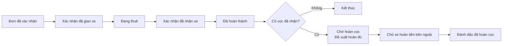

# 14 — Simplified Handover & Return

> - **Loại tài liệu:** Accepted product logic & UX specification
> - **Ngày chốt:** 2026-08-13
> - **Trạng thái:** Target cho việc sửa trực tiếp Figma Wave 10; **không khẳng định code hiện tại đã làm theo**
> - **Figma scope:** `02 — Wave 10 — Return Settlement & Surcharges`, node `298:3069`
> - **Đọc cùng:** [`12_VEHICLE_360_MANAGEMENT.md`](12_VEHICLE_360_MANAGEMENT.md), `05_RENTAL_OPERATIONS.md`

---

## 1. Quyết định sản phẩm

Luồng giao và nhận xe phải là một tác vụ vận hành nhanh, không phải một quy trình kế toán nhiều bước.

Mỗi chiều chỉ có **một hành động chính**:

- trước chuyến: `Xác nhận đã giao xe`;
- cuối chuyến: `Xác nhận đã nhận xe`.

Thời điểm thực tế được điền sẵn bằng thời gian hiện tại và có thể chỉnh khi người dùng có quyền. Odo, ảnh hiện trạng, ghi chú và quyết toán phát sinh nằm trong vùng **Thông tin nâng cao**, không được chặn hai hành động chính.

Không dùng wizard bắt buộc `Odo & Nhiên liệu → Hiện trạng xe → Phụ phí & Cọc → Xác nhận quyết toán`.

## 2. Dữ liệu bắt buộc và tùy chọn

| Nhóm | Quyết định |
| --- | --- |
| Xác nhận giao xe | Bắt buộc một lần xác nhận và thời điểm giao thực tế. |
| Xác nhận nhận xe | Bắt buộc một lần xác nhận và thời điểm nhận thực tế. |
| Odo lúc giao/trả | **Tùy chọn.** Nếu có KM trả hợp lệ thì cập nhật hồ sơ xe; nếu thiếu thì không chặn hoàn tất chuyến và có thể sinh việc `Thiếu KM trả`. |
| Nhiên liệu | **Bỏ khỏi Wave 10.** Không hỏi mức xăng/dầu, không so chênh lệch và không sinh phụ phí nhiên liệu. |
| Ảnh/hiện trạng | **Tùy chọn.** Mở trong `Ghi nhận hiện trạng`; phù hợp khi xe có dấu hiệu bất thường hoặc chủ xe muốn lưu bằng chứng. |
| Ghi chú | Tùy chọn. |
| Phụ phí | Tùy chọn qua `Ghi nhận phát sinh`; không phải một bước bắt buộc khi trả xe. |
| Chữ ký/OTP | Không yêu cầu để giao xe, nhận xe, hoàn tất chuyến hoặc đánh dấu hoàn cọc. |

Nếu chủ xe không mở phần nâng cao, một chuyến bình thường phải hoàn tất chỉ với hai lần xác nhận ở đầu và cuối chuyến.

## 3. Luồng nhanh



### 3.1 Giao xe

Modal/drawer xác nhận gồm:

1. tóm tắt xe, khách và lịch thuê;
2. thời điểm giao thực tế, mặc định `Bây giờ`;
3. vùng đóng `Thêm thông tin bàn giao` gồm Odo, ảnh hiện trạng và ghi chú;
4. CTA `Xác nhận đã giao xe`.

### 3.2 Nhận xe

Modal/drawer xác nhận gồm:

1. tóm tắt xe, khách và thời gian dự kiến/thực tế;
2. thời điểm nhận thực tế, mặc định `Bây giờ`;
3. vùng đóng `Thêm thông tin khi nhận xe` gồm Odo, ảnh hiện trạng và ghi chú;
4. liên kết phụ `Ghi nhận phát sinh` nếu thực sự có khoản cần ghi;
5. giải thích ngắn: `Nếu không có phát sinh, hệ thống đề xuất hoàn đủ tiền cọc đã nhận.`;
6. CTA `Xác nhận đã nhận xe`.

Xác nhận nhận xe không chờ hoàn cọc, chuyển khoản, OTP hoặc khách xác nhận.

## 4. Hiện trạng và phát sinh nâng cao

Hai tác vụ ít dùng mở bằng responsive drawer/dialog từ chi tiết đơn; không chiếm bước trong luồng chính.

### 4.1 Ghi nhận hiện trạng

- loại ghi nhận: lúc giao hoặc lúc nhận;
- ảnh và ghi chú;
- đánh dấu `Bình thường` hoặc `Có điểm cần lưu ý`;
- Odo tùy chọn có thể xuất hiện cùng lần ghi nhận;
- lỗi upload không làm mất dữ liệu đã nhập và có thể thử lại từng ảnh.

Không bắt người dùng chụp đủ góc cho một chuyến bình thường. Nếu một chính sách nội bộ của gian hàng muốn bằng chứng chặt hơn, đó là cấu hình/tác vụ riêng về sau, không phải mặc định toàn hệ thống.

### 4.2 Ghi nhận phát sinh

Danh mục được phép:

- quá giờ;
- vệ sinh;
- hư hại/bồi thường;
- khác.

**Không có danh mục thiếu nhiên liệu.** Mỗi khoản có số tiền và lý do; bằng chứng là tùy chọn. Quá giờ có thể được hệ thống gợi ý từ chính sách, nhưng chủ xe quyết định ghi nhận hoặc bỏ qua. Thao tác này không khóa việc nhận xe.

Phần nâng cao hiển thị:

```text
hoan_coc_de_xuat = max(coc_da_nhan - tong_phat_sinh, 0)
can_thu_them = max(tong_phat_sinh - coc_da_nhan, 0)
```

Các số trên là **ghi nhận vận hành**, không khởi tạo giao dịch ngân hàng.

## 5. Hoàn cọc thủ công

### 5.1 Mặc định

- Không có phát sinh: đề xuất hoàn `100% cọc đã nhận`.
- Có phát sinh: đề xuất hoàn phần còn lại sau khấu trừ.
- Không có cọc hoặc cọc chưa được ghi nhận là đã thu: không tạo việc hoàn cọc.

Sau khi nhận xe, trạng thái là `Chờ hoàn cọc`, không tự chuyển thành `Đã hoàn cọc`.

### 5.2 Đánh dấu đã hoàn

Chủ xe tự chuyển khoản hoặc hoàn tiền mặt bên ngoài hệ thống, sau đó bấm `Đánh dấu đã hoàn cọc`. Dialog gọn chỉ ghi nhận:

- số tiền, mặc định bằng số đề xuất;
- phương thức `Chuyển khoản` · `Tiền mặt` · `Khác`;
- thời điểm, mặc định hiện tại;
- mã tham chiếu/ghi chú tùy chọn.

Luôn hiển thị: `XePrime chỉ ghi nhận trạng thái; hệ thống không thực hiện chuyển tiền.`

Không OTP, không nhập tài khoản ngân hàng khách để tạo lệnh chuyển, không mô phỏng hoàn tiền tự động. Chỉnh lại bản ghi đã hoàn cần quyền phù hợp, lý do và audit, nhưng nằm trong menu `⋯`, không tạo bước cho mọi chuyến.

## 6. Trạng thái và bề mặt

### 6.1 Trạng thái nghiệp vụ tối thiểu

| Miền | Trạng thái hiển thị |
| --- | --- |
| Chuyến | `Sắp giao` · `Đang thuê` · `Đã nhận xe`/`Đã hoàn thành` |
| Cọc | `Không có cọc` · `Chưa nhận cọc` · `Chờ hoàn cọc` · `Đã hoàn cọc` · `Hoàn một phần` |
| Phát sinh | `Không có phát sinh` · `Có phát sinh` · `Cần thu thêm` |
| Bản ghi nâng cao | `Chưa ghi nhận` · `Đã lưu` · `Lỗi tải ảnh` |

Không dùng trạng thái `Hệ thống đang chuyển khoản` nếu không có cổng thanh toán thật.

### 6.2 Bề mặt Figma canonical

Thay tập màn hình tuyến tính hiện tại bằng các bề mặt sau:

1. chi tiết đơn trước giao + modal `Xác nhận đã giao xe`;
2. chi tiết đơn đang thuê + modal `Xác nhận đã nhận xe`;
3. drawer/dialog `Ghi nhận hiện trạng`;
4. drawer/dialog `Ghi nhận phát sinh`;
5. chi tiết đơn đã hoàn thành với card cọc;
6. dialog `Đánh dấu đã hoàn cọc`;
7. một state board cho loading, lỗi, thiếu quyền, xung đột phiên bản và lỗi upload.

Mỗi bề mặt có PC 1440 và mobile 390. Desktop dùng modal lớn nhưng không biến thành trang mới; mobile dùng full-screen responsive dialog/bottom sheet phù hợp chiều dài nội dung. Action chính sticky ở đáy khi nội dung cuộn.

## 7. Quyền, audit và toàn vẹn

- Chỉ người có quyền vận hành đơn được xác nhận giao/nhận xe.
- Chỉ người có quyền tài chính phù hợp được ghi phát sinh, đánh dấu hoàn cọc hoặc sửa bản ghi hoàn cọc.
- Xác nhận giao/nhận phải idempotent; bấm lặp không sinh hai sự kiện.
- Dữ liệu gửi từ client không được tự cấp `tenantId` hoặc vượt phạm vi đơn/xe của gian hàng.
- Sửa phát sinh/hoàn cọc sau khi đã ghi nhận cần lưu người sửa, thời điểm và lý do.
- Odo trả nhỏ hơn Odo giao không được cập nhật vào hồ sơ xe; người dùng vẫn có thể bỏ Odo để hoàn tất chuyến.
- Thiếu Odo không được biến thành `0 km`.

## 8. Loại bỏ khỏi Wave 10

- wizard 4 bước bắt buộc;
- bước riêng `Odo & Nhiên liệu`;
- mọi field, so sánh và phụ phí xăng/dầu;
- khách xác nhận phụ phí trong luồng trả xe;
- OTP quyết toán/hoàn cọc;
- chuyển khoản tự động hoặc màn giả lập giao dịch ngân hàng;
- dispute, correction và reversal như các trang bắt buộc trong happy path.

Khiếu nại vẫn có thể đi qua chat/hỗ trợ sau chuyến. Điều chỉnh có audit vẫn tồn tại trong menu nâng cao cho người có quyền, nhưng không được trình bày như quy trình mặc định.

## 9. Tiêu chí nghiệm thu

- Chuyến không phát sinh hoàn tất mà không nhập Odo, nhiên liệu, ảnh hoặc phụ phí.
- Odo và hiện trạng vẫn có thể ghi từ phần nâng cao mà không làm rối happy path.
- Không còn nội dung phụ phí nhiên liệu ở PC/mobile/state board.
- Xác nhận nhận xe hoàn tất chuyến ngay; hoàn cọc là việc theo dõi không chặn.
- Cọc đã nhận mặc định đề xuất hoàn đủ khi không có phát sinh.
- `Đã hoàn cọc` chỉ xuất hiện sau hành động ghi nhận thủ công của chủ xe.
- Không có OTP và không tuyên bố hệ thống thực hiện chuyển khoản.
- PC/mobile dùng chung cấu trúc, component và thuật ngữ.
- Các frame cũ bị thay thế được chuyển vào archive trong cùng section; không để hai canonical flow mâu thuẫn.

